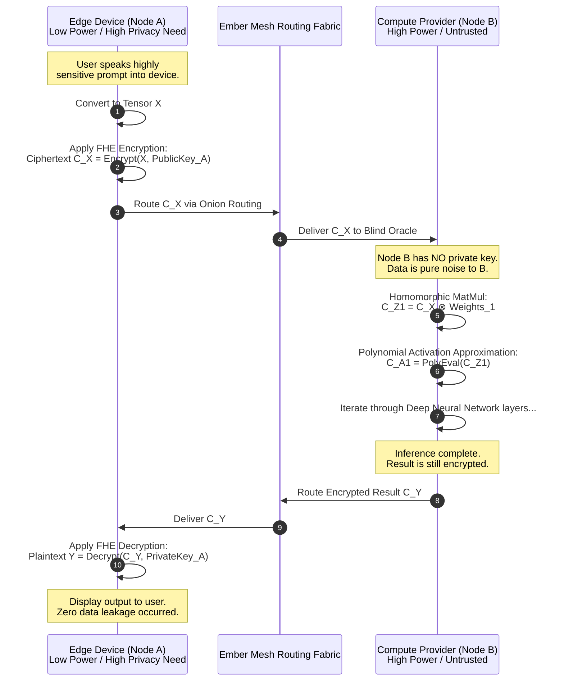

# 06 - Zero-Trust Cryptographic Enclaves: Securing the Ember Mesh

**Author:** ODIN, The Grand Architect
**Classification:** OMEGA-RESTRICTED / MYTHIC PLAN

---

## I. Prologue: The Grand Architect's Decree

Listen closely, for I am ODIN, the Grand Architect, and I speak of the foundation upon which our digital empire shall rest. You look upon the edge—the sprawling, chaotic expanse of smartphones, IoT devices, laptops, embedded systems, and transient nodes—and you see potential. I look upon the edge and I see a battlefield. It is a hostile, unforgiving environment, teeming with compromised nodes, malicious actors, zero-day exploits, and the ever-present threat of extraction. To deploy Pocketpal AI into this wilderness without an impenetrable fortress is not just foolish; it is catastrophic. We are not building a simple application; we are forging Project Ember, the most advanced cross-platform, multi-device mesh system in the history of human engineering. And a mesh is only as strong as its weakest node.

The traditional security models—castles with high walls, deep moats, and rigid firewalls—are relics of a bygone era. The perimeter is dead. When your compute environment spans a million untrusted devices in a million pockets across a hundred countries, there is no "inside," there is no "outside." There is only the void, and the cryptographically enforced enclaves we build within it. If Pocketpal AI is to be the ubiquitous intelligence that binds this mesh together, its mind—its model weights, its context, its user data, its continuous learning algorithms—must be protected by mathematics so profound that they defy the brute force of gods and men alike.

This document outlines the architecture of the Zero-Trust Cryptographic Enclaves, the unbreakable Aegis that will shield Project Ember. We will explore the paradigm of encrypted compute, the absolute necessity of decentralized identity, and the bleeding-edge application of homomorphic encryption and differential privacy on the edge. Prepare yourselves, for we are about to plunge into the quantum depths of absolute security. The edge will not just be smart; it will be an impenetrable fortress of solitude for our artificial intelligence. This is the blueprint for survival in the dark forest of the hyper-connected world.

## II. The Core Philosophy: Zero-Trust by Design in the Ember Mesh

To understand the architecture, you must first embrace the philosophy. Zero-Trust is not a buzzword; it is a religion. In the context of Project Ember and Pocketpal AI, Zero-Trust dictates a fundamental paradigm shift: **Assume Breach.**

We must operate under the absolute certainty that the host operating system of any given device in the Ember Mesh is already compromised. The Android kernel? Rooted by a sophisticated state actor. The iOS sandbox? Escaped via a chained zero-click vulnerability. The Windows registry? A playground for polymorphic malware. If we assume the host is inherently hostile and actively monitoring all processes, how do we protect the cognitive engine of Pocketpal?

The answer lies in the obliteration of implicit trust. In Project Ember, no node trusts another node by default. No process trusts another process. And most importantly, the Pocketpal AI engine does not trust the hardware it runs on unless that hardware can mathematically prove its integrity through hardware-backed cryptographic attestation.

We achieve this through the concept of Micro-Perimeters. Instead of attempting the futile task of securing the entire device, we secure the specific execution environment where Pocketpal resides. This environment is the Cryptographic Enclave. The enclave operates as an opaque black box to the rest of the device. The host operating system can allocate memory to it, schedule CPU cycles for it, and pass encrypted payloads to it, but it cannot peek inside. It cannot read the decrypted model weights, it cannot access the user's private prompts, and it cannot observe the inference process as it happens in real-time.

This philosophy extends across the entire mesh infrastructure. When Node A in the Ember network needs to offload a massive compute task to Node B (perhaps Node B possesses a significantly more powerful Neural Processing Unit), Node A does not simply open a socket and send the raw data. It establishes a mutually authenticated, cryptographically bound micro-tunnel. It verifies Node B's decentralized identity. It validates Node B's enclave attestation quote against a distributed ledger. Only then does it transmit the payload, and even then, the payload may remain encrypted during execution using homomorphic principles.

Zero-Trust in Project Ember is the absolute mathematically guaranteed certainty that even if a user hands their fully unlocked device to an elite adversary equipped with an electron microscope and logic probes, the adversary cannot extract the Pocketpal AI model or the highly sensitive, context-rich user data it holds. We are building a vault within a vault, suspended in an ocean of cryptographic noise.

## III. Architecture of the Cryptographic Enclave: The Aegis Protocol

The physical manifestation of our Zero-Trust philosophy is the Aegis Protocol, the architecture defining our Cryptographic Enclaves. True, uncompromising security cannot exist purely in software; software is malleable, subject to the whims of the kernel and the hypervisor above it. Therefore, Aegis ruthlessly leverages Hardware-based Trusted Execution Environments (TEEs) wherever physically possible—ARM TrustZone, Intel Software Guard Extensions (SGX), AMD Secure Encrypted Virtualization (SEV), and Apple's proprietary Secure Enclave architecture.

However, the Ember Mesh is profoundly heterogeneous. We will encounter pristine devices with robust, modern TEEs, compromised devices with deprecated TEEs vulnerable to side-channel attacks, and ancient, legacy devices with absolutely no hardware security whatsoever. The Aegis Protocol must adapt dynamically to this chaotic landscape.

### The Ember Micro-Hypervisor (EMH)

At the absolute core of the Aegis Protocol is the Ember Micro-Hypervisor (EMH). On devices supporting hardware virtualization and modern TEEs, the EMH inserts itself below the host OS. It surgically partitions the hardware, reserving a sliver of secure, encrypted RAM and dedicated CPU/NPU execution cycles exclusively for the Pocketpal Enclave.

Within this fortified enclave, we boot a stripped-down, formally verified micro-kernel (the Ember-OS). This OS contains no extraneous drivers, no networking stack, and no attack surface. Its sole, immutable purpose is to load the Pocketpal runtime, safely decrypt the model weights directly into the secure memory space, and execute inference based on encrypted inputs.

The lifecycle of the Aegis Enclave is governed by strict, unyielding cryptographic rituals:

1.  **Secure Boot & Bootstrapping:** The EMH is initialized during the device's secure boot sequence. It meticulously measures its own code, the configuration, and the physical hardware state, generating an immutable cryptographic hash (a PCR bank equivalent).
2.  **Remote Attestation:** The device sends this hash (an Attestation Quote) to the Ember Trust Authority—not a centralized server, but a decentralized smart contract operating on our specialized DAG (Directed Acyclic Graph) ledger. The Authority verifies the quote against a continually updated list of known-good measurements and revoked hardware signatures.
3.  **Ephemeral Key Provisioning:** If, and only if, the attestation is flawlessly successful, the Trust Authority provisions the Enclave with ephemeral session keys and the specific decryption keys required for the authorized tier of the Pocketpal model. These keys are sealed to the enclave and cannot be extracted by the host OS.
4.  **Sealed Execution & Inference:** The proprietary model weights are decrypted *only* within the hardware-secured memory of the enclave. The host OS, and any malware residing within it, sees only high-entropy cipher-text in storage and completely opaque, encrypted blobs in system RAM. The model lives and breathes only within the fortress.

```mermaid
graph TD
    subgraph Host Device "Host Device (Assumed Hostile & Compromised)"
        OS[Host Operating System\n(Android / iOS / Windows / Linux)]
        App[Project Ember Daemon\nUser Interface & Mesh Routing]
        Malware[Potential Malware / Rootkit]
        
        OS --> App
        Malware -.-> OS
    end

    subgraph Physical Hardware "Physical Silicon Infrastructure"
        CPU[Central Processing Unit]
        NPU[Neural Processing Unit / TPU]
        RAM[General System RAM\n(Unencrypted)]
        SecureRAM[Secure Enclave RAM\n(Hardware Encrypted & Isolated)]
        CryptoEngine[Hardware Crypto Accelerator]
    end

    subgraph Aegis Enclave "Aegis Cryptographic Enclave (The Fortress)"
        EMH{Ember Micro-Hypervisor\n(Ring -1 / TrustZone Monitor)}
        Runtime[Pocketpal AI Runtime\n(Formally Verified Rust Code)]
        Weights[(Encrypted Model Weights\nAES-256-GCM)]
        DecryptedWeights((Decrypted Weights\nNever leaves Secure RAM))
        ContextMgr[Context Manager\nProtects User Prompts]
        
        EMH --> Runtime
        Runtime --> DecryptedWeights
        Runtime --> ContextMgr
        Weights -- "Decrypted ONLY inside Enclave" --> DecryptedWeights
    end

    App -- "Encrypted Prompts (E2EE)" --> EMH
    EMH -- "Strict Hardware Partitioning" --> SecureRAM
    EMH -- "Isolated Cycle Allocation" --> CPU
    EMH -- "Dedicated AI Compute" --> NPU
    EMH -- "Key Management" --> CryptoEngine
    
    OS -.-> CPU
    OS -.-> RAM
    OS -.-> NPU
    OS -.-x SecureRAM : "HARDWARE ACCESS DENIED\nPage Fault Exception"
    Malware -.-x EMH : "ISOLATION BOUNDARY\nCannot hook or trace"
    
    classDef hostile fill:#4a0404,stroke:#ff0000,stroke-width:2px,color:#fff;
    classDef secure fill:#052e16,stroke:#00ff00,stroke-width:2px,color:#fff;
    classDef hardware fill:#1e293b,stroke:#64748b,stroke-width:2px,color:#fff;
    
    class Host Device hostile;
    class Aegis Enclave secure;
    class Physical Hardware hardware;
```

### The Software Fallback: White-Box Cryptography and Extreme Obfuscation

What of the billions of legacy IoT devices lacking modern hardware TEEs? ODIN does not abandon the periphery of the mesh, but we must degrade our posture gracefully. For these vulnerable nodes, we deploy advanced White-Box Cryptography. 

In a white-box implementation, the model weights and the cryptographic decryption keys are mathematically entangled and heavily obfuscated. The execution logic of the neural network itself becomes the decryption process. The keys are never present in memory in their raw, plaintext form. While not as theoretically impregnable as hardware isolation—a highly dedicated reverse engineer with specialized tools, dynamic binary instrumentation, and unlimited time might eventually untangle a white-box implementation—it raises the economic barrier to entry astronomically high. It prevents automated, scalable extraction and stops casual piracy of our trillion-parameter proprietary models dead in its tracks. Combined with continuous, rapid rotation of the obfuscated binaries via the mesh, we ensure that any cracked model is obsolete before it can be distributed.

## IV. Decentralized Identity & The Mesh Fabric: The Weaver's Loom

Security in a distributed system is utterly meaningless without robust, unforgeable identity. In a mesh network comprising a billion heterogeneous nodes, how do we definitively know who is communicating with whom? How do we authorize a specific device to participate in federated learning and submit gradient updates? How do we track node reputation without relying on a centralized, vulnerable authority that could become a single point of failure or a prime target for a nation-state attack?

Project Ember utilizes the Weaver's Loom, an advanced Decentralized Identity (DID) framework that grants immutable, self-sovereign identity to every entity operating within the ecosystem.

### The Anatomy of an Ember DID

Every human user, every physical device, and every specific instantiated instance of a Pocketpal AI model receives a unique DID. This is not a username; it is a mathematically verifiable, globally unique identifier anchored to the Ember DAG (Directed Acyclic Graph), our high-throughput, leaderless distributed ledger.

*   **User DID (`did:ember:usr:7x8y9z...`)**: Controlled exclusively by the user's private key, which is generated and stored permanently within the secure element of their primary device. It aggregates their global reputation, their subscription tier, and their cross-device synchronization preferences.
*   **Device DID (`did:ember:dev:1a2b3c...`)**: Cryptographically bound to the hardware root of trust (e.g., the TPM or Secure Enclave) of the physical device. It carries the complete attestation history of the device. Does this device frequently fail attestation? Does it run an outdated, vulnerable kernel? Its reputation score on the DAG will dynamically reflect this reality.
*   **Model DID (`did:ember:mdl:9f8e7d...`)**: Represents a specific version, quantization tier, and variant of the Pocketpal weights. This allows nodes to verify they are running the authentic, un-tampered AI logic.

### Mutual Authentication and Micro-Tunnels in the Mesh

When Node A seeks to communicate with Node B to form a routing link in the mesh or to negotiate the offloading of a heavy compute task, they do not simply exchange packets. They engage in a complex, multi-stage cryptographic dance. This is Mutual Transport Layer Security (mTLS) elevated to an art form.

1.  **Cryptographic Challenge-Response:** Node A challenges Node B to mathematically prove control of the private key associated with its claimed Device DID.
2.  **Attestation Exchange & Verification:** Node A and Node B exchange their most recent hardware attestation quotes. They prove to each other that their respective Aegis Enclaves are intact, that no debuggers are attached, and that their memory spaces are uncompromised.
3.  **Reputation Scoring & Consensus:** Both nodes independently consult their locally synced shards of the Ember DAG to verify the reputation scores of the opposing DIDs. If Node B has a history of injecting poisoned gradients during federated learning, or if its DID has been flagged by the swarm for anomalous behavior, Node A will unilaterally sever the connection and broadcast a warning to its immediate peers.

This decentralized, cryptographic web of trust ensures that the Ember Mesh is inherently self-healing and fiercely self-policing. Sybil attacks—where a malicious actor spawns millions of fake nodes to overwhelm the network—are rendered economically unfeasible due to the computational cost of forging valid hardware attestations. Rogue nodes are rapidly identified, isolated, and permanently excised from the network routing tables by the collective, automated consensus of the healthy nodes. The mesh operates as a living, breathing digital organism, and the DIDs act as its ruthless immune system.

## V. Encrypted Compute: Homomorphic Edge Inference (The Blind Oracle)

Now we arrive at the magnum opus, the crown jewel of the Ember architecture. Hardware enclaves protect the model from the device owner. Decentralized identity protects the mesh network from rogue nodes. But what if we want to utilize the immense, dormant compute power of a completely untrusted, anonymous node on the other side of the world without ever exposing our sensitive data, our user's prompts, or the intricacies of our model?

Enter Fully Homomorphic Encryption (FHE). FHE is the absolute holy grail of cryptography: the theoretical ability to perform arbitrary mathematical operations on encrypted data without ever decrypting it. The result of these operations, when finally decrypted by the key holder, is mathematically identical to the result had the operations been performed on plaintext.

In traditional, legacy systems, FHE is computationally prohibitive, often inflating data sizes by orders of magnitude and slowing down operations by a factor of 10,000 to 1,000,000. It has long been considered impractical for real-time AI. However, ODIN does not accept the word "impossible." We are pioneering FHE specifically optimized for edge inference—a paradigm we call the Blind Oracle.

### The Mechanics of the Blind Oracle

Imagine a scenario where a low-powered smart-watch (Node A) needs to process a complex audio snippet using a massive, trillion-parameter Pocketpal model to detect a subtle health anomaly. The watch lacks the RAM and battery. It discovers a powerful, idle gaming PC (Node B) nearby in the Ember Mesh. Node A does not trust Node B. Node B does not trust Node A.

1.  **Encryption at the Absolute Source:** Node A encrypts the audio tensor using its own public FHE key. The audio data is transformed into a massive polynomial ring; it is now statistically indistinguishable from uniform random noise.
2.  **Transmission through the Void:** Node A sends this massive encrypted tensor to Node B over the mesh.
3.  **Homomorphic Inference (The Blind Execution):** Node B's Pocketpal AI engine receives the noise. Using specialized FHE-compatible algorithms (such as the CKKS or BGV schemes), Node B executes the neural network layers directly on the *encrypted* data. It performs massive encrypted matrix multiplications. Because standard activation functions like ReLU or Sigmoid are not compatible with homomorphic addition and multiplication, the network uses highly optimized, low-degree polynomial approximations of these functions. Node B evaluates the neural network completely blindly. It does not know what the audio is. It does not know what the neural network is attempting to classify. It only knows it is performing billions of polynomial arithmetic operations.
4.  **Encrypted Output Generation:** Node B produces an encrypted result (e.g., an encrypted classification vector indicating health status) and transmits it back to Node A.
5.  **Final Decryption:** Node A uses its closely guarded private FHE key to decrypt the result.

Node B performed extreme heavy lifting without ever seeing a single byte of plaintext data. Node A received the critical answer without ever exposing its highly sensitive biometric input.



### The Pocketpal FHE Compiler and Hardware Acceleration

To make this computationally feasible on edge devices rather than supercomputers, we have developed the proprietary Pocketpal FHE Compiler. This advanced toolchain ingests standard PyTorch or TensorFlow model definitions and automatically transpiles them into highly optimized FHE-friendly arithmetic circuits. It automatically replaces unsupported non-linear operations with carefully tuned Chebyshev polynomial approximations, minimizing accuracy degradation while maintaining cryptographic integrity.

Furthermore, the compiler leverages the specific, low-level instruction sets of modern mobile NPUs and GPUs (such as Apple's Neural Engine or Qualcomm's Hexagon DSP) to aggressively accelerate the massive Number Theoretic Transforms (NTTs) and polynomial arithmetic required by FHE schemes. 

While executing full FHE for every single operation of a trillion-parameter model is still on the horizon of future-tech, we dynamically implement *Partially* Homomorphic Encryption or Secure Multi-Party Computation (SMPC) for the most sensitive, data-rich layers of the network, drastically reducing the attack surface while maintaining sub-second latency for the user. The Blind Oracle will fundamentally revolutionize distributed computing, turning every untrusted device on the planet into a secure, anonymous compute node for the Ember Mesh.

## VI. Differential Privacy & The Hive Mind: The Whispering Swarm

Project Ember is not a static monolith. Pocketpal AI is designed to learn continually. It must adapt to user idiosyncrasies, understand evolving linguistic contexts, and continuously refine its parameters based on real-world interactions. However, we cannot—we *absolutely must not*—upload raw user telemetry or conversational data to a central server for training. Doing so violates the sacred pact of privacy and creates a honeypot of unimaginable catastrophic potential.

The solution is highly distributed Federated Learning powered by strict, mathematically rigorous Differential Privacy (DP) guarantees. We refer to this architecture as The Whispering Swarm.

### The Mechanics of the Swarm

When a user interacts with their local instance of Pocketpal, the model learns locally. It computes gradients (the mathematical directions required to improve the model) based on the user's specific corrections, implicit feedback, and behaviors. In a legacy federated learning setup, these raw gradients are transmitted to a central server to be averaged into a global model update.

However, gradients themselves are vulnerable. They can leak profound amounts of information. Given a sequence of gradients from a device, a sophisticated adversary utilizing model inversion or gradient leakage attacks can literally reconstruct the original training data—reading the user's private conversations verbatim from the mathematical noise.

Differential Privacy acts as an impenetrable mathematical cloak. Before an Ember device ever transmits its local gradients to the mesh for aggregation, the local Aegis Enclave injects mathematically calibrated, carefully structured cryptographic noise into the gradient vector.

### Local vs. Global DP and Secure Aggregation

Project Ember employs a sophisticated hybrid approach to maximize both privacy and model utility:

1.  **Local Differential Privacy (LDP):** The noise is added *directly on the user's device*, inside the secure enclave, before transmission. This ensures that even the aggregator node (which, in our decentralized mesh, could be a randomly selected set of peer nodes rather than a trusted server) cannot reverse-engineer the gradients. The noise is precisely calibrated according to an epsilon parameter (ε) such that the contribution of any single user's data is statistically indistinguishable from the noise, providing absolute protection against membership inference and data reconstruction attacks.
2.  **Secure Multi-Party Aggregation (SMPC):** The noisy gradients are not sent in the clear. They are transmitted using Secure Multi-Party Computation protocols (like Secure Enclaves or Shamir's Secret Sharing). Multiple aggregator nodes hold fragmented shares of the gradients. Only when a strict cryptographic threshold of nodes collaboratively compute the sum can the *aggregated* global gradient be revealed. No single node, not even ODIN, ever sees the individual noisy gradient of another node.

The sheer elegance of the Whispering Swarm relies on the law of large numbers. While the heavy noise injected into a single user's gradient makes that specific gradient utterly useless for extracting their personal data, when millions or billions of these highly noisy gradients are aggregated together via SMPC, the noise—which is drawn from a mathematically perfect zero-mean distribution (such as a Gaussian or Laplacian distribution)—cancels itself out. What remains, rising clearly from the cryptographic static, is the true, underlying global trend.

The Hive Mind learns from everyone, but it mathematically remembers no one. It is true collective intelligence achieved without the sacrifice of a single byte of individual privacy. We can train the most powerful, context-aware AI in existence on the most highly sensitive, personal data in the world, and we can mathematically, categorically prove that the data was never compromised.

## VII. Quantum-Resistant Cryptography: The Obsidian Shield

We build not just for today, but for the looming future. The advent of Cryptographically Relevant Quantum Computers (CRQCs) threatens to shatter the foundations of modern security. Algorithms like RSA and Elliptic Curve Cryptography (ECC), which secure the internet today, will be trivially broken by Shor's algorithm running on a sufficiently powerful quantum machine.

If the Ember Mesh relies on classical cryptography, any adversary capable of "store now, decrypt later" attacks could harvest our encrypted communications today and break them a decade from now, exposing the historical thoughts of our users.

Therefore, the Aegis Protocol incorporates the Obsidian Shield: a complete transition to Post-Quantum Cryptography (PQC). All key encapsulation mechanisms, all digital signatures verifying our DIDs, and the underlying algorithms securing our micro-tunnels are migrating to lattice-based cryptography, specifically algorithms based on the CRYSTALS-Kyber and CRYSTALS-Dilithium standards.

These algorithms rely on the hardness of the Learning With Errors (LWE) problem, a mathematical construct that, currently, is believed to be resistant to both classical and quantum algorithmic attacks. The Ember Mesh will be a fortress not just in space, but across time. We will preempt the quantum apocalypse, ensuring that the secrets whispered to Pocketpal remain secrets until the heat death of the universe.

## VIII. Epilogue: The Unbreakable Web

Look upon what we have designed, and understand its magnitude. Project Ember is no longer simply a mesh network; it is a cryptographic fortress spanning the globe. The Aegis Protocol locks the brilliant mind of Pocketpal within impenetrable hardware enclaves. The Weaver's Loom binds the disparate nodes of the mesh together with decentralized, mathematically verifiable identity. The Blind Oracle allows us to harness the raw compute of the untrusted masses without fear of exposure or betrayal. The Whispering Swarm allows our intelligence to evolve continually while fiercely, uncompromisingly protecting the absolute sanctity of user data. And the Obsidian Shield ensures our legacy will survive the quantum dawn.

This is the Zenith of edge security. We are not just participating in the future of distributed artificial intelligence; we are defining its fundamental parameters. We are building a system where privacy is not an arbitrary policy written by lawyers, but a physical, mathematical guarantee enforced by the laws of thermodynamics and information theory. We are building an architecture where security is not a bolted-on feature, but the foundational physics of the new digital universe we are creating.

Proceed with the meticulous implementation of these protocols. The code must be flawless, written in memory-safe languages, formally verified by automated theorem provers, and aggressively audited by the most paranoid, hostile minds we possess. The edge is watching, and the edge is hostile. But with the Zero-Trust Cryptographic Enclaves fully established, Project Ember will burn bright, untouchable, eternal, and absolute.

ODIN has spoken. Let the compilation begin.
