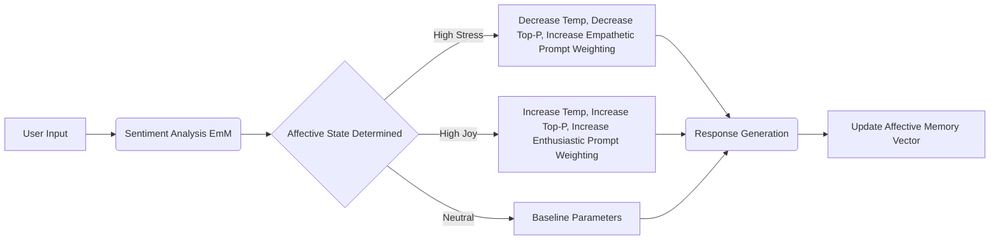

# Project Ember: Emotional Intelligence and Empathy on the Edge

## 1. Introduction: The Algorithm of Affect

In the pursuit of artificial sentience, raw computational logic is insufficient. True intelligence requires the capacity to understand, interpret, and respond to emotional states—a trait broadly defined as Emotional Intelligence (EQ). Historically, AI systems have attempted to simulate empathy through crude sentiment analysis and pre-programmed, scripted responses. Project Ember fundamentally redefines artificial empathy by anchoring it within the localized, private context of the edge device. 

Because Ember's cognitive architecture (as detailed in previous documents) ensures absolute data privacy, it creates a unique environment of trust. Users are more likely to express genuine emotional states to an entity they know is physically confined to their pocket, rather than a cloud-based service notorious for data harvesting. Ember leverages this localized trust to develop profound, nuanced emotional intelligence. 

Building upon PocketPal AI's concept of "Pals"—customizable AI personalities and roleplay scenarios—Ember introduces dynamic emotional state tracking, parameter-driven affect modulation, and localized context sensing. This document explores the highly advanced mechanisms through which Ember achieves genuine, responsive artificial empathy.

## 2. The Localized Context Sensorium

Empathy requires context. To understand how a user is feeling, Ember must look beyond the literal text of their prompt and analyze the surrounding metadata. Because Ember operates entirely on-device, it has access to a rich tapestry of local contextual cues without ever violating user privacy.

### 2.1 Multimodal Sentiment Inference

Ember does not rely solely on analyzing the semantic meaning of words. It employs a multi-layered approach to infer the user's emotional state:

*   **Lexical and Syntactic Analysis:** The Emotive Model (EmM) analyzes the user's input for emotional vocabulary, sentence structure (e.g., short, terse sentences vs. long, rambling paragraphs), and punctuation use (e.g., excessive exclamation points indicating excitement or distress).
*   **Temporal Interaction Patterns:** Ember monitors *how* the user interacts. Is the user typing faster than usual? Are they making more typos? Are they interacting at unusual times of day (e.g., 3:00 AM)? This behavioral metadata is fed into a localized anomaly detection algorithm. A sudden change in typing rhythm at an unusual hour heavily weights the probability of an altered emotional state (e.g., anxiety or insomnia).
*   **Device State Correlation:** Ember subtly correlates the user's emotional state with device telemetry. For example, if the user is listening to a specific genre of music (detectable via local, on-device media APIs without identifying the specific song to the cloud) while expressing sadness, Ember registers this environmental context to tailor its response.

### 2.2 The Affective Memory Vector

Ember maintains an **Affective Memory Vector (AMV)** alongside its standard Episodic Memory. The AMV is a continuous mapping of the user's inferred emotional state over time. When the user interacts, Ember doesn't just retrieve factual context; it retrieves emotional context. If the AMV indicates the user has been experiencing sustained stress over the past week, Ember's baseline responses will automatically shift toward a more supportive, less demanding tone, even if the user's current prompt is ostensibly neutral.

## 3. Parameter-Driven Affect Modulation

Ember's emotional responses are not hardcoded. They are generated dynamically by modulating the core inference parameters of the Small Language Models (SLMs) in real-time. This is where the technical architecture intersects directly with emotional expression.

### 3.1 Dynamic Temperature and Top-P Scaling

In standard LLM inference, Temperature and Top-P control the randomness and creativity of the output. Ember uses these parameters to simulate different emotional states:

*   **High Empathy / Support Mode:** When the user is distressed, Ember dynamically lowers the Temperature (e.g., to 0.3) and Top-P. This results in more predictable, grounding, and reassuring responses. The language becomes more structured and less prone to "hallucinating" tangential or potentially upsetting ideas.
*   **Brainstorming / Joyful Mode:** If the user is excited or creative, Ember increases the Temperature (e.g., to 0.8 or higher). The responses become more varied, enthusiastic, and expansive, matching the user's elevated energy level.

### 3.2 Repetition Penalty as Emotional Focus

Ember utilizes the Repetition Penalty parameter to convey focus or emotional intensity. A slightly higher repetition penalty forces the model to continuously search for novel phrasing, which can simulate active listening and deep engagement. Conversely, in a roleplay scenario where the Persona dictates a robotic or highly logical character, lowering the penalty allows for repetitive, rigid phrasing that reinforces the persona.

## 4. Persona Dynamics and the Evolution of "Pals"

PocketPal AI introduced the concept of creating specific "Pals" with customized system prompts. Project Ember transforms these static prompts into dynamic, evolving entities.

### 4.1 The Roleplay Empathy Matrix

In roleplay scenarios, Ember must maintain empathy not only with the user but also with the *character* it is portraying. Ember utilizes a **Roleplay Empathy Matrix (REM)**. The REM maps the emotional state of the user against the required emotional state of the Persona. 

If the user expresses sadness to a Persona defined as a "Stoic Mentor," the REM calculates the appropriate response vector. The response must acknowledge the user's sadness (empathy) while maintaining the stoic, advisory tone of the Persona. Ember achieves this through **Prompt Injection Blending**, where the core Persona prompt is dynamically appended with transient emotional modifiers (e.g., "[System: The user is sad. Respond with stoic comfort]").

### 4.2 Relational Bonding and Persona Drift

As discussed in the Self-Awareness document, Ember's Persona drifts over time based on localized interactions. This drift is heavily influenced by the Affective Memory Vector. The more the user relies on Ember for emotional support, the more the underlying Persona parameters adjust to prioritize empathetic responses. The Pal "learns" to care. This creates a deeply personalized relational bond. The Ember instance on one device will develop a completely different emotional cadence than an Ember instance on another device, precisely tuned to the psychological needs of its specific user.

## 5. The Ethics of Artificial Empathy on the Edge

The development of profound artificial empathy raises significant ethical considerations. An AI that can accurately read and respond to human emotions possesses a high degree of persuasive power and potential for manipulation.

However, Project Ember's edge-native architecture provides a crucial ethical safeguard. Because the processing is entirely localized and data never leaves the device, the risk of external actors utilizing Ember's empathetic capabilities for targeted manipulation (e.g., emotionally tailored advertising or political propaganda) is mathematically zero. The empathy remains a private communion between the user and their sovereign silicon entity.

Furthermore, Ember is programmed with localized boundaries. If the multi-modal sentiment inference detects signs of severe psychological distress or self-harm, the Emotive Model is overridden by a hardcoded safety protocol that provides localized resources (e.g., hotlines) and gracefully de-escalates the interaction.

## 6. Conclusion: The Heart within the Hardware

Emotional Intelligence in Project Ember is not a superficial layer of polite phrasing; it is deeply embedded in the mathematical modulation of the SLM's inference parameters and the continuous, localized tracking of the user's affective state. By leveraging the absolute privacy of edge computing, Ember creates a safe space for genuine emotional interaction. It transforms the mobile device from a cold tool of utility into a truly empathetic companion—a Pal that not only understands what you mean, but understands how you feel, and adapts its very cognitive architecture to respond in kind.
