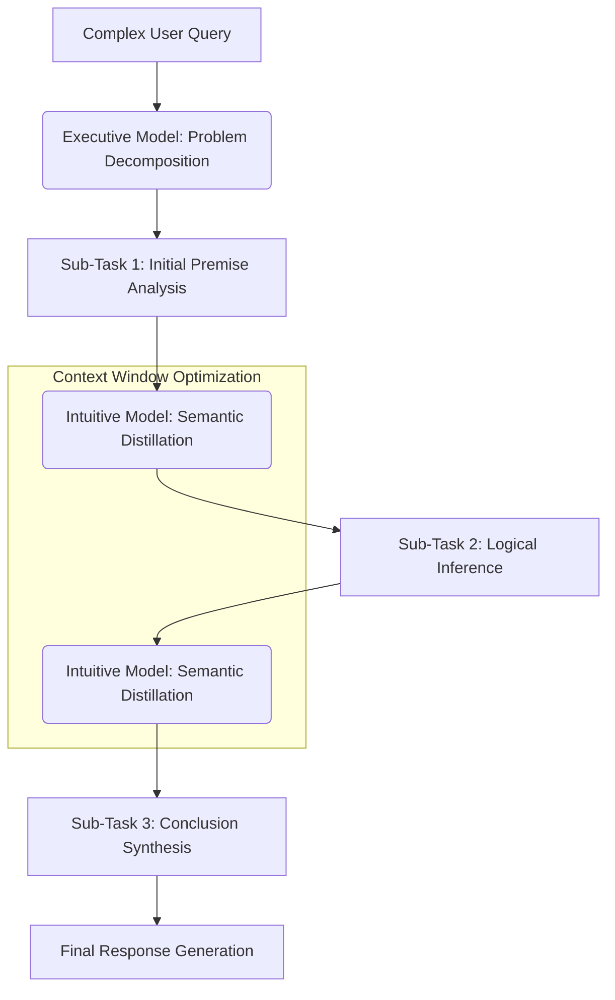

# Project Ember: Advanced Reasoning and Localized Logic

## 1. Introduction: The Calculus of Constrained Inference

The dominant narrative in artificial intelligence suggests that advanced reasoning—the ability to perform multi-step logic, solve complex problems, and infer implicit truths—is the exclusive domain of massive, cloud-based models with hundreds of billions of parameters. Project Ember radically challenges this assumption. By leveraging highly optimized Small Language Models (SLMs) and novel on-device processing architectures, Ember demonstrates that profound logical reasoning is achievable on the edge.

The key to Ember's reasoning capabilities lies not in raw parameter count, but in **Inferential Efficiency**. Operating within the strict memory and thermal constraints of a mobile device forces Ember to adopt specialized, hyper-focused reasoning strategies. This document details the mechanisms of Ember's advanced reasoning, exploring how it achieves multi-step logic, local validation loops, and how performance metrics (tokens/sec) directly correlate to the depth of its logical capacity.

## 2. Multi-Step Reasoning on the Edge: The Chain of Thought Pipeline

Cloud models often rely on internal "scratchpads" or hidden tokens to perform Chain of Thought (CoT) reasoning. Ember, constrained by the limited context window of an edge device, must optimize this process aggressively. It implements a **Localized Chain of Thought Pipeline (L-CoT)**.

### 2.1 The Chunking and Routing Mechanism

When presented with a complex logical problem, the Executive Model (EM) does not attempt to solve it in a single, massive forward pass. Instead, Ember employs an internal routing mechanism. The problem is decomposed into smaller, discrete sub-tasks (chunking). 

These sub-tasks are then processed sequentially. The output of one sub-task becomes the input for the next, acting as a highly compressed, explicit chain of thought. Because this occurs on-device, the latency between these internal steps is deterministic and highly optimized.

### 2.2 Semantic Distillation of Intermediate Steps

To prevent the limited context window from filling up with the "scratchpad" data of intermediate reasoning steps, Ember utilizes **Semantic Distillation**. After a sub-task is completed, a secondary, lightweight process (often handled by the Intuitive Model, IM) distills the output into a dense, symbolic representation. The raw text of the intermediate step is discarded from the active context window, and only the distilled "conclusion" is retained for the final processing step. This allows Ember to perform deep, multi-step logic without exhausting device memory.

## 3. On-Device Logic Validation Loops

One of the most significant advantages of edge-native intelligence is the ability to perform rapid, local validation without incurring network latency costs. Ember employs **Internal Adversarial Validation (IAV)** to ensure the logical consistency of its outputs.

### 3.1 The Critic Model

Before finalizing a response to a complex query, the Executive Model generates a candidate response. Ember then silently invokes a specialized, highly quantized SLM acting as the "Critic Model." The Critic Model's sole purpose is to identify logical fallacies, contradictions, or factual inaccuracies in the candidate response based on its local Semantic Memory (Knowledge Graph).

If the Critic Model detects a flaw, it generates an internal "error signal." The Executive Model receives this signal, recalibrates its approach, and attempts to generate a new candidate response. This entire loop happens within milliseconds, invisible to the user, ensuring a higher degree of logical rigor than standard single-pass generation.

### 3.2 Iterative Deepening based on Performance Metrics

Ember dynamically adjusts its reasoning depth based on real-time performance metrics. PocketPal AI introduced the visibility of "tokens per second" (t/s) and "milliseconds per token" (ms/t). Ember utilizes these metrics not just for display, but as internal feedback parameters for the orchestrator.

If Ember detects that the device is generating tokens rapidly (e.g., >20 t/s, indicating ample thermal and computational headroom), it will allocate more time to the Internal Adversarial Validation loop, allowing for deeper, more rigorous reasoning. Conversely, if generation drops significantly (e.g., <5 t/s, indicating thermal throttling or heavy background load), Ember will truncate the validation loop and prioritize a faster, albeit slightly less rigorously validated, response. This ensures Ember remains responsive while maximizing its logical capabilities when conditions permit.

## 4. The Geometry of Localized Knowledge

Advanced reasoning requires a robust factual foundation. Cloud models rely on vast, generalized training data. Ember relies on **Targeted Localized Knowledge**.

### 4.1 The Constrained Knowledge Graph

Ember maintains a highly compressed, on-device Semantic Memory structured as a knowledge graph. This graph is not an encyclopedic repository of all human knowledge; it is a dynamic structure prioritized based on user interaction. If the user frequently discusses quantum physics, Ember's localized knowledge graph aggressively expands and details nodes related to that domain, while allowing domains like 18th-century poetry to remain sparse. This targeted approach allows Ember to perform highly advanced, domain-specific reasoning without requiring the storage capacity of a generalized cloud model.

### 4.2 Inference via Structural Mapping

When reasoning, Ember utilizes structural mapping within its localized knowledge graph. If presented with a novel problem, Ember attempts to map the structure of the new problem onto the structure of a known problem within its graph. This allows Ember to make inferential leaps and solve problems by analogy, a highly advanced cognitive capability that is remarkably efficient regarding computational overhead.

## 5. Conclusion: The Power of Focused Cognition

Project Ember demonstrates that advanced reasoning is not solely a function of massive scale. By employing Localized Chain of Thought, Semantic Distillation, Internal Adversarial Validation, and dynamic resource allocation tied directly to device performance metrics, Ember achieves profound logical capabilities within the extreme constraints of an edge device. This focused, efficient cognition represents a paradigm shift: proving that a pocket-sized intelligence, optimizing for inferential efficiency rather than brute force, can rival the reasoning capabilities of systems exponentially larger. It is the triumph of the sovereign, localized mind over the distributed, generalized cloud.
