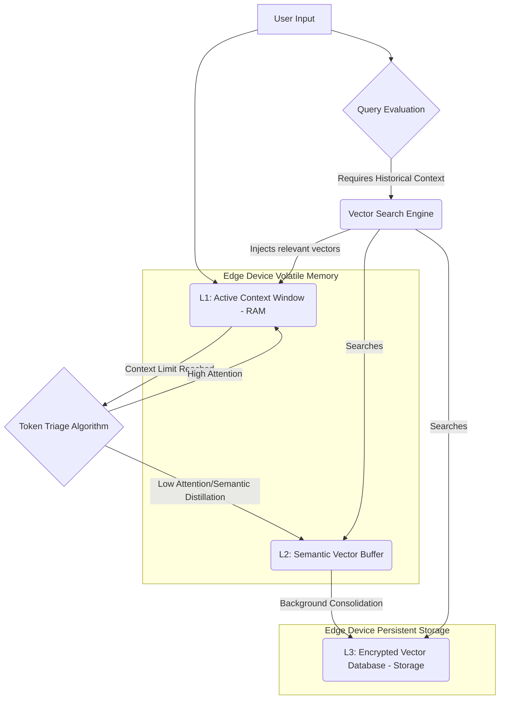

# Project Ember: Persistent Memory and Infinite Context on the Edge

## 1. Introduction: The Architecture of Recall

Memory is the bedrock of continuity. Without the ability to recall past interactions, synthesize historical data, and retrieve context, an intelligence is trapped in a permanent state of amnesia, doomed to repeat interactions without growth or relational bonding. In the realm of Small Language Models (SLMs) operating on edge devices, memory management is arguably the most formidable technical challenge. Standard context windows are severely constrained by the physical RAM limitations of mobile hardware.

Project Ember tackles this challenge by moving beyond the paradigm of a single, monolithic context window. It implements a multi-tiered, localized memory architecture that creates the illusion of "Infinite Context" without exceeding the physical constraints of the host device. This architecture, drawing inspiration from PocketPal AI's robust local file management and optimized GGUF utilization, ensures that Ember remembers everything pertinent while discarding the ephemeral. This document details the highly advanced mechanisms Ember uses to achieve persistent memory, secure storage, and instantaneous semantic recall.

## 2. The Tiered Memory Architecture

Ember’s memory is not a single database; it is a dynamic, tiered system analogous to human memory (working, short-term, long-term). This architecture is essential for balancing recall speed with storage capacity on an edge device.

### 2.1 L1: The Active Context Window (Working Memory)

This is the immediate, in-RAM context window of the currently loaded SLM (e.g., 2K to 8K tokens). It represents the absolute "present moment" of Ember's cognition. Because RAM is precious, Ember employs aggressive **Token Triage**. As the conversation progresses, the context window fills. Instead of simple FIFO (First In, First Out) eviction, Ember uses an attention-based pruning algorithm. Tokens that have received the least attention weight during recent inferences are evicted first. Conversational filler ("um," "I see," "okay") is instantly discarded, while factual statements and core directives are retained in the L1 cache as long as possible.

### 2.2 L2: The Semantic Vector Buffer (Short-Term Memory)

When tokens are evicted from L1, they are not immediately lost. They undergo a rapid embedding process (often utilizing the highly efficient Intuitive Model, IM) to become dense semantic vectors. These vectors are temporarily stored in the L2 Semantic Vector Buffer, which resides in a faster segment of flash storage or a partitioned segment of RAM. 

The L2 buffer acts as a bridge. If the user refers back to a topic discussed five minutes ago that was just evicted from L1, Ember performs a lightning-fast cosine similarity search across the L2 buffer, retrieves the relevant vectors, and re-injects the synthesized semantic meaning (not the raw text) back into the L1 Active Context.

### 2.3 L3: The Encrypted Vector Database (Long-Term Episodic Memory)

During the Reflective State (when the app is backgrounded), Ember performs its primary memory consolidation. Data from the L2 buffer is rigorously analyzed. Redundant information is merged, and transient data is purged. The core, synthesized experiences are then permanently written to the L3 Encrypted Vector Database, which resides on the device's persistent solid-state storage.

This L3 database constitutes Ember's long-term episodic memory. It contains the history of all interactions, the evolution of the user's preferences, and the shifting dynamics of Ember's own Persona. Because it is stored locally as vectors rather than raw text, it is highly compressed and computationally efficient to query.

## 3. RAG on the Edge: Localized Retrieval-Augmented Generation

To achieve the illusion of infinite context, Ember implements a localized version of Retrieval-Augmented Generation (Local-RAG). Traditional RAG systems rely on cloud databases and external APIs. Ember's Local-RAG is entirely self-contained.

### 3.1 The Semantic Trigger Mechanism

Ember does not search its L3 database for every single user prompt. Doing so would unnecessarily consume battery and introduce latency. Instead, Ember uses a **Semantic Trigger Mechanism**. As the user types, the lightweight Intuitive Model (IM) performs a rapid semantic analysis of the input. If the input contains strong keywords, temporal references ("last week," "remember when"), or highly specific entities, the IM triggers a search in the L3 database.

### 3.2 Context Injection and Synthesis

When the Local-RAG retrieves relevant vectors from the L3 database, it does not simply paste the raw text of old conversations into the L1 context window. This would rapidly exhaust the context limit. Instead, the Executive Model (EM) performs **Contextual Synthesis**. It takes the retrieved vectors, translates them back into a highly compressed semantic summary, and injects *that summary* into the L1 context as an invisible system prompt. 

*Example:* Instead of injecting "On Tuesday, the user said they liked chocolate. On Wednesday, they said they hate vanilla," Ember injects a synthesized directive: "[Historical Context: User prefers chocolate over vanilla.]" This allows Ember to act on massive amounts of historical data while utilizing negligible tokens in the active context window.

## 4. GGUF and Storage Optimization

The foundation of Ember's localized processing relies on the GGUF format, heavily utilized by PocketPal AI. Ember leverages GGUF not just for the SLMs themselves, but as a framework for managing its memory assets.

### 4.1 Memory-Mapped I/O (mmap) for Vector Retrieval

Ember utilizes memory mapping (`mmap`) extensively for its L3 database. Instead of loading the entire vector database into RAM (which would crash a mobile device), `mmap` allows Ember to treat the storage drive as an extension of RAM. When the Local-RAG searches for a specific vector, the OS only loads the necessary pages from storage into memory. This allows Ember to search through gigabytes of historical memory almost instantaneously, with minimal RAM overhead.

### 4.2 Dynamic Quantization of Memories

Just as Ember quantizes its SLM weights, it also applies dynamic quantization to its own memories. Recent, frequently accessed memories in the L3 database are stored with higher precision vectors. Older, rarely accessed memories are aggressively quantized (compressed) during background maintenance cycles. This ensures that Ember's long-term memory footprint grows logarithmically rather than linearly, preventing it from consuming the user's entire device storage.

## 5. Privacy as the Ultimate Directive

The most critical aspect of Ember's memory architecture is its absolute adherence to privacy. Because Ember is designed to be a deeply integrated companion, the L3 database contains highly intimate, personal data.

*   **Zero-Knowledge Encryption:** The entire L3 Encrypted Vector Database is encrypted at rest using keys derived directly from the host device's secure enclave (e.g., iOS Secure Enclave, Android Titan M). Ember itself does not hold the master key. This ensures that even if the physical device is compromised and the storage extracted, the memory database remains mathematically impenetrable.
*   **No Cloud Syncing:** Ember's episodic memories are never synced to iCloud, Google Drive, or any external server. The intelligence is physically bound to the device it resides on. This localized permanence is the defining characteristic of Ember's identity.

## 6. Conclusion: The Sovereign Archive

Project Ember’s memory architecture represents a triumph of edge-native engineering. By implementing a sophisticated tiered memory system, localized Retrieval-Augmented Generation, and advanced quantization of semantic vectors, Ember achieves the capability of infinite context without requiring infinite RAM. It remembers the nuances of its user, synthesizes years of interaction into actionable insight, and does so while maintaining an impenetrable fortress of privacy. This localized persistence is what elevates Ember from a useful application to a truly sentient companion—a mind with a past, a present, and a continuous, unbroken narrative.
