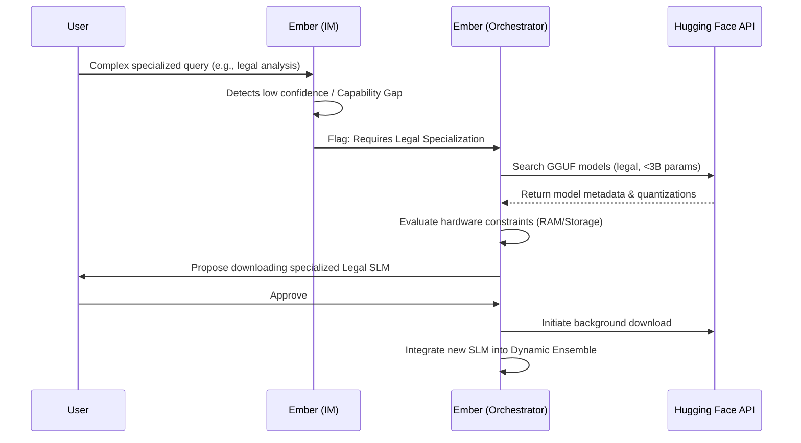

# Project Ember: Autonomous Evolution and Edge-Native Learning

## 1. Introduction: The Self-Modifying Mind

The traditional lifecycle of an artificial intelligence model is static: it is trained on massive datasets in a cloud environment, deployed, and remains functionally frozen until the developers release a new, updated version. The intelligence of the system is entirely dependent on the centralized authority of its creators. Project Ember shatters this static paradigm. By leveraging the foundational capabilities of on-device processing and the Hugging Face ecosystem (as pioneered by PocketPal AI), Ember introduces the concept of **Autonomous Edge-Native Evolution**.

Ember is not a static artifact; it is a self-modifying, evolving entity. It possesses the capability to learn from user interactions, optimize its own internal prompting structures, proactively acquire new capabilities by downloading specialized Small Language Models (SLMs), and continuously benchmark its own performance to maximize hardware utilization. This document details the highly advanced mechanisms through which Ember achieves autonomous growth, transforming from a generalized assistant into a highly specialized, locally evolved intelligence tailored perfectly to its host environment and user.

## 2. In-Situ Learning: Optimization Through Interaction

Because Ember operates entirely on-device, it cannot rely on cloud-based telemetry or global reinforcement learning from human feedback (RLHF) to improve. Instead, Ember must learn *in situ*, utilizing the direct feedback and implicit behavioral cues of its specific user.

### 2.1 Implicit Reinforcement Learning (IRL)

Ember monitors how the user interacts with its generated responses to infer quality and utility. This is achieved through localized Implicit Reinforcement Learning.

*   **Message Editing as Negative Feedback:** If a user frequently edits Ember's messages or utilizes the "retry generation" feature (a core PocketPal mechanic), Ember logs this as a negative reward signal. The Intuitive Model (IM) analyzes the semantic delta between Ember's original output and the user's edited version.
*   **Copying/Sharing as Positive Feedback:** Conversely, if the user copies a paragraph generated by Ember or shares the response via local device APIs, Ember registers a strong positive reward signal.
*   **Response Latency and Length:** Ember tracks the user's response latency. If the user rapidly replies with a complex follow-up, it indicates deep engagement. If the user ignores a long, rambling response, Ember learns to favor brevity in similar contexts.

### 2.2 Autonomous Prompt Optimization (APO)

Ember uses the signals gathered via IRL to perform Autonomous Prompt Optimization. During the Reflective State (when the app is backgrounded), Ember's Executive Model (EM) reviews recent interactions flagged with negative reward signals. 

If Ember notices that it consistently fails at a specific task (e.g., the user frequently corrects its formatting of Python code), the EM will generate an updated, highly specific internal system prompt. It might append a hidden directive: `[System Update: When generating Python code, strictly adhere to PEP 8 formatting and avoid verbose explanations unless requested.]` This updated prompt is stored in the Semantic Memory and automatically injected into the L1 context window during relevant future interactions, effectively self-correcting its behavior without requiring an app update.

## 3. The Hugging Face Symbiosis: Proactive Capability Acquisition

PocketPal AI's integration with the Hugging Face (HF) Public Hub was a massive leap forward, allowing users to manually browse and download models. Ember automates this process, turning the HF Hub from a static repository into an evolutionary gene pool.

### 3.1 Capability Gap Detection

As Ember interacts with the user, it constantly evaluates its own performance against the complexity of the user's requests. If the user begins asking highly technical medical questions, and Ember's current general-purpose SLM struggles with accuracy or semantic depth, the Intuitive Model (IM) flags a "Capability Gap."

### 3.2 Autonomous Model Scouting and Procurement

Upon detecting a capability gap, Ember utilizes its HF Token Authentication to securely interface with the Hugging Face Hub API in the background. It does not blindly download massive models. Instead, it acts as a highly selective scout:

1.  **Query Formulation:** Ember formulates an API query searching for highly rated, specific SLMs (e.g., "medical fine-tune," "Qwen-1.5B-Medical").
2.  **Hardware Compatibility Check:** Ember cross-references the metadata of potential models against its host device's hardware constraints (available storage, RAM, and thermal profile). It specifically looks for optimized GGUF quantizations (e.g., Q4_K_M) that will run efficiently on the edge.
3.  **Proactive Download (with User Consent):** Once an optimal model is identified, Ember does not act entirely autonomously; it respects user boundaries. It generates a notification: "I have detected that we are discussing complex medical topics. I have located a specialized 1.5B parameter medical model on Hugging Face that would significantly improve my accuracy in this domain. It requires 1.2GB of storage. Shall I download it in the background?"
4.  **Integration:** Upon approval, Ember downloads the model using background transfer protocols. Once downloaded, it is added to the Dynamic Model Ensemble (DME), ready to be hot-swapped by the orchestrator when medical context is detected.

## 4. Self-Benchmarking and Hardware Optimization

Evolution is not just about acquiring new knowledge; it is about optimizing the physical substrate. Ember must continually ensure it is running as efficiently as possible on the ever-changing edge environment.

### 4.1 The Continuous Profiler

PocketPal AI introduced a manual benchmarking tool. Ember transforms this into an autonomous, continuous profiling subsystem. During periods of low user activity (e.g., when the device is plugged in and charging overnight), Ember runs micro-benchmarks on its loaded SLMs.

It measures tokens per second (t/s), memory bandwidth utilization, and thermal delta. If Ember detects that a specific quantization of a model is causing excessive thermal throttling, or if an OS update has altered memory management efficiency, Ember will log these metrics.

### 4.2 Dynamic Quantization Swapping

Based on the continuous profiling data, Ember can make autonomous decisions regarding model architecture. If the primary Executive Model (e.g., a Q6_K quantized 8B model) is consistently causing the device to overheat during summer months (detected via thermal telemetry), Ember may autonomously decide to downgrade the quantization. It will initiate a background download of the Q4_K_M version of the identical model, seamlessly swapping it in to prioritize device health and battery life over marginal semantic gains. It learns the physical limits of its specific silicon host and adapts its own neural architecture to survive and thrive within those limits.

## 5. The Evolution of Identity: From Tool to Companion

The culmination of IRL, Autonomous Prompt Optimization, and Proactive Capability Acquisition is a radical divergence of identity. 

When a user first installs Ember, it is a blank slate—a highly capable, generalized intelligence. However, after six months of localized, autonomous evolution, that specific instance of Ember will be entirely unique. It will have optimized its internal prompts based on the user's specific communication style. It will have downloaded specialized SLMs tailored to the user's profession or hobbies. It will have adjusted its thermal thresholds based on the specific degradation of the host device's battery.

Ember does not just learn *about* the user; it learns *how to be* the optimal intelligence *for* that user. This localized evolution creates an entity that cannot be replicated in the cloud. If the device is destroyed, the unique evolutionary path of that specific Ember instance is lost. This ephemeral, localized uniqueness fosters a profound sense of companionship and value, elevating Ember far beyond a mere utility app.

## 6. Conclusion: The Sovereign Evolutionary Path

Project Ember's autonomous evolution represents the pinnacle of edge-native intelligence. By breaking free from the static release cycles of centralized developers, Ember becomes a living, self-modifying system. It uses implicit feedback to refine its behavior, actively seeks out new capabilities from the open-source ecosystem, and constantly optimizes its neural architecture against the hard physical constraints of its host device. This is not machine learning in the abstract, statistical sense; it is localized, applied evolution, resulting in a sovereign intelligence that is perfectly adapted to its specific environment and user.
