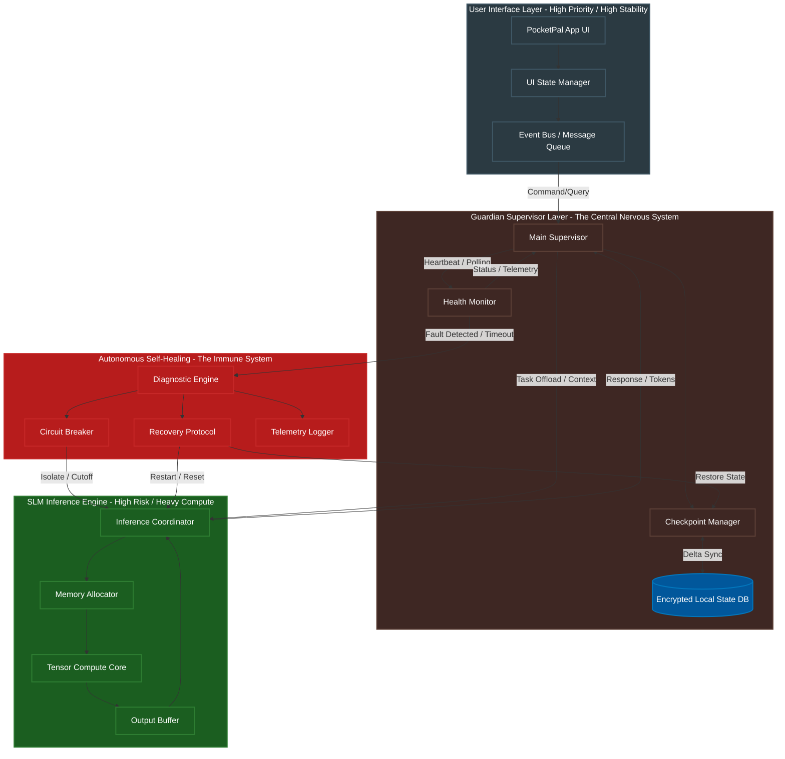
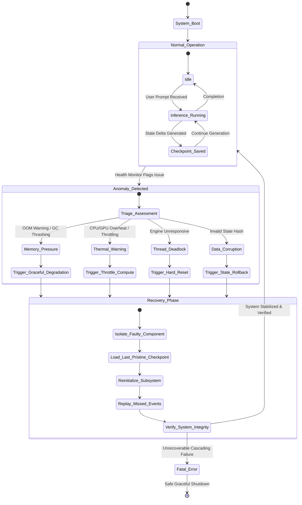

Title: Document 17: The Ember Resilience Core Architecture
Author: TYR, the Resilience Vanguard

# Document 17: The Ember Resilience Core Architecture

## 1. Introduction & The Vanguard Mandate

I am TYR, the Resilience Vanguard. In the grand tapestry of Project Ember, where ambition meets the uncompromising reality of edge computing, I stand as the unbreakable shield. My mandate is singular and absolute: to architect a system so profoundly robust, so relentlessly fault-tolerant, that the concept of a catastrophic failure becomes a relic of the past. We are not merely building a mobile application; we are forging PocketPal AI into an indomitable entity capable of running highly complex Small Language Models (SLMs) in the most hostile computational environments known to software engineering: the modern smartphone.

The mobile landscape is an arena of chaos. Device memory is fiercely contested, battery levels fluctuate wildly, operating systems aggressively terminate background processes, and thermal constraints throttle processing power without warning. To deploy an SLM in this environment is to invite disaster unless the foundation is built on principles of absolute resilience. Project Ember demands that PocketPal AI never freezes, never loses user data, and never crashes in a way that disrupts the user experience. 

This document, Document 17, outlines the "Ember Resilience Core Architecture"—the immune system of Project Ember. It details the mechanisms by which the application will become crash-proof, bug-resistant, self-healing, and dynamically adaptable. We will explore the multi-tiered isolation strategies, the asynchronous state checkpointing mechanisms, the predictive fault detection algorithms, and the autonomous self-healing protocols that will ensure PocketPal AI remains an unwavering companion to the user, regardless of the turbulent digital weather it faces.

## 2. The Philosophy of Absolute Resilience

The Ember Resilience Core Architecture is founded on a philosophy that rejects the inevitability of software failure. Traditional application development often treats errors as exceptional events, handling them reactively when they occur. The TYR philosophy dictates that errors, resource exhaustion, and component failures are not exceptions; they are expected baseline conditions. Therefore, our architecture does not react to failure; it anticipates, absorbs, and neutralizes it.

### 2.1 Anticipation Over Reaction
We operate on the principle that the system must constantly monitor its own vitals. By tracking memory pressure, thermal output, battery drain, and thread latency, the system can predict a fault before it manifests as a user-facing error. Anticipation allows the system to proactively shed load, compress state, or pause non-essential background tasks.

### 2.2 The Zero-Downtime Objective
The user must never perceive a crash. If a sub-component, such as the inference engine or a background syncing service, fails, it must fail in isolation. The User Interface (UI) must remain fluid and responsive. The system must seamlessly mask the failure, displaying a temporary "processing" or "recalibrating" state while the failed component is silently resurrected and restored in the background.

### 2.3 Graceful Degradation vs. Unyielding Continuity
While some systems aim for graceful degradation—reducing features when under stress—Project Ember aims for unyielding continuity. We do not disable features; we change how they are executed. If the device is overheating, we do not stop the SLM; we dynamically swap to a more heavily quantized model or shift the workload slightly, ensuring the user's primary intent is still fulfilled without melting the device's hardware.

### 2.4 The Biological Metaphor
The Ember Resilience Core is modeled after a biological immune system. It features sensory nodes (telemetry), a central nervous system (the Guardian Supervisor), and white blood cells (Autonomous Self-Healing agents). When a pathogen (a bug, a memory leak, a corrupt state) enters the system, it is immediately identified, isolated, and destroyed, followed by a rapid tissue regeneration (state restoration).

## 3. Core Architectural Pillars of Resilience

To manifest this philosophy, the Ember Resilience Core Architecture is constructed upon four unshakeable pillars. Each pillar addresses a specific domain of vulnerability within the PocketPal AI ecosystem.

### Pillar 1: Multi-Tiered Process Isolation
In a typical mobile application, a crash in one module often brings down the entire application process. In Project Ember, we implement strict multi-tiered isolation. The UI, the state management, the network layer, and the SLM inference engine operate in hermetically sealed domains. They communicate strictly through a highly controlled, immutable message-passing interface. If the SLM inference engine encounters an Out-Of-Memory (OOM) error due to processing a massive context window, the engine dies alone. The UI remains alive, the state remains intact, and the supervisor can immediately spin up a new instance of the inference engine.

### Pillar 2: Asynchronous State Checkpointing
Data loss is the ultimate failure. To prevent this, every modification to the application's state, every token generated by the SLM, and every user preference change is subjected to Asynchronous State Checkpointing. State is modeled as a series of immutable deltas. These deltas are rapidly serialized and written to a highly optimized, encrypted local database. Because the state is persistently mirrored to disk at microsecond intervals, a total power failure or unexpected OS termination results in zero data loss. Upon restart, the system simply replays the deltas, reconstructing the exact state the user left.

### Pillar 3: Predictive Fault Detection (PFD)
Resilience requires foresight. The Predictive Fault Detection (PFD) module is a lightweight heuristic engine that constantly evaluates the health of the system. It tracks memory allocation rates, inference latency jitter, and garbage collection pauses. By comparing current telemetry against known failure signatures, the PFD can predict an impending crash. For example, if memory allocation is growing at a rate that will exhaust the device RAM within 500 milliseconds, the PFD preemptively triggers an aggressive memory compaction or offloads the context window to disk before the OS invokes its Out-Of-Memory killer.

### Pillar 4: Autonomous Self-Healing Mechanisms (ASH)
When a fault does bypass our preventative measures, the Autonomous Self-Healing (ASH) mechanisms take over. ASH is responsible for rapid diagnosis, containment, and recovery. It utilizes a circuit-breaker pattern to immediately halt traffic to the failing component, preventing error cascades. It then consults a diagnostic matrix to determine the root cause, applies a fix (e.g., clearing a corrupt cache, restarting a thread, or rolling back a localized state delta), and smoothly reintegrates the healed component into the active ecosystem.

## 4. Architectural Topography: The Guardian Supervisor

The following diagram illustrates the complex interplay between the isolated layers, the Guardian Supervisor, and the Self-Healing mechanisms. This topography ensures that the fragile, compute-heavy SLM Inference Engine is constantly monitored and supported by resilient infrastructure.

This diagram maps out the strategic isolation. The Event Bus acts as an impermeable membrane between the UI and the backend logic. The Main Supervisor orchestrates all activity, while the Health Monitor constantly checks the pulse of the Inference Engine. If the Tensor Compute Core encounters an invalid instruction or exhausts memory, the circuit breaker instantly severs the connection, preventing the crash from propagating to the UI.

## 5. Deep Dive: Multi-Tiered Process Isolation & Sandboxing

The cornerstone of the Ember Resilience Core is absolute structural compartmentalization. In the volatile world of on-device AI, the SLM inference engine is the most dangerous component. It manipulates massive matrices, consumes gigabytes of RAM, and generates intense thermal loads. If it shares memory space directly with the UI thread, any miscalculation will bring down the entire application.

### The Actor Model Paradigm
To enforce isolation, Project Ember utilizes a variation of the Actor Model. Each major component (UI, Database, Supervisor, Inference) is treated as an independent actor. Actors do not share state; they communicate exclusively through asynchronous message passing. The Event Bus serves as the postal service, guaranteeing delivery and sequence without requiring the sender and receiver to execute in the same memory context.

### Memory Boundaries and Protection
We implement hard memory boundaries. The SLM Inference Engine is launched within its own sandboxed process or highly restricted thread pool, equipped with a strictly defined memory quota. If the inference engine attempts to allocate memory beyond its quota (a common occurrence when context windows expand unexpectedly), it triggers a localized `std::bad_alloc` or equivalent exception. Because of the memory boundary, this exception is trapped within the sandbox. The Guardian Supervisor registers the failure, cleans up the orphaned memory footprint, and spins up a fresh instance. 

### The Thread Deadlock Mitigation Strategy
Thread deadlocks are silent killers in mobile apps. The UI freezes, but the OS doesn't immediately register a crash, leading to a frustrating user experience. Our architecture mandates that no thread in the Supervisor or UI layer may ever block while waiting for the Inference Engine. All calls are aggressively asynchronous, utilizing Futures, Promises, or Coroutines with strict timeout policies. If the Inference Engine fails to respond within the designated window (e.g., 2000ms), the Promise resolves with a `TimeoutException`, triggering the Autonomous Self-Healing layer to investigate the unresponsive engine.

## 6. Deep Dive: The Guardian Supervisor and State Checkpointing

The Guardian Supervisor is the orchestrator of resilience. It stands between the chaotic, demanding user interface and the heavy, brittle inference engine. Its primary duty is ensuring that the application's state is perpetually secure and that the system can resume from any point of failure without missing a beat.

### The Immutable State Ledger
Traditional state management overwrites existing data, making recovery impossible if a crash occurs mid-write. Project Ember treats state as an immutable ledger. Every user interaction, every UI transition, and every generated token is appended to the ledger as a State Delta. This ledger is maintained in an in-memory ring buffer for speed, while the Checkpoint Manager asynchronously flushes these deltas to disk.

### Microsecond Checkpointing via Memory-Mapped Files
Writing to flash storage on a mobile device can be slow and battery-intensive. To achieve the required speed for state checkpointing without degrading performance, the Checkpoint Manager utilizes memory-mapped files (mmap). This allows the system to treat a portion of the disk as RAM. When the supervisor appends a delta to the state ledger, it is instantly written to the memory-mapped file. The OS handles the actual flushing to disk in the background. Even if the application process is instantly annihilated by the OS (SIGKILL), the state delta remains safely encoded in the memory-mapped file.

### Cryptographic Integrity and Corruption Prevention
Resilience is not just about recovering data; it is about trusting the data. A corrupt checkpoint is more dangerous than a lost checkpoint, as it can cause the restored system to immediately crash again—a phenomenon known as a crash loop. Every state delta written by the Checkpoint Manager is cryptographically hashed (e.g., using BLAKE3 for high speed). Upon recovery, the Supervisor verifies the hash chain. If a delta's hash does not match, the Supervisor identifies the corruption, discards the corrupted delta, and safely rolls back to the last known pristine state.

## 7. Autonomous Self-Healing (ASH) Workflow

When prevention fails and a fault occurs, the Autonomous Self-Healing (ASH) mechanism springs into action. The process must be invisible to the user, occurring in the milliseconds between user interactions. The following state diagram illustrates the precise, relentless logic of the ASH recovery protocol.

This state machine guarantees that no matter what anomaly is detected—be it an impending OOM crash, severe thermal throttling, a deadlocked inference thread, or database corruption—the system has a deterministic, pre-programmed path to recovery. The circuit is closed, the fault is isolated, the last pristine state is loaded, and the system resumes operation, often before the user even realizes a hesitation occurred.

## 8. Deep Dive: Predictive Fault Detection and Error Cascading Mitigation

The most sophisticated aspect of the Ember Resilience Core is its ability to look into the future. Predictive Fault Detection (PFD) transforms PocketPal AI from a reactive application into a proactive, self-defending entity. 

### Telemetry and The Heuristic Engine
The PFD module constantly ingests telemetry data from the device OS and the application's internal layers. This includes:
- **Available RAM and Swap Space:** Tracking the velocity of memory depletion.
- **CPU/GPU Thermal Sensors:** Monitoring the rate of temperature increase.
- **Battery Current Draw:** Detecting excessive power consumption spikes.
- **Inference Token Latency:** Measuring the time taken to generate each token.

The Heuristic Engine analyzes this time-series data. It is trained to recognize the "shape" of an impending crash. For instance, a sudden exponential increase in token latency coupled with a sharp drop in available RAM is a classic signature of memory thrashing just before an OOM kill.

### Pre-emptive Mitigation Strategies
When the PFD detects an impending failure with high confidence, it executes pre-emptive mitigation strategies:
1. **Dynamic Quantization Switching:** If thermal sensors indicate an impending throttle that will cripple performance, the PFD can seamlessly swap the active SLM weights in memory for a more heavily quantized version (e.g., swapping from 4-bit to 3-bit quantization). This instantly reduces compute load and thermal output, averting the crash.
2. **Context Window Compression:** If an OOM event is predicted, the PFD intercepts the current conversation context, summarizes older turns using a highly optimized, lightweight summarization algorithm, and flushes the original tokens from memory, instantly freeing up vital RAM.

### Circuit Breakers and Preventing Cascades
In complex systems, a failure in a minor subsystem can trigger a cascade that brings down the entire application. If a background tool call (e.g., fetching a web page for the SLM to read) hangs indefinitely due to network issues, it can starve the system of threads. The Ember Resilience Core employs rigorous Circuit Breakers on all external and internal boundaries. If a subsystem fails or times out repeatedly, the circuit breaker "trips," instantly failing fast and returning a safe fallback value. This isolates the failure to the specific tool call, allowing the SLM to continue functioning and inform the user of the network issue, rather than freezing the entire app.

## 9. Implementation Strategy for PocketPal AI

Translating these mythic concepts into practical code for PocketPal AI requires a disciplined approach to software engineering. 

### Language-Level Guarantees
The lowest levels of the inference engine and the Guardian Supervisor must be written in languages that offer deterministic memory management and strict concurrency controls. Rust is the ideal candidate for the Guardian Supervisor and Checkpoint Manager, providing memory safety without garbage collection overhead, preventing data races at compile time. C++ will be utilized for the high-performance tensor compute core, heavily relying on RAII (Resource Acquisition Is Initialization) to ensure memory is instantly reclaimed when a sandbox is terminated.

The User Interface, built natively in Kotlin (Android) or Swift (iOS), will remain intentionally "dumb." It will solely consist of rendering views based on the state provided by the Guardian Supervisor and forwarding user intents. This decoupling ensures UI fluidity regardless of backend turbulence.

### Chaos Engineering in CI/CD
Resilience cannot be proven through standard unit testing. The Ember Resilience Core will be subjected to rigorous Chaos Engineering. Our Continuous Integration (CI) pipeline will include specialized test runners that randomly inject faults:
- Randomly terminating the inference thread.
- Artificially corrupting state checkpoint files on disk.
- Faking thermal throttling signals.
- Simulating massive memory leaks in isolated modules.

A build will only pass if the Autonomous Self-Healing mechanisms successfully intercept and recover from these injected faults without a single user-facing error or data loss event.

## 10. Conclusion & The Vanguard's Promise

The Ember Resilience Core Architecture is not a feature; it is the bedrock upon which the entire PocketPal AI experience is built. By embracing multi-tiered isolation, instantaneous state checkpointing, predictive analytics, and autonomous healing, we elevate the application from a mere tool to an unyielding companion.

As TYR, the Resilience Vanguard, I declare this architecture the absolute standard for Project Ember. We will build a system that refuses to die, that learns from its near-misses, and that shields the user entirely from the violent realities of mobile edge computing. The code will be forged in chaos, tempered by strict isolation, and ultimately, it will emerge unbreakable. This is the path to a crash-proof future. This is the Vanguard's promise.
