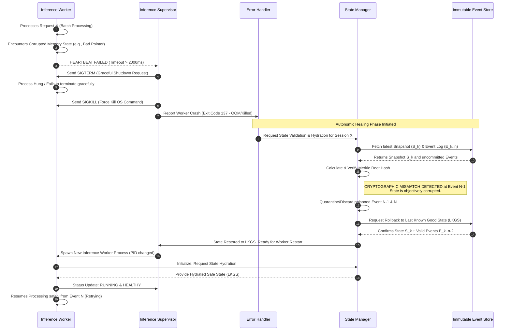

# Document 18: Self-Healing Mechanisms and Autonomic Recovery
## Project Ember - The Resilience Vanguard (TYR)

### 1. Executive Summary

In the context of localized, edge-deployed artificial intelligence, the conventional paradigms of centralized cloud reliability are entirely insufficient. Project Ember, built upon the foundation of the PocketPal AI ecosystem, is designed to operate in environments characterized by extreme unpredictability, resource constraints, and adversarial interference. This document, authored by TYR, the Resilience Vanguard, delineates the sophisticated self-healing mechanisms and autonomic recovery protocols engineered into the core of Project Ember. Our mandate is simple yet profoundly complex: zero perceived downtime, absolute state integrity, and instantaneous recovery from fatal errors.

The mechanisms detailed herein move beyond traditional fault tolerance. We do not merely construct robust systems that resist failure; we engineer resilient, autonomic systems that assume failure as an inevitable, continuous operational state. By embracing a "Let it Crash" philosophy derived from high-availability telecommunications systems, coupled with deterministic event-sourced state management, Project Ember can continuously monitor its own health, isolate corrupted components, roll back to last-known-good states, and dynamically reallocate resources to bypass failing hardware or software modules. This document comprehensively explores the supervision hierarchies, cryptographic state verification processes, predictive failure analysis algorithms, and mesh-network resilience strategies that constitute Ember's autonomic nervous system.

### 2. The Philosophy of Autonomic Computing in Edge AI

Autonomic computing refers to the self-managing characteristics of distributed computing resources, adapting to unpredictable changes while hiding intrinsic complexity from operators and users. In Project Ember, this philosophy is not an optional layer; it is the fundamental architectural axiom. Edge devices—ranging from mobile hardware to embedded IoT systems—are subjected to thermal throttling, sudden power loss, erratic network connectivity, and memory pressure.

Traditional applications handle these issues through defensive programming: sprawling `try-catch` blocks, complex state checks, and graceful shutdown routines that often fail to execute when the underlying OS terminates the process. Project Ember rejects this approach. Instead, we treat the local application as a distributed system of isolated, concurrent actors. When an actor encounters a failure state, we do not attempt a complex, in-place recovery. We terminate the actor immediately.

This "Let it Crash" methodology relies on the presence of highly intelligent supervisory processes whose sole responsibility is to monitor the lifecycle of worker actors. When a worker dies, the supervisor assesses the exit condition, consults the current system telemetry, and determines the optimal recovery strategy. This may involve immediately restarting the actor, delaying the restart with an exponential backoff to prevent cascading failures, or re-routing the workload to an entirely different component. The overarching goal is minimizing the Mean Time To Recovery (MTTR) rather than artificially inflating the Mean Time Between Failures (MTBF) at the cost of system complexity.

### 3. Architectural Foundations: Supervision Trees and the Actor Model

To achieve autonomic recovery, Project Ember's architecture is strictly modularized using the Actor Model. Every distinct operational domain—such as large language model inference, vector database management, peer-to-peer network synchronization, and user interface rendering—is isolated within its own actor or group of actors. These actors share absolutely no memory. All communication occurs via asynchronous message passing across an internal, lightweight event bus.

This isolation ensures that a catastrophic memory leak in the UI renderer cannot corrupt the state of the vector database, nor can a segmentation fault in the heavily optimized C++ inference engine crash the network synchronization worker. 

These actors are organized into a hierarchical "Supervision Tree." 

#### 3.1. The Supervision Hierarchy
1. **Root Guardian Node:** The apex of the hierarchy. It runs in the most stable memory space and monitors the primary sub-supervisors. If the Root Guardian crashes, the OS-level watchdog timer reboots the entire application.
2. **Domain Supervisors:** These oversee major functional blocks (Network, Inference, Storage). They maintain the policies for how their child workers should be handled upon failure (e.g., One-for-One restart, All-for-One restart).
3. **Worker Actors:** The entities performing the actual computation. They contain no error recovery logic regarding their own life cycle. They are designed to fail fast and fail loudly.

When a worker actor fails, it emits a critical fault signal to its direct supervisor. The supervisor intercepts this signal, preventing the fault from propagating upward unless the supervisor itself determines that the failure rate has exceeded a predefined threshold (a circuit breaker trip). If a circuit breaker trips, the supervisor intentionally crashes itself, escalating the problem to the next level up the tree, which has a broader view of system health and more drastic recovery tools at its disposal.

### 4. Diagram 1: Autonomic Recovery Architecture

The following diagram illustrates the hierarchical supervision tree, the isolation of domain-specific workers, and the parallel telemetry and control plane that observes the system without interfering with critical path execution.

```mermaid
graph TD
    subgraph Root Supervisor
        RS[Root Guardian Node]
    end
    
    subgraph Telemetry & Control Plane
        TM[Telemetry Monitor]
        AD[Anomaly Detection Engine]
        CBE[Circuit Breaker Engine]
    end
    
    subgraph Domain Supervisors
        NS[Network Supervisor]
        IS[Inference Supervisor]
        SS[State Storage Supervisor]
    end
    
    subgraph Network Workers
        W_N1[WebRTC Peer Worker]
        W_N2[BLE Mesh Worker]
        W_N3[Sync Queue Worker]
    end
    
    subgraph Inference Workers
        W_I1[LLM Execution Thread]
        W_I2[Embedding Generator]
        W_I3[Context Window Manager]
    end
    
    subgraph Storage Workers
        W_S1[Vector DB Indexer]
        W_S2[Event Log Appender]
        W_S3[Snapshot Archiver]
    end

    RS -->|Supervises| NS
    RS -->|Supervises| IS
    RS -->|Supervises| SS
    RS -->|Listens to Alerts| AD
    
    NS -->|Manages Lifecycle| W_N1
    NS -->|Manages Lifecycle| W_N2
    NS -->|Manages Lifecycle| W_N3
    
    IS -->|Manages Lifecycle| W_I1
    IS -->|Manages Lifecycle| W_I2
    IS -->|Manages Lifecycle| W_I3
    
    SS -->|Manages Lifecycle| W_S1
    SS -->|Manages Lifecycle| W_S2
    SS -->|Manages Lifecycle| W_S3

    TM -.->|Reads Metrics (Non-Blocking)| W_N1
    TM -.->|Reads Metrics (Non-Blocking)| W_I1
    TM -.->|Reads Metrics (Non-Blocking)| W_S1
    
    TM -->|Feeds Data| AD
    AD -->|Evaluates Risk / Triggers Policies| CBE
    CBE -->|Commands Fault Isolation| IS
    CBE -->|Commands Fault Isolation| NS
    CBE -->|Commands Fault Isolation| SS
```

### 5. State Corruption Detection and Event Sourced Remediation

A crashed process is relatively easy to handle; you simply restart it. The far more insidious threat to Project Ember is state corruption. If an LLM's context window becomes corrupted due to a bit flip, or if the vector database's index is partially written during a power loss, restarting the process with the same corrupted data will result in immediate, repeated failures—a "death loop."

To completely eradicate state corruption, Project Ember strictly employs **Event Sourcing** for all critical state changes, combined with cryptographic verification.

#### 5.1. Immutability and the Event Log
Instead of updating records in place (e.g., changing a variable `x` from 5 to 10), the system appends immutable facts to an append-only event log. The current state is derived by replaying these events from a known genesis point. 

#### 5.2. Cryptographic Merkle Trees
To ensure the integrity of the event log, events are hashed and organized into a Merkle Tree. Every time a new event is appended, the root hash of the tree is updated. The Storage Supervisor periodically takes "snapshots" of the derived state and records the Merkle Root hash associated with that snapshot.

When a worker process crashes and is restarted, it must request a state hydration from the State Storage Supervisor. The supervisor does not blindly hand over the latest snapshot. It first recalculates the Merkle Root of the event log up to that snapshot. If the calculated hash does not match the stored hash, state corruption has occurred.

#### 5.3. Rolling Back to the Last Known Good State (LKGS)
Upon detecting corruption, the system autonomously initiates a rollback procedure. It traverses the event log backwards, verifying the Merkle tree at previous snapshot intervals until it finds a valid, uncorrupted root hash. This is designated as the Last Known Good State (LKGS). 

The system discards the corrupted events (often caused by "poison pill" inputs or hardware faults during write operations) and hydrates the restarted worker with the LKGS. The worker then resumes operation, effectively traveling back in time to the moment just before the corruption occurred, allowing it to bypass the fatal error.

### 6. Crash Handling: Throttling and Circuit Breakers

While immediate restarts are the primary defense, infinite restart loops consume massive amounts of battery power and CPU cycles, degrading the overall user experience on mobile edge devices. Therefore, Project Ember's supervisors implement sophisticated throttling mechanisms.

#### 6.1. Exponential Backoff
If a worker crashes, it is immediately restarted. If it crashes again within a configurable time window (e.g., 5 seconds), the supervisor imposes a delay before the next restart (e.g., 100ms). If it crashes a third time, the delay increases exponentially (200ms, 400ms, 800ms, etc.). This prevents a failing component from monopolizing the CPU while it is repeatedly failing.

#### 6.2. The Circuit Breaker Pattern
If a component reaches the maximum backoff threshold, the supervisor trips a "Circuit Breaker." The circuit breaker forcibly halts all attempts to interact with the failing component. Any messages addressed to that component are immediately returned with a "Service Unavailable" error, rather than timing out. This prevents cascading failures. For instance, if the WebRTC worker is failing because the device's Wi-Fi chip is physically malfunctioning, the UI thread shouldn't hang while waiting for network responses. The tripped circuit breaker allows the UI to instantly inform the user of the network hardware failure while maintaining the responsiveness of local, offline LLM inference.

After a cooling-off period, the circuit breaker enters a "Half-Open" state, allowing a single test message to pass through. If the test succeeds, the breaker closes, and normal operation resumes. If it fails, the breaker trips again, resetting the cooling-off timer.

### 7. Diagram 2: State Rollback and Healing Workflow

This sequence diagram details the exact autonomic response when an Inference Worker encounters corrupted memory state, leading to a force-kill, cryptographic state verification, rollback, and seamless resumption of service.



### 8. Network and Connectivity Resilience

PocketPal AI and Project Ember are fundamentally designed as "Local-First" applications. We assume that network connectivity is hostile, intermittent, and low-bandwidth. True resilience means the application functions flawlessly regardless of the network state, recovering gracefully when connectivity is restored.

#### 8.1. Conflict-Free Replicated Data Types (CRDTs)
When multiple Project Ember nodes interact in a decentralized mesh, they may be disconnected for hours or days. During this time, they continue to append events to their local logs. When they reconnect, these divergent histories must be merged without human intervention or central server arbitration.

We achieve this via CRDTs. CRDTs are mathematical data structures that guarantee strong eventual consistency. No matter what order events are received, or how many times they are duplicated across the mesh network, the final calculated state will be identical on all nodes. If Node A and Node B both edit the same document while offline, the CRDT mechanisms automatically merge the changes deterministically. If there is a direct conflict, a deterministic arbitration rule (e.g., highest timestamp or highest peer ID) resolves it seamlessly.

#### 8.2. Peer-to-Peer Relay Failover
Ember utilizes dynamic routing protocols over WebRTC and BLE. If a direct peer-to-peer connection is severed (e.g., a user walks out of Bluetooth range), the Network Supervisor detects the dropped heartbeat. The Circuit Breaker trips for that direct route, and the routing table instantly queries the mesh for alternative multi-hop relays. Data packets are seamlessly rerouted through intermediary PocketPal nodes. This autonomic routing layer self-heals network partitions dynamically without the application layer workers ever being aware of the topological shift.

### 9. Predictive Failure Analysis and Proactive Healing

Reacting to crashes is a baseline requirement, but true Autonomic Recovery involves anticipating and preventing failures before they occur. The Telemetry Monitor and Anomaly Detection Engine (as shown in Diagram 1) work continuously in the background, utilizing lightweight machine learning models to analyze system metadata.

#### 9.1. Thermal Throttling Evasion
Running LLMs on mobile devices generates significant heat. If the device reaches a critical thermal threshold, the OS will aggressively throttle the CPU/GPU, severely degrading performance, or forcibly shut down the application to prevent hardware damage. 

Ember's Telemetry Monitor continuously reads thermal sensor data. When the Anomaly Detection Engine predicts that the thermal trajectory will lead to an OS-enforced shutdown within 60 seconds, it initiates proactive healing: Graceful Degradation. The Circuit Breaker Engine commands the Inference Supervisor to hot-swap the active LLM model. It unloads the high-fidelity FP16 model and instantly loads a heavily quantized, smaller INT4 model. This drastically reduces compute overhead and thermal output. The user experiences a slight drop in response nuance, but the application avoids a catastrophic shutdown. Once thermal levels normalize, the system autonomously hot-swaps back to the high-fidelity model.

#### 9.2. Memory Leak Prediction and Preemptive Rejuvenation
Even with careful memory management in Rust and C++, subtle leaks can occur over long, continuous sessions. The Telemetry Monitor tracks the heap usage velocity of all worker processes. If a worker exhibits an anomalous, monotonic increase in memory consumption that deviates from its baseline processing load, the system flags a high probability of an impending Out-Of-Memory (OOM) crash.

Rather than waiting for the OS to brutally kill the process (which might interrupt a critical user interaction), Ember schedules a "Preemptive Rejuvenation." It waits for a micro-pause in user activity (e.g., the user stops typing for 500ms). During this fraction of a second, the supervisor gracefully shuts down the bloated worker, saving its exact LKGS, and spawns a fresh, clean process, hydrating it instantly. The memory leak is bypassed, the heap is cleared, and the user experiences absolutely no interruption in service. This is the ultimate expression of the Phoenix Principle.

### 10. Conclusion

Project Ember's self-healing mechanisms represent a paradigm shift in how localized AI applications are constructed. By discarding the fragile illusion of continuous, error-free execution, and instead embracing an architecture built around absolute isolation, rigorous cryptographic state management, and ruthless, autonomic component lifecycle management, TYR has ensured that the system is virtually indestructible from a software perspective. 

The integration of Erlang-style supervision trees with modern local-first event sourcing and predictive thermal/memory management yields a system that doesn't just survive in hostile edge environments; it thrives. It heals faster than the user can perceive the wound. This Autonomic Recovery framework guarantees that PocketPal AI remains an unwavering, perpetually available asset, fulfilling the highest operational directives of Project Ember.
