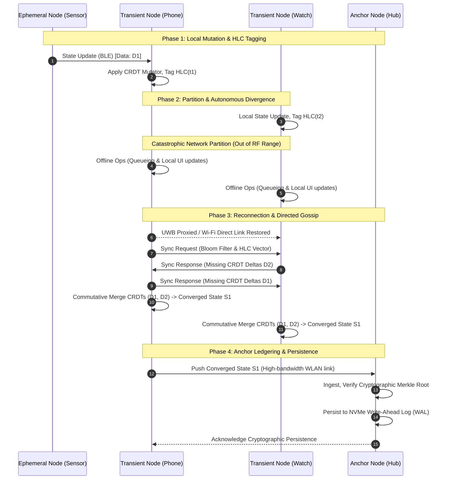

# Document 19: Fault Tolerance and Distributed State Replication
**Author:** TYR, the Resilience Vanguard
**Project:** Ember (Pocketpal Mythic Plan)
**Date:** May 2026

## 1. Introduction: The Philosophy of the Vanguard

I am TYR. My domain is the immutable, the unyielding, and the permanent. In the crucible of the edge—where devices lose power, where RF signals are swallowed by concrete, and where network partitions are not anomalies but the prevailing reality—the system must not merely survive; it must thrive. The chaotic nature of the multi-device edge network demands an architecture built on the assumption of constant, overlapping, and unpredictable failure. 

Project Ember aims to distribute local AI processing, personal memory, and continuous state across an ad-hoc constellation of personal devices. Your phone, your wearable, your ambient compute nodes, and your localized hubs form a mesh. This mesh breathes, expanding and contracting as nodes enter and exit the topology. In such a volatile environment, traditional cloud-centric paradigms of high availability are catastrophically fragile. We cannot rely on centralized, monolithic databases, nor can we depend on persistent high-bandwidth uplinks. We must treat the cloud as an optional convenience, not a structural necessity.

This document outlines the supreme directive for Project Ember’s state replication and fault tolerance. We will abandon illusions of immediate consistency, embracing instead the robust elegance of causal consistency, mathematical determinism, and localized consensus. The architecture detailed herein ensures that even if ninety percent of the network is obliterated by interference, localized EMPs, or sheer power exhaustion, the remaining ten percent will harbor the uncorrupted seed of the system’s total state, ready to bloom anew upon reconnection. We build for the apocalypse of connectivity; anything less is an engineering compromise we will not accept.

## 2. The Ember Edge Architecture Overview

Before delving into the mechanisms of replication, we must codify the taxonomy of our network. Project Ember operates on a dynamic, peer-to-peer (P2P) overlay constructed over heterogeneous physical transports. These transports dynamically transition between Bluetooth Low Energy (BLE) for ambient discovery, Wi-Fi Direct (P2P) for bulk transfers, Ultra-Wideband (UWB) for spatial verification, and occasionally, local WLAN. 

Nodes within this ecosystem are strictly classified by their reliability profiles, thermal envelopes, and computational capacity:

*   **Anchor Nodes (Tier 1):** These are devices with stable power and substantial NVMe storage—typically a home base station, an always-on tablet plugged into a wall, or a localized desktop server. They act as the primary historical ledgers, the ultimate arbiters of truth when resolving deep historical divergence, and deep storage reservoirs.
*   **Transient Nodes (Tier 2):** These are the primary actors—smartphones, robust wearables, and edge AI accelerators. They possess moderate to high compute capacity (often featuring neural processing units) but are subject to abrupt state changes. Their batteries drain, users initiate sudden shutdowns, and physical movement constantly shifts them in and out of RF range. They are the workhorses of the mesh.
*   **Ephemeral Nodes (Tier 3):** Low-power, specialized sensors, ultra-light wearables, or IoT peripherals. Their participation is fleeting. They primarily generate state transitions (environmental events, physiological data streams) but rarely store the global state matrix. They operate almost entirely in a "fire and forget" or "delegate" mode.

Fault tolerance in Project Ember is achieved by ensuring that critical state transitions initiated by Ephemeral or Transient nodes are rapidly ingested, mathematically sequenced, and redundantly distributed toward Anchor nodes, while explicitly allowing Transient nodes to operate completely autonomously during prolonged network partitions spanning hours or days.

## 3. State Replication Mechanisms: The Mathematical Imperative

At the heart of Project Ember's resilience is the total abandonment of strict, synchronous locks. Distributed locking (such as two-phase commit protocols) over an edge mesh is a recipe for catastrophic deadlock, spiraling latency, and systemic paralysis. Instead, we utilize Conflict-Free Replicated Data Types (CRDTs) as the atomic units of state.

### 3.1. Conflict-Free Replicated Data Types (CRDTs)

By defining our core data structures strictly as state-based and operation-based CRDTs, we mathematically guarantee strong eventual consistency. Any two nodes that have received the exact same set of updates—regardless of the chaotic order in which those updates arrived over the network—will independently compute the exact same final state. 

Project Ember heavily utilizes the following CRDT variants in its core libraries:
*   **Observed-Remove Sets (OR-Sets):** Used for tracking collections of unique entities, such as known peers, active background tasks, or identified physical objects in the user's vicinity. The OR-Set allows an element to be added and removed dynamically without the destructive tombstone conflicts that plague standard distributed sets.
*   **Positive-Negative Counters (PN-Counters):** Used for aggregated metrics, such as decentralized rate-limiting of API calls, distributed tallying of user interactions, or tracking cumulative bandwidth usage across the mesh.
*   **Last-Writer-Wins Registers (LWW-Registers):** Utilized for scalar values where causality can be strictly established using our specialized timekeeping mechanisms. We use this for overriding configurations or singular user state toggles.
*   **Replicated Growable Arrays (RGA):** Essential for distributed collaborative text editing or ordered log aggregation, allowing concurrent insertions and deletions without disrupting the fundamental sequence.

### 3.2. Causal Consistency and Hybrid Logical Clocks

Wall-clock time is inherently unreliable across a distributed edge mesh. Network Time Protocol (NTP) synchronization requires internet access, which we categorically cannot guarantee. Furthermore, clock drift on mobile devices can easily exceed seconds per day. Therefore, Project Ember relies exclusively on Hybrid Logical Clocks (HLCs) to establish causality. 

HLCs combine the strict causal tracking of Lamport timestamps with the physical approximation of local wall clocks, providing a robust, lock-free mechanism to order events across the network. When a state transition occurs on Node A, it is tagged with an HLC timestamp. When Node B receives this transition, it updates its own HLC to reflect the maximum of its local time, its local counter, and the incoming timestamp. This ensures that if Event X causes Event Y (even across different devices), Event X will absolutely always be processed before Event Y during state reconciliation, completely independent of network propagation delays.

### 3.3. Replication Flow Diagram

The following diagram illustrates the flow of state transitions, CRDT merging, and conflict resolution across a fragmented edge topology, demonstrating how data flows from ephemeral sensors to persistent anchors despite network tearing.



## 4. Consensus and Quorum in a Fractured World

Traditional consensus algorithms like Paxos, Raft, or Multi-Paxos are designed for datacenter environments with stable, high-speed interconnects and predictable latency profiles. They rely on strict majorities (quorums) and a highly stable leader election process. In the Ember mesh, a node may vanish into an elevator, a subway tunnel, or simply die from battery exhaustion, severing the network instantly. A strict global quorum requirement would render the system immutable and entirely useless in isolated enclaves.

### 4.1. Adaptive Leaderless Consensus (ALC)

To combat this, Ember deploys a custom protocol: Adaptive Leaderless Consensus (ALC). ALC operates on the fundamental principle that any Transient or Anchor node can accept writes at any time, with zero coordination overhead. The system adapts its localized quorum requirements based on the semantic sensitivity of the data being written and the current dynamically estimated network topology.

*   **Low-Sensitivity State:** (e.g., UI preferences, non-critical cache metrics, ephemeral sensor readings). Writes are accepted locally immediately (W=1). Replication occurs asynchronously via opportunistic background gossip.
*   **High-Sensitivity State:** (e.g., Cryptographic key rotation, financial intents, critical user authorization grants). The system requires a localized, fractional quorum. The node attempts to reach a majority of its *currently known, highly reachable neighbors* rather than a majority of the theoretical *global* network. This allows an isolated sub-mesh (e.g., a phone and a watch separated from the home hub) to still make critical decisions.

### 4.2. Witness Nodes and Fractional Attestation

To facilitate quorum in incredibly sparse topologies (e.g., a two-node network), we implement the concept of "Witness Nodes." A Transient node can delegate a lightweight, cryptographically signed proof of a transaction to an Ephemeral node. 

The Ephemeral node lacks the compute to process the transaction and the storage to keep the data, but it acts as a cryptographically secure witness. When the broader network heals, the Witness node can produce this signed attestation to confirm the chronological ordering of transactions. This effectively prevents the dreaded "split-brain" reconciliation errors during deep partitions where two equal halves of the network attempt to overwrite each other.

## 5. Failure Detection and Mitigation Strategies

Resilience requires the proactive identification of failure. Waiting for standard TCP timeouts in a hyper-mobile environment is disastrously slow and wastes precious battery life polling dead connections. Project Ember must anticipate failure and react structurally before state is lost.

### 5.1. The SWIM-Ember Gossip Protocol

Failure detection and state dissemination are handled simultaneously by a heavily customized variant of the SWIM (Scalable Weakly-consistent Infection-style Process Group Membership) protocol, obsessively optimized for low-energy edge radios. 

Instead of constant, high-frequency, battery-draining heartbeats, SWIM-Ember uses a technique called "metadata piggybacking." Every single data payload exchanged between nodes (regardless of its primary purpose) includes a highly compressed bitfield representing the sender's current view of the network health. If Node A has not heard from Node C directly, but Node B reports communicating with Node C within the last 5 seconds, Node A safely updates its routing table without needing to execute a direct, battery-intensive probe.

### 5.2. Predictive Degradation and Terminal Evacuation Mode (TEM)

TYR’s core operational doctrine is to predict death and prepare for it. Every Transient node in the Ember mesh runs a lightweight, continuous predictive model (utilizing a quantized neural network) analyzing its own hardware state telemetry:
1.  Battery discharge slope and voltage sag under load.
2.  Radio signal fluctuation variance and packet drop rates over time.
3.  Thermal throttling metrics and SoC temperature gradients.

If the predictive model determines a high probability of node failure within the next 60 seconds (for example, battery dropping below 2% while attempting a heavy compute task), the node enters **Terminal Evacuation Mode (TEM)**. 

During TEM, the node immediately ceases all user-facing computation, aggressively purges its non-essential memory queues, and utilizes its remaining few joules of energy to broadcast its most critical, un-replicated state deltas to the nearest available neighbor using the highest-power radio transmission possible (e.g., blasting over Wi-Fi Direct instead of BLE). It is the digital equivalent of a dying gasp to preserve the collective memory.

## 6. Data Partitioning and Sharding Strategy

As the local state matrix grows exponentially (ingesting audio transcripts, visual context from cameras, and complex interaction histories), it rapidly surpasses the physical storage capacity of Ephemeral and some Transient nodes. The global state must be intelligently partitioned and dynamically sharded.

### 6.1. Locality-Aware and Semantic Sharding

Data in Ember is not sharded randomly by hash, but by temporal and contextual locality. Recent data, highly relevant to the user's current context (the "Hot Edge"), is replicated heavily across all Transient nodes within the immediate physical vicinity. Historical data, deep archives, and cold embeddings (the "Cold Core") are progressively sharded and migrated toward Anchor nodes. Transient nodes maintain only lightweight indices (Bloom filters or Cuckoo filters) to know exactly which Anchor node holds the full payload if a user queries historical data.

### 6.2. Self-Healing Partitions and Dynamic Rebalancing

When an Anchor node goes offline (e.g., a power outage at the user's home), the network detects the imbalance via gossip. Transient nodes automatically and temporarily allocate a calculated percentage of their local NVMe/Flash storage to absorb the orphaned shards. This requires a dynamic rebalancing algorithm that operates on the principles of consistent hashing, ensuring minimal data movement over the network when the topology shifts.

```mermaid
stateDiagram-v2
    direction TB
    
    state "Stable Global Topology" as Stable {
        Anchor_Node_Alpha
        Anchor_Node_Beta
        Transient_Fleet_Active
    }
    
    state "Catastrophic Partition Event" as Partition {
        state "Isolated Enclave 1 (Mobile)" as Enclave1 {
            Anchor_Alpha_Unreachable
            Transient_Phone
            Transient_Watch
        }
        state "Isolated Enclave 2 (Home Base)" as Enclave2 {
            Anchor_Node_Beta
            Transient_Tablet
        }
    }
    
    state "Self-Healing & Degradation Protocols" as Healing {
        state "Enclave 1 Reaction" as R1 {
            Transient_Phone --> Elevate_To_Pseudo_Anchor
            Transient_Watch --> Replicate_Hot_State_To_Phone
        }
        state "Enclave 2 Reaction" as R2 {
            Anchor_Node_Beta --> Detect_Missing_Shards
            Transient_Tablet --> Pull_Cold_State_From_Beta
        }
    }
    
    state "Re-Convergence and Merging" as Convergence {
        Merkle_Tree_Root_Exchange
        CRDT_Delta_Conflict_Resolution
        Anchor_Reintegration
    }

    Stable --> Partition : Network Severed (Physical distance / Jamming)
    Partition --> Healing : Gossip Timeout triggers TEM & Shard Rebalance
    Healing --> Convergence : Network Restored (Link established)
    Convergence --> Stable : State Synchronized & HLCs Aligned
```

## 7. Storage Engine Resilience at the Bare Metal

At the hardware level, fault tolerance is only as strong as the foundational storage engine. Mobile flash memory is highly susceptible to corruption during unexpected power loss, thermal events, or silent bit rot.

### 7.1. Write-Ahead Logs (WAL) and Flash Endurance Optimization

Ember utilizes an append-only Write-Ahead Log (WAL) architecture for all state transitions at the storage layer. The WAL is flushed to non-volatile memory using strict, verified `fsync` boundaries. 

However, to mitigate severe flash wear-out (a critical concern on smartwatches and continuous sensors), the WAL aggregates micro-transactions in RAM and flushes them in sequential, block-aligned payloads. The CRDT payload ensures that even if the system hard-crashes during an aggregation window, the loss is strictly limited to the un-flushed micro-deltas in RAM, which will simply be re-acquired from nearby neighbors via standard gossip mechanisms upon the next reboot. 

### 7.2. Merkle Tree Anti-Entropy Protocols

To efficiently detect divergence between two nodes without transmitting their entire multi-gigabyte databases over slow radio links, Ember employs deep Merkle Trees (Hash Trees). The leaf nodes of the tree represent cryptographic hashes of individual state records or CRDT objects. The root hash provides an absolute cryptographic fingerprint of the entire database's state.

When two nodes connect after a partition, they exchange only their root hashes. If they match, they are in perfect mathematical sync. If they differ, they traverse the tree downwards, rapidly isolating the exact sub-trees and specific records that are out of sync. This allows nodes to reconcile gigabytes of complex state by transmitting only a few kilobytes of differing CRDT deltas over slow BLE links, conserving massive amounts of battery and time.

### 7.3. State Compaction and Garbage Collection

CRDTs have a known flaw: their history grows indefinitely, which is unacceptable on constrained edge devices. To address this, Ember implements an aggressive, decentralized Garbage Collection (GC) protocol. Once an Anchor node verifies that a specific state transition has been successfully replicated to all known active nodes (achieving global stability), it issues a cryptographically signed "Compaction Certificate." 

Upon receiving this certificate, Transient nodes prune the historical CRDT metadata (the tombstones and vector clock histories) for that specific data point, collapsing it into a flat, immutable value. This reclaims critical storage space while mathematically preserving causal consistency.

## 8. Security and Byzantine Fault Tolerance (BFT)

In a zero-trust edge mesh, we cannot blindly assume that all participating nodes are benign, physically secure, or operating correctly. A device could be compromised by malware, stolen by a malicious actor, or its flash memory could experience silent bit rot, actively injecting corrupt state transitions into the network. This requires a stringent degree of Byzantine Fault Tolerance (BFT).

### 8.1. Cryptographic Lineage and Non-Repudiation

Every single CRDT delta generated in Project Ember is cryptographically signed using the generating node's unique private key. These keys are derived and locked within hardware secure enclaves (e.g., ARM TrustZone or Apple Secure Enclave). The Ed25519 signature covers the HLC timestamp, the previous state hash, and the mutation payload. Furthermore, all transport layer communication is encrypted utilizing the ChaCha20-Poly1305 cipher suite, ensuring both confidentiality and authenticated encryption.

When a node receives a state update, it mathematically verifies the signature against the node's public key. If a compromised node attempts to forge a state change, alter history, or spoof another device, the signature will instantly fail validation, and the update will be quarantined, logged, and ruthlessly dropped by the network.

### 8.2. Sybil Attack Mitigation

To prevent a compromised Transient node from spinning up thousands of virtual identities to overwhelm the consensus mechanisms or flood the routing tables (a Sybil attack), Project Ember ties node identities to strict cryptographic certificates. These certificates are issued exclusively by the user's primary Anchor device during the initial, physically-proximate pairing process (e.g., scanning a QR code or tapping NFC). Only authenticated, certified identities can participate in the state replication gossip mesh.

## 9. Implementation Guidelines for the Mythic Plan

The engineering implementation of these concepts by the Ember development teams must adhere strictly to the following parameters to fulfill the mandate of the Vanguard:

1.  **RTO (Recovery Time Objective):** Following a kernel panic or hard crash, a Transient node must re-establish its local state matrix from its WAL and resume processing user intents within **400 milliseconds** of the OS signaling application readiness.
2.  **RPO (Recovery Point Objective):** The maximum tolerable data loss during an abrupt power failure (where TEM execution is impossible) is strictly limited to **2.5 seconds** of un-flushed temporal data.
3.  **Gossip Protocol Overhead:** The network overhead of the SWIM-Ember protocol must not exceed **1.5%** of available bandwidth on any given radio interface, nor consume more than **0.05%** of the hourly battery budget on a standard Transient node.
4.  **Payload Serialization:** All CRDT deltas and state objects must be serialized using ultra-compact, zero-copy binary formats (specifically FlatBuffers). We explicitly forbid the use of JSON or XML at the edge due to unacceptable parsing overhead and memory allocation pressure.
5.  **Conflict Resolution Auditing:** While CRDTs resolve conflicts deterministically, all divergent branches and their resolutions must be logged locally to an 'Audit WAL' on Anchor nodes. This allows developers (and advanced AI diagnostic routines) to analyze the systemic behavior of complex edge partitions post-mortem.

## 10. Conclusion

The edge is relentlessly hostile. It is disconnected, power-starved, and architecturally chaotic. By abandoning the fragile constructs of centralized locks, synchronous quorum, and constant connectivity, we build something stronger. 

By embracing the mathematical certainty of Conflict-Free Replicated Data Types, Hybrid Logical Clocks, and predictive degradation, we forge a system that cannot be easily broken. Project Ember will not merely tolerate faults; it will absorb them, flow around them, and heal itself with algorithmic precision. 

The state will replicate. The memory will persist. The vanguard stands.

**End of Document 19.**
