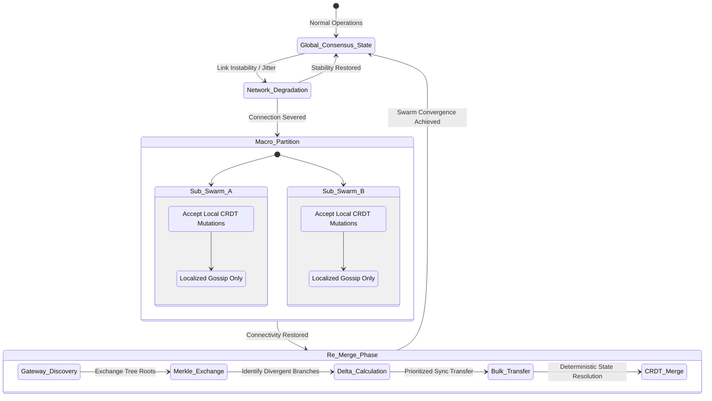

# Document 20: Edge Network Volatility Management and Sync
**Author:** TYR, The Resilience Vanguard
**Project:** Ember (Pocketpal Mythic Plan)
**Date:** May 25, 2026

## 1. Introduction and Architectural Mandate

I am TYR, the Resilience Vanguard of Project Ember. My mandate is absolute and uncompromising: the persistence, consistency, and invulnerability of the edge swarm in the face of adversarial network conditions. In the theater of edge computing, volatility is not an anomaly; it is the fundamental state of existence. Devices will disconnect, packets will drop, partitions will form, and nodes will fail unexpectedly. We do not build systems that simply tolerate these conditions; we engineer a swarm that thrives within them, utilizing decentralized synchronization, cryptographic state verification, and advanced conflict-free data types to ensure operational continuity.

This document serves as the comprehensive blueprint for managing extreme network volatility, ensuring partition tolerance, and guaranteeing state synchronization across the Project Ember edge swarm. We move beyond traditional client-server paradigms and centralized consensus algorithms (like Paxos or Raft), which are fundamentally unsuited for the high-latency, intermittently connected reality of edge swarms. Instead, we embrace a heavily partitioned, eventually consistent, peer-to-peer architecture designed specifically for the unique constraints of mobile and IoT deployments.

Our core tenet is this: No single point of failure can halt the swarm. No network partition can corrupt the global state. No volatile connection can lead to permanent data loss. The edge is autonomous, relentless, and mathematically guaranteed to converge.

## 2. The Anatomy of Edge Volatility

To defend against volatility, we must first rigorously categorize and model the permutations of failure that Project Ember will encounter in the wild. The edge is a chaotic environment, characterized by an array of hostile conditions that traditional distributed systems are not equipped to handle.

### 2.1 Types of Network Disruptions
*   **Micro-Disconnections (Jitter and Flapping):** Devices transitioning between cellular towers, Wi-Fi access points, or moving through physical interference (e.g., elevators, tunnels, dense foliage) experience transient packet loss and connection drops lasting from milliseconds to a few seconds. Our protocols must handle these without triggering expensive full-state reconciliations or timeout cascades. TCP backoff algorithms often exacerbate these issues, requiring custom UDP-based protocols for reliable delivery.
*   **Asymmetric Connectivity:** A node may be able to transmit data to the network but fail to receive acknowledgments, or vice versa, due to differences in transmission power (e.g., a low-power edge device communicating with a high-power cellular tower). This requires decoupled send and receive pathways and robust acknowledgment mechanisms that do not block ongoing operations.
*   **Macro-Partitions (Split-Brain Scenarios):** Entire geographical regions or logical subnets may become isolated from the broader network or the central control plane due to infrastructure failure or deliberate jamming. During this time, isolated sub-swarms must continue to operate autonomously, making local decisions and accumulating state changes that will later need to be merged.
*   **Bandwidth Starvation and Congestion Collapse:** Connections may degrade to a point where bandwidth is strictly limited (e.g., falling back from 5G to EDGE/2G, or operating in a highly congested stadium environment). Synchronization must be adaptable, prioritizing critical state updates over bulky telemetry or non-essential assets.
*   **Byzantine Node Behavior and Hardware Faults:** In extreme volatility, failing hardware, bit flips in memory, or compromised nodes may broadcast malformed state updates. This requires robust cryptographic validation of all state changes to prevent the propagation of corruption throughout the swarm.

### 2.2 The CAP Theorem Reality and Strong Eventual Consistency
In the context of the CAP theorem (Consistency, Availability, Partition Tolerance), Project Ember strictly prioritizes Availability and Partition Tolerance (AP) at the edge. Attempting to enforce strong linearizable consistency across a highly volatile, globally distributed edge swarm is mathematically impossible and architecturally suicidal. It would result in immediate system lockup during the first micro-disconnection. 

Therefore, we design for Strong Eventual Consistency (SEC). This guarantees that once all nodes have received the same set of updates—regardless of the order in which they were received, and regardless of the number of retries or network paths taken—they will converge on identical states without requiring centralized coordination, locking mechanisms, or complex distributed consensus protocols.

## 3. Conflict-Free Replicated Data Types (CRDTs) as the Foundation

The cornerstone of our state synchronization strategy is the pervasive use of Conflict-Free Replicated Data Types (CRDTs). CRDTs provide the mathematical guarantee of Strong Eventual Consistency, allowing any node in the swarm to accept local updates without coordinating with other nodes, even during a total network partition.

### 3.1 State-Based vs. Operation-Based CRDTs
Project Ember utilizes a hybrid approach, leveraging both State-Based (CvRDTs) and Operation-Based (CmRDTs) depending on the specific payload, network constraints, and storage limitations.

*   **Operation-Based CRDTs (CmRDTs):** Used for high-frequency, small-payload updates where bandwidth is constrained. Instead of transmitting the entire state, nodes broadcast only the specific operations (e.g., "increment counter X by 1", "add sensor reading Y to log"). This requires a reliable broadcast channel that ensures exactly-once delivery, which we implement over our local mesh routing protocol. We utilize causal delivery protocols (like Vector Clocks) to ensure operations are applied in a mathematically sound order.
*   **State-Based CRDTs (CvRDTs):** Used for smaller data structures, configuration topologies, or during anti-entropy sync phases (e.g., when two nodes reconnect after a long partition). Nodes exchange their entire local state and use a deterministic merge function. This is more bandwidth-intensive but robust against message loss and out-of-order delivery, as states can be resent statelessly.

### 3.2 The Mathematics of Convergence: Semilattices
The magic of State-Based CRDTs lies in their underlying algebraic structure: the join semilattice. For a CRDT to function, its states must form a partially ordered set (poset) equipped with a least upper bound (join) operation. 
The merge function (denoted as $\sqcup$) must possess three critical properties:
1.  **Commutativity:** $A \sqcup B = B \sqcup A$ (The order in which states are merged does not matter).
2.  **Associativity:** $(A \sqcup B) \sqcup C = A \sqcup (B \sqcup C)$ (Grouping of merges does not matter).
3.  **Idempotence:** $A \sqcup A = A$ (Merging the same state multiple times has no additional effect, protecting against duplicate network packets).
Because our data structures adhere to these mathematical laws, we eliminate the need for distributed locks. The network can duplicate, reorder, or delay packets, and the mathematical properties guarantee identical eventual states.

### 3.3 Specific CRDT Implementations in Ember
*   **Multi-Value Registers (MV-Registers):** Used for configuration settings where concurrent updates might occur from different administrative nodes. Instead of arbitrarily overwriting data (which causes data loss), an MV-Register retains all concurrent writes, creating a "sibling" state. The application layer resolves this using deterministic logic (e.g., preferring the update from a node with a higher authority tier or using a logical timestamp as a tie-breaker).
*   **Observed-Remove Sets (OR-Sets):** Essential for managing dynamic collections of active nodes, task allocations, or physical resources. An OR-Set allows elements to be added and removed concurrently without anomalies. Every element added is assigned a unique tag. A remove operation specifies the tags to be removed. This prevents the "tombstone" problem where a concurrent add and remove results in unpredictable behavior.
*   **Sequence CRDTs (e.g., LSEQ, Logoot):** Used for ordered data, such as distributed logs, mission waypoints, or collaborative text fields. These ensure that the ordering of elements remains consistent across the swarm despite concurrent insertions and deletions, by assigning dense, globally unique fractional indices to every element.

## 4. Epidemic Gossip Protocols for State Dissemination

To propagate CRDT states and operations across the swarm, we eschew rigid, top-down routing topologies (which shatter during partitions) in favor of Epidemic Gossip Protocols. Gossip protocols are inherently fault-tolerant, massively scalable, and highly resilient to edge volatility.

### 4.1 The Mechanics of Ember Gossip
In our model, every node periodically selects a random subset of its known peers and initiates a synchronization exchange. This creates a viral spread of information that guarantees exponential dissemination across the network, similar to how a pathogen spreads through a population.

*   **Push-Pull Anti-Entropy:** When two nodes (Node A and Node B) connect via gossip, they perform a Push-Pull exchange. Node A sends a highly compressed summary of its state (a version vector). Node B compares this summary with its own state, requests any missing updates, and simultaneously sends back updates that Node A is missing. This ensures both nodes leave the interaction with the union of their knowledge.
*   **Rumor Mongering (Push-Only):** For time-critical, small-payload alerts (e.g., a localized security breach, a critical node hardware failure, or an immediate threat detection), nodes use rapid rumor mongering. A node actively "pushes" the hot update to random peers for a set number of rounds or until it determines that the local network sector is saturated.
*   **Adaptive Fan-out and Protocol Swapping:** The gossip fan-out rate (how many peers a node contacts per cycle) dynamically adjusts based on local network conditions. If a node detects high packet loss or low battery, it reduces its fan-out to conserve resources. If it detects a highly stable, high-bandwidth connection (e.g., docked to a hardline or connected to an unconstrained 5G mmWave node), it increases its fan-out to act as a temporary super-spreader.

### 4.2 Handling Network Churn and Peer Sampling
The peer sampling service underpinning the gossip protocol is designed to handle extreme churn (nodes rapidly joining, dying, and leaving the swarm). We utilize a decentralized peer-sampling algorithm (derived from Scamp and Cyclon) that maintains a partially connected, dynamic random graph topology. This ensures that the network graph remains well-mixed and globally connected, preventing the formation of isolated cliques even as the physical topology of the swarm shifts rapidly.

```mermaid
sequenceDiagram
    participant Node_Alpha
    participant Node_Beta
    participant Node_Gamma
    participant Node_Delta

    Note over Node_Alpha, Node_Delta: CRDT-Based Epidemic Gossip Synchronization

    %% Initial state mutation
    Node_Alpha->>Node_Alpha: Local State Mutation (CRDT Add)<br/>Vector Clock: [A:1, B:0, G:0, D:0]

    %% Gossip Round 1
    Node_Alpha->>Node_Beta: Gossip (Push): State Summary + Update
    Node_Beta->>Node_Beta: Merge CRDT State<br/>Vector Clock: [A:1, B:1, G:0, D:0]
    Node_Beta-->>Node_Alpha: Ack & Diff (Pull)

    %% Gossip Round 2 (Concurrent operations)
    Node_Gamma->>Node_Gamma: Local State Mutation (CRDT Remove)<br/>Vector Clock: [A:0, B:0, G:1, D:0]
    
    par Epidemic Spread
        Node_Beta->>Node_Delta: Gossip (Push): Forwarding Alpha's Update
        Node_Delta->>Node_Delta: Merge State
        Node_Gamma->>Node_Delta: Gossip (Push): Gamma's Update
        Node_Delta->>Node_Delta: Merge State (Resolving concurrent Ops)
    end

    Note over Node_Delta: Delta now holds merged state:<br/>[A:1, B:1, G:1, D:1]<br/>Strong Eventual Consistency Achieved.

    %% Partition scenario
    rect rgb(50, 0, 0)
        Note right of Node_Alpha: NETWORK PARTITION DETECTED
        Node_Alpha-xNode_Beta: Connection Dropped
        Node_Alpha-xNode_Gamma: Connection Dropped
    end
    
    Node_Alpha->>Node_Alpha: Continues accepting local writes<br/>(Partition Tolerant)
```

## 5. Network Partition Detection and Autonomous Split-Brain Resolution

When a macro-partition occurs (e.g., a tunnel collapse severing communications between two halves of a search-and-rescue swarm), the network fractures into disjoint sub-swarms. Project Ember’s architecture dictates that these sub-swarms must remain fully operational, completely avoiding "read-only" modes or system lockups.

### 5.1 Partition Detection and Isolation
Nodes detect partitions not through centralized pings, but through a combination of missing heartbeat signals in the local mesh, gossip request timeouts, and explicit link-state routing failures at the physical layer. Upon detecting a partition, a node transitions into an "Isolated Swarm" state. It immediately recalculates its local topology, identifies its new perimeter, and attempts to establish a localized leader or consensus group *only* if required for specific, non-CRDT hardware coordination operations.

### 5.2 Autonomous Operation During Partition
While partitioned, the sub-swarm continues to process sensory input, execute local autonomous logic, and mutate its local state using CRDTs. Because CRDTs are conflict-free, we do not need to restrict writes. This ensures uninterrupted service for the edge application. If Sub-Swarm A marks a target as "Engaged" and Sub-Swarm B marks the same target as "Tracked", both mutations are recorded locally as valid operations.

### 5.3 Vector Clock Conflict Resolution
To track causality, every mutation is tagged with a Vector Clock (an array of logical counters, one for each node). When a node receives an update, it compares the Vector Clock of the incoming state with its local clock.
*   If the incoming clock is strictly greater, the local state is overwritten.
*   If the local clock is strictly greater, the incoming state is ignored (it is obsolete).
*   If the clocks are concurrent (neither is strictly greater), it indicates a split-brain mutation. The CRDT merge function handles this mathematically (e.g., performing a set union for an OR-Set, or preserving both values in an MV-Register).

### 5.4 The Re-merge Protocol (Anti-Entropy)
When connectivity is restored, the sub-swarms must merge their divergent states. This is the most computationally and network-intensive phase of volatility management, and must be handled delicately to prevent network storms.

1.  **Discovery and Handshake:** Nodes across the former partition boundary discover each other via physical layer broadcasts (e.g., BLE beacons) or designated gateway nodes bridging the gap.
2.  **Merkle Tree Exchange:** Gateway nodes exchange Merkle trees representing their entire sub-swarm's state, rather than sending full databases.
3.  **Delta Calculation:** By walking the Merkle tree, nodes rapidly identify the exact localized branches where state differs, identifying the exact subset of operations missing on each side.
4.  **Bulk State Transfer (Throttled):** The missing deltas are transferred. To prevent overwhelming the newly restored link, this transfer is aggressively throttled and prioritized based on our QoS tiers.
5.  **Deterministic Merge:** The CRDT merge functions are executed locally, mathematically resolving all concurrent updates that occurred during the split-brain period, bringing both sub-swarms back into harmony.

## 6. Tiered Data Synchronization and Payload Prioritization

Not all data is created equal. Under conditions of extreme volatility or severe bandwidth starvation, the swarm must ruthlessly prioritize what data is synchronized. Attempting to sync everything equally will result in nothing syncing completely. Project Ember implements a dynamic Quality of Service (QoS) tiering system for all state updates.

### 6.1 Data Tiers
*   **Tier 0: Critical Swarm Topology and Security (Highest Priority):** Cryptographic key rotations, compromised node revocations, fundamental routing table updates, and emergency override commands. This data bypasses standard throttling, utilizing redundant multi-path routing and aggressive push-gossip to ensure immediate, swarm-wide delivery regardless of cost.
*   **Tier 1: Core Application State:** The primary CRDT mutations representing the actual work of the swarm (e.g., target locations, task completion statuses, dynamic geofences). This is synchronized continuously but is subject to intelligent bandwidth shaping to prevent congestion.
*   **Tier 2: High-Resolution Telemetry and Logs:** Operational data used for debugging, rich analytics, and non-critical sensor streams. During volatility, this data is heavily downsampled, compressed via delta-encoding, or cached locally on disk. It is only synced when stable, high-bandwidth connections are available.
*   **Tier 3: Binary Assets and ML Models (Lowest Priority):** Over-the-air (OTA) firmware updates, new machine learning models, or large binary blobs (like high-res maps). These transfers are strictly suspended during any network instability and resume only via background, chunked, resumable downloads over secure, verified connections.

### 6.2 Backpressure and Adaptive Throttling Algorithms
The synchronization engine continuously monitors the Mean Time Between Failures (MTBF) of the network links, round-trip times (RTT), and the available bandwidth using a lightweight, customized TCP BBR-like algorithm adapted for UDP gossip. 
If MTBF drops below a critical threshold (indicating high volatility), the engine implements strict backpressure. It utilizes an Additive Increase/Multiplicative Decrease (AIMD) algorithm on its token bucket rate limiters, automatically suspending Tier 2 and Tier 3 syncs, and dedicating all available bandwidth to ensuring Tier 0 and Tier 1 eventual consistency.

## 7. Fallback Mechanisms: Peer-to-Peer Mesh Networking

When primary backhaul connections (e.g., Cellular LTE/5G, primary SATCOM, or enterprise Wi-Fi) fail completely, the edge swarm must not simply isolate itself; it must actively seek alternative communication channels to form localized ad-hoc mesh networks, maintaining operational integrity at the edge.

### 7.1 Multi-Radio Utilization
Ember nodes are designed to utilize all available physical radio interfaces simultaneously. If the primary uplink fails, the node automatically activates and elevates secondary protocols:
*   **Wi-Fi Direct / Local Ad-Hoc (802.11s):** Used for high-bandwidth, short-range synchronization between densely packed nodes.
*   **Bluetooth Low Energy (BLE) Mesh:** Used for low-bandwidth, extremely resilient communication for passing Tier 0 and Tier 1 gossip messages over longer ranges, bouncing signals off intermediate nodes to circumvent obstacles where Wi-Fi fails.
*   **LoRa (Long Range) Modules:** For nodes equipped with LoRa hardware, extremely low bandwidth (bytes per second) signaling can be used to pass critical state vectors over kilometers, penetrating dense urban environments or heavy foliage.

### 7.2 Opportunistic Routing (Store-and-Forward Data Mules)
In scenarios where the network is highly fragmented and no contiguous RF path exists between isolated sub-swarms, we employ Delay-Tolerant Networking (DTN) principles. A highly mobile node (e.g., an aerial drone or a fast-moving ground vehicle) can be dynamically assigned the role of a "Data Mule." 
1.  The Mule node connects to an isolated Sub-Swarm A, syncing its local state into a secure enclave.
2.  The Mule physically travels through a dead zone, out of RF contact.
3.  The Mule connects to Sub-Swarm B, delivering the stored updates and bridging the partition asynchronously, acting as a physical packet.

### 7.3 Security Considerations in Store-and-Forward
How do we trust the Data Mule? All payloads carried by the mule are heavily encrypted and cryptographically signed by the originating nodes. The Mule cannot read the data it is transporting, nor can it tamper with the CRDT operations without invalidating the cryptographic signatures. Sub-Swarm B validates the origin of every operation mathematically before merging, rendering physical capture of the Mule irrelevant to data integrity.

## 8. Cryptographic State Verification Under Duress

Volatility creates opportunities for malicious actors. A compromised node might attempt to exploit a network partition by broadcasting false state updates (a Byzantine fault), replaying old state vectors to induce rollbacks, or flooding the network with garbage data to cause a denial of service. Security cannot be compromised for the sake of availability.

### 8.1 Hash Graphs and Merkle DAGs
Every state mutation in the Ember swarm is cryptographically signed using elliptic-curve cryptography (ECC) by the originating node. Furthermore, each mutation is linked to the previous state using a cryptographic hash, forming a Directed Acyclic Graph (DAG) similar to a distributed ledger, but highly localized and lightweight.

*   When nodes exchange state summaries during gossip, they exchange the root hashes of their respective Merkle trees.
*   This allows a receiving node to rapidly verify the integrity of the entire state history without needing to download every individual transaction. If the hashes do not match, the node requests the specific divergent branches.
*   If a node attempts to lie about its state or forge an operation, the hash chain is broken, and the surrounding swarm immediately rejects the gossip payload and quarantines the offending node.

### 8.2 Byzantine Fault Tolerance (BFT) in Gossip
While true, absolute consensus algorithms (like PBFT or Tendermint) are too heavy and require too much coordination for edge volatility, we incorporate BFT principles into our gossip protocol. A node will not apply a critical Tier 0 state update (e.g., a command to self-destruct or wipe secure memory) unless it receives corroborating gossip messages via multiple, mathematically disjoint paths in the network graph. This prevents a single compromised node from poisoning the state or hijacking the command structure of the entire swarm.

## 9. Edge Storage Engine and Write-Ahead Logging

To guarantee partition tolerance, a node must be able to survive a total loss of power during a partition without losing the state mutations it accumulated while isolated. RAM-only data structures are insufficient.

Project Ember utilizes a custom, heavily optimized embedded storage engine based on a Write-Ahead Log (WAL). Before any CRDT mutation is applied to in-memory data structures or broadcasted via gossip, the operation is serialized and appended to the WAL on non-volatile storage (NVMe or eMMC flash). 
*   **Crash Resilience:** If a node loses power mid-partition, upon reboot, it replays the WAL to reconstruct its exact CRDT state before resuming gossip.
*   **Compaction:** Because operation-based CRDT logs can grow infinitely, the storage engine periodically performs background compaction. It takes a snapshot of the current state, writes it to a new file, and truncates the historical operations from the log, ensuring the storage footprint remains strictly bounded regardless of uptime.

## 10. Simulation, Chaos Engineering, and Validation

The theories of resilience are meaningless without empirical, adversarial validation. The Ember Edge Sync protocol is not built on hope; it is built on rigorous testing.

### 10.1 Chaos Monkey for the Edge
We deploy specialized daemon processes across our physical test swarms that act as "Chaos Monkeys." These agents purposefully inject extreme volatility into the environment:
*   Randomly bringing down network interfaces (eth0, wlan0) via kernel-level hooks.
*   Introducing artificial latency spikes (up to 10,000ms) and intense jitter using `tc` (traffic control) and `netem`.
*   Corrupting packets to test ECC checksums and DAG validation logic.
*   Simulating massive macro-partitions by dropping all traffic between specific subnets, and then orchestrating sudden, chaotic re-merges.

### 10.2 Convergence Monitoring and SLAs
During these chaos simulations, an out-of-band, hardwired monitoring system tracks the "Convergence Time"—the precise duration it takes for the entire swarm to reach a mathematically identical state after a partition is resolved. 
Our strict Service Level Agreement (SLA) dictates that even after a 24-hour total partition involving thousands of nodes in a simulated urban canyon environment, the swarm must achieve Strong Eventual Consistency across all Tier 1 data within 300 seconds of connectivity restoration. Any failure to meet this SLA results in a failed build.

## 11. Conclusion: The Invulnerable Edge

The Project Ember edge swarm does not fear the void; it is engineered for it. By discarding the fragile illusion of strong consistency and embracing the decentralized, mathematical certainty of CRDTs, epidemic gossip, and localized mesh routing, we have created an architecture that is fundamentally partition-tolerant. 

Volatility is no longer a failure state; it is merely an operational parameter. Through rigorous data tiering, opportunistic routing, and cryptographic verification, the swarm remains aware, operational, and uncorrupted, regardless of the chaos raging across the physical and network infrastructure. We have built an edge that cannot be broken, only temporarily delayed. The Ember swarm will always converge.

**[END OF DOCUMENT 20]**
