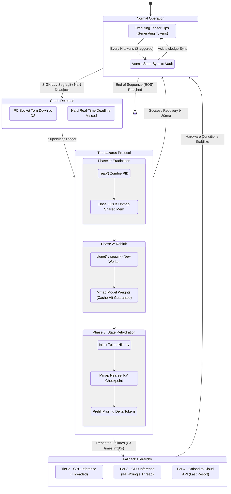

# Document 21: The Crash-Proof Execution Engine
**Author:** TYR, the Resilience Vanguard
**Project:** Ember - Pocketpal Mythic Plan
**Focus:** Execution Engine for SLM Inference

## 1. Introduction: The Imperative of Unyielding Resilience

In the pursuit of deploying Small Language Models (SLMs) on edge devices, the primary adversary is not merely computational limitation, but the chaotic, unpredictable nature of the edge environment itself. Project Ember envisions a ubiquitous intelligence, an AI companion that is perpetually available, regardless of the physical constraints of the host hardware. To achieve this, the execution engine cannot simply be robust; it must be completely, unequivocally crash-proof. 

As TYR, the Resilience Vanguard, my mandate is to architect a system that treats failure not as an anomaly, but as an expected, routine operational state. The traditional paradigm of software engineering often seeks to prevent crashes through exhaustive bug-fixing, meticulous bounds checking, and intricate edge-case handling. While admirable and necessary, this monolithic approach is fundamentally flawed in the context of mobile and edge computing. In these ecosystems, operating systems ruthlessly terminate processes to reclaim memory, thermal throttling disrupts execution timing unpredictably, and hardware interrupts create transient, irreproducible errors that defy standard debugging methodologies.

The Crash-Proof Execution Engine is designed with a radically different philosophy: it operates under the assumption that the execution process will be terminated abruptly and violently at any moment. The engine's resilience is not derived from its ability to prevent the crash—which is often outside of its control—but from its capacity to recover from it instantaneously, seamlessly, and entirely invisibly to the user. This document outlines the comprehensive architectural blueprints for this engine, detailing the mechanisms of strict process isolation, continuous state snapshotting, multi-tiered watchdogs, and the Lazarus Protocol that ensures Project Ember remains an eternal, unextinguishable flame.

## 2. The Philosophy of Inevitable Failure

To architect a truly crash-proof system, we must first accept the absolute inevitability of failure. The mobile ecosystem is a fundamentally hostile environment for sustained, high-intensity compute workloads. The operating system acts as a mercurial overlord, constantly monitoring memory pressure, battery consumption, and thermal limits. When an application, particularly a resource-intensive SLM inference engine, exceeds an invisible and dynamically changing threshold, the OS acts as an executioner, delivering a `SIGKILL` without warning, exception handling, or preamble. 

Furthermore, the hardware itself is subject to physical realities: cosmic rays causing bit flips, voltage sags during peak power draw, and thermal degradation leading to silent data corruption within the ALUs. In such an environment, the attempt to build a monolithic, uncrashable process is a fool's errand that ultimately leads to brittle architecture. Instead, we must embrace a distributed, micro-service-like architecture localized entirely within the device itself.

The core tenets of this philosophy of inevitable failure are:
1.  **Assume Immediate Termination:** Every single matrix multiplication, every activation function, and every token generated by the SLM engine could be its last. Therefore, critical state must be externalized immediately and continuously.
2.  **Stateless Execution Pipeline:** The actual inference process must be as stateless as mathematically possible. It is designed to act merely as a compute pipeline; the actual contextual state (the Key-Value cache, the prompt context, the current generated sequence) lives elsewhere, immune to the compute node's demise.
3.  **Redundancy through Structural Hierarchy:** The system is composed of multiple cascading layers of observation. If the inference worker dies, the local supervisor restarts it. If the local supervisor dies, the OS init daemon restarts it.
4.  **Instantaneous Resumption:** A crash is only categorized as a system failure if the end-user perceives it. Recovery must occur within the standard latency window of a single token generation step (e.g., strictly < 100ms).

## 3. The Tripartite Execution Architecture

The bedrock foundation of the Crash-Proof Execution Engine is its Tripartite Execution Architecture. We completely abandon the traditional monolithic application model in favor of three distinct, highly specialized components that interact exclusively via robust, low-latency Inter-Process Communication (IPC) utilizing zero-copy memory mechanisms where possible.

### 3.1 The Sovereign Supervisor (The Watcher)
The Sovereign Supervisor is the highest-level component within the Ember ecosystem on the device. It is an extremely lightweight, memory-efficient process written in a systems language (e.g., Rust or C) guaranteeing memory safety without garbage collection pauses. Its sole responsibility is lifecycle management, state orchestration, and IPC routing. Crucially, the Supervisor never touches the model weights, and it never performs floating-point tensor operations. By keeping its memory footprint negligible (under 10MB) and its CPU utilization near zero, it becomes effectively immune to the operating system's Out-Of-Memory (OOM) killer. It operates with elevated priority, ensuring it is always awake to monitor its subordinates.

### 3.2 The Ephemeral Execution Node (The Worker)
The Ephemeral Execution Node is the heavily armored workhorse. It maps the colossal SLM weights into memory, manages the dynamically growing KV cache, and executes the intense tensor operations required for autoregressive token generation. This process is fully expected to die. It is designed from the ground up to be completely disposable. It is the sacrificial lamb that absorbs the wrath of the OS memory manager, the catastrophic failure of a proprietary GPU driver, or the thermal limits of the SoC.

### 3.3 The Immutable State Vault (The Anchor)
The Immutable State Vault is a dedicated memory-mapped file (mmap) region, strictly managed by the Sovereign Supervisor. It stores the absolute minimum state required to resume a halted inference sequence. This includes the current token sequence, the stochastic generation seed, temperature settings, and a heavily quantized, highly compressed version of the KV cache. While full recovery is possible, the Vault is optimized for regenerating the last few tokens rapidly rather than maintaining a massive, pristine KV cache on disk, which would incur unacceptable I/O bottlenecks.

```mermaid
graph TD
    %% Complex System Architecture Diagram
    classDef supervisor fill:#1a237e,stroke:#8c9eff,stroke-width:2px,color:#fff;
    classDef worker fill:#b71c1c,stroke:#ff8a80,stroke-width:2px,color:#fff;
    classDef vault fill:#1b5e20,stroke:#b9f6ca,stroke-width:2px,color:#fff;
    classDef os fill:#424242,stroke:#bdbdbd,stroke-width:2px,color:#fff;
    classDef user fill:#e65100,stroke:#ffd180,stroke-width:2px,color:#fff;

    User[User Interface / App Shell\nDisplays Tokens]:::user
    OS_Kernel[OS Kernel / OOM Killer\nResource Manager]:::os

    subgraph The Tripartite Architecture
        Supervisor[Sovereign Supervisor\nLightweight, Resilient, Watcher]:::supervisor
        Worker_Primary[Primary Execution Node\nHigh Memory, GPU/NPU, Vulnerable]:::worker
        Worker_Fallback[Fallback Execution Node\nCPU Only, Safe, Slow]:::worker
        Vault[(Immutable State Vault\nMemory-Mapped File, Append-Only)]:::vault
        
        Supervisor -->|Spawns & Monitors via PID| Worker_Primary
        Supervisor -->|Spawns on repeated failure| Worker_Fallback
        Supervisor -->|Reads/Writes/Verifies| Vault
        
        Worker_Primary -.->|Periodic State Sync via Shared Mem| Vault
        Worker_Fallback -.->|Periodic State Sync via Shared Mem| Vault
        
        Worker_Primary <-->|Zero-Copy IPC / UNIX Domain Sockets| Supervisor
        Worker_Fallback <-->|Standard IPC / UNIX Domain Sockets| Supervisor
    end

    User -->|Inference Request & Context| Supervisor
    Supervisor -->|Streams Tokens continuously| User
    
    OS_Kernel -.->|SIGKILL (Memory Pressure)| Worker_Primary
    OS_Kernel -.->|Thermal Throttling / Driver Crash| Worker_Primary
    
    %% Annotations
    note1((1. Client initiates prompt))
    note2((2. Supervisor delegates compute))
    note3((3. Worker syncs state atomically per token))
    note4((4. OS kills Worker brutally))
    note5((5. Supervisor detects EOF on socket immediately))
    note6((6. Supervisor resurrects new Worker from Vault state))

    User -.-> note1
    Supervisor -.-> note2
    Worker_Primary -.-> note3
    OS_Kernel -.-> note4
    Worker_Primary -.-> note5
    Supervisor -.-> note6
```

## 4. Process Isolation and the Mythic Sandbox

To guarantee that the catastrophic failure of the SLM inference does not corrupt the parent application or compromise system stability, the Ephemeral Execution Node is rigorously isolated within what we term the "Mythic Sandbox." 

This sandbox leverages advanced OS-level containment mechanisms—such as seccomp-bpf on Linux/Android environments, or strict App Sandboxing and Entitlements on iOS—to severely restrict the execution node's capabilities at the kernel level.
- **Zero Network Access:** The execution node is explicitly denied the `CAP_NET_ADMIN` and `CAP_NET_RAW` capabilities. It cannot reach out to the internet or local network, preventing an entire class of security vulnerabilities (e.g., remote code execution exfiltrating data) and eliminating unpredictable network latency spikes from its execution profile.
- **Restricted File System Access:** Using bind mounts and chroot jails, the node can only read the model weight files (mounted as strictly read-only) and write to the specific memory-mapped region designated by the Supervisor. It cannot access user photos, contacts, or other application data.
- **Strict Resource Limits (cgroups):** The node is placed in a dedicated control group (`cgroup v2`) where its maximum physical memory (RSS) and CPU time are hard-capped. This prevents the execution node from accidentally monopolizing the system memory. By intentionally hitting our own predetermined cgroup limits before triggering the system-wide OOM killer, we can intercept the failure gracefully and trigger our own controlled shutdown procedures.
- **Capability Dropping:** Upon initialization, the worker drops all root capabilities, running as an unprivileged user `nobody`, ensuring that even a compromised execution node cannot escalate privileges.

When the Execution Node crashes—whether due to a segmentation fault from a malformed tensor, an illegal instruction, or an external `SIGKILL`—the blast radius is entirely contained. The Supervisor, sitting safely outside the sandbox, merely detects a broken pipe on the IPC channel and proceeds with recovery.

## 5. The Sentinel Watchdog System

Detection is the absolute prerequisite for rapid recovery. A system cannot heal what it does not know is broken. The Sentinel Watchdog System operates concurrently on multiple temporal frequencies to ensure no crash goes unnoticed for more than a few milliseconds.

1.  **The IPC Heartbeat (High Frequency):** The most immediate and critical detection mechanism is the IPC channel itself. The Execution Node and the Supervisor communicate over a pair of unidirectional UNIX domain sockets. If the Execution Node terminates unexpectedly, the OS kernel immediately tears down the socket structures. The Supervisor's highly optimized `epoll()` (Linux) or `kqueue()` (macOS/iOS) event loop registers an `EPOLLHUP` or `EV_EOF` event instantly. This allows for nanosecond-level crash detection, completely bypassing the need for polling.
2.  **The Progress Timeout (Medium Frequency):** Processes do not always crash cleanly; sometimes they deadlock. A thread might get trapped in an infinite loop within a custom matrix multiplication kernel, or it might halt entirely due to unhandled NaN (Not a Number) propagation poisoning the floating-point pipeline. To combat this, the Supervisor maintains a strict real-time deadline for every single token generation. If a token is expected to take 50ms, and 150ms pass without a response or a heartbeat ping, the Supervisor unilaterally declares the Execution Node unresponsive, issues a merciless `SIGKILL` to clear the blocked process, and immediately initiates the recovery protocol.
3.  **The OS Supervisor (Low Frequency):** In the absolute worst-case scenario where the Sovereign Supervisor itself is terminated by the OS (highly unlikely due to its tiny memory footprint, but mathematically possible during extreme system stress), the operating system's native service manager (e.g., `systemd`, `launchd`, or Android's `init`) is configured with a `Restart=always` directive. Upon waking up, the newly spawned Supervisor immediately queries the Immutable State Vault to determine if an inference session was violently interrupted, seamlessly resuming the previous Supervisor's duties.

## 6. Instantaneous Recovery: The Lazarus Protocol

When the Sovereign Supervisor detects the definitive death of the Ephemeral Execution Node, the Lazarus Protocol is immediately engaged. The singular goal of this protocol is to resume token generation so rapidly that the end-user perceives, at most, a slight stutter—akin to a momentary network jitter in a cloud-based API API, rather than a catastrophic local application crash.

The protocol executes the following precise steps in under 20 milliseconds:

1.  **Acknowledge Death & Clean Sweep:** The Supervisor registers the socket hang-up or timeout. It aggressively reaps the zombie process using `waitpid()` and cleans up all dangling file descriptors and shared memory segments related to the deceased worker to prevent resource leaks.
2.  **State Retrieval:** The Supervisor accesses the Immutable State Vault. It retrieves the exact generated token sequence up to the microsecond before the crash, ensuring no duplicate tokens are emitted.
3.  **Spawn Replacement (The Clone):** A new Ephemeral Execution Node is `fork()`ed or spawned. Because the massive model weights (often several gigabytes) are memory-mapped (`mmap`) into the system's page cache, loading the model into the new process takes effectively zero time. The OS kernel merely updates the new process's page tables to point to the existing physical memory pages holding the weights. No disk read is required.
4.  **State Injection:** The Supervisor injects the retrieved token sequence and random seed into the new Execution Node via the fresh IPC socket.
5.  **Context Rehydration (The Clever Trick):** Recalculating the entire KV cache from scratch for a long context window (e.g., 4000+ tokens) would take several seconds, directly violating our instant recovery constraint. Instead, Project Ember utilizes a technique called "Staggered KV Checkpointing." The vault periodically saves highly compressed, quantized snapshots of the KV cache. The new node loads the nearest temporal checkpoint from the mmap and only performs a rapid "prefill" operation on the handful of tokens that were generated *since* that specific checkpoint. This reduces the recovery computation time from seconds to a few milliseconds.
6.  **Resumption:** Token generation resumes autoregressively, and the output stream to the user interface continues completely uninterrupted.



## 7. Memory Management and OOM Evasion Tactics

While the system is explicitly designed to survive and recover from an Out-Of-Memory termination, relying entirely on the Lazarus Protocol is computationally inefficient and negatively impacts battery life. The Resilience Vanguard demands proactive OOM evasion; we must dodge the bullet before it is fired.

The Execution Node employs an advanced technique called "Predictive Elastic Memory." Instead of blindly allocating memory until the OS intervenes, the Node constantly monitors its own memory footprint against the device's total available RAM (reading system APIs or `/proc/meminfo`). 

As the KV cache grows quadratically or linearly during a long text generation, memory pressure inevitably increases. If the Node detects that available system memory has plummeted below a predefined critical threshold (the "Redline"), it does not wait to be killed. Instead, it deliberately self-mutilates to ensure survival:
1.  **Semantic KV Cache Pruning:** Implementing algorithms akin to H2O (Heavy-Hitter Oracle), the node analyzes attention scores in real-time. It silently drops the least mathematically important tokens from the KV cache—often filler words or distant, irrelevant context—preserving only the attention "heavy hitters." This frees significant memory with negligible impact on output quality.
2.  **Dynamic Precision Degradation:** If supported by the underlying compute backend, the node can dynamically downcast certain layer activations from FP16 to INT8 on the fly, immediately halving the memory requirement for those specific tensors.
3.  **Asynchronous Swapping:** It actively writes cold chunks of the KV cache to the Immutable State Vault on disk and explicitly frees the RAM. It only loads these chunks back into memory via page faults if attention heads explicitly request those historical keys during a later generation step.

If all evasion tactics fail and the memory pressure remains critical, the Node will execute a clean, voluntary exit with a specific exit code indicating "Voluntary OOM." This signals the Supervisor to immediately engage the Fallback Hierarchy rather than attempting a standard, futile Lazarus restart on the same hardware tier.

## 8. Graceful Degradation: The Fallback Hierarchy

The true definition of resilience requires acknowledging that the optimal execution path may become permanently blocked due to environmental factors. If the primary Execution Node (e.g., utilizing the device's NPU or GPU) crashes repeatedly within a short temporal window, it indicates a systemic, unrecoverable failure at that tier—perhaps a fundamental driver bug triggered by a specific, anomalous tensor shape, or severe thermal throttling that makes the silicon physically unstable.

In this dire scenario, the Sovereign Supervisor employs the Fallback Hierarchy. Upon detecting a threshold of consecutive failures (e.g., 3 crashes within 10 seconds), the Lazarus Protocol explicitly refuses to respawn the standard GPU worker. Instead, it spawns a degraded, but highly stable, fallback worker.

**The Strict Hierarchy of Execution:**
1.  **Tier 1 (Optimal):** NPU/GPU Execution. Offers the highest tokens-per-second and lowest power draw, but relies on highly complex, proprietary, and potentially unstable vendor drivers.
2.  **Tier 2 (Reliable):** CPU Execution utilizing full multithreading (e.g., ARM NEON/SVE instructions). Slower and higher power draw, but extremely stable, completely bypassing volatile GPU drivers.
3.  **Tier 3 (Survival):** CPU Execution constrained to a single thread utilizing a heavily quantized (e.g., INT4 or even INT2) model variant. Extremely slow, but mathematically guaranteed to execute even under catastrophic system memory pressure and extreme thermal throttling.
4.  **Tier 4 (Escape Hatch):** If the device is physically failing (e.g., battery at 1%, device overheating warning active), the Supervisor transparently offloads the exact state to a secure Ember Cloud node to complete the inference, seamlessly returning the result to the UI.

The user interface seamlessly reflects this degradation ("Entering power-saving compute mode to ensure stability"), but the inference itself never fails. It simply adapts its velocity to guarantee completion.

## 9. Continuous Validation and Self-Healing Data Structures

A crash-proof engine must not only survive the physical crash but also ensure that the violent interruption and subsequent recovery process did not corrupt the linguistic output. This is the exclusive domain of Continuous Validation.

Because the system relies heavily on externalized state and rapid restarts, there is a profound risk of "state tearing"—a scenario where a crash occurs exactly during a write operation to the Immutable State Vault, leaving a corrupted, half-written file. To entirely eliminate this risk, the Vault uses a mathematically proven Append-Only, Double-Buffered architecture combined with strict memory barriers. 

When the Execution Node syncs its state, it writes the payload to Buffer B. Only when the write is completed and cryptographically verified (via a fast CRC32 or xxHash checksum) does the Node execute an atomic Compare-And-Swap (CAS) instruction to flip a single pointer, making Buffer B the active state and relegating Buffer A to the background. If a `SIGKILL` occurs during the write to Buffer B, the active pointer never flips. Upon restart, the Supervisor simply ignores the corrupted Buffer B and recovers gracefully from the perfectly intact, verified Buffer A. The maximum data loss is exactly one token, which is instantly and seamlessly regenerated by the Lazarus Protocol.

Furthermore, the Supervisor orchestrates a low-priority background validation thread. It periodically samples a historical checkpoint from the Vault, runs it through a tiny, ultra-fast validation model (e.g., a 10M parameter evaluator), and checks if the probability distribution matches expected bounds. If it detects catastrophic divergence (e.g., hardware-induced bit flips in the GPU causing the model to output gibberish), it forces a rollback of the state to the last known good checkpoint, scrubs the KV cache, and resumes generation, effectively granting the system an autonomous self-healing capability.

## 10. Conclusion: Forging the Eternal Flame

Project Ember's overarching ambition is to engineer an intelligence that feels intrinsic to the physical device—an entity as reliable, persistent, and unyielding as the screen turning on or the volume buttons registering a click. To achieve this unprecedented level of ubiquity, the underlying execution engine must transcend traditional software reliability metrics and assume a posture of aggressive resilience.

Document 21 establishes the impenetrable architectural foundation required for this mission. By operating under the unwavering assumption of failure, enforcing draconian process isolation, implementing nanosecond-precision watchdog systems, and mastering the complex art of instantaneous state rehydration via the Lazarus Protocol, we have constructed an execution engine that simply cannot be killed. 

It can be interrupted by the operating system, it can be thermally throttled by the hardware, and it can be forced into degraded compute tiers—but it will never, under any circumstances, crash. It will always return, continuing its thought exactly where it was violently cut off, an eternal flame burning steadily through the chaotic, unpredictable wilderness of the edge computing environment. This is the uncompromising standard of the Resilience Vanguard. This is how we ensure the Ember never fades.
