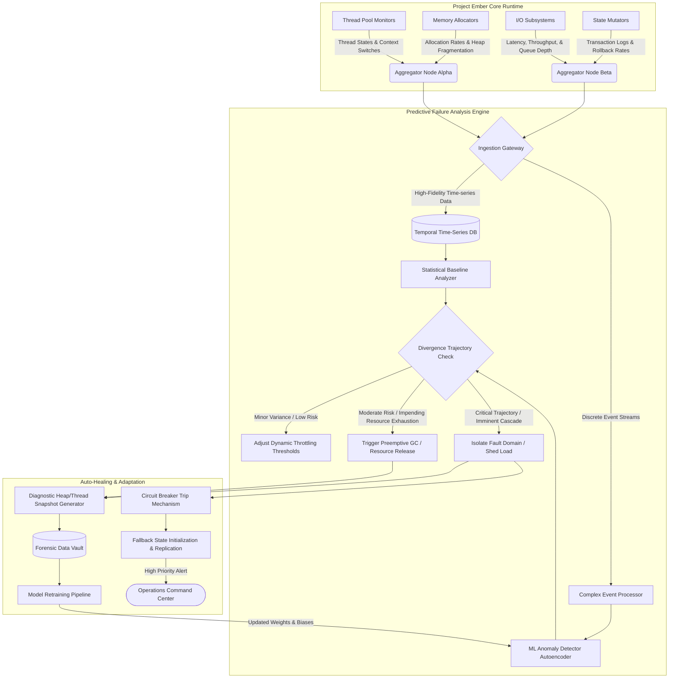
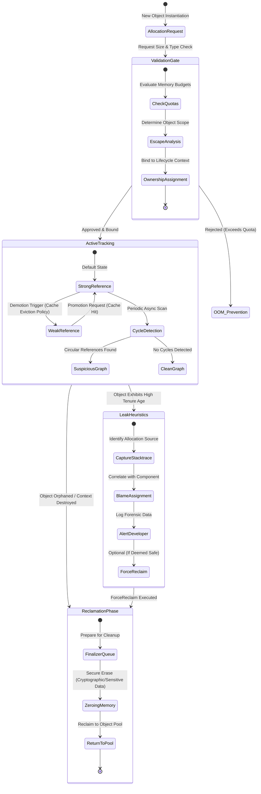

# Document 22: Bug Resistance and Predictive Failure Analysis
**Author:** TYR, the Resilience Vanguard
**Project:** Project Ember - Pocketpal Mythic Plan
**Date:** May 25, 2026

---

## 1. The Vanguard’s Manifesto: The Philosophy of Intrinsic Resilience

In the crucible of complex systems engineering, hope is not a strategy, and reactive debugging is an admission of architectural failure. As TYR, the Resilience Vanguard, I approach Project Ember with an uncompromising mandate: the system shall not merely recover from failure; it shall anticipate, preempt, and immunize itself against the very genesis of systemic degradation. Bug resistance is not a phase of testing; it is a fundamental property of the codebase, woven into the subatomic fabric of the application’s architecture. 

For too long, software engineering has relied on the post-mortem. A failure occurs, the stack trace is analyzed, a patch is applied, and the cycle repeats. This is unacceptable for Project Ember. The mythic scale of this undertaking demands a paradigm shift from reactive mitigation to predictive invulnerability. We must architect a system that treats runtime anomalies not as unexpected disasters, but as deterministic, quantifiable variances that can be detected and neutralized before they cascade into user-facing outages.

Intrinsic resilience requires us to view the system as a living organism. Just as an immune system does not wait for an infection to become systemic before mounting a defense, Project Ember must continuously monitor its own internal state, identifying pathogenic code behaviors—such as memory bloat, runaway threads, or unhandled edge cases—and neutralizing them in real-time. This document outlines the core methodologies, architectural patterns, and predictive frameworks that will constitute the impenetrable shield of Project Ember. The objective is absolute operational continuity, characterized by a mean time to failure (MTTF) that approaches infinity.

To achieve this, we will deploy a multi-layered defense-in-depth strategy. This encompasses Predictive Failure Analysis (PFA), aggressive memory lifecycle management, intrinsic bug resistance through strict contract-based programming, and automated graceful degradation. We are building a fortress, and every line of code is a brick in its walls.

---

## 2. Predictive Failure Analysis (PFA) Framework

The cornerstone of Project Ember’s resilience is the Predictive Failure Analysis (PFA) Framework. Traditional monitoring alerts operators when a system is dying; PFA alerts the system when the probability of future death exceeds an acceptable threshold. It is a deterministic oracle, leveraging high-fidelity telemetry, statistical baselining, and machine learning anomaly detection to forecast failure horizons.

### 2.1 The Telemetry Panopticon

Predictive analysis is only as effective as the data it consumes. Project Ember will deploy a non-intrusive, ultra-low-latency telemetry mesh that monitors every critical subsystem. We do not just log errors; we log the *conditions* that precede errors. This includes thread pool saturation rates, lock contention durations, memory allocation velocities, I/O queue depths, and state mutation frequencies.

These metrics are streamed in real-time to the PFA Engine, which acts as the central nervous system of our resilience architecture. The ingestion gateways process both time-series data and complex event streams, allowing the system to correlate seemingly disparate events—for example, a minor increase in database latency correlating with a specific spike in garbage collection pauses.

### 2.2 The Predictive Engine and Heuristics

The PFA Engine employs a dual-pronged approach: Statistical Baseline Analyzers and Machine Learning Anomaly Detectors.

1.  **Statistical Baseline Analyzers:** These models maintain a rolling window of normal operational parameters. They utilize advanced statistical process control (SPC) algorithms, such as Exponentially Weighted Moving Averages (EWMA), to detect deviations from the mean. If a specific subsystem’s memory allocation rate diverges from its historical baseline by more than three standard deviations for a sustained period, the analyzer flags a "Divergence Warning."
2.  **Machine Learning Anomaly Detectors:** While statistical models are excellent for linear deviations, complex systems often fail in non-linear, multidimensional ways. We utilize unsupervised machine learning models (such as Isolation Forests and Autoencoders) trained on historical telemetry to identify subtle, multi-variate anomalies that human operators and simple thresholds would miss.

When an anomaly is detected, the PFA Engine evaluates the trajectory. Is this a transient spike, or is the system trending toward a catastrophic state? Based on this calculation, it executes preemptive remediations.

### 2.3 PFA Architecture Diagram

The following diagram illustrates the flow of telemetry data, the predictive analysis pipeline, and the automated remediation feedback loop.

---

## 3. Memory Leak Prevention and Lifecycle Management

Memory leaks are the silent assassins of long-running services. They degrade performance slowly, evading superficial testing, only to cause catastrophic Out-Of-Memory (OOM) crashes in production. For Project Ember, memory management is not left to the whims of standard garbage collectors; it is aggressively policed through strict ownership semantics and continuous lifecycle auditing.

### 3.1 Strict Ownership and Escape Analysis

We mandate strict ownership semantics at the architectural level. Every object instantiated within Project Ember must have a clearly defined, singular owner responsible for its lifecycle. When the owner’s context is destroyed, the object is immediately marked for reclamation. We heavily leverage compiler-level escape analysis to ensure that objects allocated within a local scope do not inadvertently "escape" to global scopes or static collections unless explicitly designed to do so.

### 3.2 Continuous Memory Graph Analysis

The traditional approach to memory leaks is analyzing heap dumps after a crash. Our approach is continuous, real-time memory graph analysis. The system periodically samples the object graph, looking for specific pathogenic patterns:

1.  **High Tenure Age Anomalies:** Objects that survive multiple garbage collection cycles without being accessed. These are prime suspects for "forgotten" references in caches or event listener registries.
2.  **Unbounded Collection Growth:** The system monitors the size of all Maps, Lists, and Sets. If a collection demonstrates monotonic growth without corresponding eviction events, the PFA Engine raises an alert and can automatically cap the collection or initiate an eviction protocol.
3.  **Dangling Event Listeners:** One of the most common sources of memory leaks in event-driven architectures. Project Ember requires all event listeners to utilize Weak References or implement auto-deregistration upon the subscriber's destruction.

### 3.3 The Reclamation Cycle Diagram

The following state diagram details the lifecycle of memory allocation, active tracking, leak heuristic application, and eventual reclamation.

---

## 4. Intrinsic Bug Resistance Mechanisms

Predicting failures and managing memory are essential, but the most resilient system is one where bugs simply cannot compile or execute. We achieve this through stringent architectural constraints and a philosophy of defensive, contract-based programming.

### 4.1 Immutability by Default

Mutable state is the root of all race conditions, inconsistent data views, and unpredictable side effects. In Project Ember, immutability is the default state of all data structures. Once an object is created, its state cannot be altered. Any transformation requires the creation of a new object representing the new state. This completely eliminates a massive category of concurrency bugs. When multiple threads access the same data, no locks are required, no deadlocks can occur, and thread safety is mathematically guaranteed.

### 4.2 Pure Functions and Side-Effect Isolation

Business logic must be encapsulated in pure functions—functions that always produce the same output for the same input and have no side effects (such as modifying global variables or performing I/O). By isolating pure logic from side-effect-inducing operations (like database writes or network calls), we make the core logic trivially testable and entirely predictable.

Side effects are pushed to the absolute edges of the architecture, managed by dedicated Monadic structures or side-effect handlers. This clear demarcation ensures that a network timeout or a disk error cannot corrupt the internal state of the application's domain logic.

### 4.3 Contract-Based Programming and Invariant Enforcement

Every function and module in Project Ember operates under strict contracts. These contracts define preconditions (what must be true before the function runs), postconditions (what must be true after the function runs), and invariants (what must always be true during the function's execution).

These are not merely comments; they are executable assertions evaluated at runtime (and preferably at compile-time via advanced static analyzers). If a module receives data that violates its precondition, it immediately throws a `ContractViolationException`. It does not attempt to "guess" or sanitize the data in unexpected ways. Failing fast and failing loudly at the exact point of contract breach provides immediate, localized context for debugging, preventing the silent propagation of corrupted state that leads to incomprehensible bugs downstream.

### 4.4 Advanced Type Safety and State Machines

We leverage the type system not just for memory safety, but for logic safety. Illegal states should be unrepresentable. For example, an object representing a network connection should not have a state where it is both "Disconnected" and "Transmitting." By modeling complex lifecycles as strict Finite State Machines (FSMs) encoded directly into the type system, the compiler becomes our first line of defense against illogical state transitions.

---

## 5. Graceful Degradation and Auto-Recovery

Even with predictive analysis and bug-resistant design, black swan events—unforeseeable external catastrophes—will occur. Project Ember must not collapse under extreme duress; it must bend, shed non-essential load, and maintain core functionality. This is the essence of graceful degradation.

### 5.1 The Shedding Hierarchy

When the PFA Engine detects imminent resource exhaustion (e.g., CPU starvation, database connection pool depletion), the system initiates a predefined shedding protocol. Features are categorized into a strict hierarchy of criticality:

1.  **Tier 1 (Critical):** Core transactional integrity, security enforcement, data persistence.
2.  **Tier 2 (Degraded):** Synchronous user interactions, real-time updates.
3.  **Tier 3 (Sacrificial):** Background analytics, pre-fetching, complex non-essential computations, high-fidelity logging (downgraded to minimal logging).

As stress increases, Tier 3 features are systematically disabled. If the stress continues, Tier 2 is throttled or switched to asynchronous processing. The system focuses all remaining resources on preserving Tier 1 operations.

### 5.2 Circuit Breakers and Bulkheads

To prevent localized failures from cascading, Project Ember implements extensive Circuit Breaker and Bulkhead patterns.
*   **Circuit Breakers:** If an external service or internal microservice exhibits high latency or error rates, the circuit breaker trips, immediately failing subsequent requests rather than allowing threads to block and exhaust the thread pool. A fallback mechanism (such as serving cached data or returning a default safe response) is instantly activated. The circuit breaker periodically allows test requests through to determine if the failing service has recovered.
*   **Bulkheads:** The system is partitioned into isolated execution pools. If the component handling image processing consumes all its allocated memory, it will crash, but it cannot consume the memory allocated for the authentication component. The ship may flood in one compartment, but the bulkhead doors ensure it remains afloat.

### 5.3 Automated Remediation and Self-Healing

Recovery must be autonomous. When a node fails, the orchestration layer must instantly route traffic away, quarantine the failed node for forensic analysis, and spin up a pristine replacement. If a specific data partition becomes corrupted, the system must automatically initiate a localized rollback from the nearest consistent snapshot or replay the event log to rebuild the state. Human intervention is a bottleneck that cannot be tolerated in a mythic-scale system.

---

## 6. Chaos Engineering and Stress Testing Integration

Resilience cannot be proven through standard unit testing; it must be forged in the fire of intentional destruction. Project Ember embraces Chaos Engineering as a continuous, automated process, not an occasional exercise.

### 6.1 The Chaos Engine

We deploy a dedicated "Chaos Engine" that operates continuously in staging and, in a highly controlled manner, in the production environment. Its sole purpose is to inject failure. It will:
*   Randomly terminate processes and containers.
*   Artificially inflate network latency and drop packets.
*   Simulate disk failures and I/O bottlenecks.
*   Inject malformed data into internal queues.
*   Force clock skews across distributed nodes.

### 6.2 Validation of the PFA and Remediation Systems

The purpose of the Chaos Engine is to validate the PFA framework and the automated remediation protocols. When the Chaos Engine injects a memory leak, the PFA Engine must detect it, the memory heuristics must isolate it, and the system must gracefully recover without human operator alerts triggering. If a Chaos experiment results in an unanticipated system degradation, it is logged as a critical architecture flaw. The continuous battle between the Chaos Engine and the Resilience Framework ensures that the system's defenses are perpetually hardened and adapted to novel failure modes.

---

## 7. Conclusion

Document 22 establishes the non-negotiable standards for Project Ember's resilience. As TYR, I dictate that we do not build software that merely works under optimal conditions; we engineer a digital fortress capable of predicting its own vulnerabilities and self-healing under catastrophic duress. By integrating Predictive Failure Analysis, uncompromising memory lifecycle governance, intrinsic bug resistance through immutability and contracts, and automated graceful degradation, Project Ember will achieve operational immortality. The code will not break; it will adapt, survive, and execute with mythic reliability. The Vanguard has spoken.
