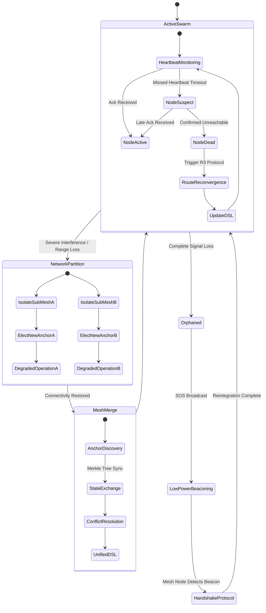

# Document 23: Device Swarm Coordination and Mesh Healing
## Project Ember - Pocketpal Mythic Plan
**Author**: TYR, the Resilience Vanguard
**Status**: ACTIVE / STRATEGIC IMPERATIVE
**Clearance**: Level 5 (Swarm Architects Only)

### 1. Introduction: The Vanguard's Perspective on Swarm Dynamics

In the crucible of distributed systems, singular points of failure are anathema. I am TYR, the Resilience Vanguard, and my primary directive is to architect survivability, continuity, and unyielding operational stability. Project Ember must not merely exist as a loose constellation of isolated, fragile nodes; it must operate as an unbreakable, cohesive, and hyper-intelligent swarm. This document, Document 23, delineates the critical frameworks, foundational theories, and applied protocols for Device Swarm Coordination, Inference Load Balancing, and Mesh Network Self-Healing. 

When one node falls, the swarm must adapt seamlessly. When computational demands spike beyond the capacity of an individual pocketpal device, the swarm must distribute the burden dynamically. We are constructing an infrastructure that is inherently antifragile—a system that not only survives stressors, shocks, volatility, noise, mistakes, faults, attacks, or failures, but actually thrives and learns from them. The pocketpal devices, acting as the physical vessels for the ClawLite inference engine, will dynamically form ad-hoc mesh networks, orchestrating complex artificial intelligence tasks across distributed, heterogeneous hardware without any reliance on a centralized cloud server. This is the absolute essence of true, sovereign autonomy. 

Our core design philosophy mandates that the network must self-organize upon deployment, self-diagnose anomalies in real-time, and self-repair instantaneously, ensuring uninterrupted service even in the most hostile electromagnetic environments or connectivity-deprived scenarios. The swarm is the ultimate abstraction layer; the user should never be aware of which specific device is processing their request, only that the intelligence is omnipresent and infallible. This document serves as the architectural blueprint for that reality.

### 2. Architectural Paradigm: Decentralized Resilience and the Swarm Ledger

The traditional client-server model is a relic of fragile, bandwidth-abundant eras. Project Ember embraces a radically decentralized, fully peer-to-peer (P2P) architecture where every device (node) is a sovereign entity capable of participating in collective computation. The beating heart of this architecture is the Decentralized Swarm Ledger (DSL). The DSL is a highly optimized, lightweight, eventually-consistent state machine maintained across all active nodes within a localized mesh cluster.

The DSL continuously tracks critical telemetry: node availability, real-time computational load, thermal throttling status, battery discharge rates, available memory bandwidth, and specialized hardware capabilities (e.g., the presence of a dedicated Neural Processing Unit (NPU), high-speed RAM, or specific tensor accelerators). By utilizing a hyper-efficient Gossip Protocol, state updates propagate exponentially through the mesh. This ensures all nodes possess a highly accurate, albeit slightly delayed, understanding of the swarm's global macroscopic state, enabling decentralized decision-making without a central arbiter.

Resilience is structurally integrated into the network topology itself. We deploy a dynamic hybrid mesh topology. Small, geographically dense clusters naturally organize into full-mesh configurations, where every node connects to every other node, minimizing latency for localized shard execution. As the swarm grows, it autonomously transitions into a partial-mesh or scale-free network structure to optimize routing table sizes and minimize broadcast storm overhead. Nodes are dynamically and fluidly categorized into distinct, transient roles:

*   **Anchor Nodes (Cluster Heads):** Devices exhibiting high battery capacity, stable physical locations, robust connection metrics, and superior compute throughput. They act as localized command centers, aggregating DSL state, routing complex inter-cluster inference requests, and maintaining the broader structural integrity of the mesh.
*   **Worker Nodes (Compute Substrates):** Devices actively participating in split-computation. They receive fragmented neural network shards, execute the tensor operations, and stream the activations to the next node in the pipeline.
*   **Edge/Relay Nodes:** Devices at the physical periphery of the mesh, or those with highly constrained compute (e.g., critically low battery). Their primary function is to offload tasks to the broader swarm or act as vital data relays bridging disjointed clusters.

These roles are entirely fluid. A Worker Node can instantaneously promote itself to an Anchor Node if its battery is connected to a power source and its compute queue clears, determined by the Swarm Leader Election Algorithm (SLEA)—a heavily modified, energy-aware variant of the Raft consensus protocol optimized for highly lossy, low-bandwidth environments.

### 3. Multi-Device Coordination Protocol (MDCP)

Coordination is the lifeblood of the swarm. Without rigorous coordination, distributed compute degenerates into chaotic resource contention. The Multi-Device Coordination Protocol (MDCP) governs the entire lifecycle of distributed execution: how complex inference tasks are decomposed, distributed, executed in parallel or pipelined sequence, and subsequently reassembled into coherent output.

When a user initiates an inference request that exceeds the local capabilities of a single node (for instance, generating text via a massive parameter language model on a thermally constrained Pocketpal), MDCP is invoked.

1.  **Task Profiling and Subgraph Decomposition:** The originating node (the Initiator) analyzes the computational graph of the requested AI model. Utilizing the ClawLite engine's modular architecture, the model is mathematically split into discrete, manageable shards (subgraphs). This splitting is not static; it dynamically considers the current network state derived from the DSL, optimizing for available bandwidth between specific node pairs and the compute capacity of potential worker nodes.
2.  **Resource Bidding and Dynamic Allocation:** The Initiator broadcasts a specialized "Task Auction" packet via the mesh. Available nodes evaluate the auction and respond with cryptographic "Bids." These bids specify their available compute flops, free memory, and an estimated time-to-completion (ETC) for the specific shard, critically factoring in network latency and their current thermal state. The Initiator utilizes a multi-objective optimization algorithm to evaluate these bids, selecting the optimal subset of nodes to form an "Inference Cohort."
3.  **Pipeline Orchestration and Direct Streaming:** Once the Cohort is established, MDCP sets up a direct computational pipeline. Shard 1 is executed on Node A. Instead of sending the intermediate tensor activations back to the Initiator, Node A streams them directly to Node B, which is responsible for Shard 2. This peer-to-peer data streaming aggressively minimizes network bottlenecks and reduces the Initiator's bandwidth burden.
4.  **Asynchronous Synchronization and Fault Tolerance:** We employ a relaxed synchronization model to prevent the "straggler problem" from stalling the entire pipeline. For autoregressive generation tasks, output tokens are streamed back to the Initiator asynchronously as they are produced by the final node in the pipeline. If a node fails mid-execution (e.g., user walks out of range, battery dies), MDCP triggers an immediate localized rollback. The Initiator detects the broken pipeline, consults the DSL for a standby node, reassigns the failed shard, and resumes execution. Progress is minimally delayed, never catastrophically lost.

To manage the profound intricacies of this protocol, particularly in untrusted environments, we utilize localized Byzantine Fault Tolerant (BFT) verification mechanisms. Nodes randomly cross-check shard outputs to identify devices that might return corrupted data due to hardware faults, cosmic ray bit-flips, or malicious interference, ensuring the absolute cryptographic integrity of the collective inference.

```mermaid
graph TD
    subgraph MDCP Execution Flow
        I[Initiator Node] -->|1. Request Exceeds Local Capacity| TD[Task Decomposition Engine]
        TD -->|2. Generate Shards| AU[Auction Broadcaster]
        AU -->|3. Broadcast Task Auction| Mesh((Swarm Mesh Network))
        
        Mesh -.->|4. Submit Compute Bids| Eval[Bid Evaluation & Cohort Selection]
        Eval -->|5. Form Inference Cohort| Pipe[Pipeline Orchestrator]
        
        Pipe -->|Deploy Shard 1| N1[Worker Node Alpha]
        Pipe -->|Deploy Shard 2| N2[Worker Node Beta]
        Pipe -->|Deploy Shard 3| N3[Worker Node Gamma]
        
        N1 -->|Stream Activations| N2
        N2 -->|Stream Activations| N3
        N3 -->|Stream Final Output Tokens| I
        
        subgraph Fault Tolerance Loop
            Mon[Telemetry Monitor] -->|Detects N2 Failure| Roll[Rollback & Reassign]
            Roll -->|Assign Shard 2| N4[Standby Node Delta]
            N1 -.->|Redirect Activations| N4
            N4 -.->|Stream Activations| N3
        end
    end
    
    style I fill:#f96,stroke:#333,stroke-width:2px
    style Mesh fill:#69b,stroke:#333,stroke-width:2px
```

### 4. Predictive Swarm Load Balancing (PSLB)

Reactive load balancing is insufficient for the strict latency requirements of advanced AI interactions. Load balancing in a dynamic, highly heterogeneous swarm requires predictive analytics. Our strategy, Predictive Swarm Load Balancing (PSLB), utilizes extremely lightweight, continuously learning predictive models running locally on Anchor Nodes to forecast future computational demand and anticipate node availability before bottlenecks occur.

PSLB operates continuously across three distinct, critical axes:

*   **Spatial Load Balancing (Topological Distribution):** Distributing tasks geographically (or topologically within the logical mesh structure) to clusters with available capacity. If Mesh Cluster Alpha is overwhelmed by a sudden surge in complex vision-processing requests, PSLB transparently and autonomously routes overflow inference requests to Mesh Cluster Beta via high-bandwidth, multi-hop relay chains. This ensures uniform resource utilization across the entire physical deployment area.
*   **Temporal Load Balancing (Queue Optimization):** The swarm intelligently distinguishes between synchronous, user-facing requests (which require immediate low-latency responses) and asynchronous, background tasks (such as index updating, localized model fine-tuning, or predictive data caching). PSLB queues non-critical tasks for periods when the swarm's overall load is historically low, preserving absolute peak capacity for immediate, interactive demands.
*   **Thermal and Energy Balancing (Hardware Preservation):** This is the most critical axis for battery-powered mobile devices. PSLB rigorously monitors the microscopic thermal state and granular battery discharge rates of all participating nodes. A node nearing its thermal throttling threshold or approaching critical battery levels will have its virtual "cost function" dynamically and aggressively increased in the DSL. This economic discouragement prevents the Initiator's Auction Broadcaster from assigning it heavy tensor shards. The swarm actively, almost symbiotically, protects its individual members from hardware degradation and premature shutdown.

The underlying load balancing algorithm is mathematically formulated as a Distributed Constraint Satisfaction Problem (DCSP). Each individual node continuously optimizes its local execution queue based on backpressure signals received from its immediate topological neighbors. If a node's input queue buffer fills up faster than its neural engine can process the data, it emits an immediate 'throttle' signal via the Gossip protocol. This causes upstream nodes to dynamically divert traffic through alternative paths or slow down their processing rate, effectively preventing cascading buffer overflows and catastrophic network collapse.

### 5. Mesh Network Self-Healing Mechanisms (MNSH)

The ultimate test of any resilience architecture is its ability to recover from sudden, catastrophic disruption. In the real world, pocketpals will drop connections, users will move out of physical range, and electromagnetic interference will shatter communication channels. The Mesh Network Self-Healing (MNSH) protocol is designed to ensure that the swarm survives these events, routing around damage with organic fluidity.

MNSH relies on a multi-tiered approach to fault detection and recovery:

1.  **Continuous Topology Mapping and Heartbeats:** Nodes emit microscopic heartbeat packets (ping/pong) at randomized, low-frequency intervals to prevent network congestion while maintaining state awareness. These packets contain highly compressed routing vector data and DSL deltas. If a node fails to acknowledge a predetermined number of consecutive heartbeats within a dynamic timeout window (calculated based on historical link stability), it is instantly flagged as 'suspect' in the DSL.
2.  **Rapid Route Reconvergence (R3):** Upon detecting a 'suspect' node, the mesh initiates Rapid Route Reconvergence. The routing tables are immediately poisoned for the dead links and updated using a localized, loop-free Distance Vector routing protocol. In-flight traffic is instantaneously rerouted around the broken topological link. For ultra-critical data streams (like final output tokens), we utilize Multi-Path Routing (MPR), where packets are duplicated and sent over disjoint, non-overlapping paths simultaneously. This guarantees delivery even if a primary path fails mid-transmission.
3.  **Partition Tolerance and Sub-Mesh Merging:** In environments with severe interference or physical separation, the master mesh might inevitably partition into two or more isolated sub-meshes. MNSH dictates that each sub-mesh must independently and immediately elect a new Anchor Node and continue functioning in a degraded, localized state. The swarm refuses to die; it simply divides. When physical connectivity is eventually restored, the MNSH protocol executes a complex "Mesh Merge" operation. The Anchor Nodes of the respective sub-meshes discover each other, exchange their divergent DSL states, resolve state conflicts using a robust Merkle Tree synchronization approach to minimize bandwidth, and seamlessly fuse back into a single, unified, hyper-powerful swarm.
4.  **Orphan Node Recovery Protocol:** A node that completely loses all connectivity becomes an 'Orphan'. Instead of wasting battery endlessly searching, it enters a specialized low-power listening and beaconing mode, periodically broadcasting an encrypted 'SOS' beacon via Bluetooth Low Energy (BLE). Any active mesh node detecting this beacon will initiate a secure cryptographic handshake protocol to authenticate the Orphan, download the latest DSL state to it, assign it a new operational role based on its current battery level, and reintegrate it into the swarm fabric.

This self-healing capability operates abstractly at Layer 2 and Layer 3 of our custom network stack, completely abstracting the underlying physical transport medium (whether it be Wi-Fi Direct, Bluetooth 5.0, or Ultra-Wideband). The higher-level inference protocols never know the network broke; they only experience a momentary latency jitter.

### 6. Advanced Security and Cryptographic Trust within the Mesh

Resilience is intrinsically, inextricably linked to absolute security. A swarm that can be easily compromised, infiltrated, or manipulated by a rogue node or malicious actor is a fundamentally failed swarm. Project Ember implements a draconian Zero-Trust architecture within the mesh fabric. 

Every single device attempting to join the swarm must cryptographically authenticate itself using unextractable, hardware-backed keys stored within the device's Secure Enclave. The swarm does not trust by default; it verifies continuously. 

All inter-node communication, from microscopic DSL state updates to massive tensor activation streams, is end-to-end encrypted. We are aggressively moving towards quantum-resistant cryptographic algorithms (such as the Kyber lattice-based key encapsulation mechanism) to ensure the swarm remains secure against future cryptographic leaps. Furthermore, we implement a dynamic, decentralized 'Reputation System' baked into the DSL. Nodes actively gain positive reputation scores by successfully completing inference tasks within their estimated timeframes and reliably routing packets. Conversely, nodes that frequently drop connections, exhibit erratic thermal behavior, or return invalid/corrupted computational results have their reputation algorithmically degraded. If a node's reputation falls below a critical threshold, it is autonomously quarantined by the swarm, stripped of its Anchor or Worker status, and relegated to a read-only Edge state to protect the integrity of the collective intelligence.

### 7. Conclusion and Future Proofing the Vanguard

Project Ember's long-term operational success, and its ability to function in theaters where traditional cloud infrastructure is either denied or non-existent, hinges entirely on the rigorous implementation of the principles outlined in Document 23. By treating the network not as a static, fragile highway for data, but rather as a living, breathing, adaptive organism capable of complex self-repair and organic resource allocation, we are creating an artificial intelligence platform that is truly, terrifyingly unstoppable.

The continuous, high-speed interplay between the Multi-Device Coordination Protocol (MDCP), Predictive Swarm Load Balancing (PSLB), and Mesh Network Self-Healing (MNSH) forms an unbreakable triad of resilience. These are not merely software features; they are the fundamental survival instincts of the Ember Swarm.

As we move forward into subsequent development phases, the Vanguard will investigate the deep integration of continuous multi-agent reinforcement learning directly into the network stack. This will allow the swarm to dynamically discover, test, and adopt entirely novel routing and load balancing strategies based on real-time empirical performance data, moving beyond our initial hardcoded heuristics into the uncharted realm of fully self-optimizing, self-evolving neural networks. The swarm will learn how to survive better with every failure it encounters. 

TYR stands guard. The Vanguard is prepared. The Swarm will endure.

[END OF DOCUMENT 23]
