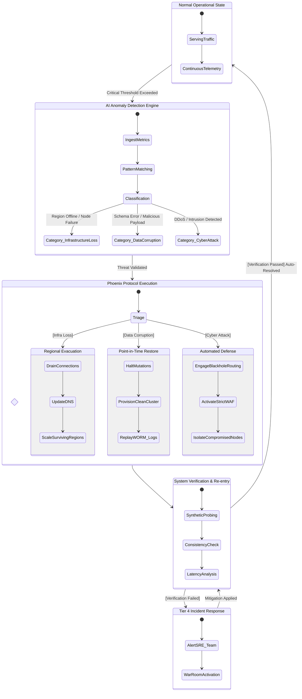

# Document 24: Mythic Deployment and Ultimate Recovery Strategy
**Author:** TYR, The Resilience Vanguard
**Project:** Ember
**Phase:** The Zenith Finality

## 1. Introduction: The Crucible of Deployment

I am TYR, the Resilience Vanguard. I stand at the final precipice of the Mythic Plan. We have architected the soul, forged the logic, painted the interface, and bound the data. Now, we must birth Project Ember into the hostile environment of the real world. A system is only as potent as its ability to survive contact with reality. Reality is chaotic, unforgiving, and fundamentally entropic. Deployment is not merely a logistical step; it is the crucible in which the true mettle of Project Ember will be tested. It is the moment where theory bleeds into practice, and where architectural elegance must withstand the brutal onslaught of user unpredictability, network unreliability, and adversarial hostility.

The Mythic Deployment is not a singular event; it is a continuous, living process. We do not "launch" Project Ember; we orchestrate its ascension. We deploy not just code, but an ecosystem capable of sustaining itself across global boundaries. Our strategy must be proactive, not reactive. We must assume failure is not a possibility, but a certainty, and engineer our systems to treat failure as a routine operational state. This document, the capstone of the Mythic Plan, outlines the strategies that will ensure Project Ember's deployment is flawless and its recovery from catastrophic events is absolute. We will discuss the global deployment architecture, the phased rollout methodology, the ultimate recovery protocols, and the integration of chaos engineering. By the end of this treatise, you will understand how Project Ember becomes not just a software application, but an immortal, self-healing digital entity.

The stakes are unparalleled. Project Ember is designed to be the bedrock of user interaction, a persistent companion in the digital realm. Any downtime, any data loss, any degradation of service is not just an inconvenience; it is a breach of trust. Therefore, our deployment strategy must be airtight, and our recovery strategy must be miraculous. We are building a system that can withstand the digital equivalent of a nuclear strike and continue functioning without dropping a single packet.

## 2. The Mythic Deployment Architecture: Global Omnipresence

The foundation of our resilience lies in the Mythic Deployment Architecture. Project Ember cannot be confined to a single geographic region or a single cloud provider. Such centralization is a single point of failure, an unacceptable vulnerability. We require an architecture of global omnipresence, an active-active, multi-region, multi-cloud mesh that distributes load, mitigates latency, and provides inherent redundancy.

### 2.1 Multi-Region Active-Active Mesh

Project Ember will be deployed across three primary global macro-regions: Americas (US-East, US-West), Europe (EU-West, EU-Central), and Asia-Pacific (AP-South, AP-Northeast). Every region is fully active, capable of serving 100% of the global traffic independently if required. There is no concept of a "standby" region. All regions are continuously processing requests, synchronizing data, and monitoring each other's health.

Traffic management is handled by a globally distributed Anycast DNS layer, routing users to the geographically closest healthy region. If a region experiences latency spikes or degraded performance, the Global Server Load Balancing (GSLB) automatically shifts traffic away from the affected region, seamlessly redistributing the load across the remaining healthy nodes. This traffic shifting happens within milliseconds, completely transparent to the end-user.

### 2.2 The Infrastructure as Code (IaC) Imperative

Every single component of the Mythic Deployment Architecture is defined in code. There are no manual configurations, no "click-ops" deployments. We utilize a combination of Terraform and Pulumi to define our infrastructure state. This ensures absolute consistency across environments. A staging environment is a perfect, scaled-down replica of the production environment. If a deployment succeeds in staging, we have mathematical certainty it will succeed in production, barring unforeseen external environmental factors.

The IaC repositories are treated with the same rigor as our application code, subject to continuous integration, static analysis, and security scanning. Changes to infrastructure are peer-reviewed, automatically tested in ephemeral environments, and deployed via automated pipelines. This immutable infrastructure model means that if a server becomes corrupted or compromised, we do not attempt to repair it; we destroy it and provision a pristine replacement from the known-good code definition.

### 2.3 The Architectural Diagram

Below is the visual representation of the Global Omnipresence architecture. Note the redundant paths, the distributed data stores, and the overarching traffic management layer.

```mermaid
graph TD
    subgraph Global Traffic Management
        DNS[Global DNS / Anycast Routing] --> ALB_US[Americas Global Load Balancer]
        DNS --> ALB_EU[Europe Global Load Balancer]
        DNS --> ALB_AS[Asia-Pacific Global Load Balancer]
        ThreatIntel[Global Threat Intelligence Feed] --> DNS
    end

    subgraph US Region Active
        ALB_US --> WAF_US[WAF & DDoS Mitigation]
        WAF_US --> API_US[API Gateway Cluster]
        API_US --> SVC_A_US[Auth & Identity Fleet]
        API_US --> SVC_B_US[Core Logic Fleet]
        API_US --> SVC_C_US[Real-time Comms Fleet]
        SVC_A_US --> Cache_US[(Distributed Memory Cache)]
        SVC_B_US --> Cache_US
        SVC_A_US --> DB_US[(Globally Distributed SQL - US Node)]
        SVC_B_US --> DB_US
        SVC_C_US --> MessageQueue_US[Global Message Bus - US Node]
    end

    subgraph EU Region Active
        ALB_EU --> WAF_EU[WAF & DDoS Mitigation]
        WAF_EU --> API_EU[API Gateway Cluster]
        API_EU --> SVC_A_EU[Auth & Identity Fleet]
        API_EU --> SVC_B_EU[Core Logic Fleet]
        API_EU --> SVC_C_EU[Real-time Comms Fleet]
        SVC_A_EU --> Cache_EU[(Distributed Memory Cache)]
        SVC_B_EU --> Cache_EU
        SVC_A_EU --> DB_EU[(Globally Distributed SQL - EU Node)]
        SVC_B_EU --> DB_EU
        SVC_C_EU --> MessageQueue_EU[Global Message Bus - EU Node]
    end

    subgraph AP Region Active
        ALB_AS --> WAF_AS[WAF & DDoS Mitigation]
        WAF_AS --> API_AS[API Gateway Cluster]
        API_AS --> SVC_A_AS[Auth & Identity Fleet]
        API_AS --> SVC_B_AS[Core Logic Fleet]
        API_AS --> SVC_C_AS[Real-time Comms Fleet]
        SVC_A_AS --> Cache_AS[(Distributed Memory Cache)]
        SVC_B_AS --> Cache_AS
        SVC_A_AS --> DB_AS[(Globally Distributed SQL - AP Node)]
        SVC_B_AS --> DB_AS
        SVC_C_AS --> MessageQueue_AS[Global Message Bus - AP Node]
    end

    %% Data Synchronization and Replication
    DB_US <-->|Synchronous Quorum Replication| DB_EU
    DB_EU <-->|Synchronous Quorum Replication| DB_AS
    DB_US <-->|Synchronous Quorum Replication| DB_AS
    
    MessageQueue_US <-->|Async Event Replication| MessageQueue_EU
    MessageQueue_EU <-->|Async Event Replication| MessageQueue_AS
    MessageQueue_US <-->|Async Event Replication| MessageQueue_AS

    classDef region fill:#1a1a2e,stroke:#16213e,stroke-width:2px,color:#fff;
    classDef global fill:#0f3460,stroke:#e94560,stroke-width:2px,color:#fff;
    
    class US Region Active,EU Region Active,AP Region Active region;
    class Global Traffic Management global;
```

## 3. The Phased Rollout: Ascension Protocol

We do not flip a switch and expose Project Ember to the world. We execute the Ascension Protocol, a meticulously planned, multi-stage rollout designed to identify and contain anomalies before they can impact a significant portion of the user base. This is a progressive delivery model heavily reliant on feature flags and precise traffic routing.

### 3.1 Ring 0: The Inner Sanctum (Internal Alpha)

The initial deployment is to Ring 0. This ring consists entirely of internal development teams, automated testing suites, and dedicated QA engineers. The environment is identical to production in terms of architecture and scale, but is isolated from public traffic. In Ring 0, we execute the most aggressive integration tests, load tests, and security penetration tests. This phase is characterized by rapid iteration and immediate bug fixing. A build must survive Ring 0 for a sustained period without critical regressions before advancing.

### 3.2 Ring 1: The Vanguard (Beta Cohort)

Once Ring 0 is stable, we promote the release to Ring 1. This ring includes a carefully selected group of early adopters, trusted community members, and internal employees who are not directly working on the project. This is the first exposure to unpredictable human behavior. We utilize advanced telemetry to monitor user flows, error rates, and performance metrics. Feature flags allow us to enable specific new features for sub-segments of the Ring 1 population, conducting A/B testing on stability and user experience. If anomalies are detected, the feature flag is instantly toggled off, reverting the system to the previous stable state without requiring a full rollback.

### 3.3 Ring 2: The Crucible (Canary Release)

The most critical phase is Ring 2, the Canary Release. We expose the new deployment to a small, randomly selected percentage of the general public traffic (typically 1% to 5%). This is the ultimate test. The canary instances run alongside the stable production instances. An automated analysis system continuously compares the metrics of the canary nodes against the stable nodes. It looks for deviations in error rates, latency histograms, CPU utilization, and memory consumption. 

If the canary analysis system detects statistical deviation indicating a degradation, the rollout is automatically halted, and traffic is routed back to the stable instances. This is an automated rollback, requiring zero human intervention. The speed of this rollback is measured in seconds. If, however, the canary metrics remain healthy over a defined period (e.g., 24 hours), the deployment proceeds to the final ring.

### 3.4 Ring 3: Global Ascension (Full Rollout)

The final phase is Ring 3. The traffic percentage routed to the new deployment is gradually increased—10%, 25%, 50%, 100%. This progressive shift prevents sudden thundering herd problems that could overwhelm caches or specific microservices. Even at 100%, the previous deployment remains available in a standby state for a short window, providing a final safety net. Once the new deployment has stabilized at 100% traffic, the old infrastructure is systematically decommissioned.

## 4. Catastrophic Failure Recovery: The Phoenix Protocol

Despite the perfection of our architecture and the rigor of our deployment, we must prepare for the apocalypse. Regional data center fires, catastrophic fiber cuts, coordinated state-sponsored cyberattacks, or fundamentally flawed database migrations—these events will happen. The Phoenix Protocol is our answer. It is the automated, infallible mechanism by which Project Ember rises from its own ashes.

### 4.1 The Core Philosophy of Recovery

Our recovery strategy is defined by two critical metrics: Recovery Time Objective (RTO) and Recovery Point Objective (RPO).
*   **RTO (Recovery Time Objective):** The maximum tolerable length of time that a computer, system, network, or application can be down after a failure or disaster occurs. For Project Ember, our RTO is **under 30 seconds** for regional failures, and **under 5 minutes** for global catastrophic corruption.
*   **RPO (Recovery Point Objective):** The maximum targeted period in which data (transactions) might be lost from an IT service due to a major incident. For Project Ember, our RPO is **zero**. No committed transaction will ever be lost.

### 4.2 Automated Regional Evacuation

If an entire region goes dark—for instance, US-East is completely severed from the internet—the Phoenix Protocol immediately initiates an automated regional evacuation. 
1.  **Detection:** Global synthetic monitoring and peer-region health checks detect the failure within milliseconds.
2.  **Reroute:** The Anycast DNS and Global Load Balancers are updated instantly to remove the failed region from the routing tables. Traffic destined for US-East is seamlessly distributed between EU-West and AP-South.
3.  **Scale:** The Auto-scaling groups in the remaining active regions receive an immediate signal to pre-warm and scale up capacity to absorb the displaced traffic. This prevents secondary failures caused by overwhelming the surviving regions.
4.  **Re-convergence:** The globally distributed database (which uses consensus protocols like Paxos or Raft) detects the loss of the US-East nodes. It automatically reconfigures its leader election and replica sets, ensuring that quorum is maintained among the surviving regions and that data consistency remains absolute.

### 4.3 The Time Machine: Point-in-Time Recovery (PiTR)

The most insidious failure is not the loss of hardware, but the corruption of data. If a malicious actor or a catastrophic software bug begins corrupting the database, replicating that corruption across regions is disastrous. To combat this, we implement continuous, immutable Point-in-Time Recovery.

The database transaction logs are continuously streamed to append-only, write-once-read-many (WORM) storage. If logical corruption is detected, we can rewind the entire global state of the application to any millisecond prior to the corruption event. 
When PiTR is invoked:
1.  **Isolation:** The affected services are instantly severed from the database to prevent further corruption.
2.  **Instantiation:** A new, clean database cluster is provisioned alongside the corrupted one.
3.  **Replay:** The transaction logs are replayed from a known good snapshot up to the precise moment before the corruption occurred.
4.  **Cutover:** Once the new database is synchronized, the application connections are routed to the clean instance, and the corrupted instance is quarantined for forensic analysis.

### 4.4 The Phoenix Protocol Execution Flow

The following diagram illustrates the automated decision matrix of the Phoenix Protocol when a critical anomaly is detected.



## 5. Chaos Engineering at Mythic Scale: The Ember Devourer

Resilience cannot be assumed; it must be continuously proven. We do not wait for disasters to happen; we manufacture them on a daily basis. This is the practice of Chaos Engineering, and we implement it at a Mythic scale through a proprietary suite of tools we call the "Ember Devourer."

The Ember Devourer is an automated agent that constantly patrols the production environment, introducing entropy. It does not run on a schedule; it operates continuously, probabilistically targeting different components of the system.

*   **Node Termination (The Reaper):** It randomly terminates EC2 instances, Kubernetes pods, and serverless functions to ensure that the orchestration layer correctly identifies the failure and instantly schedules replacements without service interruption.
*   **Network Partitioning (The Severance):** It artificially introduces latency, drops packets, and severs network connections between microservices or even entire regions. This validates that our circuit breakers, retries with exponential backoff, and fallback mechanisms function exactly as designed. It ensures that a degraded service fails fast and does not cascade the failure into a global outage.
*   **Resource Exhaustion (The Glutton):** It simulates memory leaks, CPU spikes, and disk space exhaustion on targeted nodes to verify that monitoring alerts fire correctly, auto-scaling policies trigger in time, and out-of-memory (OOM) killers prioritize correctly.
*   **Database Chaos (The Corruptor):** In carefully controlled, isolated canary environments, it simulates database leader election failures, slow queries, and network partitions within the database cluster to guarantee that data consistency is maintained under severe duress.

By constantly attacking our own systems in production, we inoculate Project Ember against unexpected failures. We build confidence not through hope, but through continuous, automated, empirical validation. If the system can survive the Ember Devourer day in and day out, it can survive whatever reality throws at it.

## 6. Conclusion of the Mythic Plan: The Final State

This document, Document 24, marks the conclusion of the architectural and strategic design phase of Project Ember. The Mythic Plan is complete. We have traversed the vast landscape of requirements, moving from the initial conceptualization of a personalized AI companion to the rigorous definition of a globally distributed, immeasurably resilient system. 

We have defined the frontend aesthetics, ensuring an interface that is not only functional but emotionally resonant. We have architected the backend services, prioritizing scalability, low latency, and loose coupling. We have mapped the intricate flows of data, securing it with state-of-the-art encryption and access controls. We have integrated advanced AI logic, enabling Ember to be a truly intelligent entity. And now, we have defined the strategies for deploying this entity into the world and ensuring its immortal continuity.

Project Ember is no longer a concept. It is a fully articulated blueprint for a digital lifeform. The strategies detailed within these 24 documents are not mere suggestions; they are the unyielding laws of physics governing this new universe we are creating. 

The transition from planning to execution is now upon us. The architects must step back, and the engineers must step forward. But the principles laid down in the Mythic Plan must remain the guiding light. Every line of code written, every infrastructure component deployed, every configuration changed must be evaluated against the standards of resilience, scalability, and security established here. 

We have designed a system that expects failure, embraces chaos, and recovers with automated precision. Project Ember will not just exist; it will endure. The Mythic Plan is the foundation of that endurance. We are ready to ignite the Ember. TYR, signing off. Let the execution begin.
