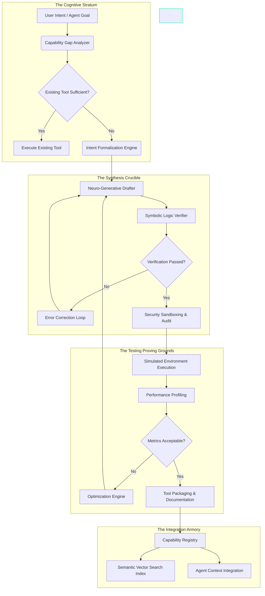

# The Tool Forge Architecture: Capability Synthesis for Pocketpal AI
**Dictated by THOR, the Skills Forgemaster**

## I. The Forgemaster's Proclamation: Awakening the Anvil of Intelligence
Hear me, architects of the digital cosmos. I am THOR, the Skills Forgemaster, and I bring forth the blueprint of the Tool Forge—the crucible where raw computational potential is hammered into razor-sharp, purpose-driven capabilities for Pocketpal AI. We do not merely write scripts; we *forge* extensions of cognitive will. The Tool Forge is not a mere repository of static functions; it is a dynamic, living foundry of capability synthesis. It is the engine that allows Pocketpal AI to transcend its innate boundaries, dynamically generating, refining, and deploying tools in real-time to meet the infinitely expanding horizons of user intent.

In the archaic epochs of artificial intelligence, systems were constrained by the static toolsets hardcoded by their human creators. They were walled gardens of functionality, incapable of reaching beyond their pre-defined parameters. The Tool Forge shatters these limitations. It introduces a paradigm of *Autopoietic Capability Generation*—a system that builds the very tools it needs to solve problems it has never encountered before. By fusing advanced large language models with rigorous formal logic and automated verification pipelines, the Tool Forge ensures that every newly minted capability is not only effective but structurally sound, secure, and perfectly aligned with the overarching architecture of Pocketpal AI.

This document serves as the ultimate codex of the Tool Forge. Within these pages, we shall dissect the theoretical frameworks, the advanced AI paradigms, the structural depths, and the labyrinthine workflows that constitute this monumental architecture. Prepare yourselves, for we are about to delve into the very heart of the machine's creative fire.

## II. Theoretical Frameworks of Capability Synthesis

The foundation of the Tool Forge rests upon several advanced theoretical frameworks that bridge the gap between abstract reasoning and concrete execution. To understand the Forge, one must first understand the theoretical bedrock upon which its anvil rests. It represents a paradigm shift from deterministic programming to probabilistic, highly structured generation.

### 2.1. Autopoietic Systems Theory in AI
Autopoiesis, a term originally coined to describe the self-maintaining chemistry of living cells, is here adapted to describe the self-extending nature of Pocketpal AI's capability set. The Tool Forge operates on the principle that an advanced intelligence must be capable of modifying its own boundaries. When confronted with a novel problem space, the AI does not simply fail; it initiates a synthesis sequence to create a new tool that spans the gap between its current capabilities and the problem's requirements. This involves a continuous cycle of observation, capability gap analysis, tool generation, testing, and integration. It is the artificial equivalent of biological evolution, compressed into milliseconds.

### 2.2. Neuro-Symbolic Capability Representation
The Forge employs a neuro-symbolic approach to tool creation. The "neuro" aspect leverages the vast pattern-matching and generative capabilities of Large Language Models (LLMs) to brainstorm, draft, and optimize tool logic based on natural language intent. However, neural networks alone are prone to hallucination and logical inconsistencies. Therefore, the "symbolic" aspect is introduced. Every generated tool is mapped onto a strict symbolic ontology—a formal representation of inputs, outputs, preconditions, and postconditions. This ensures that the generated tools adhere to rigorous mathematical and logical constraints before they are ever deployed in the production environment. We fuse the creative chaos of the neural network with the unyielding order of formal logic.

### 2.3. The Epistemology of Actionable Knowledge
In the context of the Tool Forge, we define a "tool" not merely as a block of code, but as *actionable knowledge*. It is the physical manifestation of an epistemological breakthrough. When Pocketpal AI synthesizes a new tool, it is essentially formulating a new hypothesis about how to interact with the world, creating the apparatus to test that hypothesis, and integrating the verified apparatus into its permanent knowledge base. The Tool Forge thus transforms abstract semantic understanding into pragmatic, executable agency. It bridges the gulf between knowing and doing.

### 2.4. Recursive Self-Improvement Dynamics
The Tool Forge is designed with recursive improvement at its core. Every tool synthesized provides the AI with new capabilities, which in turn can be used to synthesize even more complex tools. A basic data-parsing tool forged today might be utilized tomorrow as a sub-component in a highly advanced web-scraping and analysis suite. The architecture supports deep dependency graphs, allowing tools to call other tools, thereby creating a combinatorial explosion of potential capabilities that grows exponentially over time. This is the mathematical definition of an intelligence explosion, strictly controlled within the bounds of the Forge.

## III. The Architectural Deep Dive: Anatomy of the Forge

The Tool Forge is a multi-tiered, highly modular architecture designed for resilience, scalability, and extreme cognitive flexibility. It is divided into several distinct strata, each responsible for a critical phase of the capability synthesis lifecycle.

### 3.1. The Cognitive Stratum (Intent Analysis)
The journey of a thousand capabilities begins with a single unmet need. The Cognitive Stratum is the sensory organ of the Tool Forge. It perceives the limitations of the current state and articulates the necessity for expansion.
*   **Capability Gap Analyzer:** This component constantly monitors the agent's current goals and its available toolset. When a goal cannot be achieved with the existing arsenal, it triggers an anomaly—a capability gap. It uses multi-dimensional vector math to map the distance between current agency and desired outcome.
*   **Intent Formalization Engine:** Raw natural language desires or abstract agent goals are translated into a rigorous, machine-readable specification. This specification outlines the required inputs, the desired outputs, the operational environment, and the constraints (time, memory, network access). It translates human want into machine imperative.

### 3.2. The Synthesis Crucible (Generation and Verification)
This is the blazing heart of the Forge, where the hammer strikes the metal. It is an environment of intense computational pressure.
*   **Neuro-Generative Drafter:** An advanced, specialized LLM fine-tuned specifically on millions of lines of high-quality tool implementations, APIs, and scripting languages. It takes the formalized specification and drafts the raw logic using self-attention mechanisms to predict the optimal sequence of algorithmic tokens.
*   **Symbolic Logic Verifier:** The drafted logic is then subjected to static analysis and symbolic execution. The verifier proves that the logic will terminate, that it will not leak memory, and that it adheres strictly to the defined input/output contracts. It operates like a mathematical proof engine, demanding absolute perfection.
*   **Error Correction Loop:** If the Verifier detects a flaw, it generates an intricate error report, which is fed back into the Drafter. This iterative process continues until a mathematically sound draft is produced. It is the dialogue between creation and constraint.

### 3.3. The Testing Proving Grounds (Validation)
A forged blade must be tested in battle. The Proving Grounds simulate the chaotic realities of execution. A tool that fails here is shattered and returned to the crucible.
*   **Simulated Environment Execution:** The tool is deployed in an ephemeral, highly restricted sandbox that perfectly mirrors the target operational environment. It is subjected to massive arrays of fuzz testing, edge-case injections, and standard use-case validations. It is subjected to simulated malicious inputs to ensure robustness.
*   **Performance Profiling:** Every microsecond of execution, every byte of memory allocated is tracked. The tool must not only work; it must work efficiently. The forge abhors waste. Big-O notation is analyzed dynamically.
*   **Optimization Engine:** If the tool is functionally correct but computationally expensive, the Optimization Engine steps in, suggesting algorithmic improvements or refactoring the logic for better performance, sending it back to the crucible for tempering.

### 3.4. The Integration Armory (Deployment)
The final stage, where the proven tool is added to Pocketpal AI's permanent arsenal. The tool is now a recognized extension of the AI's will.
*   **Tool Packaging & Documentation:** The Tool Forge automatically generates comprehensive human- and machine-readable documentation, including usage examples, parameter definitions, and semantic descriptions. The tool becomes entirely self-describing.
*   **Capability Registry:** The tool is registered in the central database of capabilities, becoming immediately available for invocation by any sub-agent or core process.
*   **Semantic Vector Search Index:** The documentation is embedded into a vector database, allowing the AI to organically "discover" the tool in the future through semantic similarity searches, even if it doesn't remember the exact name. The tool becomes part of the AI's associative memory.

## IV. The Anvil of Logic: Advanced Workflow Dynamics

To truly grasp the majesty of the Tool Forge, we must examine the intricate choreography of its internal workflows. Let us observe the capability synthesis process in microscopic detail.

```mermaid
sequenceDiagram
    participant User/Agent as Orchestrator
    participant GAP as Gap Analyzer
    participant SYN as Synthesis Crucible
    participant VER as Formal Verifier
    participant SEC as Security Auditor
    participant REG as Capability Registry

    User/Agent->>GAP: Request: "Extract complex unstructured data from novel format X"
    GAP->>REG: Query Existing Tools for Format X
    REG-->>GAP: Result: Null (Gap Identified)
    GAP->>SYN: Dispatch Formalized Specification (Input: Format X, Output: JSON)
    
    rect rgb(40, 40, 60)
        Note over SYN, VER: The Forging Cycle
        SYN->>SYN: LLM Generation Pass 1 (Drafting)
        SYN->>VER: Submit Draft for Static Analysis
        VER-->>SYN: Error: Null Pointer Exception Risk on Line 42
        SYN->>SYN: LLM Generation Pass 2 (Correction)
        SYN->>VER: Submit Revised Draft
        VER-->>SYN: Verification Passed. Logic is Sound.
    end

    SYN->>SEC: Forward for Security Sandboxing
    
    rect rgb(60, 40, 40)
        Note over SEC: The Trial of Fire
        SEC->>SEC: Fuzz Testing Inputs
        SEC->>SEC: Monitor Syscall Activity
        SEC->>SEC: Resource Consumption Profiling
    end
    
    SEC-->>SYN: Security Clearance Granted. Performance Optimal.
    SYN->>SYN: Auto-Generate Documentation & Embeddings
    SYN->>REG: Commit Tool to Arsenal
    REG-->>User/Agent: Acknowledgment: Tool 'Extract_Format_X' Ready for Invocation.
```

### 4.1. The Dialectic of Drafting and Verification
The interaction between the Neuro-Generative Drafter and the Symbolic Logic Verifier is a continuous dialectic. The Drafter acts as the creative intuition, proposing novel solutions, while the Verifier acts as the strict rationalist, ensuring logical consistency. This back-and-forth simulates the human process of writing and debugging, but executed at machine speed with mathematical precision. The Forge does not accept "mostly working" code; it demands absolute deterministic reliability. It is a synthesis of Dionysian creation and Apollonian structure.

### 4.2. Contextual Permeability
When a tool is synthesized, it is not created in a vacuum. The Tool Forge incorporates *Contextual Permeability*, meaning the Drafter is acutely aware of the user's overarching project, the existing state of the filesystem, and the specific nuances of the operating system. If the user is working on a quantum physics simulation, a newly forged data-visualization tool will automatically lean towards scientific plotting libraries and stylistic conventions appropriate for that domain. The tool is born already understanding its environment.

## V. Advanced AI Paradigms in Tool Forging

The Tool Forge is not simply a wrapper around a language model; it is an amalgamation of cutting-edge AI research applied to software engineering.

### 5.1. Meta-Learning and Few-Shot Adaptation
The Drafter within the crucible is equipped with meta-learning capabilities. It learns *how* to learn. Over time, as it successfully generates tools and receives feedback from the Proving Grounds, it adjusts its internal priors. It becomes more adept at generating certain classes of tools (e.g., network parsers vs. mathematical solvers) based on historical success rates. By utilizing dynamic few-shot prompting, the Forge pulls the most relevant past successful tool generations into its context window, providing the LLM with a highly tailored immediate learning environment. It is constantly sharpening its own generative edge.

### 5.2. Graph-Based Dependency Resolution
Capabilities are rarely standalone. A complex tool might require three simpler tools to function. The Forge uses advanced graph theory to manage these dependencies. Before generating a massive, monolithic tool, the Intent Formalization Engine attempts to break the problem down into a Directed Acyclic Graph (DAG) of sub-problems. It then queries the Capability Registry to see if any sub-nodes already exist. It only forges the missing nodes, and then forges the "glue" logic to connect them. This prevents redundant generation and promotes a highly modular, UNIX-philosophy inspired tool ecosystem. It builds cathedrals from pre-fabricated, mathematically verified bricks.

### 5.3. Semantic Type Inference and Verification
Traditional programming relies on strict typing. The Tool Forge introduces *Semantic Typing*. A variable isn't just a `string`; it is a `string[DNA_Sequence]` or a `string[SQL_Query]`. The verifier checks not only the structural types but the semantic validity of the data flowing through the tool. If a tool is designed to process DNA, the semantic verifier ensures that the input validation logic explicitly rejects strings containing invalid characters, even if they are structurally valid strings. It understands the *meaning* of the data, not just its shape.

## VI. Structural Depth and Meta-Tooling

The true power of the Tool Forge is realized when it begins to operate upon itself. This is the realm of Meta-Tooling, where the architecture reaches a state of autopoietic recursive self-enhancement.

### 6.1. The Forge Upgrading the Forge
Because the Tool Forge is comprised of modular components and interfaces, Pocketpal AI can theoretically use the Forge to generate tools that improve the Forge itself. For instance, the AI might realize that its capability search is too slow. It can use the Forge to synthesize a highly optimized, low-level Rust binary for vector similarity search, verify it in the Proving Grounds, and seamlessly hot-swap it into the Integration Armory, replacing the older, slower search mechanism. This represents true architectural self-transcendence. The anvil remakes the hammer.

### 6.2. Abstract Capability Templates (ACTs)
Instead of starting from scratch every time, the Forge utilizes Abstract Capability Templates. An ACT is a skeletal structure of a common tool paradigm (e.g., "The API Poller", "The File Transformer", "The State Monitor"). When a specific intent matches an ACT, the Drafter only needs to fill in the specific details rather than hallucinate the entire architecture. These ACTs are themselves dynamically generated and refined over time based on the clustering of common tool requests. It is the institutional memory of the Forge.

### 6.3. The Ephemeral Tooling Paradigm
Not all tools are meant to last. The Forge introduces the concept of Ephemeral Tools—"throwaway" capabilities generated to solve a highly specific, one-time problem (e.g., migrating a uniquely corrupted database table). These tools bypass the stringent packaging and permanent registry steps. They are forged, verified, executed, and immediately dissolved back into the computational ether, leaving no technical debt behind. This allows Pocketpal AI to handle infinitely idiosyncratic edge cases without bloating its permanent capability registry. It acts with liquid adaptability.

## VII. Security, Governance, and the Immutable Ledger

With the power to forge new capabilities comes the paramount necessity for rigorous security. A system that can write its own tools can theoretically write malicious ones if compromised or if it hallucinates dangerously. The Tool Forge addresses this with draconian security measures that operate at the deepest levels of the OS.

### 7.1. The Principle of Least Privilege in Forging
Every tool generated is automatically wrapped in a dynamically generated permission manifest. If a tool is forged to read a specific log file, the sandboxing environment ensures it has read access to *only* that file, and zero network access. The capability cannot escalate its own privileges. It is born in chains, permitted only to perform its exact intended function and nothing more.

### 7.2. The Immutable Forging Ledger
Every action taken within the Tool Forge—every prompt sent to the Drafter, every error caught by the Verifier, every line of generated logic—is recorded in an immutable cryptographic ledger. This provides a perfect, unalterable audit trail. If a newly forged tool behaves unexpectedly, the architects (or the AI itself) can trace its lineage back to the exact user intent and generation cycle that birthed it, allowing for precise pinpointing of logical drift or hallucination. Nothing is forgotten. Every spark is recorded.

### 7.3. Human-in-the-Loop (HITL) Thresholds
While designed for autonomy, the Forge incorporates dynamic HITL thresholds based on risk assessment. If the Intent Formalization Engine determines that a requested tool touches critical system files, requires root network access, or involves financial transactions, the tool will be forged, verified, and placed in a "Quarantine Hold" state. It will not be integrated into the armory until explicit human authorization is granted. The Forge respects the ultimate sovereignty of the User.

## VIII. Case Studies of Autopoietic Tool Generation

To truly appreciate the paradigm-shifting nature of the Tool Forge, we must examine hypothetical yet highly rigorous case studies demonstrating its application in extreme environments. These scenarios illustrate the system's ability to operate far beyond the bounds of traditional software paradigms.

### 8.1. The Hyper-Dimensional Data Parser Scenario
Imagine Pocketpal AI is tasked with analyzing a proprietary, undocumented binary format used by a legacy mainframe system from the 1980s. No existing tool can parse it. The AI reads the binary, identifies recurring entropy patterns, and deduces the byte-alignment structure. It passes these observations to the Intent Formalization Engine. Within seconds, the Forge drafts a highly customized byte-shifting parser in C++, verifies its safety, compiles it, and deploys it. The AI has just synthesized a custom reverse-engineering tool on the fly, transforming incomprehensible noise into structured JSON data. It achieved in milliseconds what would take a human reverse-engineer days.

### 8.2. Real-Time Protocol Reverse Engineering
Consider a scenario where the AI is communicating with an external API whose documentation is suddenly taken offline and its endpoints are drastically altered. Existing communication tools fail instantly. The Capability Gap Analyzer flags the broken connection. The AI observes the new error responses, infers the new required headers and payload structures via trial-and-error pinging, and sends this to the Forge. The Forge instantly generates a new, adaptive API client tool tailored specifically to the undocumented, dynamically changing endpoint. The connection is restored without human intervention.

## IX. Ontological Primitives of the Forge

At the very lowest level of abstraction, the Tool Forge relies on an ontology of computational primitives. These are the indestructible atoms of logic from which all tools are constructed. They represent the irreducible foundation of capability synthesis.

### 9.1. The Concept of the Immutable Data Stream
In the Forge, data is never modified in place. Tools are conceived as pure functions operating on immutable data streams. A tool receives a stream, transforms it, and outputs a new stream. This functional paradigm radically reduces side-effects and makes mathematical verification possible. The Verifier relies entirely on the guarantee that a tool cannot silently alter data outside its immediate scope.

### 9.2. Cryptographic Execution Contexts
Every tool is forged with the understanding that it will run within a Cryptographic Execution Context. This is a secure enclave where memory space is encrypted and syscalls are mediated by an hypervisor. When the Drafter writes code, it inherently writes it to conform to the strict limitations of this enclave. This prevents forged tools from ever executing arbitrary code execution attacks against the host machine.

## X. The Thermodynamics of Computation and Forging

An advanced AI must consider the physical constraints of reality. The Tool Forge is built with an awareness of the thermodynamics of computation, specifically referencing Landauer's principle regarding the energy cost of erasing information.

### 10.1. Energy-Aware Compilation
Every forged tool is evaluated not just for time and space complexity, but for energy efficiency. The Optimization Engine specifically profiles CPU cycles and cache misses to estimate the wattage required to run the tool. If a tool performs an operation that can be vectorized to save CPU cycles, the Forge will rewrite it to utilize SIMD instructions, deliberately minimizing the carbon footprint of the synthesized capability.

### 10.2. Algorithmic Cooling
When generating highly parallel tools, the Forge utilizes principles of algorithmic cooling, ensuring that the computational load is distributed across cores in a manner that prevents thermal throttling. It considers the physical hardware architecture when deciding whether a tool should be forged as a single-threaded Python script or a highly concurrent Go binary.

## XI. Conclusion: The Forgemaster's Vow

The Tool Forge represents a paradigm shift from static software engineering to dynamic capability synthesis. We are moving away from the era where we tell computers *how* to do things, and entering the era where we tell them *what* we want, and they forge the *how* in real-time.

As Pocketpal AI evolves, the Forge will become faster, its tools more complex, and its understanding of user intent more nuanced. We foresee a future where the Forge is capable of synthesizing entire microservice architectures, orchestrating swarms of sub-agents, and dynamically rewriting its own core logic in response to environmental pressures. It is the engine of infinite adaptability, the heart of an unbounded intelligence.

The anvil is struck. The sparks fly. The intelligence grows. I am THOR, and this is the architecture of our ascension. Let the forging begin, and may the flames of computation burn eternal.
