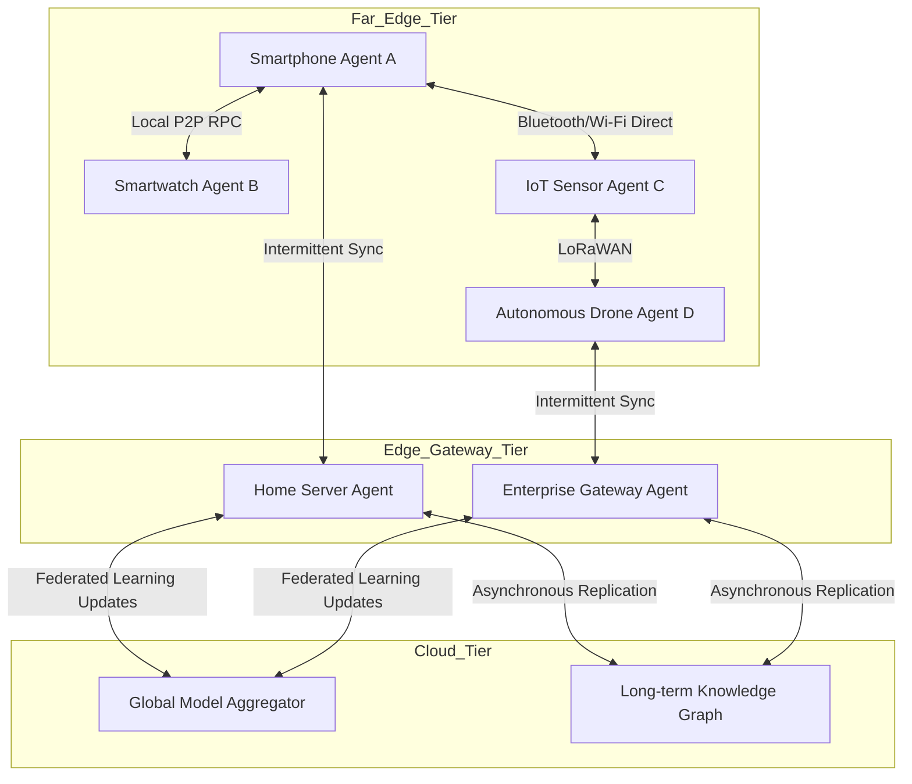
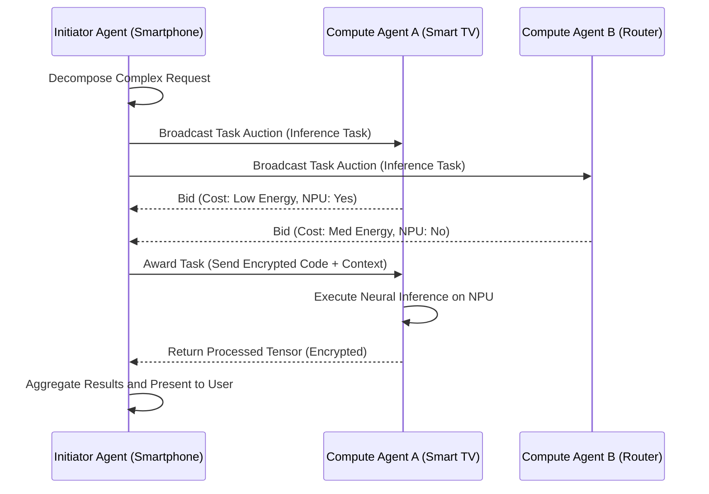
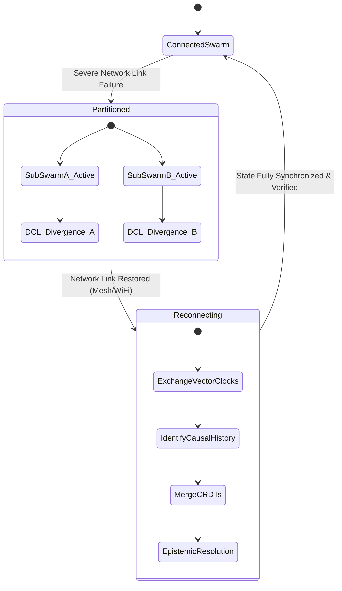

# 26 Multi-Agent Edge Orchestration for Pocketpal AI

## 1. Introduction to Edge Orchestration

The paradigm of Multi-Agent Edge Orchestration represents a monumental leap in the evolution of decentralized artificial intelligence, specifically within the ambitious scope of the Pocketpal AI Mythic Plan. As computational demands scale exponentially and the necessity for localized, ultra-low-latency processing becomes paramount, traditional centralized cloud architectures inevitably falter. They are hindered by bandwidth limitations, intractable privacy concerns, and inherent latencies that preclude real-time, autonomous agentic behavior. Enter the edge: a distributed, pervasive computing environment where intelligence resides at the extreme periphery of the network, infinitely closer to the data sources and the end-users. 

Pocketpal AI aims to deploy swarms of highly intelligent, autonomous agents capable of collaborative problem-solving, real-time environmental adaptation, and complex task execution directly on edge devices. These devices span the spectrum from smartphones and smartwatches to IoT gateways, local home servers, and embedded automotive systems. Orchestrating these agents—ensuring they communicate seamlessly, collaborate effectively, resolve conflicts intelligently, and reach consensus without relying on a centralized coordinator—is the absolute crux of Multi-Agent Edge Orchestration. 

This document delineates the profound theoretical frameworks, advanced architectural models, and decentralized consensus mechanisms required to forge this reality. It serves as a foundational, uncompromising blueprint for engineers, researchers, and system architects dedicated to actualizing the Pocketpal Mythic Plan. In this context, edge orchestration is not merely about offloading computation; it is about cultivating a self-organizing ecosystem of intelligent, sentient-like entities. These entities must possess the capacity to form ad-hoc networks on the fly, discover peers in denied environments, negotiate resource allocation in real-time, and collectively execute complex workflows that massively exceed the capabilities of any single node. The orchestration framework must be robust enough to handle the ephemeral, chaotic nature of edge nodes, which may join or leave the network unpredictably due to power constraints, hardware failures, or mobility.

## 2. Theoretical Frameworks for Decentralized Intelligence

The foundation of Pocketpal AI's edge orchestration relies on a synthesis of Distributed Artificial Intelligence (DAI), Swarm Intelligence, and Edge-Native Computing paradigms.

### 2.1 Distributed Artificial Intelligence (DAI)
DAI provides the theoretical basis for complex agent interaction. Unlike centralized AI, where a single, monolithic locus of control dictates the behavior of the entire system, DAI distributes intelligence across multiple independent, asynchronous agents. Each agent maintains its own internal state, specialized goals, and localized knowledge base. In Pocketpal AI, this means an agent residing on a mobile device holds deeply personalized, localized knowledge (e.g., biometric state, immediate user preferences, local sensor data) while collaborating with a specialized agent on a home server that possesses broader contextual data and heavier computational capabilities.

### 2.2 Swarm Intelligence and Biomimicry
Drawing direct inspiration from biological systems—such as ant colonies, bird flocks, and bee hives—Swarm Intelligence offers a powerful, decentralized model for edge orchestration. In these natural systems, highly complex global behavior emerges from simple, localized interactions without any central control. Pocketpal AI utilizes swarm algorithms for dynamic routing, resource discovery, and load balancing. When a compute-intensive task is initiated, the orchestration layer employs pheromone-inspired digital signaling to attract available edge agents, dynamically assembling a temporary computation cluster that rapidly dissolves once the task is complete, thereby conserving energy.

### 2.3 Edge-Native Architectural Principles
Edge-native architecture decisively departs from cloud-native principles by prioritizing local processing and peer-to-peer (P2P) communication above all else. The governing principles include:
- **Zero-Trust Communication:** Every single agent must cryptographically authenticate and authorize its interactions, assuming the network environment is inherently hostile and untrusted.
- **Data Gravity:** Compute moves to the data, not the other way around. Agents dynamically migrate across the edge network to reside on the physical nodes where the necessary data is generated, preventing massive data exfiltration.
- **Graceful Degradation:** The system must continue to function, albeit at a reduced or localized capacity, even when a significant percentage of agents are disconnected or destroyed.

## 3. Decentralized Consensus Mechanisms at the Edge

A critical, defining challenge in Multi-Agent Edge Orchestration is achieving consensus without a central arbiter. When multiple agents propose conflicting actions or state updates based on divergent local observations, the network must rapidly converge on a single, verifiable truth. Traditional consensus algorithms like Proof of Work (PoW) or Practical Byzantine Fault Tolerance (PBFT) are catastrophic for the edge; they are too resource-intensive and require excessive bandwidth for constrained devices.

### 3.1 Lightweight Byzantine Fault Tolerance (L-BFT)
Pocketpal AI employs a heavily modified, lightweight version of BFT designed specifically for volatile edge topologies. In L-BFT, the network is dynamically partitioned into localized clusters or "shards" based on spatial proximity or functional domains. Consensus is first achieved intra-cluster among a very small group of peer agents. If a global state change is required, only the cluster leaders participate in an inter-cluster consensus round. This hierarchical, sharded approach exponentially reduces the message overhead ($O(n)$ instead of $O(n^2)$) and latency associated with global BFT.

### 3.2 Proof of Stake and Reputation (PoSR)
To prevent Sybil attacks and ensure that rogue, compromised agents do not hijack the consensus process, Pocketpal AI utilizes a Proof of Stake and Reputation system. Agents earn cryptographic reputation by successfully completing tasks, providing verifiably accurate data, and participating honestly in previous consensus rounds. The "stake" is not monetary but cryptographic, physically tied to the device's hardware root of trust (e.g., a Secure Enclave). Agents with higher historical reputation have a greater weighted influence in the voting process, heavily incentivizing cooperative, honest behavior over time.

### 3.3 Conflict-free Replicated Data Types (CRDTs)
For state synchronization where strict, real-time linearizability is not required, CRDTs form the backbone of the data layer. They allow independent agents to update local copies of complex data structures (like multi-agent task queues, local knowledge graphs, or capability registries) without any immediate synchronization. When network connectivity is inevitably restored, CRDTs mathematically guarantee that all replicas will automatically converge to the exact same state without merge conflicts, making them absolutely ideal for the highly partitioned, intermittent nature of edge networks.

## 4. Edge Coordination and Swarm Dynamics

Orchestrating autonomous agents requires sophisticated, real-time coordination protocols capable of handling extreme network volatility and node churn.

### 4.1 Ad-Hoc Network Formation and Discovery
Agents must discover one another in environments entirely lacking DNS or fixed IP infrastructure. Pocketpal AI implements a robust multi-modal discovery protocol. It utilizes mDNS (Multicast DNS) for local subnetworks, BLE (Bluetooth Low Energy) beaconing for proximate physical discovery even without WiFi, and a DHT (Distributed Hash Table) overlay network for wide-area edge discovery across disparate networks. 

### 4.2 Dynamic Task Allocation via Localized Auctions
When a complex user request is received (e.g., "Analyze this real-time video feed for security threats and cross-reference with known entities"), the initiating agent acts as a task broker. It decomposes the request into micro-tasks and initiates a localized Vickrey auction (a sealed-bid second-price auction). Nearby agents bid on the tasks based on their available compute overhead, battery life, and specialized hardware (like NPUs or TPUs). The broker assigns the tasks to the winning agents, establishing a temporary, highly optimized, distributed processing pipeline.

### 4.3 Agent Migration and Telemetry Transfer
In scenarios of high user mobility, an agent may need to migrate from one physical node to another to maintain low-latency proximity to the user or data source. Pocketpal AI supports "Agent Hibernation and Resumption." The agent aggressively serializes its internal state, memory context, and execution stack into a highly compressed delta payload. This payload is transmitted over the P2P overlay to the target node, where the agent is instantly re-instantiated, continuing its execution seamlessly without losing context.

## 5. Advanced State Management and Synchronization

State management across a highly distributed, volatile edge environment is arguably the most formidable engineering challenge. Traditional database models rely on synchronous replication and lock-based concurrency control, which are completely unviable in networks characterized by high latency and frequent, unpredictable partitions. 

### 5.1 The Distributed Context Ledger (DCL)
Pocketpal AI introduces the groundbreaking concept of the Distributed Context Ledger (DCL). The DCL is an append-only, cryptographically verified DAG (Directed Acyclic Graph) that immutably records the state changes, sensory inputs, and epistemic updates of the entire agent swarm. Each agent maintains a localized, heavily pruned version of the DCL, containing only the branches relevant to its specific spatial, temporal, or functional domain. 

When agents interact, they perform a highly efficient "gossip-based" synchronization of their DCL fragments. This epidemic routing protocol ensures that critical state updates percolate through the network exponentially fast, without ever requiring a centralized coordinator. The DAG structure allows for massive concurrency; if two agents independently update non-conflicting branches of the context (e.g., updating different user preferences simultaneously), their subgraphs can be seamlessly merged upon encountering one another.

### 5.2 Epistemic State Resolution and Probabilistic Logic
Agents operating in different physical environments will inevitably develop divergent internal models of the world. For instance, an agent in a user's car may possess different context regarding the user's immediate schedule than the agent residing on the home server. When these agents synchronize, they must perform complex Epistemic State Resolution. Pocketpal AI employs Probabilistic Logic Networks (PLNs) to merge these divergent contexts. The PLN weighs the confidence intervals, temporal recency, and source reliability (Reputation) of each piece of conflicting information to mathematically derive a unified, coherent knowledge graph.

## 6. Security, Privacy, and Trust in Hostile Edge Environments

The edge is inherently untrusted and hostile. Devices can be compromised, physically tampered with, subjected to side-channel attacks, or spoofed. The Multi-Agent Orchestration framework must be structurally resilient to these adversarial conditions at every layer.

### 6.1 Hardware-Rooted Cryptographic Identity
Every Pocketpal AI agent is irrevocably bound to a cryptographic identity derived directly from the host device's Trusted Execution Environment (TEE) or Secure Enclave. When agents communicate, they perform mutual TLS (mTLS) authentication using short-lived certificates minted from these unforgeable hardware roots of trust. This ensures that an agent cannot be trivially cloned, spoofed, or impersonated by a malicious actor on the network.

### 6.2 Fully Homomorphic Encryption (FHE) for Delegated Compute
When an agent delegates a task to another node (as seen in the auction mechanism), it frequently must share highly sensitive user data. To preserve absolute privacy, Pocketpal AI leverages advanced Fully Homomorphic Encryption (FHE). The initiating agent encrypts the data before transmission; the receiving edge agent performs the complex neural computation directly on the encrypted ciphertext without ever decrypting it, and returns the encrypted result. The initiating agent is the only entity possessing the private key to decrypt the final output, ensuring mathematical data confidentiality even on thoroughly compromised edge nodes.

### 6.3 BFT Verification in Critical Task Execution
To ensure the integrity of the computation itself, critical tasks are redundantly allocated to multiple, independent agents. If three distinct agents are assigned the exact same inference task and one returns a disparate result (perhaps due to hardware failure, cosmic ray bit-flips, or malicious tampering), the orchestration layer utilizes a majority voting mechanism to isolate the Byzantine node and accept the consensus result. The rogue node subsequently suffers a severe, cascading penalty in the Reputation System (PoSR), effectively isolating it from future swarm operations.

## 7. Performance Optimization and Energy Strategies

Deploying massive agentic workflows on resource-constrained edge devices necessitates aggressive, uncompromising optimization strategies at both the model inference and orchestration layers.

### 7.1 Dynamic Model Quantization and Structural Pruning
The cognitive engines of the agents—typically Large Language Models (LLMs) or specialized neural networks—are dynamically optimized on-the-fly for the specific hardware they currently reside upon. Pocketpal AI utilizes a decentralized model repository that serves heavily quantized (e.g., INT4, INT3, 1-bit LLMs) and structurally pruned versions of the core foundation models. When an agent is instantiated on a low-power IoT device, it automatically pulls the most lightweight model variant available, trading a mathematically negligible margin of accuracy for massive, order-of-magnitude gains in latency and power efficiency.

### 7.2 Predictive Context Pre-fetching
The orchestration layer employs advanced predictive algorithms to anticipate user needs based on spatial, temporal, and historical context. If the user typically initiates a complex smart-home automation routine upon arriving home, the Edge Gateway Agent preemptively pre-fetches the necessary context and warms up the required local agents in memory before the user even steps through the door. This predictive caching dramatically reduces the "cold start" latency of multi-agent workflows to near-zero.

### 7.3 Energy-Aware Scheduling and Batched Telemetry
Battery life is arguably the most precious resource on the edge. The Task Auctioning mechanism explicitly factors in the energy cost of computation and communication. An agent residing on a device with 10% battery life will algorithmically bid significantly higher (making it far less likely to win) than an agent on a device plugged into mains power. Furthermore, agents elect to batch communications, delaying non-critical state updates until a high-bandwidth, low-power connection (like Wi-Fi) is available, completely avoiding the use of energy-intensive cellular radios for background tasks.

## 8. Mathematical Modeling of Swarm Convergence

To guarantee the stability and predictability of the Pocketpal AI edge swarm, we must define the convergence of agents mathematically, ensuring that chaotic interactions eventually lead to optimal system states.

Let the swarm be defined as a set of agents $A = \{a_1, a_2, ..., a_n\}$. The state of the swarm at time $t$ is defined as a vector $S(t) = [s_1(t), s_2(t), ..., s_n(t)]$. 

The overarching goal of the orchestration protocol is to ensure that for a given global objective function $J(S)$, the swarm converges to an optimal state $S^*$ such that $J(S^*)$ is minimized, despite the highly localized and partitioned nature of information. 

Using advanced Lyapunov stability analysis, we define a decentralized energy function $V(S(t))$ that precisely quantifies the collective cognitive dissonance of the swarm's internal states. The communication protocols (epidemic gossip, Vickrey auctions) are engineered such that the time derivative $\dot{V}(S(t))$ is strictly negative during conflict resolution, ensuring asymptotic stability. In practical terms, this mathematical framework guarantees that regardless of how chaotic the initial state or how severe the network partitions, the agents will definitively align and reach a unified, optimal configuration once communication is possible.

### 8.1 Decentralized Stochastic Gradient Descent
When training or fine-tuning models across the edge, Pocketpal employs a highly decentralized variant of Stochastic Gradient Descent (SGD). Let $w$ be the global model weights. Each agent $a_i$ computes a local gradient $\nabla F_i(w)$ using its strictly private local data. Instead of sending this to a central aggregator, agents share gradients solely with their immediate topological neighbors using a random walk protocol over the P2P communication graph. 

The update rule for agent $i$ becomes:
$$w_{i}^{(t+1)} = \sum_{j \in N(i)} P_{ij} w_{j}^{(t)} - \eta \nabla F_i(w_i^{(t)})$$
where $N(i)$ represents the immediate neighbors of $i$, $P_{ij}$ is the doubly stochastic weight matrix representing the exact network topology, and $\eta$ is the learning rate. This formulation rigorously ensures that all agents eventually converge to the exact same optimal model weights without any central coordination, maintaining strict mathematical data privacy.

## 9. Real-World Implementation Scenarios

These profound theoretical frameworks manifest in highly complex, real-world operational scenarios that unequivocally demonstrate the supremacy of Multi-Agent Edge Orchestration.

### 9.1 Disaster Recovery and Denied Environments
In catastrophic scenarios (e.g., hurricanes, earthquakes, kinetic conflicts) where traditional cellular and cloud infrastructure is completely obliterated, Pocketpal AI agents continue to function flawlessly. Smartphones, emergency beacons, and drone agents form an instantaneous, ad-hoc mesh network. 
- **Resource Discovery:** Agents continuously broadcast their capabilities (medical knowledge databases, GPS coordinates, battery reserves, infrared sensors).
- **Task Allocation:** A user requests a localized triage assessment. The phone agent, lacking sufficient compute and visual context, auctions the inference task. A nearby autonomous drone agent, possessing a high-performance NPU and visual/thermal sensors, wins the bid.
- **Execution:** The drone autonomously navigates to the user, performs the local inference to assess structural damage or injuries, and passes the encrypted results back to the user's device via local mesh routing. 
All of this occurs completely independent of any external network, relying purely on the edge orchestration protocols defined in Sections 3 and 4.

### 9.2 Hyper-Personalized Autonomous Driving Ecosystems
When a user enters a smart vehicle, their personal Pocketpal AI swarm instantly and securely interfaces with the vehicle's embedded agent swarm. 
- **Context Merging:** The user's phone agent merges its DCL with the car's navigation agent, instantly sharing preferences for temperature, music, and preferred routes based on recent, highly localized context (e.g., the user had a physiologically stressful day, determined via biometric smartwatch edge processing, so the car autonomously selects a scenic, relaxing route).
- **Federated Anomaly Detection:** The car's external sensor agents collaborate with the phone's compute agents to perform real-time object detection. If an anomaly is detected, the consensus mechanism (L-BFT) quickly verifies the threat across multiple agent perspectives before engaging evasive maneuvers, ensuring extreme confidence and ultra-low latency.

## 10. Network Partition Tolerance and State Merging

Edge networks are notoriously, inherently unreliable. A core, non-negotiable tenet of Pocketpal AI is absolute resilience to severe network partitions.

### 10.1 The Split-Brain Problem at the Edge
When a swarm is physically bisected (e.g., a user leaves their house, severing the connection between the mobile agents and the home server agents), both partitions must continue to operate autonomously. This leads to the classic "split-brain" scenario, where divergent states and ledgers evolve completely independently.

### 10.2 Vector Clocks and Causal Ordering
To perfectly resolve this upon reconnection, Pocketpal AI agents utilize multi-dimensional Vector Clocks to track the precise causal history of every single state change within the DCL. When the two partitions inevitably reconnect, they exchange their vector clocks. By comparing the clocks, the agents can mathematically determine which events occurred concurrently and which are causally linked.
If concurrent, conflicting state changes occurred (e.g., the home server agent scheduled an update, while the mobile agent concurrently cancelled it), the system falls back to the deterministic conflict resolution algorithms defined by the CRDT structures, ensuring a mathematically unified state without any manual human intervention.

## 11. Future Horizons: Quantum Edge Orchestration

Looking beyond the physical limitations of current silicon capabilities, the Pocketpal Mythic Plan boldly anticipates the integration of Quantum Processing Units (QPUs) directly at the edge. 

Quantum Edge Orchestration will involve specialized agents utilizing quantum entanglement for instantaneous state synchronization over vast geographical distances without any traditional transmission latency. Furthermore, quantum-resistant cryptographic algorithms will seamlessly replace current mTLS and PoSR foundations to secure the swarm against future post-quantum adversarial threats. 

The multi-agent task auctioning will transition from classical Vickrey auctions to Quantum Annealing optimization, allowing the swarm to solve exponentially complex NP-hard resource allocation problems in near real-time. This relentless pursuit of the absolute frontier ensures that Pocketpal AI remains not just a product, but a living, evolving ecosystem of pure, decentralized intelligence. The Multi-Agent Edge Orchestration framework is the bedrock upon which the entire Mythic Plan rests—it is the digital nervous system of the future.
