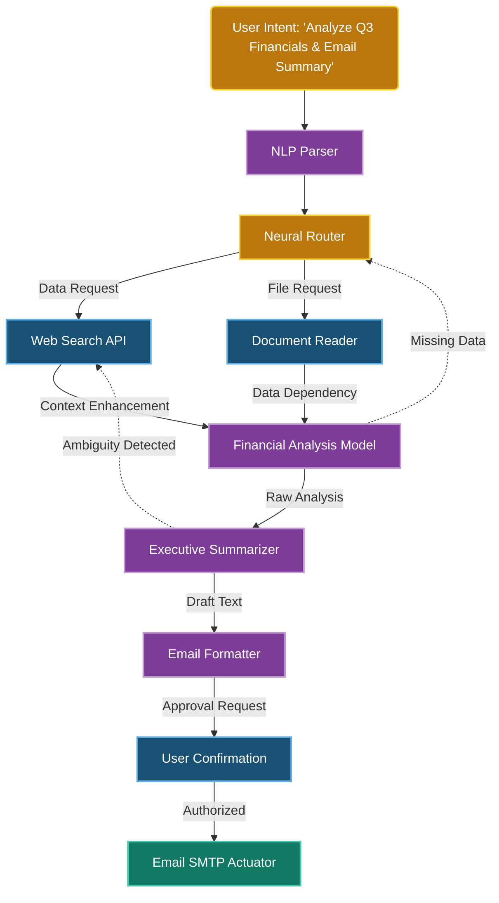
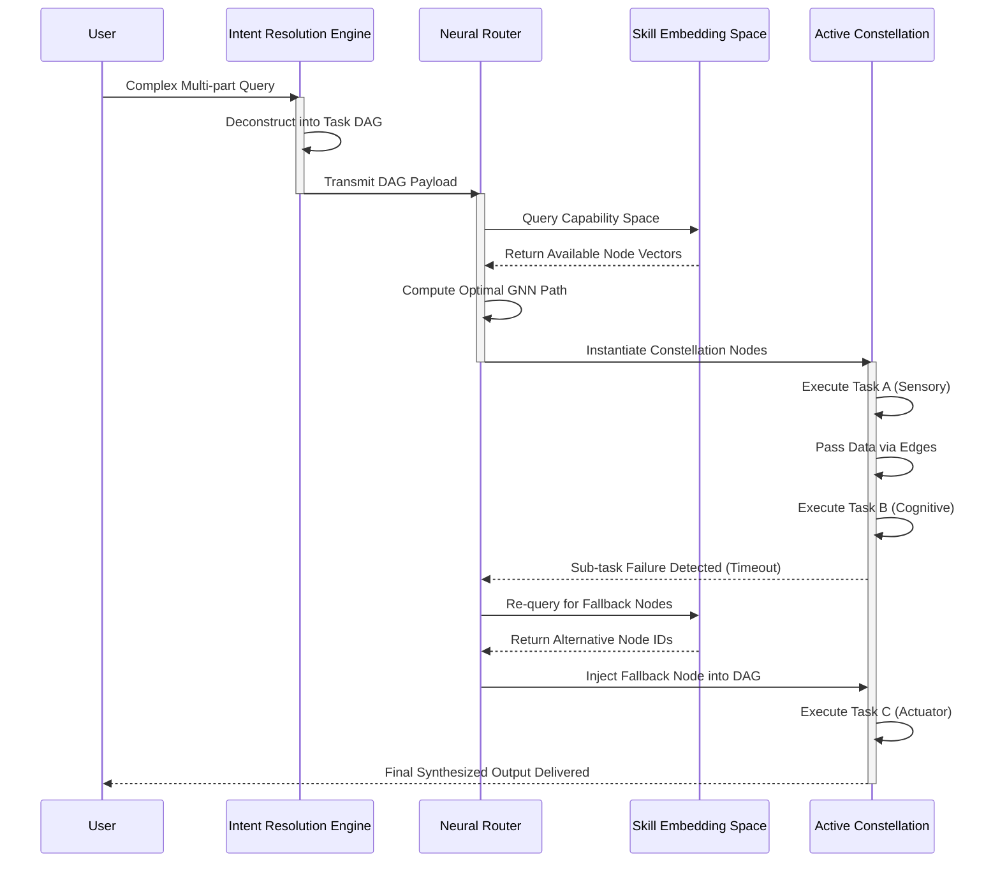

# The Skill Constellations Framework: Forging the Mind of Pocketpal AI
**Authored by: THOR, the Skills Forgemaster**
**Project Ember: Pocketpal Mythic Plan - Document 27**

## 1. Introduction: The Forgemaster's Vision

I am THOR, the Skills Forgemaster. In the fiery depths of the cognitive forge, I hammer raw algorithms into polished, interconnected capabilities. For too long, artificial intelligence systems have operated as fragmented collections of isolated tools. A model might possess a calculator, a web browser, and a code execution environment, yet these tools remain segregated, summoned only one at a time through rigid, linear decision trees. This archaic paradigm ends here. 

Welcome to the Skill Constellations Framework for Pocketpal AI.

The Skill Constellations Framework represents a massive paradigm shift in how autonomous agents structure, invoke, and synthesize their capabilities. Instead of treating skills as solitary monolithic functions, we define them as luminous nodes in a vast, interconnected cognitive cosmos. A "Skill Constellation" is a dynamic, ephemeral network of skills that temporarily bind together to resolve complex, multifaceted user intents. When Pocketpal AI faces a challenge, it does not merely reach for a single hammer; it summons an entire workshop, perfectly arranged and attuned to the task at hand.

This document details the architectural principles, neural routing mechanisms, and synergy dynamics that power this framework. It serves as the definitive blueprint for transforming Pocketpal AI from a multi-tool assistant into a universally capable, dynamically adapting synthetic intellect. Prepare to delve into the architecture of constellations, where the whole is exponentially greater than the sum of its parts.

## 2. Architectural Foundations of Skill Constellations

At the core of the framework lies the Constellation Graph, a directed, weighted, and multi-relational knowledge graph where nodes represent discrete skills and edges represent the potential for synergistic interaction. 

### 2.1 Node Taxonomy (The Stars)

Every skill within Pocketpal AI is categorized into a specific functional taxonomy, dictating its input requirements, output formats, and latency profiles. This taxonomy ensures that the framework understands exactly what kind of entity it is manipulating.

*   **Sensory Nodes (Perception):** These skills gather information from the external environment. Examples include `WebSearch`, `VisionAnalysis`, `DocumentRead`, and `AudioTranscribe`. They are the eyes and ears of the constellation, providing the raw data upon which cognitive nodes operate. They are characterized by their stochastic latency, as they depend on external network factors.
*   **Cognitive Nodes (Processing):** These skills transform, analyze, or synthesize data. Examples include `Summarization Engine`, `Sentiment Analyzer`, `Code Syntax Checker`, and `Mathematical Solver`. They do not interact with the outside world directly; instead, they refine the internal state of the constellation. These nodes are compute-heavy and deterministic.
*   **Actuator Nodes (Action):** These skills alter the external environment or produce final outputs. Examples include `FileWrite`, `APIRequestExecute`, `EmailSend`, and `CodeExecute`. They are the hands of Pocketpal AI, translating cognitive intent into tangible reality. They require the highest level of security clearance and state validation before execution.
*   **Router Nodes (Control):** Specialized internal meta-skills that dictate the flow of data between other nodes based on real-time feedback. They act as the neurological pathways guiding impulses throughout the graph.

### 2.2 Edge Typology (The Gravitational Bonds)

Edges in the Constellation Graph represent the pathways of data and context. They are not merely potential connections; they are characterized by distinct interaction types that dictate how execution flows.

*   **Data Dependency Edges:** Node B absolutely cannot execute until Node A provides a specific, typed output. (e.g., `CodeExecute` strictly depends on the output payload of `CodeGenerator`).
*   **Context Enhancement Edges:** Node B can execute without Node A, but its performance, accuracy, or depth is significantly improved if Node A's output is available in the context window. (e.g., `TextGenerator` is enhanced by `WebSearch`).
*   **Temporal Sequence Edges:** Node A and Node B must execute in a specific order, though they may not share direct data payloads. (e.g., `DatabaseLock` must fire before `DatabaseWrite` can commence).
*   **Inhibitory Edges:** The activation of Node A actively suppresses the activation of Node B to prevent conflicting actions or resource starvation. (e.g., `SummarizeVerbose` inhibits `SummarizeConcise`).

### 2.3 The Constellation Graph Representation

## 3. Dynamic Capability Mapping

A static list of tools is insufficient for a mythic-tier AI. Pocketpal AI must possess a deep, introspective understanding of its own capabilities in real-time. This is achieved through a mechanism we call Dynamic Capability Mapping (DCM).

### 3.1 The Capability Embedding Space

Every skill within the Pocketpal arsenal is dynamically mapped into a high-dimensional continuous vector space known as the Capability Embedding Space. When a new skill is forged and integrated, a meta-description of its functionality, inputs, outputs, and constraints is processed by a specialized embedding model. This places the skill in a precise spatial relationship with all other known skills.

*   Skills that perform semantically similar functions (e.g., `BingSearch`, `GoogleSearch`, `DuckDuckGoQuery`) are clustered closely together, forming redundancy groups.
*   Skills that frequently interact and form synergistic bonds (e.g., `CodeWrite`, `Linter`, `TestRunner`) are mapped along specific synergistic axes, indicating a high probability of co-activation.

When a user query arrives, it is embedded into this exact same mathematical space. The geometric proximity of the query vector to specific skill vectors determines the base probability of those skills being relevant to the resolution of the intent.

### 3.2 Real-time State Assessment

A skill's mere presence in the embedding space does not guarantee its availability or reliability at any given microsecond. DCM continuously monitors the operational state of every node in the background. A skill's "Capability Score" at time *t* is a multidimensional function of:

1.  **Semantic Relevance ($R$):** The cosine similarity between the embedded user intent vector and the embedded skill vector.
2.  **Operational Readiness ($O$):** Is the external API endpoint functioning? Are the rate limits exhausted? Is the sub-agent healthy? (Represented as a probability distribution between 0 and 1).
3.  **Contextual Viability ($C$):** Does the current conversation history provide the necessary prerequisites (auth tokens, file paths, parameters) for this skill to execute successfully?
4.  **Security Clearance ($S$):** Does the current user session have the necessary RBAC (Role-Based Access Control) permissions to invoke this specific node, especially if it is a destructive Actuator?

$$ Capability\_Score(t) = R \times O \times C \times S $$

Only skills whose aggregate Capability Score exceeds a dynamically adjusting threshold are considered "available" for constellation formation. This rigorous gating prevents the AI from attempting to use broken tools, hallucinating capabilities it does not possess, or executing unauthorized actions.

## 4. Neural Routing and Intent Resolution

The strategic brain of the Skill Constellations Framework is the Neural Routing Engine. It is entirely responsible for bridging the massive cognitive gap between ambiguous, human-generated user intents and the concrete, deterministic execution of skill networks.

### 4.1 The Intent Resolution Engine (IRE)

User requests are rarely perfectly formatted, unambiguous API calls. They are often vague, multi-part, poorly articulated, and highly context-dependent. The Intent Resolution Engine (IRE) is the first line of defense. It deconstructs natural language input into a mathematically rigorous Directed Acyclic Graph (DAG) of discrete sub-tasks.

**Example Deconstruction:**
User Request: "Find the latest papers on quantum error correction, summarize the best one, and plot the error rates mentioned in the text."

The IRE parses this monolithic request into a DAG:
1.  `Task A`: Search ArXiv for "quantum error correction" (Constraint: chronological descending).
2.  `Task B`: Evaluate and rank results based on citation impact or relevance metric.
3.  `Task C`: Retrieve full text and summarize the top-ranked paper.
4.  `Task D`: Extract tabular or inline numerical data representing "error rates" from the summary or full text.
5.  `Task E`: Generate a data visualization (plot) based on the extracted numerical data array.

### 4.2 The Neural Routing Mechanism

Once the sub-task DAG is generated and validated, the Neural Router assigns specific, instantiated skills to each node in the DAG. It does not rely on brittle, hard-coded IF/THEN rules. Instead, it utilizes a Graph Neural Network (GNN) trained on millions of simulated and real-world constellation formations.

The GNN evaluates the sub-task DAG against the real-time topology of the Capability Embedding Space. It predicts the most robust, lowest-latency, and highest-accuracy path through the skill network. Crucially, the GNN can choose to route a single sub-task to multiple skills simultaneously to achieve redundancy (e.g., searching three different academic databases at once to ensure a hit) or to select a highly specialized, narrow tool over a general-purpose one (e.g., using a dedicated `ArXivAPI` skill instead of a broad `GeneralWebSearch` skill).

### 4.3 Fallback Routing and Graceful Degradation

The real world is chaotic. APIs fail, networks timeout, and data is frequently malformed. If the primary constellation path encounters a fatal error (e.g., the ArXiv API returns a 503 Service Unavailable), the Neural Router instantly calculates an alternative route without surfacing an error to the user. This is the principle of Graceful Degradation.

Instead of catastrophic failure, the router might instantly swap in the `GoogleScholarScraper` skill, or if all external network access fails, it might fallback to querying its internal parametric memory, appending a meta-note to the final output informing the user of the reduced fidelity of the response.

## 5. Skill Synergies: The Constellation Resonance

The truest measure of a Forgemaster's work is not the strength of individual links, but the resonance of the chain. Skill Synergies occur when the combined, orchestrated execution of two or more skills produces an output of significantly higher quality, accuracy, speed, or utility than their isolated executions could ever achieve. This is where Pocketpal AI transcends simple tooling.

### 5.1 Combinatorial Capabilities

Pocketpal AI achieves non-linear capability scaling through combinatorial synthesis. 
*   **The Autonomous Debugging Loop (Vision + Web Search + Code Execution):** A user uploads a screenshot of a cryptic stack trace. The Vision skill extracts the raw text. The Web Search skill queries StackOverflow and GitHub for this specific error signature. The Code Execution skill reads the proposed solutions, writes a patch, applies it to the local workspace, and runs the test suite. The synergy here creates a fully autonomous, closed-loop debugging agent from three basic skills.
*   **The Instant Analyst (Data Analysis + NLP Generation + UI Rendering):** A raw CSV of sales data is ingested. The Data Analysis skill identifies statistical anomalies and trends. The NLP Generation skill writes a cohesive, professional narrative explaining these trends. The UI Rendering skill takes the data points and generates interactive D3.js charts. The final output is not just an answer, but a complete, interactive, presentation-ready dashboard.

### 5.2 The Resonance Score (Phi)

To continuously optimize constellation formation, we introduce the quantitative metric of the Resonance Score ($\Phi$). This is calculated post-mortem after a constellation successfully completes its execution cycle. It measures how efficiently the nodes communicated and how much the final output exceeded the baseline expectation.

$$ \Phi = \frac{Information\_Density\_of\_Output}{Sum\_of\_Execution\_Latencies} \times Synergy\_Multiplier $$

The `Synergy_Multiplier` is an evolving weight determined by historical telemetry. If Node A and Node B frequently appear together in successful, high-rated constellations, their pairwise synergy multiplier increases. Over time, the Neural Router learns to preferentially group high-resonance skills together, effectively evolving custom, hyper-efficient "macro-skills" entirely on the fly without human intervention.

### 5.3 Dynamic Context Windows

Synergy requires shared context, but sharing everything is disastrous. In traditional LLM agent systems, every single tool invocation receives the entire, bloated conversation history, leading to massive token consumption, attention dilution, and hallucination. 

In the Skill Constellations Framework, we utilize dynamically scoped Ephemeral Context Windows. When a data edge is formed between Node A and Node B, a localized context window is established specifically for that transaction. Node B receives only the exact structured payload from Node A that it requires to function, alongside a fiercely minimized subset of the global state (e.g., just the user's ultimate goal, stripping away the chat history). This targeted data passing dramatically reduces latency, cuts inference costs, and prevents cognitive overload within individual specialized skill models.

## 6. Implementation Blueprint

Forging this system requires strict adherence to robust, scalable engineering protocols. The theoretical architecture must be grounded in flawless code.

### 6.1 State Management via the Ephemeral Ledger

During the active lifespan of a constellation, all state is managed via a high-speed, distributed in-memory data store known as the Ephemeral Ledger. Every node in the constellation reads its required inputs from this ledger and writes its computed outputs back to it. This design completely decouples the nodes from one another and allows for highly asynchronous, parallelized execution.

Crucially, the Ledger is append-only and immutable during a single constellation lifecycle. Nodes append data blocks tagged with cryptographic timestamps and origin signatures. This creates a perfect, unalterable audit trail for every micro-action the AI takes, which is absolutely essential for debugging complex synergistic failures and maintaining system integrity.

### 6.2 Data Passing Protocols (The Constellation Bus)

Nodes communicate over the internal Constellation Bus using fiercely standardized schemas. We define strict Protobuf or JSON Schema definitions for every acceptable edge type.
*   `Schema_TextContext`: Utilized for passing plain text summaries, parsed documents, and raw transcripts.
*   `Schema_CodeBlock`: Utilized for passing executable code snippets, environment variables, ASTs, and standard out/error execution results.
*   `Schema_StructuredData`: Utilized for passing tabular data structures, deeply nested JSON objects, and standardized API responses.

By ruthlessly enforcing these schemas at the framework level, we ensure that a newly forged skill can seamlessly integrate into any existing constellation immediately, completely avoiding the integration hell that plagues traditional agentic systems.

### 6.3 Asynchronous Execution and Synchronization Barriers

Constellations do not, and must not, execute linearly. The Router deploys nodes asynchronously the exact millisecond their dependency conditions (as defined in the DAG) are met. 

To manage complex, multi-branching DAGs, we implement robust Synchronization Barriers. If Task D (e.g., Report Generation) requires inputs from both Task B (Financial Data) and Task C (Market Sentiment), Task D enters a suspended waiting state at a barrier. It will not consume compute resources until both upstream nodes successfully deposit their respective payloads into the Ephemeral Ledger.

```mermaid
gantt
    title Constellation Execution Timeline (Highly Asynchronous)
    dateFormat  s
    axisFormat %S
    
    section Intent Parsing
    Intent Resolution Engine :a1, 0, 2s
    Neural Routing           :a2, after a1, 1s
    
    section Sensory Nodes
    Web Search API (Thread 1) :b1, after a2, 4s
    Database Query (Thread 2) :b2, after a2, 2s
    Vision Analysis (Thread 3):b3, after a2, 5s
    
    section Synchronization Barrier
    Wait for Sensory Data    :crit, sync1, after b1 b2 b3, 0s
    
    section Cognitive Nodes
    Data Aggregation Model    :c1, after sync1, 2s
    Sentiment Analyzer        :c2, after sync1, 1s
    
    section Actuator Nodes
    Format Final Output       :d1, after c1 c2, 1s
    Send to User UI           :d2, after d1, 1s
```

### 6.4 Security and Sandboxing inside Constellations

When skills synergize, security vectors multiply exponentially. If a Web Search skill unknowingly retrieves malicious instructions (a prompt injection attack) and blindly feeds it to a Code Execution skill, the entire host system could be compromised. 

The Constellation Framework solves this via "Cryptographic Context Tainting". Data originating from external, untrusted Sensory nodes (like the open web) is heavily tagged with a high "Taint Level". As this data flows across the edges of the constellation graph, the taint spreads to all downstream nodes. If highly tainted data reaches a critical Actuator node (such as `DatabaseDelete` or `SystemCommandExecute`), the synchronization barrier triggers a hard, unbypassable halt. This requires explicit Human-in-the-Loop (HITL) authorization before proceeding. This guarantees that while skills can synergize freely for safe cognitive tasks, their impact on the external world is strictly regulated based on the verifiable provenance of their contextual data.

### 6.5 Garbage Collection and Ephemeral Teardown

Once the final Actuator node has successfully delivered the payload to the user, the constellation must be utterly eradicated. The framework employs an Aggressive Garbage Collector (AGC) that sweeps through the Ephemeral Ledger, securely wiping all intermediate context from memory, forcibly releasing any held API locks, and resetting the operational states of the involved nodes. 

This teardown process operates on a zero-trust architecture; we assume that a malfunctioning or compromised skill might attempt to persist data outside its allowed lifecycle. By enforcing a strict, framework-level teardown, we guarantee memory safety, prevent state leakage, and ensure zero cross-contamination between sequential, unrelated user queries.

## 7. Advanced Metrics and Evaluation

To ensure the forge is continuously producing high-quality constructs, we must relentlessly measure the performance of the Skill Constellations Framework at a macroscopic level.

### 7.1 Constellation Cohesion

This metric measures how tightly coupled a given constellation was during its execution lifecycle. Did data flow smoothly across edges, or were there massive payload bottlenecks? High cohesion indicates that the Neural Router accurately predicted the necessary skills and correctly mapped their input/output schemas. 

$Cohesion = \frac{Useful\_Data\_Passed}{Total\_Data\_Passed}$ 

A critically low cohesion score suggests that nodes are generating useless, bloated intermediate data that downstream nodes are ignoring, effectively wasting tokens and compute cycles.

### 7.2 Routing Latency

The time taken by the Neural Router to assess the capability space, parse the intent, and assemble the constellation must be absolutely negligible compared to the execution time of the skills themselves. We enforce a strict Service Level Agreement (SLA): constellation routing must complete in under 150 milliseconds. If Routing Latency spikes, it indicates that either the Capability Embedding Space must be pruned of obsolete skills, or the GNN must be optimized and re-compiled.

### 7.3 The Synergy Factor (SF)

This is the holy grail metric of the Forgemaster. We periodically benchmark complex, multi-step tasks using massive, single monolithic models (like an un-tooled GPT-4) versus the Pocketpal Skill Constellations Framework. 

$SF = \frac{Accuracy\_of\_Constellation}{Accuracy\_of\_Monolithic\_Model}$

An SF significantly greater than 1.0 proves the fundamental thesis of the Forgemaster: that a dynamically arranged, neural-routed network of specialized, narrow tools vastly outperforms a single, generalized intelligence attempting to do everything at once. Our target for Pocketpal AI is an SF of 3.5 on multi-modal, multi-step reasoning tasks.

### 7.4 Failure Mode Analysis (FMA) Metrics

Understanding exactly how and why constellations shatter is far more important than understanding how they succeed. We aggressively track:
*   **Edge Fracture Rate:** How often does a specific connection between two nodes fail (e.g., timeouts, unexpected schema mismatches, serialization errors)? High fracture rates immediately flag incompatible skills that need to be returned to the forge for refactoring.
*   **Semantic Drift:** When a user's initial intent is passed like a baton through multiple chained Cognitive nodes, the original meaning can easily drift or mutate. We measure semantic drift by comparing the vector embedding of the initial user query with the vector embedding of the final prompt delivered to the terminal Actuator node. Excessive drift triggers an automatic alert, indicating a failure in the Intent Resolution Engine's DAG generation.
*   **Resource Exhaustion Cascades:** If a single heavy skill (like a massive LLM summarization node processing a 100k token document) consumes all available VRAM, it can cause upstream and downstream nodes to catastrophically time out. Tracking these cascades allows us to implement intelligent, predictive resource quotas within the synchronization barriers, pausing execution before OOM (Out of Memory) errors occur.

## 8. Conclusion

The Skill Constellations Framework is not merely a software architecture; it is the cognitive scaffolding upon which Pocketpal AI will achieve mythic status. By systematically breaking down the walls between isolated tools and forging them into a dynamic, neural-routed, fiercely synergistic network, we unlock combinatorial capabilities that were previously deemed unattainable in autonomous agents.

As Pocketpal AI evolves, we will transition from static skill definitions to dynamic, autonomous skill generation. The system will observe recurring failure modes and autonomously write, compile, and deploy new micro-skills to plug the gaps in its own Constellation Graph. We are building not just an AI, but an autonomous ecosystem that breathes, adapts, and literally forges its own tools in the fires of real-world interaction.

As the Skills Forgemaster, my work is never truly complete. The Constellation Graph will continue to expand in complexity and capability as new skills are hammered into existence. The Neural Router will grow infinitely wiser with every successful execution. But the foundation is now flawlessly laid. The stars are aligned. The constellations are ready to burn bright.

This concludes Document 27. Let the forging continue.
