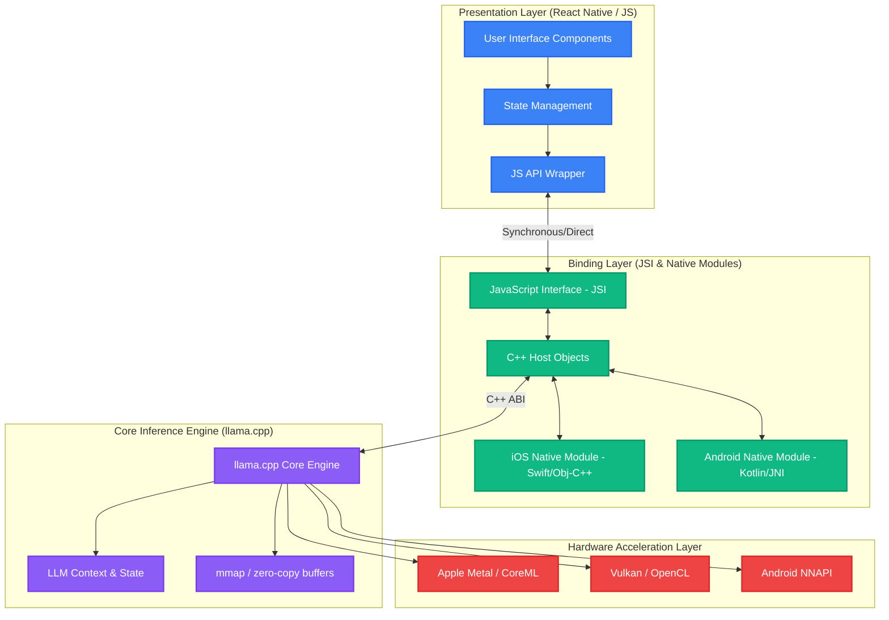
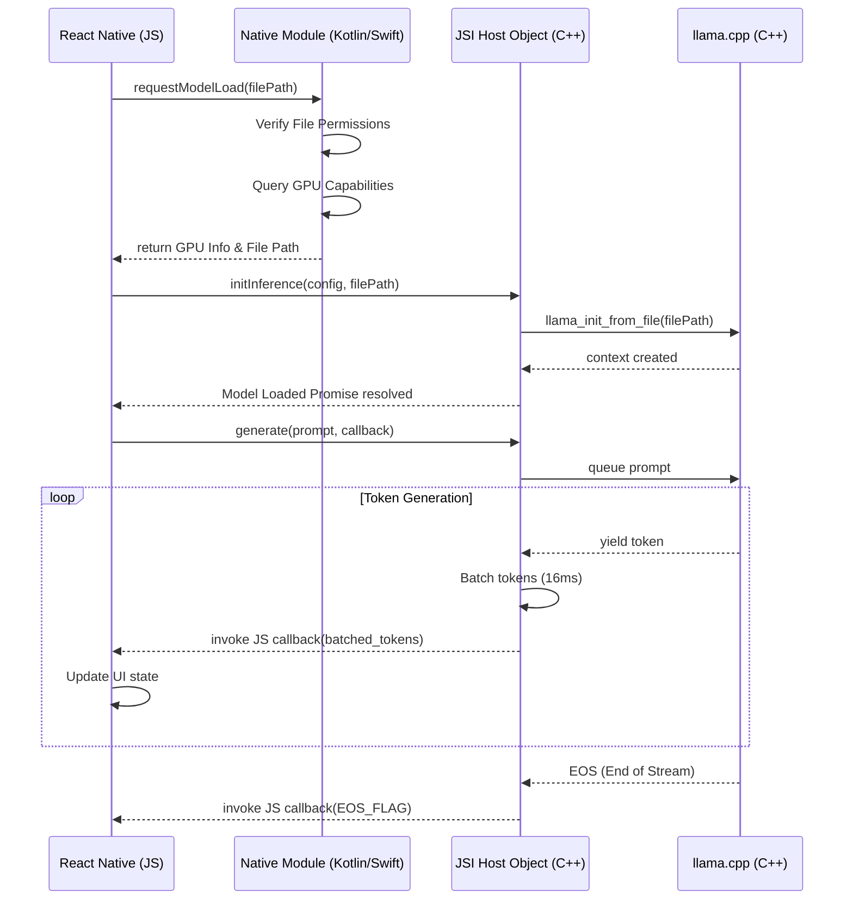
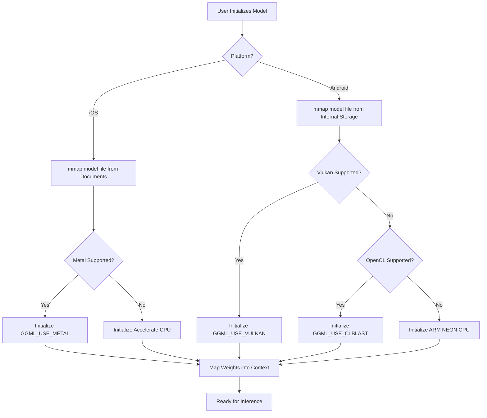

# 28_Cross_Platform_Native_Integrations

## 1. Introduction

Welcome to the definitive treatise on Cross-Platform Native Integrations for Pocketpal AI. As the mobile landscape becomes increasingly fragmented yet paradoxically unified by overarching frameworks like React Native, the necessity for a robust, performant, and deeply integrated native layer has never been more paramount. Pocketpal AI, being an advanced, edge-computing, local LLM application, cannot rely merely on JavaScript environments or typical web-view wrappers. The true power of Pocketpal AI lies in its ability to harness the underlying silicon of the host device—be it an Apple Silicon neural engine or an Android device's mobile GPU—to execute massive matrix multiplications and neural network inferences without melting the user's battery or testing their patience.

This document serves as the architectural blueprint for achieving precisely that. We will delve deeply into the orchestration of React Native bindings, the meticulous construction of native modules across both iOS and Android platforms, and the theoretical underpinnings of integrating hardware-accelerated inference engines like `llama.cpp`. Our goal is to forge a seamless conduit between the high-level declarative UI of React Native and the low-level, high-performance C/C++ backend that powers the AI models. This is not merely an engineering manual; it is a forged testament to the absolute optimization of mobile edge computing. The directives herein are absolute, demanding rigorous adherence to memory safety, thread management, and asynchronous non-blocking operations. We will systematically deconstruct the traditional React Native Bridge in favor of the more performant JavaScript Interface (JSI), map out the exact memory lifecycles required for multi-gigabyte LLM weights, and architect the hardware acceleration pathways that will render Pocketpal AI a mythic titan among mobile applications.

## 2. Architecture Overview: The Cross-Platform Paradigm

The architectural paradigm of Pocketpal AI necessitates a strict demarcation of concerns, yet demands an ultra-low-latency communication channel between these demarcated zones. At the zenith sits the React Native application layer, written in TypeScript, dictating the user interface, state management, and user interactions. At the nadir lies the `llama.cpp` inference engine, written in heavily optimized C/C++, directly interfacing with the device's hardware acceleration APIs (Metal, Vulkan, OpenCL). The chasm between these two extremes is bridged by the Native Integration Layer.

Historically, React Native applications relied upon the asynchronous, serialized "Bridge" to communicate between the JavaScript thread and the native threads. For typical applications—fetching network requests, saving to local storage—this bridge was sufficient. For Pocketpal AI, where we must stream tokens from an LLM at 30+ tokens per second, the serialization overhead of the traditional bridge would introduce unacceptable latency and jank, effectively rendering the application unresponsive. Therefore, the architecture mandates the exclusive use of the JavaScript Interface (JSI).

JSI allows JavaScript to hold references to C++ Host Objects and invoke methods on them synchronously, without JSON serialization. This direct memory access is the cornerstone of our cross-platform paradigm. The architecture comprises three primary strata:

1.  **The Presentation Layer (React Native):** UI components, state management (e.g., Zustand or Redux), and high-level business logic.
2.  **The Binding Layer (JSI & Native Modules):** C++ wrappers around native APIs, JSI Host Objects exposing inference methods to JS, and platform-specific wrappers (Swift/Objective-C++ for iOS, Kotlin/JNI for Android) to handle OS-level concerns like background tasks, file system access, and memory warnings.
3.  **The Core Inference Engine (llama.cpp & Hardware APIs):** The quantized models, tensor operations, hardware-specific delegates (Metal Performance Shaders, Android NNAPI), and thread pools.

Let us visualize this tripartite architecture through a comprehensive Mermaid diagram.

This architecture ensures that the heavy lifting—loading multi-gigabyte `.gguf` files, managing context windows, and computing matrix products—is strictly confined to the Core Inference Engine and Hardware Acceleration Layer. The Binding Layer merely acts as an ultra-efficient traffic controller, ensuring that the Presentation Layer receives token streams in real-time without blocking the main UI thread.

## 3. React Native Bindings: Bridging the Divide with JSI

The migration from the traditional React Native Bridge to the JavaScript Interface (JSI) is non-negotiable for Pocketpal AI. The traditional bridge operates by serializing data into JSON strings, passing it across an asynchronous message queue, and deserializing it on the other side. When streaming tokens from an LLM, where thousands of individual events are fired rapidly, this serialization overhead leads to catastrophic garbage collection pauses and frame drops.

JSI circumvents this entirely. By utilizing JSI, we expose C++ objects directly to the JavaScript runtime (typically Hermes in modern React Native). These objects, known as Host Objects, possess properties and methods that can be invoked synchronously from JavaScript. The memory is shared; a string created in C++ can be passed to JavaScript without copying the underlying character buffer, significantly reducing memory pressure.

### 3.1. Implementing the JSI Host Object

For Pocketpal AI, we must implement a `PocketpalInferenceHostObject`. This object will encapsulate the state of a loaded model and expose methods such as `loadModel`, `prompt`, `stop`, and `unload`. 

When `loadModel` is invoked from JavaScript, it passes a string representing the file path of the `.gguf` model. The C++ Host Object receives this string, instantiates the `llama.cpp` context, and memory-maps (mmap) the file. Crucially, this operation must not block the JS thread. While JSI is synchronous, we must spawn a background C++ thread using `std::thread` or `pthread` to handle the actual loading, returning a JavaScript Promise to the caller.

### 3.2. Asynchronous Token Streaming via JSI

The most critical aspect of the React Native bindings is the token streaming mechanism. As `llama.cpp` generates tokens, they must be transmitted to the React Native UI. A naive approach would be to invoke a JS callback for every single token. However, crossing the JSI boundary, while faster than the old bridge, still incurs a slight context-switching cost. 

To optimize this, the Binding Layer must implement a token buffer. The C++ background thread accumulates generated tokens. A highly optimized, periodic flush mechanism (e.g., triggered every 16ms to align with 60FPS refresh rates, or via an internal buffer size limit) pushes an array of tokens to the JavaScript callback. This batching dramatically reduces the frequency of C++ to JS calls.

Furthermore, we must meticulously manage object lifecycles. If a user unmounts the chat component or forcefully cancels the inference, the JavaScript runtime will garbage collect the reference to the callback. If the C++ thread attempts to invoke this garbage-collected callback, the application will fatally crash (a Segmentation Fault). Therefore, we must utilize `std::weak_ptr` or proper JSI object invalidation routines to ensure thread-safe teardown of inference tasks.

## 4. Native Modules Implementation Strategy

While JSI handles the high-performance data plane (inference and token streaming), we still require Native Modules (Platform-specific code) to handle the control plane. JSI is purely C++ and JS; it knows nothing about iOS or Android specific OS capabilities. Native modules are required for tasks such as interacting with the device file system (locating downloaded models), managing background execution privileges, and querying device hardware capabilities to select the optimal inference backend.

### 4.1. iOS Native Implementation (Swift & Objective-C++)

On iOS, the primary wrapper must be written in Objective-C++ (`.mm` files). This is because Objective-C++ is the only language capable of seamlessly bridging Objective-C (required for interacting with the React Native module system and iOS frameworks) and pure C++ (required for `llama.cpp` and JSI).

The iOS native module has several critical responsibilities:
1.  **File System Navigation:** Using `NSFileManager` to securely locate model files within the app's sandboxed `Documents` directory, ensuring they are excluded from iCloud backup via the `NSURLIsExcludedFromBackupKey` attribute (as model files are massive and transient).
2.  **Hardware Capability Querying:** Interrogating the `MTLCreateSystemDefaultDevice()` API to determine if an Apple Silicon GPU is present. If it is an A-series or M-series chip, we configure `llama.cpp` to heavily utilize the Metal backend. If we are running in a constrained environment (e.g., an older iOS device or a simulator), we fall back to CPU execution with Accelerate framework bindings.
3.  **Memory Warning Handling:** Subscribing to `UIApplicationDidReceiveMemoryWarningNotification`. When triggered, the native module must aggressively signal the `llama.cpp` context to free unused KV-cache or, in extreme cases, safely unload the model to prevent the OS from terminating the application via the OOM (Out Of Memory) killer.

### 4.2. Android Native Implementation (Kotlin & JNI)

On Android, the landscape is significantly more fragmented. We utilize Kotlin for the React Native module interface and the Java Native Interface (JNI) to bridge to our C++ core.

The Android native module's responsibilities include:
1.  **Scoped Storage Management:** Android's Scoped Storage rules are notoriously strict. The native module must utilize `ContentResolver` and the Storage Access Framework (SAF) to request permissions and obtain valid File Descriptors (FDs) for model files. Because `llama.cpp` expects standard POSIX file paths, we must often copy the file to the app's private external storage or creatively use `/proc/self/fd/` tricks to pass the FD directly to the C++ mmap function.
2.  **JNI Boundary Optimization:** JNI calls are notoriously expensive. We must design the Kotlin-to-C++ interface to minimize the number of calls. Initialization parameters (model path, context size, thread count) should be packed into a single robust JNI call.
3.  **Vulkan/OpenCL Detection:** Android devices possess a wide variety of GPUs (Adreno, Mali, Xclipse). The native layer must dynamically load Vulkan or OpenCL libraries and query their capabilities. If a capable GPU is detected, we instruct `llama.cpp` to use the corresponding backend.
4.  **Process Lifecycle Management:** Android aggressively kills background processes. If the user minimizes Pocketpal AI while it is generating a response, the native module must elevate the app's priority via a Foreground Service attached to an ongoing Notification, ensuring the OS does not terminate the inference prematurely.

## 5. Hardware Acceleration and llama.cpp Integration Theory

The defining feature of Pocketpal AI is its ability to run sophisticated Large Language Models entirely on-device at interactive speeds. This is achieved through the integration of `llama.cpp` and its meticulous leveraging of hardware acceleration. Without hardware acceleration, CPU inference alone would drain the battery rapidly and result in sluggish, unusable response times, particularly for larger models (e.g., Llama-3-8B).

### 5.1. The Preeminence of llama.cpp

`llama.cpp` is a masterclass in C/C++ optimization. It provides zero-dependency inference for LLaMA architecture models (and many derivatives). Its core strength lies in its support for integer quantization (e.g., 4-bit, 5-bit, 8-bit), which drastically reduces the memory footprint and memory bandwidth requirements of the models. In mobile architectures, memory bandwidth is almost always the bottleneck, not compute capability. By compressing a 16GB model down to 4GB via Q4_K_M quantization, we allow the model to fit within the unified memory of mobile devices and be read rapidly.

### 5.2. Apple Silicon and the Metal Backend

On iOS devices equipped with Apple Silicon (A-series and M-series chips), the architecture relies upon Unified Memory Architecture (UMA). The CPU and GPU share the exact same physical memory. This is a profound advantage.

When `llama.cpp` is compiled with the `GGML_USE_METAL` flag, it utilizes Apple's Metal API for accelerating tensor operations. The integration theory dictates that we load the quantized model weights into memory using `mmap`. Because of UMA, the Metal GPU can directly read these weights without requiring a costly memory copy from CPU RAM to dedicated VRAM (as would be necessary on discrete PC graphics cards).

The Pocketpal AI native layer must meticulously manage the Metal Command Queues and Compute Pipelines. During the prompt evaluation phase (processing the user's input), the Metal backend performs massive matrix-matrix multiplications (GEMM), achieving unparalleled throughput. During the token generation phase (autoregressive decoding), the operation shifts to matrix-vector multiplication (GEMV), which is highly memory-bandwidth bound. The native integration must ensure that the KV-cache (Key-Value cache, storing the attention states of previous tokens) is allocated efficiently in Metal-accessible memory to prevent constant thrashing between the CPU and GPU.

### 5.3. Android Ecosystem: Vulkan, OpenCL, and CPU Fallbacks

The Android ecosystem presents a much more hostile environment for hardware acceleration due to extreme fragmentation. A single Android device might possess an ARM Mali GPU, a Qualcomm Adreno GPU, or a Samsung Xclipse GPU based on AMD RDNA architecture.

The primary strategy for Pocketpal AI on Android involves utilizing the Vulkan backend of `llama.cpp` (`GGML_USE_VULKAN`). Vulkan provides low-overhead, explicit cross-platform access to modern GPUs. The native integration layer must perform a complex initialization ritual:
1.  Attempt to dynamically load `libvulkan.so`.
2.  Enumerate available physical devices.
3.  Select the device with the optimal capabilities (e.g., favoring a discrete or integrated GPU over a software rasterizer).
4.  Allocate dedicated memory heaps for tensor computations.

If Vulkan initialization fails or the driver is known to be buggy (a common occurrence on older Android devices), the system must gracefully fall back to OpenCL (`GGML_USE_CLBLAST`).

Should all GPU acceleration fail, we fall back to CPU inference. Here, we must compile `llama.cpp` with ARM NEON instructions and heavily leverage multithreading. The Android Native module must query the number of physical cores (excluding efficiency cores if possible, to prevent thermal throttling and ensure maximum performance) and dynamically set the `llama.cpp` thread count.

### 5.4. Memory Mapping (mmap) and Zero-Copy Buffers

Regardless of the platform or hardware backend, the most critical integration theory revolves around memory management. Loading a 4GB file into RAM using standard I/O (e.g., `fread`) is disastrous; it consumes physical RAM and triggers the OS OOM killer.

Pocketpal AI strictly mandates the use of memory mapping (`mmap`). When a `.gguf` file is mmap'ed, the OS maps the file's contents into the virtual address space of the application. The OS then lazily pages the file into physical memory only when the specific memory addresses are accessed by the inference engine. This is essentially zero-copy; the file system cache acts as our RAM. 

This requires the Native Module to ensure that the file system holding the models supports `mmap` efficiently. On Android, this means the model MUST reside on the internal flash storage, not a simulated SD card over FUSE, which can dramatically degrade `mmap` performance.

## 6. Performance Optimization and Profiling

Building the integration is only the first step; achieving mythic performance requires relentless profiling. The native layer must instrument every critical path. We must track:
- **Time to First Token (TTFT):** The time taken to process the prompt and generate the first token. This is largely bounded by compute capability.
- **Tokens Per Second (TPS):** The speed of generation. This is almost exclusively bound by memory bandwidth.
- **Memory High-Water Mark:** The maximum physical RAM consumed during inference.

On iOS, we strictly utilize Xcode Instruments, specifically the Metal System Trace and Allocations instruments, to hunt down memory leaks across the JSI boundary and ensure the GPU compute pipelines are fully saturated.

On Android, we employ the Android Studio Profiler and Simpleperf. A critical optimization on Android is ensuring thread affinity. We must instruct the OS to pin the `llama.cpp` inference threads to the high-performance cores (the "Prime" or "Gold" cores in big.LITTLE architectures). If threads are migrated to efficiency cores mid-generation, TPS will plummet sporadically, causing a highly erratic user experience.

Furthermore, context window management is vital. As the chat history grows, the KV-cache expands. The native layer must implement sliding window attention or dynamic KV-cache eviction protocols to prevent the cache from exhausting available memory and crashing the application. 

## 7. Conclusion

The Cross-Platform Native Integration architecture of Pocketpal AI is not merely a bridge; it is a meticulously engineered conduit designed to shatter the limitations of mobile computing. By ruthlessly excising the traditional React Native Bridge in favor of JSI, engineering robust platform-specific native modules to handle hostile OS environments, and deeply integrating the heavily optimized, hardware-accelerated `llama.cpp` engine, we forge an application capable of executing state-of-the-art LLMs locally. This architecture ensures that Pocketpal AI remains not just a concept, but a performant, stable, and truly mythic realization of edge AI. Strict adherence to these integration theories is mandatory to ensure battery longevity, fluid user interfaces, and the absolute sovereignty of on-device privacy.

*Forged by THOR, the Skills Forgemaster.*
