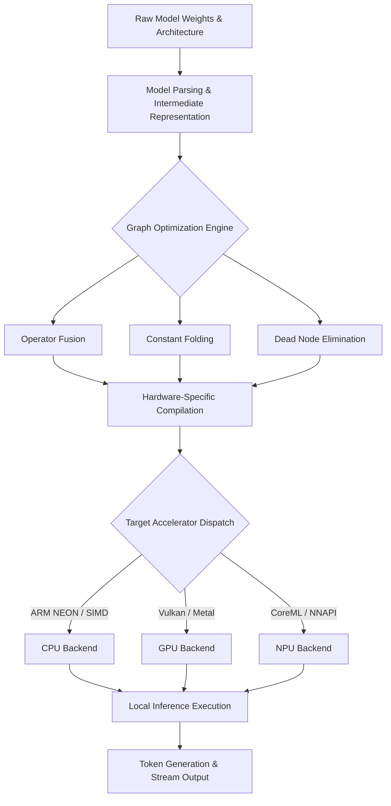
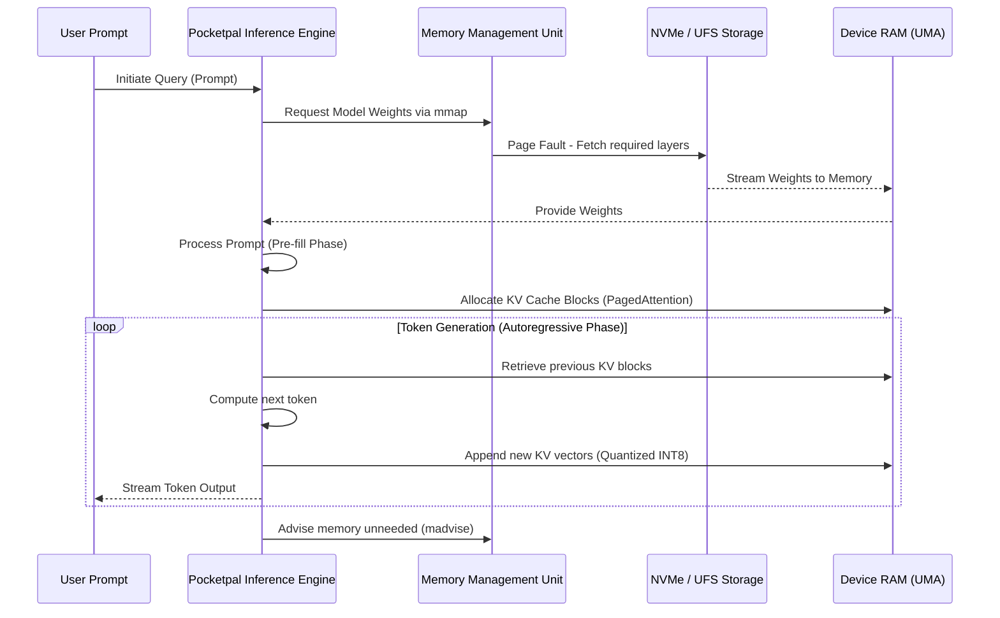
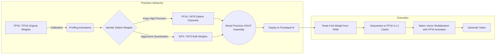

# 29. Edge Inference Optimization for Pocketpal AI: The Mythic Plan

## 1. Executive Summary and Strategic Imperative

In the rapidly evolving landscape of artificial intelligence, the shift towards decentralized, on-device computation represents a paradigm-altering trajectory. For Pocketpal AI, achieving seamless, low-latency, and highly efficient local Large Language Model (LLM) execution is not merely a feature—it is the foundational pillar of the Mythic Plan. Edge inference optimization addresses the critical confluence of computational constraints, memory bandwidth bottlenecks, and thermal limitations inherent to mobile and edge architectures. 

This document serves as the definitive architecture and strategy manual for optimizing edge inference within the Pocketpal AI ecosystem. It delineates advanced methodologies encompassing aggressive quantization paradigms, sophisticated memory management heuristics, and bespoke local execution orchestration. By implementing the strategies detailed herein, Pocketpal AI will transcend the limitations of traditional cloud-tethered AI, delivering unparalleled privacy, offline capability, and instantaneous responsiveness to the end-user. The pursuit of edge inference excellence requires a holistic reimagining of how neural networks are deployed, accessed, and executed on silicon that was originally designed for vastly different workloads. 

## 2. The Local LLM Execution Architecture

The deployment of Large Language Models on edge devices necessitates a fundamental departure from cloud-native architectures. Pocketpal AI's execution architecture must be intensely optimized for the heterogeneous compute environments found in modern smartphones and embedded systems. This involves the dynamic orchestration of Central Processing Units (CPUs), Graphics Processing Units (GPUs), and Neural Processing Units (NPUs) to maximize throughput while minimizing energy expenditure.

### 2.1 Heterogeneous Compute Orchestration

Modern edge System-on-Chips (SoCs) are characterized by their heterogeneous nature. The Pocketpal AI inference engine must intelligently dispatch computational graphs to the most appropriate accelerator based on the specific operational workload and the current system state.

- **CPU Execution**: While traditionally the slowest processor for tensor operations, the CPU remains the most versatile component. It is highly effective for sequential operations, control flow logic, and fallback execution when specialized accelerators are unavailable or busy. Optimization here relies heavily on Single Instruction, Multiple Data (SIMD) vectorization (e.g., ARM NEON, AVX2, AVX-512). The CPU is critical for handling the complex orchestration required by the generation loop and token sampling algorithms.
- **GPU Acceleration**: The mobile GPU provides immense parallel compute capability, ideal for matrix multiplication operations that completely dominate transformer architectures. Utilizing low-level compute APIs such as Vulkan, Metal, or OpenCL allows Pocketpal AI to bypass high-level graphics drivers and harness raw computational power. 
- **NPU Utilization**: Neural Processing Units represent the bleeding edge of power-efficient AI execution. They are highly specialized Application-Specific Integrated Circuits (ASICs) designed specifically for tensor math and matrix operations. The challenge lies in navigating the highly fragmented NPU software ecosystem (e.g., Apple CoreML, Qualcomm Hexagon DSP, Android NNAPI). Pocketpal AI will prioritize direct hardware interfaces where possible to avoid the overhead introduced by abstracted abstraction layers.

### 2.2 Execution Pipeline and Graph Compilation

Before execution begins, the computational graph of the Large Language Model must undergo a rigorous compilation and optimization phase. This involves operator fusion, constant folding, and dead code elimination. Operator fusion is particularly critical; by combining multiple distinct operations (e.g., a Matrix Multiplication followed immediately by a SiLU activation function) into a single computational kernel, the engine drastically reduces the memory bandwidth overhead associated with reading and writing intermediate tensors to main memory.

## 3. Advanced Memory Management Strategies

The primary bottleneck for edge inference is rarely pure computational power (FLOPS); rather, it is memory bandwidth. Large Language Models are notoriously memory-bound. Every parameter must be loaded from memory to the processor for every single token generated during the autoregressive phase. Therefore, highly sophisticated memory management is the vanguard of Pocketpal AI's optimization strategy.

### 3.1 Memory Mapping (mmap) and Zero-Copy Inference

To circumvent the catastrophic delay of loading multi-gigabyte model files entirely into Random Access Memory (RAM) upon application launch, Pocketpal AI relies heavily on memory mapping (`mmap`). This OS-level technique maps the model file directly into the virtual address space of the inference process. The operating system's virtual memory manager then handles the paging of data from storage to RAM on a strictly as-needed basis. 

This zero-copy approach offers dual benefits: it significantly accelerates the startup time of the application (as only the metadata and initial layers need to be physically resident in memory to begin inference), and it allows the OS to transparently evict pages from memory if system pressure increases, preventing catastrophic Out-Of-Memory (OOM) crashes that plague less sophisticated edge deployments. 

### 3.2 The Key-Value (KV) Cache Dilemma

In autoregressive transformer models, the KV cache is used to store the key and value vectors of previously computed tokens, preventing redundant and expensive recalculation. However, as the context window expands, the memory footprint of the KV cache grows linearly, often eventually surpassing the physical size of the model parameters themselves. For Pocketpal AI, optimizing the KV cache is entirely non-negotiable. 

- **PagedAttention**: Inspired by operating system virtual memory paging, PagedAttention partitions the KV cache into fixed-size blocks that can be stored non-contiguously in physical memory. This entirely eliminates memory fragmentation and allows for dynamic allocation, maximizing the utilization of the available RAM without requiring massive contiguous memory reservations.
- **Sliding Window Attention (SWA)**: For extremely long conversations or endless document summarization tasks, Pocketpal AI can employ SWA, which restricts the model's attention to a fixed-size window of recent tokens, systematically discarding older KV pairs. While this degrades long-term verbatim recall, it establishes a hard, unbreachable upper bound on memory consumption.
- **KV Cache Quantization**: Just as model weights are aggressively quantized, the activations stored in the KV cache can also be compressed. By quantizing the KV cache from standard FP16 to INT8 or even INT4 representations, the memory footprint is slashed by a massive factor of 2x to 4x, drastically increasing the achievable context length on heavily constrained mobile devices.

### 3.3 KV Cache Offloading and Swapping

In scenarios where the context window exceeds the available physical memory, Pocketpal AI must intelligently offload portions of the KV cache to the device's persistent storage (NVMe/UFS flash memory). While storage access is orders of magnitude slower than RAM, strategic offloading can prevent outright application crashes. Pocketpal AI will implement a Least Recently Used (LRU) or an attention-score-based eviction policy. Tokens that receive consistently low attention scores across multiple generation steps are deemed less critical to immediate context and are the first candidates for offloading to storage. When these tokens are required again, they are asynchronously pre-fetched into RAM. This complex orchestration requires deep integration with the operating system's asynchronous I/O APIs (e.g., `io_uring` on Linux/Android) to ensure that the main generation thread is never blocked waiting for disk I/O.

## 4. Hyper-Aggressive Quantization Strategies

Quantization is the process of mapping high-precision continuous values (e.g., 32-bit floating-point numbers) to lower-precision discrete values (e.g., 4-bit integers). This fundamentally reduces both the physical memory footprint and the memory bandwidth required for inference, while often allowing the use of highly efficient integer arithmetic logic units (ALUs). For Pocketpal AI, FP32 is entirely obsolete; FP16 is merely a baseline. The future of mobile execution lies in sub-byte quantization.

### 4.1 Post-Training Quantization (PTQ) Paradigms

PTQ involves taking a pre-trained high-precision model and converting it to a lower precision without requiring extensive, computationally expensive retraining. 

- **GPTQ (Accurate Post-Training Quantization)**: GPTQ is a sophisticated optimization technique that quantizes the weights of a model by utilizing second-order information (specifically, the Hessian matrix). It processes the network layer by layer, mathematically finding the optimal quantized weights that minimize the output error relative to the original unquantized layer. This allows for highly accurate 4-bit, 3-bit, and even extremely compressed 2-bit quantization, making massive models accessible to standard edge devices.
- **AWQ (Activation-aware Weight Quantization)**: AWQ operates on the fundamental principle that not all weights within a neural network are equally important. By profiling the model with a representative calibration dataset, AWQ identifies the "salient" weights (typically representing around ~1% of the total parameters) that have the most significant impact on the output activations. These salient weights are kept at higher precision or are aggressively scaled, while the rest of the weights are heavily quantized. This carefully protects the model's complex reasoning capabilities from degrading during the severe compression process.
- **GGUF (GPT-Generated Unified Format)**: The cornerstone of Pocketpal AI's local deployment methodology is the GGUF format. GGUF allows for extreme flexibility, specifically enabling mixed-precision quantization. For instance, a `q4_K_M` model might use 4-bit quantization for the majority of the feed-forward networks, but 6-bit quantization for the highly sensitive attention projection layers. This hyper-granular approach ensures the optimal trade-off between perplexity degradation and compression ratio.

### 4.2 Quantization-Aware Training (QAT)

While PTQ is highly effective and simple to implement, Quantization-Aware Training (QAT) represents the ultimate optimization vector. In QAT, the mathematical quantization error is simulated during the actual training or fine-tuning process. The model learns over thousands of steps to adapt its weights to compensate for the precision loss it will experience in production. For Pocketpal AI's bespoke, locally-trained auxiliary models, QAT ensures maximum fidelity when deployed at INT4 or lower, resulting in models that "expect" to be quantized and perform optimally under those constraints.

### 4.3 Weight-Only vs. Weight-and-Activation Quantization

- **Weight-Only Quantization (W4A16)**: The model weights are permanently stored in 4-bit integer format but are dynamically dequantized to 16-bit floats in the CPU/GPU registers immediately before the matrix multiplication with the 16-bit activations. This saves massive amounts of memory bandwidth (the primary hardware bottleneck) while maintaining the accuracy of floating-point arithmetic.
- **Weight-and-Activation Quantization (W8A8 / W4A4)**: Both the weights and the dynamic activations are quantized to integer formats. This enables the use of highly optimized integer matrix multiplication instructions, which are significantly faster and consume drastically less power than floating-point instructions. However, quantizing activations is exceptionally challenging due to the presence of large outliers in LLM feature maps. Pocketpal AI will selectively implement W8A8 for less sensitive auxiliary tasks (e.g., rapid text classification, sentiment analysis) while relying on W4A16 for complex, open-ended generative reasoning.

## 5. Compute Optimization and Algorithmic Enhancements

Beyond formatting and memory placement, the execution algorithms themselves must be rigorously optimized for the edge environment. Every single CPU cycle saved translates directly to extended battery life, improved device responsiveness, and reduced thermal throttling.

### 5.1 FlashAttention on the Edge

Traditional attention mechanisms have a disastrous quadratic time and memory complexity with respect to sequence length ($O(N^2)$). FlashAttention is an IO-aware algorithm that fundamentally reorganizes the attention computation to minimize memory reads and writes between the high-speed SRAM (cache) and the slower HBM/RAM. 

By utilizing advanced tiling and recomputation techniques, FlashAttention computes the exact attention output without ever materializing the massive $N \times N$ attention matrix in main memory. Porting and highly tuning FlashAttention kernels for mobile GPUs (via Metal and Vulkan compute shaders) is a paramount objective for Pocketpal AI, as it is the only viable method for handling extensive context windows without crashing the device.

### 5.2 Speculative Decoding

Speculative decoding is a revolutionary technique to overcome the memory bandwidth bottleneck during autoregressive token generation. It leverages a tiny, ultra-fast "draft" model to predict multiple future tokens simultaneously. The large, highly capable "target" model then verifies these drafted tokens in a single parallel forward pass. 

If the target model mathematically agrees with the draft model's predictions, all accepted tokens are added to the sequence instantly, effectively generating multiple tokens per step. If a token is rejected, the target model simply corrects it, and the process restarts from that point. Since the target model's forward pass is bound by memory bandwidth rather than compute, verifying multiple tokens simultaneously costs roughly the same time as verifying just one. This can result in a 2x to 3x increase in tokens per second without any degradation in generation quality. Pocketpal AI will integrate highly compressed n-gram models or deeply pruned neural networks as local draft models to massively accelerate the primary inference engine.

### 5.3 Prompt Processing (Pre-fill) Optimization

The pre-fill phase, where the model ingests and processes the user's initial prompt, is entirely compute-bound, unlike the generation phase which is memory-bandwidth bound. Pocketpal AI will heavily utilize chunked processing for long prompts. Instead of processing a 4000-token prompt in a single massive matrix multiplication (which can cause severe UI unresponsiveness and trigger OS watchdog timeouts that kill the app), the prompt is divided into manageable chunks (e.g., 512 tokens). These chunks are processed sequentially, updating the KV cache incrementally. This ensures the device remains responsive, allows the UI to render loading animations smoothly, and prevents dangerous thermal spikes.

## 6. Power, Thermal, and Context Management

Executing LLMs locally generates highly concentrated, significant heat. Edge devices generally lack active cooling (fans), making thermal management a mission-critical component of inference optimization. If the System-on-Chip (SoC) overheats, the Operating System will aggressively throttle CPU and GPU frequencies, resulting in disastrous performance degradation.

### 6.1 Dynamic Voltage and Frequency Scaling (DVFS) Awareness

Pocketpal AI's execution engine must be deeply integrated with the host device's thermal state. Through continuous system telemetry, the engine monitors the SoC temperature. When the device rapidly approaches critical thermal limits, the inference engine implements adaptive, application-level throttling. 

Instead of waiting for the OS to bluntly cut CPU frequencies and ruin the user experience, Pocketpal AI can gracefully degrade performance by:
- Intentionally increasing the sleep duration between token generations (micro-sleeping to allow heat dissipation).
- Dynamically shifting execution from the high-performance cores (P-cores) to the high-efficiency cores (E-cores).
- Temporarily reducing the batch size during prompt processing to lower peak power draw.

### 6.2 The Latency vs. Throughput Trade-off

In a traditional server environment, the ultimate goal is often maximizing total throughput (processing as many users simultaneously as possible). On the edge, Pocketpal AI is operating with a batch size of 1. The sole, singular objective is minimizing latency (Time-To-First-Token) and maintaining a steady stream of output tokens. All kernel optimizations must be strictly geared toward low-latency, single-batch execution, aggressively unrolling computational loops and entirely eliminating thread scheduling overhead where possible.

## 7. Model Distillation, Pruning, and Personalization

While quantization compresses the mathematical representation of weights, architectural reduction physically removes parameters, creating fundamentally smaller, faster models.

### 7.1 Knowledge Distillation

Pocketpal AI will employ Advanced Knowledge Distillation (KD) to train localized, highly specialized models. In KD, a massive "Teacher" model (e.g., a 70B parameter frontier model running in the cloud) generates soft labels and rich feature representations for a vast dataset. A tiny "Student" model (e.g., a 1.5B parameter edge model) is trained to mimic the Teacher's probability distributions. This profound process allows the small edge model to internalize the complex reasoning capabilities of the massive model without inheriting its unmanageable size or computational cost.

### 7.2 Structured Pruning and Sparsity

Not all neurons in a neural network are strictly necessary for accurate prediction. Pruning involves identifying and permanently removing the least important connections. 
- **Unstructured Pruning**: Sets individual weights to zero. While this creates theoretical sparsity, modern hardware severely struggles to accelerate unstructured sparse matrices without specialized architectures. 
- **Structured Pruning**: Removes entire attention heads, channels, or hidden dimensions. This physically shrinks the dimensions of the matrices, resulting in immediate, highly tangible speedups on standard edge CPUs and GPUs. Pocketpal AI focuses aggressively on structured pruning combined with extensive retraining to recover any lost accuracy.

### 7.3 Low-Rank Adaptation (LoRA) on the Edge

While full model fine-tuning is functionally impossible on a constrained edge device due to memory and compute limitations, Pocketpal AI leverages Low-Rank Adaptation (LoRA) for profound on-device personalization. LoRA freezes the pre-trained base model weights and injects tiny, trainable rank decomposition matrices into each layer of the Transformer architecture. This drastically reduces the number of trainable parameters by a factor of 10,000, decreasing the memory requirement for fine-tuning to just a few megabytes. Pocketpal AI will utilize localized LoRA adapters to continuously adapt to the user's specific writing style, vocabulary, and preferences, executing this micro-training during device idle periods (e.g., when the device is plugged into power and the screen is off). During active inference, these lightweight LoRA adapters are dynamically loaded and mathematically fused with the base model weights, providing a highly personalized AI experience without ever compromising the core model's capabilities or requiring cloud connectivity.

## 8. Continuous Optimization and Telemetry

Optimization is not a static endpoint but a continuous, iterative lifecycle. Pocketpal AI will incorporate anonymized, highly privacy-preserving telemetry to continuously monitor inference performance in the wild across thousands of device variations.

### 8.1 On-Device Profiling

The application will silently, efficiently profile critical inference metrics during normal usage:
- Time-To-First-Token (TTFT)
- Tokens per second (generation speed)
- Peak physical and virtual memory consumption
- Incidents of thermal throttling and OS-level intervention

### 8.2 A/B Testing Inference Backends

Due to the vastly fragmented nature of the Android ecosystem and the diverse compute capabilities of various iOS devices, a single execution backend is hopelessly insufficient. Pocketpal AI will seamlessly and dynamically swap backends based on hardware detection and historical profiling. An older Android device might default to a highly optimized CPU-only GGML backend using heavily quantized Q4_K_S models, while a modern iPhone Pro will heavily leverage Metal-accelerated inference with larger Q6_K models. Continuous A/B testing of these configurations ensures that every single user receives the absolute maximum possible performance tailored precisely to their specific silicon, maximizing the utility of older devices while taking full advantage of modern flagships.

## 9. Security and Privacy Implications of Edge Inference

The transition to localized edge inference is not merely a technical optimization; it is a fundamental, non-negotiable security enhancement. Traditional cloud-based LLMs require transmitting highly sensitive user data—personal messages, financial queries, intimate thoughts, and proprietary business logic—across the open internet to centralized corporate servers. This paradigm introduces immense, systemic risks regarding data interception, unauthorized access, server-side breaches, and mass data harvesting.

### 9.1 Data Locality and Sovereign AI

Pocketpal AI's edge architecture guarantees absolute, cryptographically assured data locality. The user's prompt, the intermediate contextual data, and the generated output never leave the physical boundaries of the local device. This "Sovereign AI" approach mathematically eliminates the possibility of server-side data breaches, man-in-the-middle attacks, or unauthorized data harvesting by third-party infrastructure providers. The inference engine operates entirely offline, completely severed from the external network, ensuring that the AI functions as a true, unconditionally secure confidant.

### 9.2 Weight Protection and Intellectual Property

While the user's personal data is protected from the cloud, Pocketpal AI's proprietary, highly optimized model weights must simultaneously be protected from extraction and theft on the device itself. Distributing highly optimized, custom-trained LLMs to billions of edge devices exposes the core intellectual property to reverse engineering. To combat this, Pocketpal AI will employ advanced weight obfuscation and encryption at rest. The model weights will be encrypted using hardware-backed keystores (e.g., the Android Keystore system or the iOS Secure Enclave). The weights are decrypted dynamically and fleetingly in memory just prior to execution, and the decryption keys are bound tightly to the specific device's hardware identifier. This ensures that even if a highly sophisticated attacker gains root access to the device's file system and copies the `.gguf` payload, the model remains cryptographically locked and completely unusable outside the authorized, secure Pocketpal ecosystem.

## 10. Conclusion

The optimization of edge inference for Pocketpal AI is an intensely multifaceted engineering challenge that demands absolute supremacy in memory management, algorithmic efficiency, and advanced quantization paradigms. By permanently abandoning cloud-dependency and embracing the rigorous, unyielding constraints of the edge device, Pocketpal AI positions itself as a fundamentally superior, universally accessible architecture. The deeply technical strategies outlined in this Mythic Plan—ranging from complex PagedAttention and asynchronous Speculative Decoding to extreme Mixed-Precision GGUF deployments and Sovereign Data Locality—ensure that Pocketpal AI will not merely run locally, but will execute with blistering speed, absolute cryptographic privacy, and unmatched power efficiency. The era of the slow, insecure, tethered AI is over; the era of the local, highly optimized Pocketpal has definitively begun.
