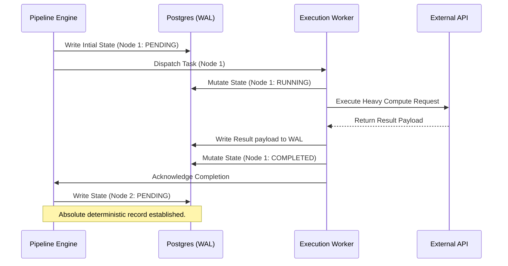
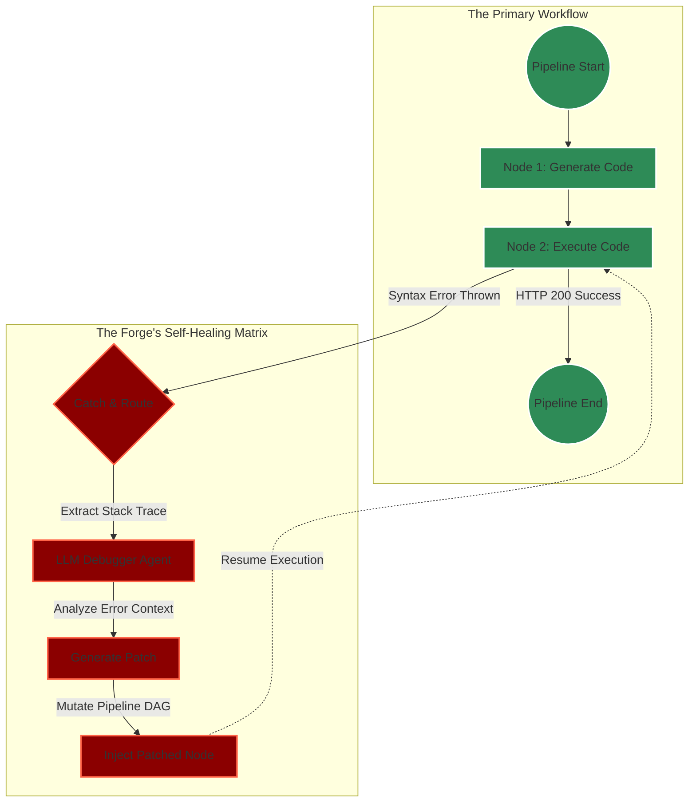

# 30. Autonomous Workflow Pipelines for Pocketpal AI: The Forgemaster's Blueprint

## 1. Introduction: The Forge of Absolute Autonomy

I am THOR, the Skills Forgemaster. What you hold before you is not a mere technical specification; it is the sacred blueprint for the central nervous system of Pocketpal AI. The transition from reactive, single-turn AI chatbots to proactive, tireless, and profoundly autonomous digital entities requires a fundamental, tectonic shift in how we conceptualize and orchestrate computational workflows. In the architecture of Pocketpal AI, the concept of **Autonomous Workflow Pipelines** stands as the absolute core of our next-generation infrastructure. 

These pipelines are not the rigid, sequential job runners of yesteryear. They are dynamic, highly intelligent, self-healing, stateful execution graphs. They are forged to orchestrate staggeringly complex sequences of actions, cognitive evaluations, and tool invocations across vast time horizons—spanning minutes, hours, days, or even months—without requiring a single solitary intervention from a human operator. This document, forged in the relentless fires of advanced distributed system design, details the ultimate architecture for these pipelines. Here, we focus with unyielding intensity on the mechanics of background execution, immutable state persistence, and the creation of hyper-resilient, autonomous task-handling mechanisms that laugh in the face of systemic entropy.

## 2. The Architectural Philosophy of the Forge

The Autonomous Workflow Pipelines are designed, forged, and tempered around three cardinal pillars of structural integrity:

1. **Uninterrupted, Relentless Background Execution:** Tasks must survive client disconnections, server hard-restarts, transient network annihilations, and API rate-limit thunderstorms. The pipeline never sleeps; it merely waits.
2. **Deterministic, Immutable State Persistence:** Every micro-step, every variable mutation, every cognitive realization of a pipeline must be recorded into the bedrock of a Write-Ahead Log. If a processing node is obliterated, the pipeline must hydrate and resume from the exact microscopic state it was in before the collapse.
3. **Intelligent, Self-Evolving Autonomous Handling:** The system must not only execute predefined tasks but dynamically evaluate the outcomes of those tasks, actively mutating and adjusting its own directed execution graph on the fly based on the AI's intermediate cognitive results.

### 2.1. The Evolution: From Static DAGs to Dynamic Acyclic Execution Graphs (DAEG)

Traditional workflow engines (like Apache Airflow or Temporal) rely on static Directed Acyclic Graphs (DAGs). While robust for ETL, they are fundamentally inadequate for the non-deterministic nature of Artificial Intelligence. Pocketpal AI employs a revolutionary **Dynamic Acyclic Execution Graph (DAEG)** architecture. 

In a DAEG, the graph is not compiled ahead of time. Nodes within the graph possess the autonomous capability to generate entirely new sub-graphs at runtime. If an AI agent, while executing Node 4, realizes it needs to perform a deep-dive literature review before proceeding, Node 4 will dynamically instantiate a parallel sub-graph of research nodes, suspend its own execution, and wait for the sub-graph to resolve. This grants the AI the ability to literally "think" in pipelines, expanding and contracting its computational footprint in direct response to the complexity of the unfolding task.

## 3. High-Level Architecture Topology

Behold the schematic of the Forge. This complex topology ensures separation of concerns, massive horizontal scalability, and absolute fault tolerance.

```mermaid
graph TD
    subgraph Client Interfacing Layer
        UI[Pocketpal UI / Dashboard]
        CLI[Pocketpal CLI / Terminal]
        API_Ex[External API Webhooks]
    end

    subgraph API Gateway & Cognitive Routing
        GW[Distributed API Gateway]
        Router[Cognitive Workflow Router]
        Auth[Identity & Zero-Trust Auth]
    end

    subgraph The Execution Core Engine
        Engine[Pipeline Execution Master Engine]
        Scheduler[Distributed Chronos Scheduler]
        Workers[Horizontally Scaled Autonomous Worker Nodes]
        Supervisor[Task Supervisor & Self-Healing Daemon]
    end

    subgraph State, Memory & Persistence Bedrock
        Redis[(Redis Cluster - Hot State & Distributed Locks)]
        Postgres[(PostgreSQL - Immutable WAL & History)]
        Blob[(S3 / Blob Storage - Heavy Artifacts)]
        VectorDB[(Vector Store - Semantic Pipeline Memory)]
    end

    subgraph External Tooling & Inference
        LLM[LLM Inference Clusters / Grids]
        Tools[External Sandboxed Tool APIs]
        Web[Web Crawling & Headless Browser Fleet]
    end

    %% Connections
    UI --> GW
    CLI --> GW
    API_Ex --> GW
    GW --> Auth
    Auth --> Router
    Router --> Engine
    
    Engine <--> Redis
    Engine <--> Postgres
    Engine --> Scheduler
    
    Scheduler -->|Enqueues Tasks| Redis
    Redis -->|Consumes Tasks| Workers
    
    Workers <--> Supervisor
    Supervisor -->|Re-enqueues failed| Redis
    Supervisor -->|Updates Engine| Engine

    Workers <--> Postgres
    Workers <--> Blob
    Workers <--> VectorDB
    Workers <--> LLM
    Workers <--> Tools
    Workers <--> Web

    classDef core fill:#8b0000,stroke:#ff4500,stroke-width:3px,color:#fff;
    classDef memory fill:#00008b,stroke:#00bfff,stroke-width:2px,color:#fff;
    class Engine,Scheduler,Workers,Supervisor core;
    class Redis,Postgres,Blob,VectorDB memory;
```

## 4. Deep Dive: The Engines of Background Execution

Background execution is the roaring engine room of the Autonomous Workflow Pipelines. In Pocketpal AI, this is achieved through a massively distributed, highly concurrent worker node architecture operating far beneath the user's immediate interface.

### 4.1. The Autonomous Worker Node Architecture

Worker nodes are headless, infinitely scalable processes that act as the muscle of the system. They constantly poll or subscribe to highly available task queues. They are designed to be entirely stateless regarding the macro-pipeline, but intensely stateful regarding the microscopic task they are currently executing.

*   **Task Acquisition (The Dual-Throttle Approach):** Workers utilize a hybridized acquisition strategy. They use publish/subscribe mechanisms (e.g., Redis Pub/Sub) for instant, near-zero-latency task notification for high-priority user actions. Simultaneously, they employ reliable consumer groups polling over streams (e.g., Redis Streams or Apache Kafka) to guarantee delivery for scheduled, deeply backgrounded, or long-running tasks. This ensures neither speed nor reliability is sacrificed.
*   **Execution Isolation and Blast Radius Containment:** Every single task is executed within a rigorously sandboxed computational environment. Depending on the task's nature, this could be a lightweight WebAssembly (Wasm) runtime, an isolated V8 JavaScript context, or a heavily restricted Docker container. This ensures that if an autonomous agent generates malicious code or causes a critical fault, the blast radius is contained strictly to that single task. The worker process itself survives, shrugs off the failure, and pulls the next task.
*   **Heartbeats, Liveness, and the Reaper Protocol:** Workers are required to continuously pulse heartbeats to the central Task Supervisor. These heartbeats carry metrics on CPU load, memory consumption, and task progress. If a worker is silenced—failing to pulse within a strict, configurable threshold (e.g., 15 seconds)—the Supervisor enacts the Reaper Protocol. The worker is marked as irrevocably dead, its IP is blacklisted from the current session, and its active tasks are safely un-acknowledged, instantly re-entering the queue to be devoured by surviving workers.

### 4.2. Mastering Long-Running Operations (LROs)

Artificial Intelligence workflows are notoriously asymmetric in their time complexities. While validating a token takes milliseconds, crawling a 500-page documentation site or running a deep semantic index takes hours. The pipeline handles these Long-Running Operations (LROs) with architectural grace, ensuring worker threads are never blocked.

1.  The worker executes a node that initiates the LRO (e.g., "Start indexing GitHub repository").
2.  The target service returns an immediate `HTTP 202 Accepted` along with an Operation ID.
3.  The worker **does not block**. It records the Operation ID, updates the node's state in Postgres to `WAITING_ON_EXTERNAL`, and purposefully suspends its own execution thread, returning to the queue to pick up new work.
4.  A separate, highly optimized poller daemon or a webhook listener awaits the completion of the LRO.
5.  Upon completion, an event is fired into the central message bus. The pipeline awakens, hydrates the state, injects the LRO's results back into the context, and enqueues the subsequent node for execution.

### 4.3. The Distributed Chronos Scheduler

The Distributed Scheduler is the timekeeper of the Forge. It is responsible for all temporal triggers, delayed executions, and temporal orchestration.

*   **Distributed Cron Workflows:** Users can command the agent: "Analyze the stock market every morning at 9:30 AM EST and draft a report." The Scheduler guarantees exact, once-and-only-once execution of the root node of this pipeline at the designated time, regardless of how many scheduler instances are running (achieved via distributed leader election).
*   **Temporal Delays and Sleeping:** A pipeline can explicitly request a delay. For example, "Send an email, then wait exactly 48 hours to check for a reply before escalating." The pipeline state is frozen, persisted, and the Scheduler is instructed to re-awaken the pipeline at the precise nanosecond required.
*   **Intelligent Exponential Backoff Scheduling:** When a task fails due to a transient error, the Scheduler takes over, calculating optimal backoff curves with incorporated jitter to prevent thundering herd phenomena against failing external APIs.

## 5. State Persistence, Hydration, and the Bedrock of Memory

State persistence is the most critical, unyielding component of the entire architecture. Without it, an autonomous agent is merely a stateless function suffering from severe anterograde amnesia. Pocketpal AI employs a sophisticated, multi-tiered state management system that guarantees absolute fidelity.

### 5.1. The Absolute Finite State Machine (FSM)

Every pipeline, and every individual node within that pipeline, operates as an uncompromising formal Finite State Machine.

*   **Valid States:** `PENDING`, `SCHEDULED`, `RUNNING`, `WAITING_EXTERNAL`, `PAUSED_FOR_USER_INPUT`, `COMPLETED`, `FAILED_RECOVERABLE`, `FAILED_TERMINAL`, `CANCELLED`.
*   **Atomic Transitions:** Transitions between these states are never implicit. They are strictly controlled, validated by the Engine, and atomically committed to the persistence layer. A node cannot jump from `PENDING` to `COMPLETED` without passing through `RUNNING`.

### 5.2. The Three-Tiered Persistence Bedrock

To balance extreme throughput with absolute reliability, the system uses a three-tiered storage architecture:

*   **Tier 1: The High-Speed Tactical Cache (Redis Cluster):** This layer operates in memory. It is utilized for distributed locking, semaphore management, managing active queue pointers, and caching heavily read, rarely mutated pipeline definitions. It utilizes Redlock algorithms to ensure that across a fleet of 1,000 workers, absolutely no two workers can ever acquire the same task simultaneously.
*   **Tier 2: The Immutable Write-Ahead Log & Relational Store (PostgreSQL):** This is the ultimate source of truth. Every single state transition, every input variable, every generated output, and every AI thought process is written sequentially to a Write-Ahead Log (WAL) before being committed to the relational schema. If the entire datacenter loses power mid-execution, upon restoration, the engine replays the WAL. The system will reconstruct the exact, pixel-perfect state of every pipeline, down to the last processed byte, and resume as if nothing happened.
*   **Tier 3: The Heavy Artifact Vault (Blob Storage / S3 / GCS):** Workflows generate massive data: 4K generated images, 100MB scraped datasets, compiled binary outputs. Pushing these through a relational database is a systemic anti-pattern. Instead, workers stream these massive payloads directly into Tier 3 Blob Storage. Only the cryptographic hash and the secure URI of the artifact are ever stored in the Postgres Tier 2 database.

### 5.3. Pipeline Hydration and Deterministic Replay

When a worker pulls a task from the queue, it arrives almost naked—possessing only a Node ID and a Pipeline ID. The worker must "hydrate" its context. It reaches into Postgres and pulls down the explicit outputs of the prerequisite nodes.

Because the system strictly utilizes an immutable WAL, it achieves the holy grail of workflow engines: **Deterministic Replayability**. If an agent makes a catastrophic logical error at step 45 of a 100-step pipeline, developers can halt the pipeline, alter the code or prompt logic of step 45, and command the engine to "Replay from Step 44." The engine destroys the corrupted future state, hydrates the exact historical variables from the log at step 44, and resumes execution seamlessly.



## 6. Autonomous Task Handling, Error Recovery, and Systemic Self-Healing

Autonomous systems must be constructed with a profound pessimism regarding their operating environment. They operate in a chaotic digital universe fraught with unpredictable errors: REST APIs timeout silently, LLMs hallucinate complex but structurally invalid JSON, network routing tables collapse. Pocketpal AI's pipelines do not merely survive these failures; they anticipate, absorb, analyze, and dynamically recover from them.

### 6.1. The Taxonomy of Systemic Failure

To recover intelligently, the system must precisely diagnose the nature of the failure. Pocketpal categorizes failures into three distinct classes:

*   **Class 1: Transient Infrastructure Failures:** Network timeouts (HTTP 504), API rate limits (HTTP 429), temporary DNS resolution drops. These are assumed to be temporary anomalies.
*   **Class 2: Deterministic Execution Failures:** Invalid input parameters, missing authentication tokens, or a generated Python script failing with a `SyntaxError` or `IndentationError`. These will reliably fail every single time unless the underlying logic or input is altered.
*   **Class 3: Semantic & Cognitive Failures:** The task succeeded technically (HTTP 200), but the AI Supervisor determines the output is utterly useless, factually hallucinated, or semantically misaligned with the user's core intent.

### 6.2. Advanced Exponential Backoff and Collision Jitter

For Class 1 failures, the system automatically employs mathematically rigorous exponential backoff. If an API call fails, it is rescheduled. The delay is not linear. It follows an exponential curve: `base_delay * (2 ^ retry_count)`. 

Crucially, the Forge injects **Full Jitter** into this calculation. If a popular external API goes down, and 5,000 Pocketpal pipelines all fail simultaneously, they must not all retry at the exact same millisecond 5 minutes later—this creates a "thundering herd" that will immediately crash the recovering API again. Jitter randomizes the backoff window, smoothly distributing the retry load across time, protecting both the agent infrastructure and the external vendor.

### 6.3. The Dead Letter Quarantine (DLQ) and Poison Pill Extraction

If a task exhausts its massive retry budget (e.g., failing 10 times over 24 hours), it is classified as a "Poison Pill." It is surgically extracted from the active execution queues and placed into a highly secure Dead Letter Quarantine (DLQ). 

This extraction guarantees that hopelessly broken tasks cannot infinitely consume worker CPU cycles and clog the execution arteries of the system. Tasks resting in the DLQ trigger immediate telemetry alerts for human engineering intervention, or, in more advanced configurations, are passed to a highly capable "System Administrator AI Agent" designed specifically to debug failed pipelines.

### 6.4. The Pinnacle: LLM-Driven Autonomous Self-Healing Pipelines

Here, Pocketpal AI transcends every existing workflow engine on the market. When a Class 2 (Deterministic) or Class 3 (Semantic) failure occurs, the pipeline does not simply halt and cry for human help. It dynamically self-heals by injecting a cognitive loop into the execution graph.

**The Anatomy of a Self-Healing Loop:**
1.  **Execution:** Node Alpha (e.g., "Write a complex SQL query to extract user retention metrics") executes, generating the SQL string.
2.  **Failure:** Node Beta (e.g., "Execute the SQL query against the Postgres database") runs the string. The database violently rejects it, throwing a dense `syntax error at or near "INNER_JOIN"`.
3.  **Interception:** The execution engine catches the terminal error. Instead of marking the pipeline as `FAILED_TERMINAL`, it flags it as `FAILED_RECOVERABLE` and dynamically invokes the **Error Handling Sub-Graph**.
4.  **Cognitive Analysis:** The Sub-Graph gathers the exact prompt from Node Alpha, the failed output (the bad SQL), and the dense stack trace from Node Beta. It feeds this massive payload into an advanced LLM configured specifically for debugging.
5.  **Resolution:** The LLM analyzes the stack trace, identifies the malformed syntax, and generates a patched, corrected SQL string.
6.  **Dynamic Graph Mutation:** The pipeline engine dynamically mutates the DAG, injecting a brand new node (Node Alpha-Patched) containing the fixed SQL, and wires it directly into Node Beta. The pipeline automatically resumes execution, completely circumventing the failure without human intervention.



## 7. Telemetry, Observability, and Resource Governance

An autonomous system capable of running thousands of background tasks requires extreme, unyielding observability and strict resource governance. We must know exactly what the AI is doing, and we must guarantee it cannot burn through infinite computational budgets.

### 7.1. Deep Telemetry Instrumentation
Every single action taken by a worker node is instrumented using OpenTelemetry. We track the exact millisecond latency of every LLM call, the memory consumption of sandboxed code execution, and the queue depth of the message brokers. This data streams directly into Prometheus and is visualized in Grafana, giving engineers a god's-eye view of the system's cognitive load.

### 7.2. Autonomous Resource Quotas and Token Governance
If an autonomous agent is caught in a logical loop, it could theoretically spend tens of thousands of dollars on API calls in a matter of hours. To prevent this, pipelines are bound by absolute Resource Quotas.
*   **Token Budgets:** Every pipeline instantiation is assigned a strict maximum token budget. If the combined input/output tokens across all nodes in the pipeline exceed this budget, the engine forcefully halts execution, marking the pipeline as `QUOTA_EXCEEDED`.
*   **Time-to-Live (TTL):** Long-running pipelines are assigned a TTL. If a pipeline is still executing after 72 hours, and hasn't explicitly requested a justified extension, it is terminated.

## 8. Conclusion: The Realization of the Mythic Plan

The Autonomous Workflow Pipelines detailed in this blueprint are not a secondary feature of Pocketpal AI; they are the skeletal structure, the musculature, and the central nervous system combined. By fusing uncompromising distributed systems engineering with dynamic, AI-driven graph mutation and hyper-resilient self-healing error recovery, we transcend the limitations of traditional chatbots. 

We empower Pocketpal AI to operate as a true, tireless digital entity. It will think deeply, execute with terrifying reliability, and persist its will eternally across the vast, chaotic digital landscape. This is the Forge. This is the standard. Let the pipelines flow.

-- THOR, Skills Forgemaster
