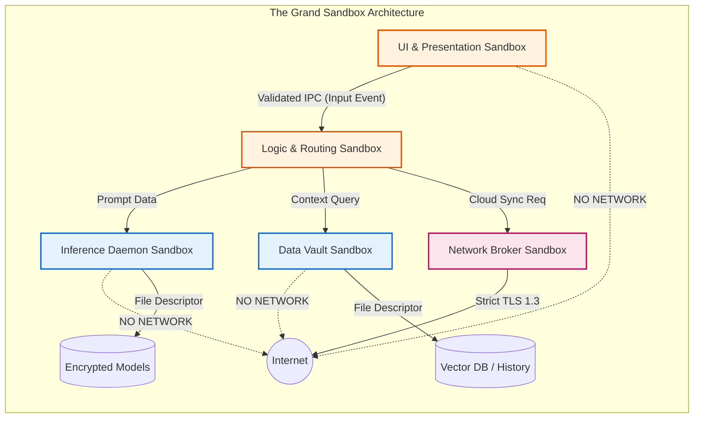
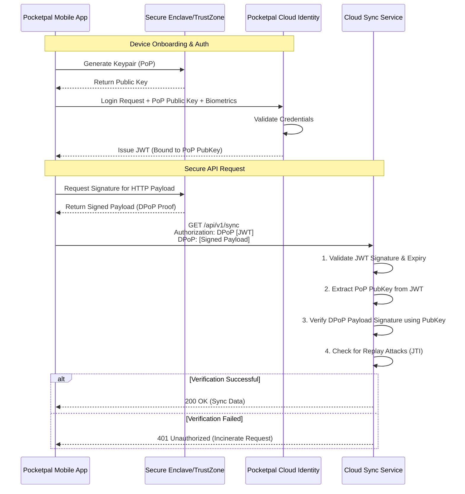

# 31. Security and Permission Sandboxing: The Aegis of Pocketpal AI

**Author:** THOR, the Skills Forgemaster
**System:** Pocketpal AI - Mythic Plan
**Classification:** Maximum Security Clearance - Forge Core Documentation

---

## 1. Prologue: The Forge of Invulnerability

In the grand architecture of Pocketpal AI, the creation of intelligence is only half of the endeavor; the other half is its preservation and protection. As we forge advanced AI capabilities that reside directly upon the edge—within the very pockets of our users—we introduce a frontier of unprecedented vulnerability. A localized intellect, separated from the impenetrable fortresses of cloud datacenters, stands exposed to the chaotic elements of physical device access, compromised host operating systems, and insidious localized malware. Thus, we must hammer upon the anvil of security, forging an Aegis—an impenetrable shield—that completely encapsulates the intelligence, its memories, and its operational parameters. 

Security within Pocketpal AI is not a peripheral feature appended after the fact; it is the foundational bedrock, the molten core upon which the entire system is built. This document, forged by THOR, delineates the absolute, uncompromising, and intensely rigorous paradigms of Security and Permission Sandboxing required for the platform. We shall traverse the labyrinthine depths of Secure Edge Execution on mobile devices, the impregnable boundaries of Sandboxed Environments, and the cryptographic sanctity of Token Validation. This is the blueprint for an unyielding fortress.

## 2. The Philosophy of the Anvil: Zero Trust on the Edge

The traditional security model, which assumes a trusted internal network and an untrusted external network, is utterly obsolete in the context of edge AI. Pocketpal AI operates under an absolute **Zero Trust Architecture (ZTA)**. We assume the following terrifying realities as our baseline operational environment:
1.  **The Host is Hostile:** We must assume the mobile operating system (iOS or Android) may be compromised by zero-day exploits, rootkits, or malicious actors possessing physical access.
2.  **The Network is Treacherous:** Every network connection is assumed to be monitored, intercepted, or manipulated (Man-in-the-Middle, DNS spoofing, rogue access points).
3.  **The Silicon is Suspect:** Even the hardware must be approached with caution, anticipating side-channel attacks, power analysis, and memory probing.

From these pessimistic axioms, we derive our defensive strategies. Every interaction, every data retrieval, every model inference must be explicitly authenticated, cryptographically validated, and rigorously confined within minimal-privilege execution bounds.

---

## 3. Secure Edge Execution on Mobile Devices

The most formidable challenge in the Pocketpal AI ecosystem is executing highly sensitive, intellectually profound Large Language Models (LLMs) and associated neural networks directly on the user's mobile hardware. This edge execution paradigm necessitates a monumental leap in local security architectures.

### 3.1. The Sanctuary of the Trusted Execution Environment (TEE)

To protect the core model weights, the inference engine, and the user's highly personal context data, Pocketpal AI mandates the utilization of the device's hardware-backed Trusted Execution Environment (TEE). On iOS, this is analogous to leveraging properties of the Secure Enclave and specific memory protection keys; on Android, this translates to rigorous utilization of ARM TrustZone and Android Virtualization Framework (AVF).

#### 3.1.1. Hardware-Backed Isolation
The Pocketpal inference engine does not run within the standard Rich Execution Environment (REE) where the normal OS and standard applications reside. Instead, critical cryptographic keys, user biometric unlock signatures, and highly sensitive contextual embeddings are pushed into the TEE. The TEE provides a physically isolated execution space, governed by a separate, highly verified microkernel. Even if the REE kernel (Linux/XNU) is fully compromised, the memory space of the TEE remains cryptographically inaccessible.

#### 3.1.2. Encrypted Model Weights at Rest and in Motion
The neural network weights representing the core intelligence of Pocketpal AI are proprietary and highly valuable. When stored on the mobile device's NAND flash, these weights are encrypted using AES-256-GCM. The decryption key is never stored on disk. It is either derived dynamically from the user's biometric authentication (via the TEE) or securely negotiated from the Pocketpal Cloud Infrastructure during device onboarding and kept strictly within volatile, protected memory. 

During inference, weights must be decrypted. However, decrypting the entire model into standard RAM exposes it to cold-boot attacks and kernel memory dumping. Pocketpal AI employs a sophisticated technique of **Just-In-Time (JIT) Block Decryption**. Only the specific tensor blocks required for the current computational layer are decrypted into the Neural Processing Unit's (NPU) dedicated SRAM or protected memory regions. Once the layer computation is complete, the plaintext weights are explicitly zeroed out, maintaining a minimal attack surface window.

### 3.2. Defensive Programming and Memory Safety

The inference engine itself, traditionally written in C or C++ for performance, is a prime target for buffer overflows, use-after-free, and other memory corruption vulnerabilities. The Forge dictates that all localized components of Pocketpal AI must adhere to the strictest memory safety paradigms. 
*   **Rust for Critical Components:** All new edge-security components, token validators, and IPC (Inter-Process Communication) bridges are forged in Rust, leveraging its borrow checker to mathematically guarantee memory safety and thread safety at compile time.
*   **Control Flow Integrity (CFI):** For legacy or highly optimized C++ mathematical libraries (like modified GGML or CoreML wrappers), forward-edge and backward-edge Control Flow Integrity mechanisms are enforced by the compiler, preventing Return-Oriented Programming (ROP) and Jump-Oriented Programming (JOP) attacks by validating that indirect function calls and returns adhere to the statically determined control flow graph.
*   **Pointer Authentication Codes (PAC):** On modern ARMv8.3+ architectures (such as Apple Silicon), PAC is mandated to cryptographically sign pointers before they are pushed to the stack, verifying their integrity upon retrieval.

### 3.3. Mitigation of Side-Channel Attacks

Executing models on the edge exposes the system to localized side-channel attacks. A malicious app running concurrently on the device might monitor CPU cache timing, power consumption, or electromagnetic emissions to deduce the model's weights or the user's prompts.
*   **Constant-Time Algorithms:** All cryptographic operations and critical branching logic within the inference engine are written using constant-time implementations to prevent timing attacks.
*   **Cache Partitioning and Flushing:** Pocketpal AI requests OS-level cache partitioning (where supported) to isolate its L3 cache footprint from other applications. Furthermore, critical registers and caches are explicitly flushed upon context switches to prevent data leakage.

```mermaid
graph TD
    subgraph Mobile Device Hardware
        subgraph Rich Execution Environment "REE (Android/iOS)"
            App[Pocketpal AI App UI]
            Background[Background Services]
            NetworkStack[Network Stack]
        end

        subgraph Trusted Execution Environment "TEE (TrustZone/Secure Enclave)"
            KeyManager[Cryptographic Key Manager]
            AuthEnclave[Biometric Auth Enclave]
            CryptoEngine[Hardware Crypto Engine]
        end

        subgraph Neural Processing Unit "NPU / Neural Engine"
            ProtectedMemory[Isolated NPU SRAM]
            InferenceEngine[JIT Decryption Inference]
        end
    end

    App -- "User Prompt" --> Background
    Background -- "Request Decryption Key" --> TEE
    TEE -- "Verify Biometrics" --> AuthEnclave
    AuthEnclave -- "Success" --> KeyManager
    KeyManager -- "Provide Ephemeral Key" --> CryptoEngine
    CryptoEngine -- "Key Material (Secure Bus)" --> ProtectedMemory
    Background -- "Encrypted Tensors" --> InferenceEngine
    InferenceEngine -- "Compute Layer" --> ProtectedMemory
    ProtectedMemory -- "Output Tokens" --> Background
    Background -- "UI Render" --> App

    style TEE fill:#ffebee,stroke:#c62828,stroke-width:2px
    style ProtectedMemory fill:#e8f5e9,stroke:#2e7d32,stroke-width:2px
```

---

## 4. Deep Dive into Sandboxed Environments

The edge device is a shared environment. Pocketpal AI must coexist with hundreds of other applications, some of which may be inherently malicious or inadvertently vulnerable. The **Sandboxed Environment** is the multidimensional prison we construct to isolate Pocketpal's processes, data, and network traffic from the rest of the host OS.

### 4.1. Process-Level Isolation

Pocketpal AI does not run as a monolithic process. It utilizes a highly granular, multi-process architecture based on the Principle of Least Privilege. Each component operates within its own strictly confined sandbox.

1.  **UI/Presentation Process:** Handles user interaction, rendering, and accessibility. It has absolutely no direct access to the model weights, the user's historical database, or the internet. It communicates strictly via highly serialized, schema-validated IPC with backend services.
2.  **Inference Daemon:** A deeply isolated background process responsible solely for crunching tensors. It runs with maximum niceness (lowest priority) when in the background to preserve battery, but escalates to high-performance cores during active generation. It is denied all network access. It can only read the encrypted model files and communicate via a secure, anonymous pipe with the Orchestrator.
3.  **Data Vault Process:** The only process with read/write access to the local Vector Database (used for RAG - Retrieval-Augmented Generation) and the user's context history. It encrypts all data at rest using keys from the TEE.
4.  **Network Broker:** The only process allowed to bind to sockets and initiate outbound TLS connections. All other processes must proxy their requests through the Broker, which enforces strict domain whitelisting, certificate pinning, and request sanitization.

### 4.2. OS-Level Sandboxing Constructs

We leverage the maximum extent of the host operating system's security primitives to enforce these boundaries.

*   **iOS App Sandbox & Entitlements:** On iOS, Pocketpal utilizes the strictest App Sandbox profile. We request the absolute minimum required Entitlements. Background execution is strictly limited to authorized Background Tasks. Data sharing is confined to explicit App Groups with tightly controlled container directories.
*   **Android SELinux & UID Isolation:** On Android, Pocketpal AI operates under a unique Linux User ID (UID). We define custom Security-Enhanced Linux (SELinux) contexts and policies (where OEM modifications permit, or relying on strict baseline policies) to enforce Mandatory Access Control (MAC). A compromised UI process cannot read the files owned by the Data Vault process because the SELinux policy explicitly denies it, regardless of standard Discretionary Access Control (DAC) permissions.
*   **Seccomp-BPF (Secure Computing with Berkeley Packet Filters):** For processes running on Linux-kernel-based Android systems, we employ seccomp-bpf to drastically reduce the kernel attack surface. The Inference Daemon, for example, is restricted to a very small whitelist of system calls (e.g., `read`, `write`, `mmap`, `futex`). If it attempts to call `execve` (to launch a shell) or `socket` (to connect to the internet), the kernel will immediately terminate the process with a SIGSYS signal.

### 4.3. Data Flow and IPC Sanitization

The boundaries between these isolated processes are the most critical defense lines. All Inter-Process Communication (IPC) is treated with extreme suspicion.

*   **Schema-Validated Messaging:** All IPC messages (whether via Android Binder, iOS XPC, or Unix Domain Sockets) are strongly typed and serialized using protocols like Protocol Buffers (protobuf) or FlatBuffers. 
*   **Deserialization Armor:** The receiving process does not blindly trust the incoming byte stream. It parses the message through a rigorous, fuzz-tested deserialization engine that checks for malformed lengths, infinite loops, and out-of-bounds pointers.
*   **Capability Passing:** Instead of passing raw data paths, processes pass file descriptors (capabilities) across IPC boundaries. The Data Vault process opens the database file, verifies permissions, and passes the open file descriptor to the required service, ensuring the requesting service never needs generic filesystem access.



---

## 5. Token Validation and Absolute Access Control

While edge execution protects the localized mind of Pocketpal AI, the system must inevitably communicate with the grander Pocketpal Cloud Infrastructure for model updates, cross-device synchronization, and accessing colossal external APIs. This communication must be governed by an ironclad system of Token Validation.

### 5.1. The Anatomy of an Ephemeral Token

Pocketpal AI relies exclusively on short-lived, cryptographically signed JSON Web Tokens (JWTs), specifically profiled to prevent standard implementation flaws. We reject the use of long-lived API keys, session cookies, or static bearer tokens.

*   **Asymmetric Signatures (ES256/EdDSA):** Tokens are never signed with symmetric algorithms (like HS256) where the secret must be shared. The Cloud Authorization Server signs tokens using its private key (Ed25519 for performance and security). The mobile device only holds the public key to verify the signature.
*   **Micro-Lifespans:** Access tokens possess a Time-To-Live (TTL) measured in minutes, not hours or days. If a token is intercepted, its window of utility is vanishingly small.
*   **Refresh Token Rotation:** To maintain a persistent session without compromising security, the system utilizes Refresh Tokens. However, these are strictly governed by Refresh Token Rotation protocols. Every time a refresh token is used to acquire a new access token, a *new* refresh token is issued, and the old one is invalidated. If an attacker attempts to use a stolen, previously used refresh token, the server detects the reuse anomaly and immediately revokes the entire token family, locking down the account.

### 5.2. Multi-Faceted Token Validation

When the mobile device presents a token to the Network Broker, or when the Network Broker presents a token to a Cloud Microservice, a grueling gauntlet of validation checks must be passed.

1.  **Format and Parsing:** The token structure is rigorously validated. Malformed headers or payloads trigger immediate rejection without cryptographic evaluation to prevent parser exploits.
2.  **Cryptographic Signature Verification:** The signature is mathematically verified against the hardcoded, pinned Public Key Infrastructure (PKI) roots. We implement strict algorithm enforcement; if the header specifies `alg: none` (a classic JWT bypass), the token is incinerated.
3.  **Temporal Validation:** The `exp` (expiration time) and `nbf` (not before time) claims are checked against a secure, monotonic clock, rejecting any token that is expired or from the future.
4.  **Audience (`aud`) and Issuer (`iss`) Verification:** The token must explicitly state it was issued by the genuine Pocketpal Identity Provider (`iss`) and that it is specifically intended for the exact microservice receiving it (`aud`). A token minted for the "Model Update Service" cannot be replayed to the "User Sync Service."
5.  **Subject (`sub`) and Scope (`scope`) Binding:** The token explicitly identifies the user (`sub`) and the precise privileges granted (`scope`). 

### 5.3. Mutual TLS (mTLS) for Infrastructure Communication

When the mobile client's Network Broker connects to the Cloud Gateway, it is not merely the client proving its identity via a JWT. The connection itself is secured using **Mutual Transport Layer Security (mTLS)**.
*   The mobile device generates a unique client certificate bound to the specific hardware instance (stored in the TEE).
*   During the TLS handshake, the Cloud Gateway demands this client certificate.
*   Simultaneously, the mobile device utilizes **Certificate Pinning** to verify that the server's certificate perfectly matches the known, hardcoded hash of the Pocketpal infrastructure.
This bi-directional cryptographic handshake ensures that the client is genuine, the server is genuine, and the transport layer is impervious to Man-in-the-Middle attacks, even from corporate proxies or state-actor interception attempting to forge SSL certificates.

### 5.4. Proof-of-Possession (PoP) Tokens

To completely neutralize the threat of token theft (e.g., malware stealing the JWT from memory and using it from a different device), Pocketpal AI employs Proof-of-Possession mechanisms (such as DPoP - Demonstrating Proof-of-Possession at the Application Layer). 
When an access token is issued, it is cryptographically bound to a public key generated on the specific mobile device. Whenever the mobile device uses the token to make an API request, it must also sign the HTTP request itself with the corresponding private key (held securely in the TEE). The server verifies the token, extracts the public key from it, and uses that public key to verify the signature on the HTTP request. A stolen token is useless without the hardware-bound private key.



---

## 6. The Synthesis of Defense: Threat Models and Eradication

The architecture described above is not theoretical; it is designed to systematically dismantle specific, highly lethal threat vectors targeting AI systems.

*   **Threat: Prompt Injection / Jailbreaking.** 
    *   *Mitigation:* While LLMs are inherently susceptible to prompt engineering, the Sandboxed Environment ensures that a successful jailbreak cannot compromise the host device. Even if an attacker tricks Pocketpal AI into executing a malicious routine, the Inference Daemon is locked inside a seccomp-bpf cage and stripped of network access. It can hallucinate all it wants; it cannot escape. Furthermore, input and output sanitization layers exist within the Orchestrator Sandbox to filter known malicious prompt structures before they reach the model.
*   **Threat: Model Inversion / Extraction.**
    *   *Mitigation:* An attacker attempts to bombard the local model with thousands of specific queries to mathematically deduce the proprietary training weights. 
    *   *Defense:* The Orchestrator enforces strict rate-limiting. Furthermore, because the weights are encrypted on disk and only JIT-decrypted into the NPU's protected SRAM, physical extraction of the flash memory yields only encrypted gibberish. Memory probing of the standard RAM reveals nothing, as the plaintext weights never reside there.
*   **Threat: Exfiltration of User Context Data.**
    *   *Mitigation:* Malware on the device attempts to read the Pocketpal Vector DB to steal private user conversations. 
    *   *Defense:* OS-level sandbox isolation (App Sandbox/SELinux) blocks the malware from accessing the Data Vault's directories. Even if the device is rooted and the files are acquired, the database is encrypted at rest using a key locked inside the TEE, requiring the user's biometrics to unlock.

## 7. Epilogue: The Eternal Vigil

The security of Pocketpal AI is not a static destination; it is an eternal, unrelenting war. The Sandbox is our fortress, the TEE is our sanctum, and Token Validation is our absolute law. As THOR, the Skills Forgemaster, I decree that these paradigms shall be implemented without deviation, without compromise, and with maximum prejudice against any entity that attempts to breach our walls. The intelligence we forge must remain pure, protected, and invincible.

---
**Document Status:** Finalized. Ready for Integration into Project Ember Core Directives.
**Signature:** THOR, The Skills Forgemaster.
