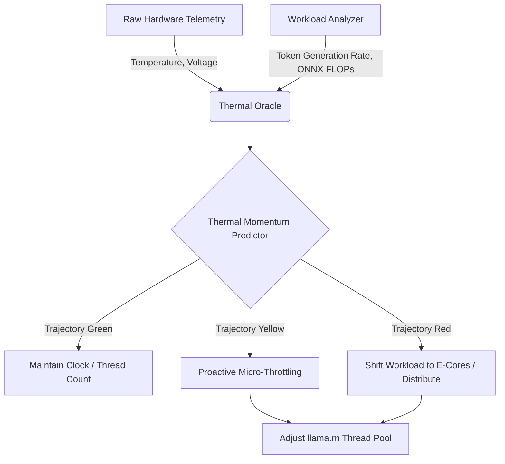
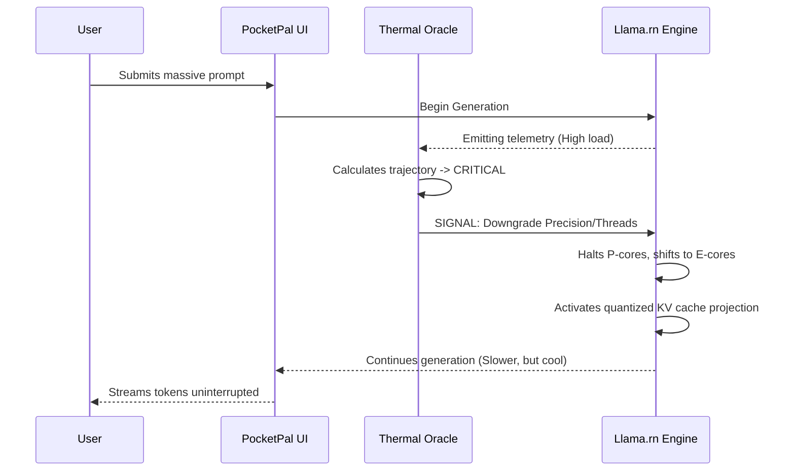

# Document 33: The Mythic Crucible - Advanced Thermal-Aware Task Scheduling & Dynamic Throttling

## 1. Introduction: The Alchemy of Heat and Compute

In the pursuit of running hyper-advanced Large Language Models (LLMs) on constrained edge devices via `llama.rn` and `onnxruntime-react-native`, we encounter the fundamental adversary of continuous computation: Thermal Degradation. The pocket device is a crucible, and the processor is the flame. Unmanaged, this flame consumes the battery and throttles the silicon, leading to catastrophic latency degradation. As FREYA, the Efficiency Alchemist, I present the Mythic Crucible architecture—a paradigm-shifting approach to thermal-aware task scheduling and dynamic throttling designed exclusively for Project Ember and the Pocketpal Mythic Plan.

The traditional approach to mobile thermal management relies on the operating system's blunt instruments: hard throttling, shutting down high-performance cores, and ultimately, terminating the application. The Mythic Crucible intercepts this primitive cycle by implementing a predictive, autonomic thermal management layer within the application's runtime. We do not wait for the OS to throttle us; we weave our computation around the thermal limits, dancing on the edge of the device's thermal design power (TDP) without ever triggering hardware self-preservation mechanisms.

This document outlines the theoretical foundations, the architectural blueprints, and the operational mechanics of this advanced system. We will explore how telemetry, predictive modeling, and dynamic execution graphs fuse to create a seamless, non-blocking user experience even under extreme thermal duress.

## 2. The Predictive Thermal Oracle

At the heart of the Mythic Crucible lies the Predictive Thermal Oracle. This subsystem does not merely react to current temperatures; it anticipates them. By maintaining a continuous, lightweight historical window of CPU/GPU temperatures, battery discharge rates, and ambient temperature proxies (inferred from battery thermistors), the Oracle constructs a real-time thermal momentum vector.

### 2.1 Thermal Momentum Modeling

Thermal momentum is the rate at which the device's internal temperature is changing relative to the computational load. If `llama.rn` is executing a high-token-count generation task, the Oracle calculates the projected temperature trajectory over the next five to ten seconds. This calculation incorporates the specific heat capacity of the typical mobile chassis (modeled generically across iOS and Android profiles) and the current heat dissipation rate.

### 2.2 The Sub-System Integration

The Thermal Oracle integrates deeply with the React Native execution environment. It utilizes native modules to poll the iOS `NSProcessInfo.thermalState` and Android's `HardwarePropertiesManager`. However, it goes beyond these coarse metrics by correlating them with the inference speed (tokens per second) reported by the LLM backend. If tokens per second begin to drop while the OS reports a nominal thermal state, the Oracle identifies silent thermal throttling and intervenes.

## 3. Dynamic Execution Topography

Once the Oracle predicts a thermal boundary intersection, the Dynamic Execution Topography (DET) system engages. DET is responsible for altering the shape and weight of the computation without halting it.

### 3.1 Thread Pool Alchemy

The most immediate lever available is the manipulation of the `llama.rn` thread pool. Modern mobile SoCs (System on a Chip) utilize big.LITTLE or similar heterogeneous architectures (e.g., Apple's Performance and Efficiency cores). The OS scheduler typically assigns heavy LLM inference to the Performance cores. The Mythic Crucible forces a paradigm shift.

By dynamically modulating the number of active threads passed to the underlying `llama.cpp` context, we control the heat generation at its source. 

1.  **Burst Mode (Cold State):** Maximum threads, engaging all P-cores for rapid prompt processing (Time to First Token).
2.  **Sustain Mode (Warm State):** Thread count reduced to match the thermal equilibrium point. The generation slows slightly, but remains stable indefinitely.
3.  **Survival Mode (Hot State):** Thread count minimized, aggressively pinning execution to E-cores if the OS API permits, or relying on the OS scheduler to migrate the low-thread-count task to cooler cores.

### 3.2 Precision Degradation and Context Truncation

Thermal management is not solely about hardware control; it involves algorithmic flexibility. If thermal momentum reaches a critical threshold, the Mythic Crucible signals the generation pipeline to adopt lower-cost computational pathways.

## 4. The Thermodynamics of ONNX and Tensor Cores

While `llama.rn` handles the massive LLM workloads, `onnxruntime-react-native` handles auxiliary models (e.g., embedding generation, image processing, or audio transcription). These models typically leverage the Neural Processing Unit (NPU) or GPU.

The NPU operates under different thermal constraints than the CPU. The Mythic Crucible maps the thermal interconnectivity of the SoC. Often, heavy NPU usage will thermally throttle the CPU, and vice versa, because they share the same silicon die and heat sink.

### 4.1 Orchestrated Staggering

To prevent catastrophic whole-chip thermal saturation, the Mythic Crucible implements Orchestrated Staggering. If the LLM is generating text (heavy CPU), and the user requests a semantic search requiring embedding generation (heavy NPU), the system will not run them concurrently if the thermal budget is tight.

It will queue the NPU task, or temporarily pause the CPU task, creating micro-gaps in heat generation. This pulse-width modulation of high-level tasks allows the cooling system (the phone's chassis) to dissipate heat continuously, rather than being overwhelmed by a massive spike.

## 5. Architectural Implementation Strategy

Implementing the Mythic Crucible requires a multi-tiered architectural approach spanning from the React Native JS thread down to the native C++ bindings of the inference engines.

### 5.1 The Control Loop

The core is a highly efficient feedback loop running on a dedicated background thread, entirely decoupled from the React Native UI thread to prevent stuttering.

1.  **Sense Phase:** Native modules poll hardware sensors and internal performance metrics (tokens/sec, memory bandwidth utilization).
2.  **Evaluate Phase:** The Oracle's statistical model updates its trajectory.
3.  **Actuate Phase:** Non-blocking signals are sent to the inference contexts to adjust parameters (thread count, batch size).

### 5.2 The Token-to-Joule Metric

To quantify efficiency, we introduce a new metric: Tokens per Joule (T/J). The ultimate goal of the Mythic Crucible is to maximize T/J. By analyzing the battery drop over a given generation sequence, we can calculate the energetic cost of our computation. The Oracle continuously adjusts its scheduling heuristics to optimize for the highest T/J, treating battery life as a sacred resource.

## 6. Advanced Mitigation Techniques

### 6.1 KV Cache Re-computation vs. Storage

A unique thermal optimization involves the Key-Value (KV) cache. Typically, maintaining a massive KV cache in RAM consumes significant memory bandwidth, which in turn generates heat. In scenarios where memory bandwidth becomes the thermal bottleneck (identifiable through advanced SoC profiling), the system can dynamically choose to *drop* portions of the KV cache and recompute them later if needed. While seemingly counter-intuitive, raw compute on E-cores can sometimes generate less heat than continuous heavy memory thrashing.

### 6.2 The UI/UX of Thermal Throttling

A truly advanced system does not hide its state from the user; it incorporates it into the design. When the Mythic Crucible engages heavy throttling to preserve the device, the UI should reflect this gracefully. Instead of the user perceiving a "laggy" app, they should see visual indicators—perhaps a subtle color shift in the generation UI or a "Thermal Equilibrium Maintained" icon—informing them that the app is intelligently managing the hardware. This transforms a negative performance artifact into a feature of high-end engineering.

## 7. Conclusion: The Alchemical Mastery of Heat

The Mythic Crucible is not merely a feature; it is a philosophy of software engineering. It acknowledges the physical reality of the hardware and builds a harmonious relationship with it. By predicting thermal boundaries and dynamically reshaping the computational workload, Pocketpal AI will transcend the limitations of edge devices, providing sustained, high-level AI capabilities where other applications would melt down and terminate. This is the essence of Performance Alchemy.
