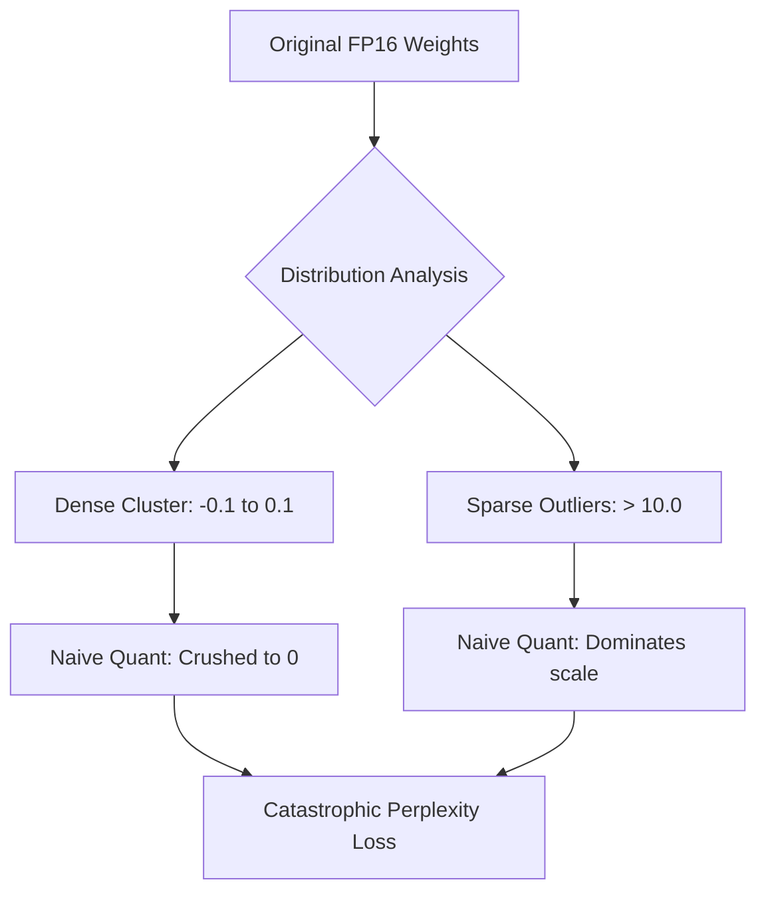
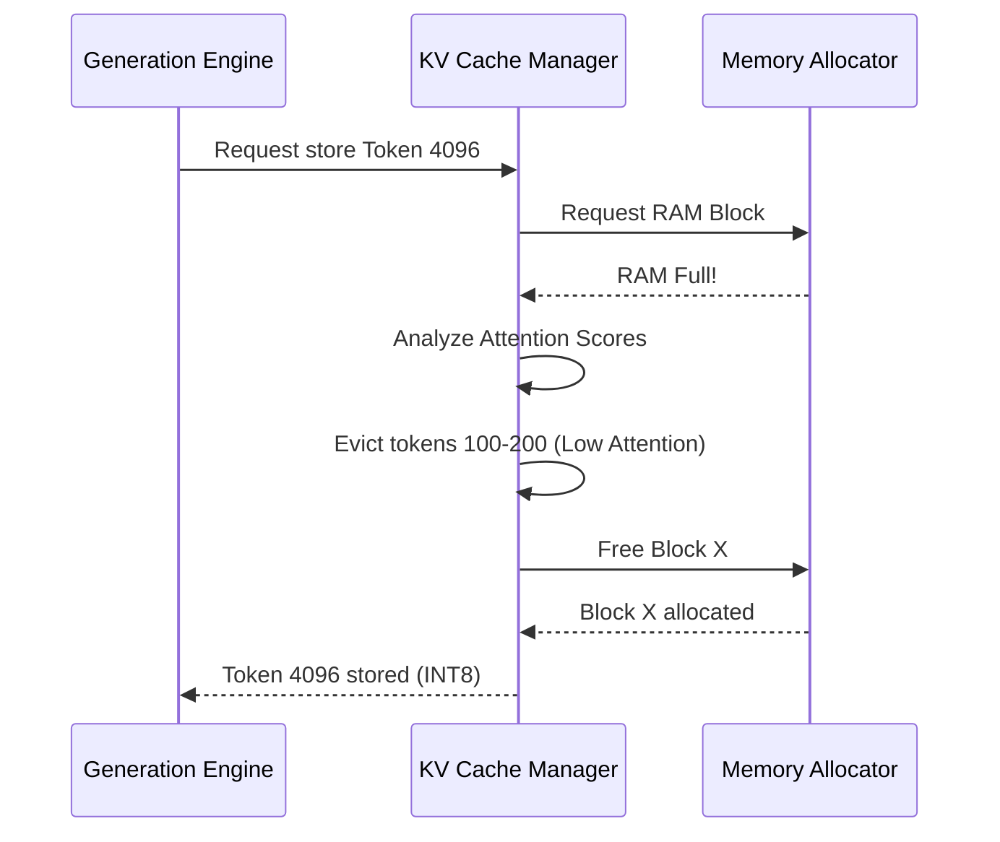

# Document 34: Quantum Forging - Sub-4-Bit Quantization Strategies, Mixed-Precision Architectures, and Activation Compression

## 1. Introduction: Forging Intelligence from the Void

In the mythos of Project Ember, we are not merely running models; we are bending the fabric of computation to fit within the impossible confines of mobile silicon. The central challenge of on-device Large Language Models (LLMs) via `llama.rn` is memory bandwidth and RAM capacity. A standard 8-billion parameter model at 16-bit precision demands 16 gigabytes of RAM—a luxury unavailable on most edge devices. 

To break this barrier, we must engage in "Quantum Forging": the extreme compression of neural weights and activations without devastating the model's perplexity. This document details the absolute bleeding-edge techniques required to achieve sub-4-bit effective quantization, leveraging mixed-precision architectures, outlier-aware quantization, and dynamic activation compression. This is how we distill a titan into a pocket watch.

## 2. The Limits of Traditional Quantization

Traditional quantization (like standard INT8 or naive INT4) operates uniformly. It scales all weights within a tensor down to a lower precision representation. While effective, it hits a hard perplexity wall below 4 bits. The loss of representational capacity destroys the model's ability to retain nuanced knowledge and reasoning capabilities.

The problem lies in the distribution of neural weights. They are not uniformly important. A small percentage of weights—the "outliers"—carry disproportionate significance. If you blindly squash these outliers into a tiny 4-bit bin alongside thousands of near-zero weights, the network collapses.

### 2.1 The Outlier Catastrophe

Consider a tensor where 99% of values are between -0.1 and 0.1, but a few critical activation weights are at 15.0. A naive linear quantization scheme spanning the min and max will dedicate the vast majority of its representational bins to empty space, while the dense cluster of small weights is crushed into a single value (zero).

## 3. Advanced Sub-4-Bit Strategies: The GGUF Alchemy

To push below 4 bits (e.g., to 3-bit, 2-bit, or fractional bit-rates like 2.5bpw), we must utilize the advanced features of the GGUF format and the `llama.cpp` backend, elevating them with custom preprocessing and mixed-precision topography.

### 3.1 K-Quants and Non-Linear Binning

The foundation of our approach is the k-quantization system (e.g., Q4_K, Q3_K). Unlike naive block quantization, k-quants divide tensors into super-blocks and sub-blocks, applying different scales and precisions hierarchically.

For extreme compression, we deploy non-linear, k-means-derived binning. Instead of evenly spaced quantization steps, the steps are clustered where the weights are dense.

1.  **Block-Level Scaling:** The tensor is divided into blocks of 256 weights. Each block has an FP16 scale factor.
2.  **Sub-Block Precision:** Within the block, sub-blocks (e.g., 32 weights) might be quantized to 3-bit, while the scale factor is retained at higher precision.
3.  **Outlier Preservation:** The most critical breakthrough is identifying the outlier weights during the conversion process and deliberately keeping them in FP16 or INT8, while aggressively compressing the rest to 2-bit.

### 3.2 Mixed-Precision Topography (The MoQA Approach)

Not all layers in a transformer are created equal. The initial embedding layers and the final output layers (the LM head) are incredibly sensitive to quantization noise. The middle layers, particularly the dense feed-forward networks (FFNs), are remarkably robust.

The Mythic Plan dictates a Mixed-Precision Topography. We do not quantize the entire model to Q3_K. Instead, we perform an automated sensitivity analysis (using a calibration dataset) to map the fragility of every layer.

*   **Embedding/LM Head:** Retained at Q8_0 or FP16. (High importance, small size).
*   **Early/Late Attention Layers:** Quantized to Q4_K_M.
*   **Deep FFN Layers:** Aggressively crushed to Q2_K or experimental ternary weight formats.

## 4. Activation Compression: The Silent Memory Killer

Quantizing weights solves the storage and initial loading problem. However, during generation, the model must maintain the Key-Value (KV) cache for every token in the context window. At large context sizes (e.g., 8k or 16k tokens), the KV cache can easily consume more RAM than the model weights themselves.

### 4.1 KV Cache Quantization

Standard KV caches store activations in FP16. We must implement aggressive KV cache quantization to INT8 or even INT4.

The challenge here is dynamic range. Unlike weights, which are static, activations change dynamically based on the input prompt. We cannot pre-calculate perfect scale factors.

1.  **Dynamic Per-Token Scaling:** As each token's Keys and Values are generated, we calculate a dynamic scale factor on the fly. The FP16 vector is divided by the maximum absolute value in that specific vector, quantized to INT8, and stored alongside the single FP16 scale factor.
2.  **Streaming Outliers:** Recent research (like SmoothQuant or AWQ) shows that activation outliers tend to emerge in specific hidden dimensions. We can apply a static, pre-calculated transformation matrix to the weights that "smoothes" the activation landscape, pulling the outliers down and pushing the dense weights up, making the activations far easier to quantize dynamically without loss.

### 4.2 Paged Attention and Cache Eviction

When the KV cache exceeds the physical limits of the device, we cannot simply crash. We must implement an OS-like paging system for the mind of the AI.

The KV cache is divided into blocks (e.g., 16 tokens per block). We implement a Least Recently Used (LRU) or Attention-Weighted Eviction policy.

*   **Attention-Weighted Eviction:** We monitor the attention scores during generation. Tokens that the model consistently ignores (low attention weights) have their KV cache blocks compressed further (from INT8 to INT4) or evicted entirely to slower storage, keeping the highly attended "anchor tokens" in high-precision fast RAM.

## 5. The Forge in Practice: Implementation Hurdles

Implementing these extreme quantization techniques in a React Native environment requires navigating severe bottlenecks.

### 5.1 The C++ / JS Boundary

All quantization, mixed-precision mapping, and dynamic scaling MUST occur entirely within the C++ layer of `llama.rn`. The React Native JS bridge is far too slow to handle tensor manipulation or even coordinate the eviction of KV cache blocks. The JS layer should only be aware of high-level state (e.g., "Memory Critical, engaging paging").

### 5.2 Device-Specific Optimization (ARM NEON and Metal)

The math required to de-quantize sub-4-bit weights on the fly during matrix multiplication is intensely complex. If the CPU spends all its time unpacking the weights, the generation speed will plummet, negating the memory bandwidth benefits.

We must rely on highly optimized, hand-written assembly kernels for ARM NEON (Android) and Apple Silicon (iOS/Metal). For Q2_K, the unpacking must happen directly in the registers of the SIMD units. We structure the data layout in memory specifically to align with the cache lines of the Snapdragon or Apple A-series chips.

## 6. The Holy Grail: 1.5-Bit and Ternary Weights

Looking to the immediate future of Project Ember, we must architect the system to support the emerging frontier of extreme quantization: BitNet and Ternary architectures.

In these models, weights are constrained to just three values: {-1, 0, 1}. This requires 1.58 bits per weight. The implications are staggering. Matrix multiplication (which requires expensive Floating Point Units) is completely replaced by simple integer addition and subtraction.

While we cannot convert an existing Llama model to a true BitNet without retraining, the infrastructure we build now—the ability to handle bizarre sub-byte memory alignments, the custom SIMD unpacking kernels, and the dynamic precision topography—will make Pocketpal AI uniquely positioned to deploy these ultra-efficient architectures the moment they become available.

## 7. Conclusion: The Edge of Feasibility

Quantum Forging is not a single technique; it is an arsenal of aggressive optimizations. By carefully mapping the sensitivity of the neural network, deploying non-linear sub-block quantization, smoothing activations dynamically, and implementing intelligent, attention-aware cache paging, we can force models designed for data centers to run smoothly on a device powered by a lithium-ion battery. We trade mathematical purity for pragmatic magic, achieving the impossible through sheer engineering violence and alchemical precision.
