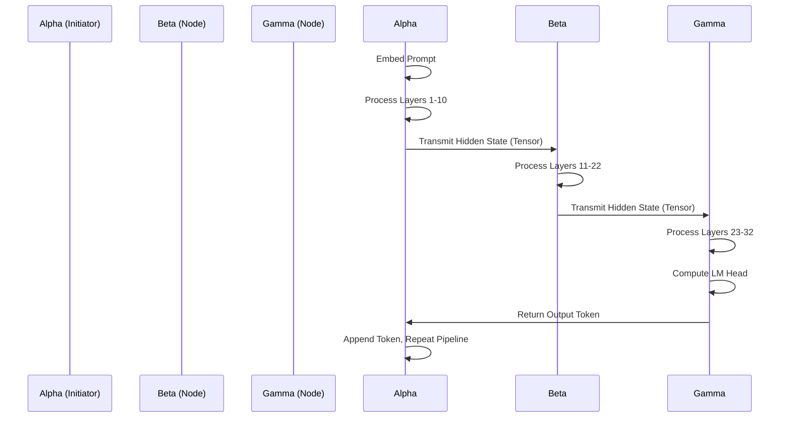
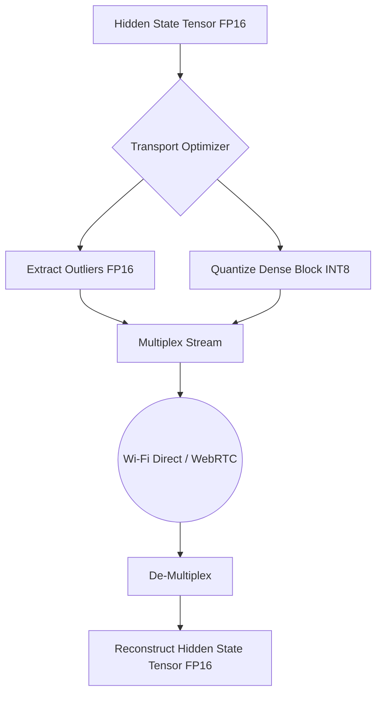

# Document 35: The Distributed Ember - Cross-Device Peer-to-Peer Compute Orchestration and Edge-Mesh Neural Processing

## 1. Introduction: The Hive Mind Awakening

The fundamental limitation of edge AI is the isolated nature of the compute node. A single smartphone possesses a finite amount of RAM, memory bandwidth, and thermal dissipation capacity. When the demands of a monolithic Large Language Model exceed these physical boundaries, the application fails. However, the modern environment is rarely populated by a single isolated device. We are surrounded by latent computational power: other phones, tablets, laptops, and smart home hubs. 

Project Ember introduces the concept of the "Distributed Ember"—a radical paradigm shift from isolated edge inference to Edge-Mesh Neural Processing. By orchestrating a peer-to-peer compute cluster formed spontaneously by proximal devices, we transcend the limitations of a single silicon die. We shatter the monolithic model, distributing its layers across a localized mesh network, turning a collection of constrained devices into a singular, immensely powerful supercomputer.

This document outlines the theoretical architecture and practical implementation strategies for Cross-Device Peer-to-Peer Compute Orchestration, focusing on high-bandwidth transport layers, dynamic tensor pipelining, and fault-tolerant mesh topologies.

## 2. The Theoretical Physics of Distributed Inference

Distributed inference of a transformer model is fundamentally an exercise in pipeline parallelism. We are not splitting the matrix multiplication of a single layer across devices (tensor parallelism), as the network latency would immediately choke the compute. Instead, we split the model *depth-wise*.

### 2.1 Depth-Wise Pipeline Parallelism

Consider a 32-layer LLM and three devices: Device Alpha (the initiator), Device Beta, and Device Gamma.

1.  **Device Alpha (Layers 1-10):** Takes the raw text prompt, generates the initial embeddings, and processes the first block of transformer layers. It then transmits the intermediate hidden state tensor to Device Beta.
2.  **Device Beta (Layers 11-22):** Receives the tensor, processes the middle layers, and transmits the resulting hidden state to Device Gamma.
3.  **Device Gamma (Layers 23-32):** Receives the tensor, processes the final layers, calculates the logits through the LM head, and transmits the final chosen token back to Device Alpha.

### 2.2 The Latency vs. Bandwidth Equation

The viability of the Distributed Ember hinges entirely on the interconnect. The data transmitted between devices is not a text string; it is a dense, high-dimensional tensor (e.g., a hidden state matrix of size `[batch_size, sequence_length, hidden_dimension]`).

If `hidden_dimension` is 4096, and we are processing a single token (`sequence_length = 1`), the tensor at FP16 precision is `1 * 1 * 4096 * 2 bytes = ~8 KB`. Transmitting 8 KB across a local Wi-Fi network takes less than a millisecond.

However, during the initial prompt processing (prefill phase), the `sequence_length` might be 1000 tokens. The tensor size explodes to `1000 * 4096 * 2 bytes = ~8 MB`. Transmitting 8 MB across a Bluetooth connection is disastrously slow, resulting in massive latency spikes.

Therefore, the orchestration layer must intelligently manage the prefill vs. generation phases.

## 3. The Interconnect Fabric: Transport Layer Alchemy

To achieve the necessary bandwidth and latency, Pocketpal AI must employ an adaptive, multi-protocol transport layer. We cannot rely on cloud servers to route traffic; this must be entirely localized, true peer-to-peer.

### 3.1 Wi-Fi Direct and Apple Multipeer Connectivity

The primary transport mechanism must be local Wi-Fi. 
*   **Android:** We utilize Wi-Fi Direct (P2P), allowing Android devices to form a high-bandwidth ad-hoc network without requiring a central router.
*   **iOS:** We leverage Apple's Multipeer Connectivity framework, which abstractly manages Wi-Fi and Bluetooth to create local sessions.
*   **Cross-Platform:** For interoperability between iOS and Android, we must fall back to a localized WebRTC data channel, utilizing mDNS (Multicast DNS) for zero-configuration local discovery, bypassing standard internet signaling servers.

### 3.2 Tensor Compression over the Wire

Even with Wi-Fi Direct, transmitting 8MB tensors during the prefill phase introduces unacceptable latency. We must compress the intermediate hidden states before transmission.

Since we are already employing aggressive quantization for the model weights (as detailed in Document 34), we apply similar techniques to the transmission tensor. Before transmission, Device Alpha quantizes the 8MB FP16 tensor to an 8-bit or 4-bit representation, reducing the payload to 4MB or 2MB, transmitting it, and Device Beta immediately de-quantizes it back to FP16 before feeding it into layer 11.

This introduces a slight quantization error into the hidden state, which can accumulate. We must utilize outlier-aware quantization for the transport layer, ensuring the massive activation spikes (which carry critical contextual information) are transmitted accurately, while the dense noise is compressed.

## 4. Autonomic Mesh Topography and Load Balancing

The Ember Mesh is not a static cluster. Devices join and leave; batteries drain; thermal throttles engage. The orchestration layer must be autonomic, constantly evaluating the health and capability of the mesh and re-distributing the workload dynamically.

### 4.1 The Capability Handshake

When a device joins the mesh, it performs a capability handshake. It broadcasts its hardware profile (NPU teraflops, CPU core count), current available RAM, battery level, and thermal state.

The Initiator (Device Alpha) acts as the ephemeral master node. It runs a lightweight optimization algorithm to calculate the ideal layer split.

*   If Device Beta is an iPad Pro with a massive GPU and M-series chip, and Alpha is an older iPhone, Alpha will offload 80% of the layers to Beta.
*   If Alpha's Thermal Oracle (Document 33) detects an impending thermal throttle, it dynamically shifts more layers to the network, sacrificing slight latency to prevent a total thermal shutdown of the primary device.

### 4.2 Fault Tolerance and The Healing Mesh

What happens if Device Beta is turned off or walks out of Wi-Fi range mid-generation? A naive pipeline would crash instantly.

The Distributed Ember implements **Redundant Layer Overlap**. The models are not split perfectly cleanly. 

1.  Alpha holds layers 1-15.
2.  Beta holds layers 10-32.

If Beta disconnects at layer 12, Alpha detects the timeout. Because Alpha possesses up to layer 15, it can continue processing locally while simultaneously searching for a new node (Device Gamma) to take over the remaining layers. This overlapping redundancy ensures the generation stream stutters, but does not catastrophically fail, when the mesh topography shifts.

## 5. Security and Privacy in the Hive

Distributing computation raises immense privacy concerns. We are transmitting the user's hidden states (the mathematical representation of their prompt and the AI's thoughts) to external devices.

The Distributed Ember enforces absolute zero-trust architecture.

1.  **Ephemeral Key Exchange:** When the mesh forms, the devices execute a localized Diffie-Hellman key exchange over the P2P connection.
2.  **Encrypted Tensor Transport:** All tensors transmitted over the wire are encrypted via AES-256-GCM. 
3.  **Anonymized Hidden States:** While difficult to reverse-engineer an exact prompt from a deep hidden state (e.g., layer 15), it is theoretically possible. To mitigate this, we inject cryptographic noise into the unused dimensions of the tensor, obscuring the data without affecting the forward pass of the neural network (as the network has learned to ignore those dimensions).

## 6. The Ultimate Vision: Heterogeneous Asymmetric Inference

The true power of the Distributed Ember lies in its ability to pool heterogeneous resources. We are not just chaining three identical phones. We are chaining a phone (CPU), a smart TV (idle GPU), and a local desktop (massive VRAM).

In this scenario, we move beyond simple depth-wise splitting. We can implement **Speculative Decoding across the Mesh**.

The smartphone (Alpha) runs a tiny, ultra-fast 1-billion parameter draft model. It generates 5 tokens instantly. It sends these 5 tokens to the desktop PC (Gamma) sitting on the same Wi-Fi network. Gamma is running the massive 70-billion parameter "Mythic" target model. Gamma evaluates all 5 draft tokens in parallel in a single forward pass. It accepts 4 of them, corrects the 5th, and sends the verified sequence back to Alpha.

The smartphone appears to generate text from a 70B model at the speed of a 1B model, powered invisibly by the latent compute of the environment.

## 7. Conclusion: Shattering the Silicon Ceiling

The Distributed Ember is the most ambitious component of the Pocketpal Mythic Plan. It requires overcoming immense challenges in P2P networking, tensor compression, and dynamic graph compilation. However, the reward is the complete eradication of hardware limitations. By transforming isolated edge devices into a fluid, self-healing, and incredibly powerful neural mesh, we unlock the true potential of decentralized Artificial Intelligence. We stop fighting the constraints of the pocket, and start utilizing the power of the room.
