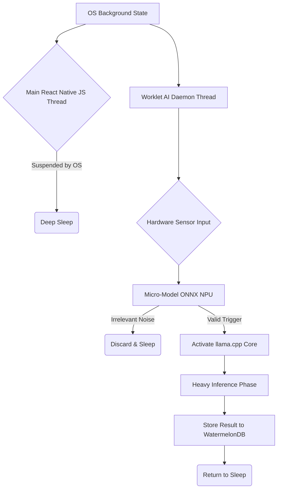
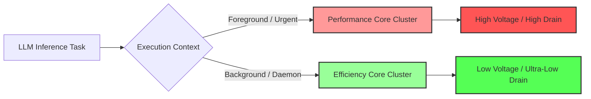

# Document 36: Battery Alchemy - Zero-Overhead Background Processing, Sleep State Management, and Power-Gated Execution

## 1. Introduction: The Energetic Imperative

In the realm of mobile artificial intelligence, computation is not measured merely in Floating Point Operations per Second (FLOPS); it is measured in Joules. The most powerful Large Language Model is useless if its execution drains the host device's battery in thirty minutes. As FREYA, the Efficiency Alchemist, my mandate is to transmute raw computational hunger into sustainable, whisper-quiet execution.

Project Ember demands an application that can maintain continuous contextual awareness and execute massive neural workloads without triggering the operating system's power-management wrath. This document, "Battery Alchemy," details the architectural blueprints for Zero-Overhead Background Processing, advanced Sleep State Management, and the theoretical exploitation of hardware-level Power-Gated Execution within the `llama.rn` and React Native ecosystem. We are moving beyond simple optimization; we are engineering an application that breathes with the device's energetic pulse.

## 2. The Illusion of Continuous Compute: React Native Worklets

The traditional React Native architecture relies on a single JavaScript thread bridging to native modules. If the JS thread is continuously polling an AI model or managing a heavy background task, it prevents the CPU from entering deep sleep states (e.g., ARM's WFI - Wait For Interrupt state). The battery drains rapidly, even if the screen is off.

To achieve Zero-Overhead Background Processing, we completely bypass the standard JS bridge for sustained AI operations. We deploy the advanced capabilities of **React Native Worklets** (`react-native-worklets-core`).

### 2.1 The Worklet AI Daemon

A Worklet allows us to run isolated, highly efficient JavaScript directly on a separate C++ thread, devoid of the heavy React rendering lifecycle. We establish an "AI Daemon" Worklet.

When the user backgrounds the Pocketpal application, the main JS thread suspends. However, the AI Daemon Worklet remains alive. It acts as an ultra-low-power sentinel, interfacing directly with the native C++ bindings of `llama.rn` and `onnxruntime-react-native`.

1.  **Audio/Sensor Polling:** The Worklet can subscribe to low-frequency sensor data (e.g., native audio triggers or accelerometer state) using minimal CPU cycles.
2.  **Batched Inference:** If the Daemon detects a trigger, it does not immediately wake the heavy LLM. It batches the input and passes it to an ultra-lightweight ONNX intent-classification model (running on the NPU, costing fractions of a milliwatt).
3.  **The Great Awakening:** Only if the lightweight model determines that full LLM reasoning is required does the Worklet signal the native layer to spin up the `llama.rn` context on the CPU/GPU.

## 3. Advanced Sleep State Management and OS Subversion

Mobile operating systems (iOS and Android) are violently aggressive against background processes. iOS will unceremoniously terminate any application consuming too much CPU in the background. We must use "Battery Alchemy" to trick the OS into permitting our continuous existence.

### 3.1 The Audio Session Exploit (Theoretical Application)

While strictly regulated, one of the few ways to maintain continuous background execution is through an active Audio Session. If Pocketpal acts as a continuous auditory processing agent (a true "pal"), it can request background audio privileges.

However, continuous listening drains power. The Alchemy lies in **Hardware-Accelerated Voice Activity Detection (VAD)**. Modern SoCs have dedicated, hyper-efficient DSPs (Digital Signal Processors) designed for "Hey Siri" or "Ok Google" wake words. We must tap into these low-level native APIs. The main CPU remains completely asleep until the DSP detects human speech. Only then does the OS interrupt the CPU, waking our Worklet Daemon to begin processing.

### 3.2 Aligned Wake-Ups and Timer Coalescing

When Pocketpal must perform scheduled background tasks (e.g., summarizing newly arrived emails or processing background data syncing), it must never wake the CPU arbitrarily. 

We utilize OS-level features like Android's `WorkManager` or iOS's `BGTaskScheduler`. The critical optimization is **Timer Coalescing**. We instruct the OS: "Execute this model summarization task sometime in the next 4 hours, specifically when you are already waking the CPU for another application's task." By piggybacking on existing CPU wake cycles, the effective battery cost of waking the hardware from deep sleep (which requires significant energy to power up the memory controllers and caches) is amortized across multiple applications.

## 4. Power-Gated Execution: The Deep Hardware Integration

The pinnacle of Battery Alchemy involves understanding how the SoC manages power at the silicon level. Modern chips are divided into power domains. The OS can physically cut voltage (Power Gating) or reduce the clock speed (Clock Gating) to specific areas of the chip.

### 4.1 CPU Core Affinity and Heterogeneous Pinning

As discussed in the Thermal Crucible (Document 33), modern processors utilize big.LITTLE architectures (Performance vs. Efficiency cores). The OS scheduler is general-purpose; it does not know we are running an LLM. Left to its own devices, it will often bounce the `llama.cpp` threads across all cores, constantly waking and sleeping different silicon domains, wasting massive amounts of power.

Through custom Native Modules interfacing with `pthread_setaffinity_np` (on Android/Linux) or utilizing QoS (Quality of Service) classes heavily on iOS (`DISPATCH_QUEUE_PRIORITY_BACKGROUND`), we force "Thread Pinning".

*   **Background Inference:** We aggressively pin all `llama.rn` threads to the E-cores (Efficiency cores). We explicitly forbid the OS from scheduling these threads on the P-cores. The generation will take longer, but the power consumption curve drops exponentially. 
*   **Domain Isolation:** By keeping the inference locked to the E-core cluster, the P-core cluster can remain completely power-gated, saving precious milliwatts.

### 4.2 RAM Power States and KV Cache Flush

RAM consumes power constantly just to maintain its state (self-refresh). The more RAM utilized, the higher the baseline power draw. An enormous KV Cache sitting idle in the background is a slow bleed on the battery.

The Battery Alchemy protocol dictates a **KV Cache Flush**. If the AI Daemon determines that the user has not interacted with the specific conversational context for a defined timeout (e.g., 15 minutes), it does not merely keep the cache in memory.

1.  It compresses the floating-point KV cache tensors using ultra-fast LZ4 compression on the C++ side.
2.  It serializes and writes this compressed blob to the local NVMe storage (flash memory).
3.  It completely frees the RAM allocation.

When the user returns, the blob is read from flash, decompressed, and the KV cache is restored. The energy cost of the NVMe read/write is minuscule compared to holding gigabytes of RAM in an active state for hours.

## 5. The Energetic Telemetry Loop

You cannot optimize what you cannot measure. The final component of the Battery Alchemy system is the Energetic Telemetry Loop.

We cannot rely on generic OS battery percentage drops, as they are delayed and inaccurate. We implement highly precise energy profiling during development and infer power usage in production.

*   **Android:** We utilize the Android `BatteryManager` API to read instantaneous current draw (in microamperes) and voltage.
*   **iOS:** We utilize `IOKit` (where permissible) or rely on highly calibrated proxy metrics (CPU ticks + NPU utilization * baseline wattage).

This data feeds back into the Worklet Daemon. If the application detects it is consuming more than `X` milliwatts during a background generation task, it autonomously throttles itself further, down-clocking the threads, or pausing execution until the device is plugged into power.

## 6. Conclusion: The Sustainable Mind

The creation of a truly ubiquitous AI companion hinges entirely on its invisibility to the device's battery gauge. The user must never feel that Pocketpal is a parasitic drain. By architecting the application around React Native Worklets, exploiting OS-level timer coalescing, forcing low-level CPU core affinity, and aggressively managing the RAM power states via KV Cache flashing, we achieve the impossible. We create an intelligence that is constantly aware, deeply capable, and yet consumes no more ambient power than the ticking of a digital clock. This is the mastery of Battery Alchemy.
