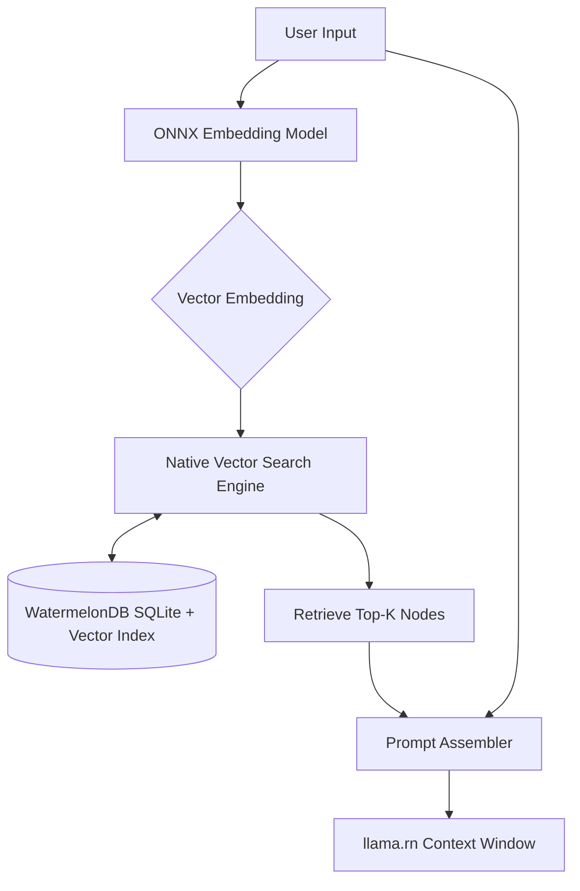
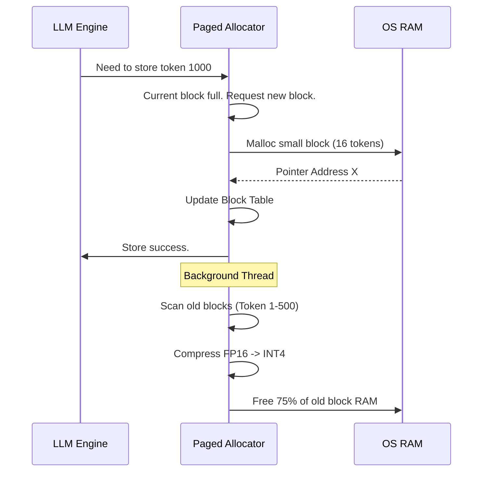

# Document 37: The Memory Forge - WatermelonDB Synergy, Paged Attention Memory Allocation, and KV Cache Compression

## 1. Introduction: The Architecture of Infinite Recall

The defining characteristic of an advanced AI companion is not merely its intelligence in the moment, but its capacity for enduring memory. It must remember conversations from months ago, recall obscure facts parsed from documents, and maintain a coherent persona over thousands of interactions. On cloud-based systems, memory is cheap; on a mobile device, memory is the most fiercely contested resource.

Project Ember demands a revolutionary approach to data persistence and active memory management. We cannot simply load entire chat histories into the LLM context window—it would instantly exhaust the device's RAM. We must forge a system that seamlessly blends long-term disk storage with highly optimized, dynamically allocated active memory. 

This document, "The Memory Forge," details the synergistic architecture connecting the React Native WatermelonDB layer with the low-level C++ memory allocators of `llama.rn`. We will explore the implementation of on-device Retrieval-Augmented Generation (RAG), the adaptation of Paged Attention for mobile silicon, and extreme KV Cache compression techniques.

## 2. The WatermelonDB Synergy: The Subconscious Mind

WatermelonDB is a highly optimized, reactive database framework for React Native, built on top of SQLite. It is designed to handle tens of thousands of records without blocking the main JS thread. In the Mythic Plan, WatermelonDB acts as the "Subconscious Mind" of Pocketpal AI.

### 2.1 The Long-Term Memory Schema

Every interaction, every generated thought, and every parsed document is serialized and stored within WatermelonDB. However, a raw text dump is useless for rapid AI recall. The schema must be explicitly designed for semantic retrieval.

*   **Nodes:** The fundamental unit of memory. A Node could be a user message, an AI response, an image description, or a paragraph from an uploaded PDF.
*   **Embeddings:** Crucially, every Node is accompanied by a dense vector embedding (e.g., a 384-dimensional float array generated by a lightweight ONNX embedding model running on the NPU).
*   **Edges (Relations):** Nodes are connected via Edges, forming a localized Knowledge Graph. An Edge might link a user's statement about their dog to a previous Node where the dog's name was established.

### 2.2 On-Device Retrieval-Augmented Generation (RAG)

When the user queries the AI, we do not feed the entire chat history to the LLM. Instead, we execute an ultra-fast semantic search.

1.  **Query Embedding:** The user's prompt is passed to the ONNX embedding model to generate a query vector.
2.  **Vector Search (Native Extension):** While WatermelonDB handles relational data beautifully, raw SQLite is poor at vector similarity search. We must implement a custom Native C++ extension (e.g., integrating `hnswlib` or a custom FAISS implementation) that maps directly to the WatermelonDB file system, bypassing JS entirely for the search phase.
3.  **Context Assembly:** The top-K most relevant Nodes are retrieved, structured into a concise prompt template, and injected into the `llama.rn` context window.

## 3. The Active Mind: Paged Attention on the Edge

While WatermelonDB handles the subconscious long-term storage, the LLM must maintain the "Active Mind"—the Key-Value (KV) cache of the current, ongoing conversation.

Traditional LLM inference pre-allocates a massive, contiguous block of RAM for the KV cache based on the maximum possible sequence length. If the max context is 8192 tokens, 8192 tokens worth of RAM are reserved immediately, even if the current prompt is only 10 tokens long. On a mobile device, this contiguous memory requirement often leads to Immediate Out Of Memory (OOM) crashes because mobile operating systems heavily fragment the RAM.

### 3.1 The vLLM Inspiration: Paging the Brain

We must adapt the "Paged Attention" algorithm (pioneered by vLLM for data centers) for the edge environment within `llama.rn`.

Paged Attention shatters the requirement for contiguous memory. It views the KV cache not as a single array, but as a virtual memory space divided into small, fixed-size blocks (e.g., 16 tokens per block). 

1.  **Block Allocation:** When the generation begins, the memory allocator requests small, non-contiguous blocks of RAM from the OS.
2.  **The Block Table:** A lightweight mapping table (the Block Table) translates the logical sequence of tokens in the LLM's mind to the fragmented physical blocks scattered across the device's RAM.
3.  **Zero-Waste Scaling:** As the conversation grows, new blocks are allocated dynamically. There is zero wasted pre-allocated memory. 

### 3.2 Dynamic Defragmentation

Because mobile RAM is so constrained, even fragmented blocks can fill up. The Memory Forge implements a background defragmentation thread. If the system detects memory pressure, it can pause inference for a microsecond, copy active KV blocks into newly freed larger contiguous segments (if available), and update the Block Table, optimizing memory access patterns for the CPU cache.

## 4. Extreme KV Cache Compression

Even with Paged Attention solving the fragmentation and pre-allocation waste, the sheer volume of a large context KV cache can overwhelm physical RAM. We must implement extreme KV Cache Compression within the blocks themselves.

### 4.1 Precision Degradation (INT8/INT4 KV Cache)

Standard FP16 KV caches are a luxury we cannot afford. The Memory Forge enforces dynamic precision degradation.

*   **Recent Tokens:** The most recently generated tokens (e.g., the last 512) are crucial for immediate syntactic coherence. Their KV blocks are maintained in higher precision (FP16 or INT8).
*   **Distant Tokens:** Tokens from earlier in the conversation provide semantic context but do not require perfect floating-point representation. As blocks age, a background native thread compresses them down to INT4 or even lower custom formats.

The `llama.cpp` inference kernel must be heavily modified (via custom metal/NEON kernels) to perform the attention matrix multiplication by dynamically unpacking the INT4 cache blocks on the fly during the forward pass.

### 4.2 Semantic Eviction (The Forgetful Cache)

We push beyond simple compression to outright algorithmic eviction. Not all tokens are equally important.

By analyzing the attention weights during previous forward passes, the system identifies "junk tokens" (e.g., filler words, formatting characters, or highly repetitive phrases) that the model rarely attends to.

The Paged Allocator can choose to completely evict the KV data for these junk tokens from the block. During the attention calculation, if a token's KV data is missing, it is simply treated as a zero-value. This "Semantic Eviction" allows us to maintain the illusion of a massive context window while only actually storing the structurally and semantically vital anchor tokens in RAM.

## 5. Conclusion: The Synthesis of Storage and Thought

The Memory Forge is the bridge between dead data and active intelligence. By combining the reactive, long-term persistence of WatermelonDB with highly optimized native vector search, we grant Pocketpal AI a vast subconscious. By replacing naive contiguous memory allocation with Edge-Optimized Paged Attention and aggressive, attention-aware KV cache compression, we allow the active mind of the LLM to operate within the suffocating constraints of mobile RAM. We are not just storing data; we are engineering the architecture of infinite, dynamic recall.
