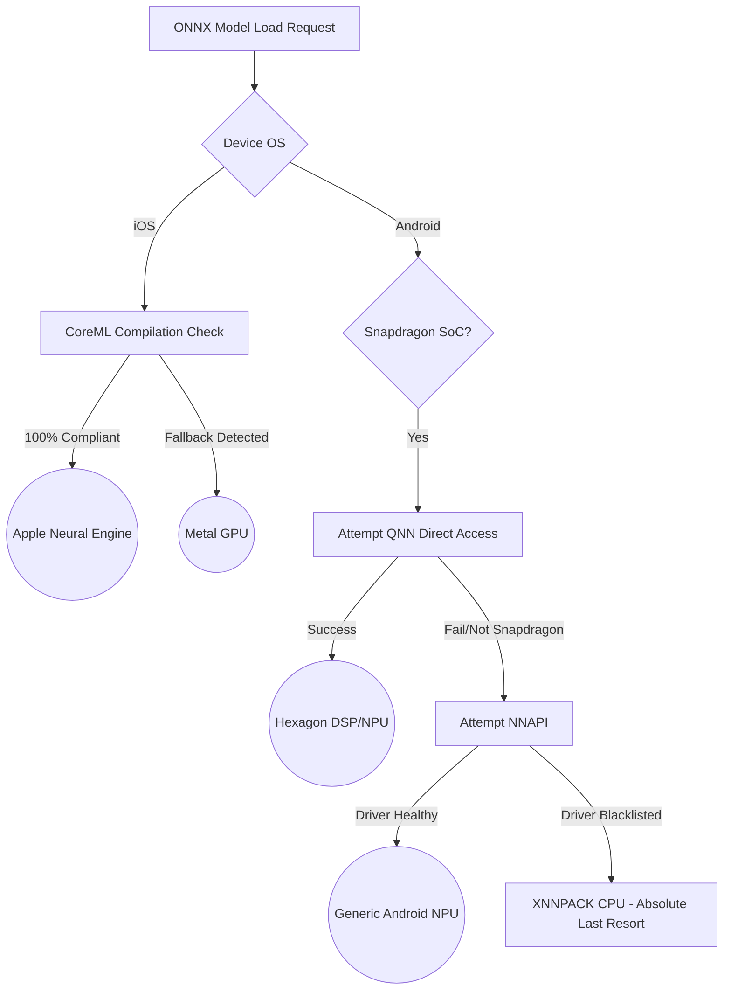

# Document 38: ONNX Acceleration Alchemy - NPU/GPU Offloading, Tensor Core Exploitation, and Heterogeneous Compute

## 1. Introduction: The Heterogeneous Matrix

To rely solely on the Central Processing Unit (CPU) for the entirety of an AI companion's workload is an architectural fallacy. Modern Systems-on-Chip (SoCs), particularly Apple's A/M-series and Qualcomm's Snapdragon lines, are vast, heterogeneous landscapes. They house specialized silicon specifically forged for matrix multiplication: Graphics Processing Units (GPUs) and Neural Processing Units (NPUs/Neural Engines). 

While `llama.rn` handles the massive, autoregressive token generation—often requiring the CPU due to complex dynamic memory access patterns and extreme quantization that NPUs struggle to parse—a myriad of critical auxiliary models support the Ember ecosystem. These include vision encoders (CLIP), embedding models (MiniLM), acoustic models (Whisper/VAD), and text-to-speech vocoders. 

This document, "ONNX Acceleration Alchemy," details the extreme exploitation of these specialized hardware blocks using `onnxruntime-react-native` (ORT). We will explore the bypass of generic CPU fallback, the enforcement of CoreML and NNAPI execution providers, and the delicate orchestration of asynchronous heterogeneous compute to achieve zero-latency perception.

## 2. The Execution Provider Hierarchy

The ONNX Runtime is not a monolithic engine; it is a router. When an ONNX model is loaded, ORT attempts to map the model's graph of mathematical operations to an "Execution Provider" (EP). 

The naive, default implementation always falls back to the CPU EP. This is safe, universally compatible, and catastrophically slow. The Alchemical imperative requires forcing the graph onto the silicon designed for it.

### 2.1 iOS: The CoreML Mandate

On Apple silicon, the Neural Engine is the supreme target. It offers teraflops of INT8 compute at a fraction of the power cost of the GPU or CPU.

1.  **Strict EP Fallback Prevention:** We must configure the ORT session with the `CoreML` execution provider prioritized. However, if a single operation within the ONNX graph is unsupported by CoreML, ORT will silently partition the graph, bouncing the execution back to the CPU mid-inference. This context-switching destroys performance.
2.  **Graph Surgery:** Before deployment, every ONNX model (e.g., the embedding generator) must undergo rigorous "Graph Surgery." Using tools like ONNX GraphSurgeon, we analyze the model for CoreML incompatibilities (often bizarre reshapes or unsupported activation functions). We mathematically fuse or rewrite these nodes into CoreML-compliant equivalents. The goal is 100% graph compilation onto the Neural Engine.
3.  **ANE Bypass (The Metal Alternative):** Some highly dynamic models (like certain vision transformers) cause the Apple Neural Engine (ANE) compiler to thrash. In these edge cases, we explicitly target the `Metal` EP, leveraging the GPU. The Metal EP provides massive parallel bandwidth, far exceeding the CPU, though at a slightly higher thermal cost than the ANE.

### 2.2 Android: The NNAPI and QNN Labyrinth

The Android ecosystem is fractured. Different manufacturers implement different NPUs (Hexagon, Mali, Exynos NPU).

1.  **NNAPI (Neural Networks API):** The primary abstraction layer. We prioritize the `NNAPI` EP. However, NNAPI drivers are notoriously buggy. We must implement a "Driver Health Check" upon application initialization, testing a dummy model. If the NNAPI driver crashes or returns garbage data, we black-list it for that specific device session.
2.  **Qualcomm QNN (The Holy Grail):** For Snapdragon devices, relying on generic NNAPI leaves massive performance on the table. Project Ember mandates the integration of the Qualcomm Neural Network (QNN) Execution Provider. This allows direct, low-level access to the Hexagon DSP and Tensor Accelerators, bypassing the Android OS abstraction layer entirely. This requires compiling a custom version of `onnxruntime-react-native` bundling the QNN libraries, but the performance leap (often 3x-5x over NNAPI) justifies the engineering violence.

## 3. Asynchronous Heterogeneous Orchestration

Executing models fast is only half the battle. If the main React Native JS thread is blocked while waiting for the NPU to process an image, the UI stutters, and the illusion of intelligence shatters.

We must implement Asynchronous Heterogeneous Orchestration. This means managing concurrent compute workloads across the CPU (llama.rn), the NPU (ORT CoreML), and the GPU (React Native UI/Metal) simultaneously, without any pipeline stalling.

### 3.1 The Triple-Buffer Perception Pipeline

Consider the scenario where the user activates the device camera, asking the AI, "What am I looking at?"

A naive implementation would: Capture Frame -> Block -> Run Vision Encoder -> Block -> Run LLM -> Block -> Speak.

The Alchemical implementation utilizes a Triple-Buffer Pipeline:

1.  **Buffer 1 (Capture - GPU/ISP):** The `react-native-vision-camera` captures a frame directly to a GPU texture. The JS thread is never touched.
2.  **Buffer 2 (Encode - NPU):** A native Worklet (see Document 36) intercepts the GPU texture, resizes it via hardware, and feeds it directly into the ONNX Vision Encoder (e.g., MobileVLM encoder) running on the CoreML NPU.
3.  **Buffer 3 (Reason - CPU):** As soon as the NPU produces the image embedding tensor, it is pushed into a lock-free queue. The `llama.rn` engine, sitting idle on the CPU, instantly pulls the tensor and begins generating text. 

While the CPU is generating text for Frame 1, the NPU is already encoding Frame 2, and the GPU is capturing Frame 3. Continuous, overlapping, zero-latency perception.

```mermaid
sequenceDiagram
    participant Camera (ISP/GPU)
    participant Vision Model (NPU via ORT)
    participant Llama Engine (CPU)
    participant User Output
    
    rect rgb(30, 30, 30)
    Note over Camera, User Output: Time Slice T=1
    Camera->>Vision Model: Feed Frame 1 (GPU Memory)
    end
    
    rect rgb(40, 40, 40)
    Note over Camera, User Output: Time Slice T=2
    Camera->>Vision Model: Feed Frame 2
    Vision Model->>Llama Engine: Push Embedding 1 (Instant)
    Llama Engine->>Llama Engine: Begin generation (Frame 1)
    end
    
    rect rgb(50, 50, 50)
    Note over Camera, User Output: Time Slice T=3
    Camera->>Vision Model: Feed Frame 3
    Vision Model->>Llama Engine: Push Embedding 2
    Llama Engine->>User Output: Stream Text (Frame 1)
    Llama Engine->>Llama Engine: Continue/Shift generation
    end
```

## 4. Tensor Memory Zero-Copy Architectures

Moving data between the CPU, GPU, and NPU is incredibly expensive in terms of time and battery. The ultimate optimization in the ONNX Acceleration Alchemy is the pursuit of "Zero-Copy."

When the NPU generates an embedding, it stores the result in its dedicated memory space (or a partitioned segment of unified memory). If the CPU needs to read that embedding to feed it to `llama.cpp`, the OS typically executes a deep memory copy (`memcpy`), pausing execution and draining power.

By utilizing advanced native bridging (e.g., `IOSurface` on Apple or AHardwareBuffer on Android), we map the physical memory address of the NPU's output tensor directly into the virtual memory space of the `llama.cpp` process. The `llama.cpp` engine reads the data directly from where the NPU deposited it. Zero bytes are copied. 

This requires writing highly unsafe, deeply integrated C++ JNI/Objective-C++ code that circumvents the standard ORT React Native bindings entirely for the most critical tensors.

## 5. Conclusion: The Master Orchestrator

The edge device is not a single computer; it is a network of highly specialized micro-computers. Treating it as a monolith guarantees failure. By enforcing strict execution provider routing within `onnxruntime-react-native`, engaging in rigorous graph surgery, establishing overlapping asynchronous pipelines, and ruthlessly pursuing zero-copy memory architectures, we unleash the true theoretical capability of the silicon. We transform the mobile device from a struggling calculator into a master orchestrator of heterogeneous compute.
