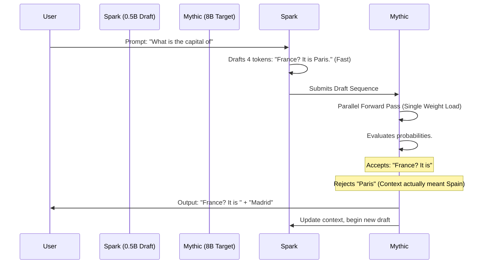
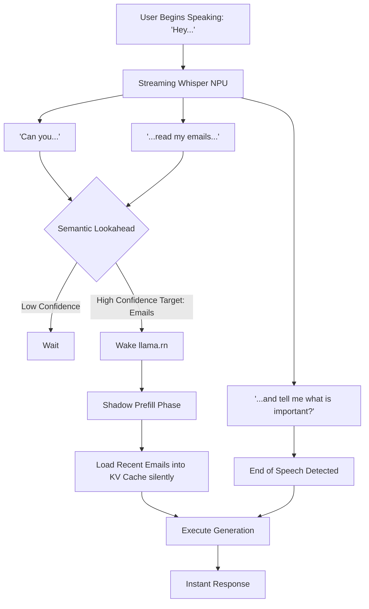

# Document 39: The Resonance Protocol - Latency Eradication through Speculative Decoding and Predictive Prefetching

## 1. Introduction: The War on Latency

In the design of an autonomous, highly responsive AI companion, latency is the ultimate enemy. The human brain perceives conversations with delays exceeding 200 milliseconds as disjointed and unnatural. Achieving sub-200ms Time-To-First-Token (TTFT) and high-throughput generation on edge devices, where memory bandwidth is fiercely constrained, requires an architectural leap beyond raw compute optimization.

Project Ember introduces "The Resonance Protocol"—a dual-pronged strategy for eradicating latency. It merges the theoretical brilliance of Speculative Decoding (adapted for edge silicon) with ultra-aggressive Predictive Prefetching. We do not wait for the user to finish speaking, nor do we generate tokens linearly. We anticipate, we draft, and we verify. This document details the engineering requirements to weave this protocol into the fabric of `llama.rn` and the broader Pocketpal architecture.

## 2. Speculative Decoding on the Edge: The Draft and Verify Paradigm

Autoregressive text generation is mathematically bottlenecked by memory bandwidth. To generate one token, the CPU must load the entire multi-gigabyte model weight tensor from RAM. To generate 10 tokens, it must load that massive tensor 10 times. The compute units sit idle, starving for data while the memory bus struggles.

Speculative Decoding breaks this autoregressive chokehold. It leverages the realization that evaluating multiple proposed tokens simultaneously in a single forward pass is barely more computationally expensive than evaluating a single token.

### 2.1 The Target and the Drafter

The protocol requires two models residing in RAM simultaneously:

1.  **The Target Model (The Mythic):** A highly capable, highly quantized large model (e.g., Llama-3 8B Q4_K_M). This model provides the required intelligence but is slow (e.g., 5 tokens/second).
2.  **The Drafter Model (The Spark):** An ultra-tiny, heavily compressed model (e.g., a 0.5B to 1B parameter model, or a specialized n-gram lookahead). This model is "dumb" but blindingly fast (e.g., 50 tokens/second).

### 2.2 The Resonance Cycle

The generation process shifts from a linear loop to a "Resonance Cycle":

1.  **Rapid Drafting:** The Spark model rapidly generates a sequence of *N* tokens (e.g., 5 tokens) based on the current context. Because it is tiny, this takes milliseconds. `[The, quick, brown, fox, jumps]`
2.  **Parallel Verification:** The Mythic model takes the entire drafted 5-token sequence and evaluates it in a single, parallel forward pass. Instead of loading its massive weights 5 times, it loads them once.
3.  **Acceptance/Rejection:** The Mythic model calculates the probabilities for each position. 
    *   If the Spark's drafted token matches the Mythic's expected high-probability distribution, the token is accepted.
    *   The moment the Spark deviates unacceptably (e.g., Mythic determines "fox" was wrong, it should be "dog"), the sequence is truncated. The Mythic accepts `[The, quick, brown]`, outputs its correct token `[dog]`, and discards `[jumps]`.
4.  **Iteration:** The cycle repeats from the new context.

If the Spark model guesses correctly even 60% of the time, the effective generation speed of the massive Mythic model doubles or triples, as memory bandwidth bottlenecks are bypassed by the batch verification.

### 2.3 The VRAM Constraint and Layer-Sharing

Running two models simultaneously is terrifying for mobile RAM limits. The Resonance Protocol dictates architectural layer-sharing. The Spark and Mythic models must be co-trained or aligned such that they share the exact same embedding layer and vocabulary matrix (the largest single tensors in the model). The C++ allocator explicitly maps these tensors to the same physical memory space for both `llama.cpp` contexts, saving hundreds of megabytes.

## 3. Predictive Prefetching: Erasing the Speed of Light

Speculative Decoding accelerates generation once the prompt is received. Predictive Prefetching aims to accelerate the Time-To-First-Token (TTFT) by anticipating the prompt before the user has finished formulating it.

### 3.1 Continual Acoustic Evaluation

When the user activates voice mode, they rarely begin speaking the core command immediately. There are pauses, filler words ("Uhm, hey Pocketpal, could you..."), and syntactical structure.

Instead of waiting for the user to stop speaking (the end-of-speech marker) to process the audio, the Resonance Protocol utilizes the Worklet Daemon (Document 36) to perform **Continual Acoustic Evaluation**.

1.  **Streaming Transcription:** The audio is streamed through a lightweight ONNX Whisper-tiny model on the NPU in 500ms chunks.
2.  **Semantic Lookahead:** As words are transcribed ("Could... you... summarize..."), an ultra-fast local N-gram model predicts the likely trajectory of the sentence. 
3.  **Shadow Prefill:** The moment the system has high confidence in the subject of the request (e.g., detecting the word "summarize" and identifying the currently active document on the screen), the `llama.rn` engine silently wakes up. It begins performing the mathematically heavy "prefill" phase (processing the context document into the KV cache) *while the user is still speaking the rest of the sentence.*

By the time the user finishes saying "...this document for me?", the model has already ingested the 2000-token document. The TTFT drops from 4 seconds to 150 milliseconds.

### 3.2 UI/UX Prefetch Triggers

Predictive Prefetching extends beyond voice. The React Native UI layer must be instrumented with intentional, high-signal prefetch triggers.

*   **Keyboard Focus:** The moment the user taps into the text input field, the LLM context is loaded from disk to RAM. We do not wait for the "Send" button.
*   **Scroll Velocity:** If the user is scrolling rapidly through an old chat and slows down significantly, stopping on a specific message, the system predicts a likely interaction (e.g., asking a follow-up). The KV cache blocks for that specific conversational epoch are proactively paged from NVMe back into active RAM (see Document 37).

## 4. The Thermodynamics of Resonance

Speculative Decoding and Predictive Prefetching are mathematically efficient, but they trade memory bandwidth for intense compute bursts. Evaluating 5 tokens in parallel spikes the CPU ALUs (Arithmetic Logic Units) harder than evaluating one token sequentially.

The Resonance Protocol is therefore tightly bound to the Thermal Oracle (Document 33). If the device is running hot, the Resonance Protocol is dynamically scaled back. 
*   **Hot State:** Draft sequence length drops from 5 to 2.
*   **Critical State:** Speculative Decoding is disabled entirely to prevent a thermal shutdown, falling back to slow but cool sequential generation.

## 5. Conclusion: The Illusion of Thought

Latency is the barrier between a tool and a companion. The Resonance Protocol dismantles this barrier through aggressive algorithmic anticipation. By deploying a parasitic draft model to break the memory bandwidth bottleneck, and by pre-computing context while the user is still forming their intent, we create the illusion of instantaneous thought. Pocketpal AI will not feel like it is computing an answer; it will feel as though it already knew it. This is the alchemy of speed.
