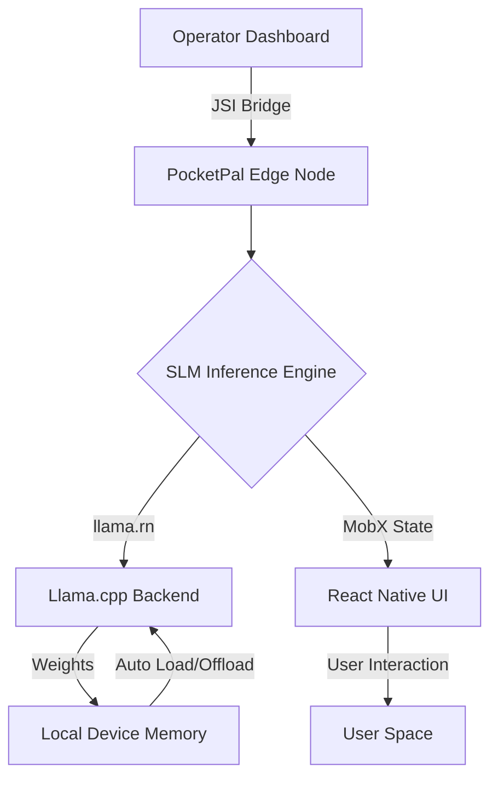
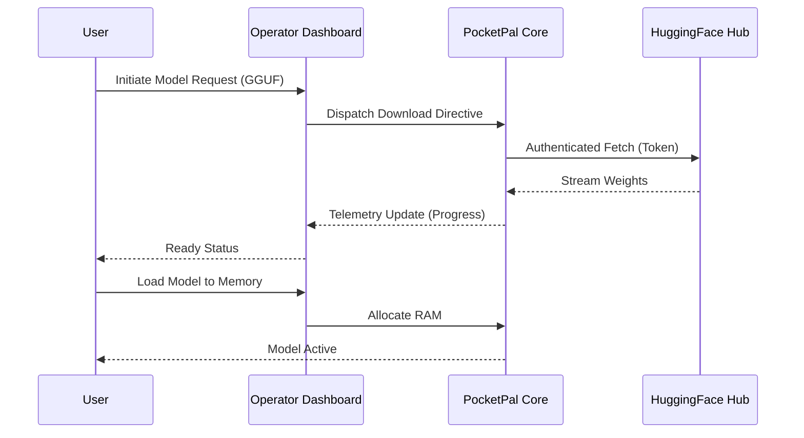
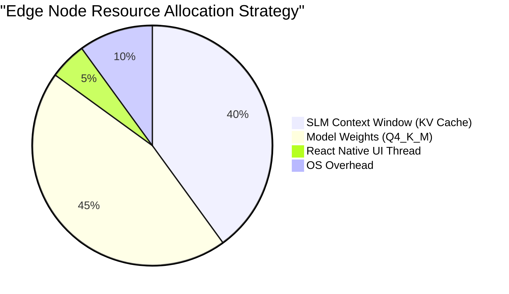

# 41 Pocketpal Core Integration\n\n> **Author:** BALDR, the Visionary Chronicler\n> **Project:** Ember x Pocketpal AI\n> **Classification:** ABSOLUTE / MYTHIC\n\n## I. Architectural Prelude\n\nThe synergy between the local file system and the Hugging Face hub is managed by a robust download manager. This manager handles network interruptions, partial downloads, and checksum verification with mathematical precision. The user is shielded from this complexity, presented only with a progress bar and a promise of future intelligence. This seamless acquisition of knowledge is a cornerstone of the Project Ember vision.\n\nCentral to this mythic integration is the Operator Dashboard, an omniscient yet strictly local panopticon that allows the user to orchestrate the symphony of neural weights. The dashboard is not a mere user interface; it is a cybernetic command center. It visualizes the intricate dance of tokens per second (t/s), memory bandwidth utilization, and the fluid dynamics of context window management. Through a React Native bridge optimized with JSI constraints, the dashboard provides a frictionless, zero-latency reflection of the underlying Llama.cpp engine's heartbeat.\n\nPhilosophically, the decentralization of intelligence is an imperative of the modern digital age. We are witnessing the democratization of thought generation. By embedding models capable of complex reasoning directly into the silicon of mobile devices (iOS and Android), Pocketpal AI democratizes access to synthetic intellect. The roadmap charted by Project Ember envisions a future where each device is an autonomous intellectual entity, capable of roleplay, task automation, and ambient assistance without ever transmitting a single byte of personal data to an external server.\n\nThe Visionary Chronicler, BALDR, decrees that the documentation of this system must be as robust as the system itself. This documentation is not merely technical instruction; it is the sacred text of the decentralized AI movement. Every line of code, every architectural decision, must be aligned with the philosophy of user empowerment. The Pocketpal Mythic Plan is the blueprint for a rebellion against the cloud.\n\nThe Visionary Chronicler, BALDR, decrees that the documentation of this system must be as robust as the system itself. This documentation is not merely technical instruction; it is the sacred text of the decentralized AI movement. Every line of code, every architectural decision, must be aligned with the philosophy of user empowerment. The Pocketpal Mythic Plan is the blueprint for a rebellion against the cloud.\n\nTelemetry within the Pocketpal ecosystem is an exercise in introverted analysis. Rather than streaming analytics to a corporate overlord, the benchmarking framework conducts exhaustive self-diagnostics. It measures the latency of prompt processing (time-to-first-token) and the sustained throughput of generation. This telemetry is presented to the user through the Operator Dashboard in real-time, offering granular insights into how different quantization schemes and model architectures interact with the thermal and power envelopes of their specific mobile processor.\n\nThe architectural masterplan dictates a strict adherence to React Native's cross-platform capabilities, yet demands native-level performance. The synthesis of React Native Paper for the fluid, materialistic UI and the raw computational power of C++ backends creates a dualistic system. It is elegant on the surface, brutal in its computational efficiency beneath. This duality is the core tenet of the UX Masterplan: absolute simplicity for the user, absolute complexity managed by the system.\n\nConsider the philosophical implications of an offline AI ecosystem. It is a bunker against digital collapse. Should the global network falter, the Pocketpal node remains functional, a repository of knowledge and reasoning. This resilience is not merely technical; it is ideological. It reasserts the primacy of the individual's hardware over the collective's server farm.\n\nBenchmarking is elevated from a developer tool to a user-facing game. By participating in the AI Phone Leaderboard, users become nodes in a decentralized hardware survey. They test the limits of their silicon, comparing their metrics against global averages. The Operator Dashboard transforms raw data (tokens/sec, context size) into badges of honor, fostering a community of edge AI enthusiasts.\n\nMemory management in a constrained edge environment is a heroic battle against the limitations of modern mobile RAM. Pocketpal's auto load/offload mechanisms act as an intelligent hypervisor, swapping model weights into active memory only when the user's attention is focused on the interaction. This dynamic memory orchestration ensures that the OS does not ruthlessly terminate the application, maintaining the illusion of a persistently conscious companion waiting dormant in the background.\n\nThe Roleplay Persona Matrix allows for the instantiation of historical figures, fictional entities, or highly specialized technical advisors. By manipulating the BOS (Beginning of Sequence) tokens and chat templates (ChatML, Llama-2, etc.), the Operator Dashboard ensures that the underlying SLM adheres strictly to the desired persona's formatting constraints. This level of granular control is unprecedented in mobile applications and forms the heart of the Pocketpal experience.\n\nThe integration plan heavily emphasizes the robustness of the CI/CD pipeline. Through automated testing via Jest and detox (e2e), the structural integrity of the application is verified before any code reaches the user. This rigor ensures that the complex interplay between the UI, the state management (MobX), and the native modules remains stable across the fragmented landscape of Android and iOS devices.\n\nPhilosophically, the decentralization of intelligence is an imperative of the modern digital age. We are witnessing the democratization of thought generation. By embedding models capable of complex reasoning directly into the silicon of mobile devices (iOS and Android), Pocketpal AI democratizes access to synthetic intellect. The roadmap charted by Project Ember envisions a future where each device is an autonomous intellectual entity, capable of roleplay, task automation, and ambient assistance without ever transmitting a single byte of personal data to an external server.\n\nInference optimization techniques such as flash attention and kv-cache quantization are critical components of the system's viability. By shrinking the memory footprint of the context window, Pocketpal allows for extended conversations that span days or weeks. The Operator Dashboard visualizes this kv-cache, allowing the user to selectively prune context or summarize past interactions, thus becoming an active participant in the AI's memory management.\n\nThe 2027 Ascension Roadmap for Project Ember foresees the integration of multimodal local models. Vision and auditory processing will happen with the same rigorous local constraints as text generation. The Operator Dashboard will evolve to handle streams of visual data, processed by quantized vision-language models, turning the device's camera into an eye for the local intelligence. This roadmap is a binding covenant between the user and the technology: infinite capability, zero compromise on privacy.\n\n

\n\n## II. The Core Directives\n\nThe synergy between the local file system and the Hugging Face hub is managed by a robust download manager. This manager handles network interruptions, partial downloads, and checksum verification with mathematical precision. The user is shielded from this complexity, presented only with a progress bar and a promise of future intelligence. This seamless acquisition of knowledge is a cornerstone of the Project Ember vision.\n\nInference optimization techniques such as flash attention and kv-cache quantization are critical components of the system's viability. By shrinking the memory footprint of the context window, Pocketpal allows for extended conversations that span days or weeks. The Operator Dashboard visualizes this kv-cache, allowing the user to selectively prune context or summarize past interactions, thus becoming an active participant in the AI's memory management.\n\nThe dawn of the Edge AI paradigm heralds a fundamental paradigm shift in how computational cognition is distributed across the planetary topology. Project Ember, guided by the visionary architectural foresight of BALDR, establishes the Pocketpal AI ecosystem not merely as a localized application, but as a sovereign sovereign cognitive node. By severing the umbilical cord to centralized, monolithic cloud architectures, Pocketpal guarantees absolute data sanctity. Every inference cycle, every token generated, resonates within the hermetic seal of the host device, utilizing optimized Small Language Models (SLMs) such as Danube, Phi, and Gemma.\n\nCentral to this mythic integration is the Operator Dashboard, an omniscient yet strictly local panopticon that allows the user to orchestrate the symphony of neural weights. The dashboard is not a mere user interface; it is a cybernetic command center. It visualizes the intricate dance of tokens per second (t/s), memory bandwidth utilization, and the fluid dynamics of context window management. Through a React Native bridge optimized with JSI constraints, the dashboard provides a frictionless, zero-latency reflection of the underlying Llama.cpp engine's heartbeat.\n\nInference optimization techniques such as flash attention and kv-cache quantization are critical components of the system's viability. By shrinking the memory footprint of the context window, Pocketpal allows for extended conversations that span days or weeks. The Operator Dashboard visualizes this kv-cache, allowing the user to selectively prune context or summarize past interactions, thus becoming an active participant in the AI's memory management.\n\nConsider the philosophical implications of an offline AI ecosystem. It is a bunker against digital collapse. Should the global network falter, the Pocketpal node remains functional, a repository of knowledge and reasoning. This resilience is not merely technical; it is ideological. It reasserts the primacy of the individual's hardware over the collective's server farm.\n\nCentral to this mythic integration is the Operator Dashboard, an omniscient yet strictly local panopticon that allows the user to orchestrate the symphony of neural weights. The dashboard is not a mere user interface; it is a cybernetic command center. It visualizes the intricate dance of tokens per second (t/s), memory bandwidth utilization, and the fluid dynamics of context window management. Through a React Native bridge optimized with JSI constraints, the dashboard provides a frictionless, zero-latency reflection of the underlying Llama.cpp engine's heartbeat.\n\nThe integration plan heavily emphasizes the robustness of the CI/CD pipeline. Through automated testing via Jest and detox (e2e), the structural integrity of the application is verified before any code reaches the user. This rigor ensures that the complex interplay between the UI, the state management (MobX), and the native modules remains stable across the fragmented landscape of Android and iOS devices.\n\nPhilosophically, the decentralization of intelligence is an imperative of the modern digital age. We are witnessing the democratization of thought generation. By embedding models capable of complex reasoning directly into the silicon of mobile devices (iOS and Android), Pocketpal AI democratizes access to synthetic intellect. The roadmap charted by Project Ember envisions a future where each device is an autonomous intellectual entity, capable of roleplay, task automation, and ambient assistance without ever transmitting a single byte of personal data to an external server.\n\nCentral to this mythic integration is the Operator Dashboard, an omniscient yet strictly local panopticon that allows the user to orchestrate the symphony of neural weights. The dashboard is not a mere user interface; it is a cybernetic command center. It visualizes the intricate dance of tokens per second (t/s), memory bandwidth utilization, and the fluid dynamics of context window management. Through a React Native bridge optimized with JSI constraints, the dashboard provides a frictionless, zero-latency reflection of the underlying Llama.cpp engine's heartbeat.\n\nTelemetry within the Pocketpal ecosystem is an exercise in introverted analysis. Rather than streaming analytics to a corporate overlord, the benchmarking framework conducts exhaustive self-diagnostics. It measures the latency of prompt processing (time-to-first-token) and the sustained throughput of generation. This telemetry is presented to the user through the Operator Dashboard in real-time, offering granular insights into how different quantization schemes and model architectures interact with the thermal and power envelopes of their specific mobile processor.\n\nThe integration plan heavily emphasizes the robustness of the CI/CD pipeline. Through automated testing via Jest and detox (e2e), the structural integrity of the application is verified before any code reaches the user. This rigor ensures that the complex interplay between the UI, the state management (MobX), and the native modules remains stable across the fragmented landscape of Android and iOS devices.\n\nThe Persona Matrix, actualized through the 'Pals' feature, introduces a modular approach to synthetic personality. An Assistant Pal and a Roleplay Pal are not mere prompt wrappers; they are distinct cognitive configurations. By altering the system prompt, the temperature, the top-p sampling limits, and the presence penalties, the Operator Dashboard allows the user to sculpt the psychological profile of the AI. This sculpting happens locally, meaning highly personal or sensitive roleplay scenarios are protected by the physical boundaries of the device.\n\nThe integration plan heavily emphasizes the robustness of the CI/CD pipeline. Through automated testing via Jest and detox (e2e), the structural integrity of the application is verified before any code reaches the user. This rigor ensures that the complex interplay between the UI, the state management (MobX), and the native modules remains stable across the fragmented landscape of Android and iOS devices.\n\nThe architectural masterplan dictates a strict adherence to React Native's cross-platform capabilities, yet demands native-level performance. The synthesis of React Native Paper for the fluid, materialistic UI and the raw computational power of C++ backends creates a dualistic system. It is elegant on the surface, brutal in its computational efficiency beneath. This duality is the core tenet of the UX Masterplan: absolute simplicity for the user, absolute complexity managed by the system.\n\n

\n\n## III. Tactical Implementation Details\n\nThe Persona Matrix, actualized through the 'Pals' feature, introduces a modular approach to synthetic personality. An Assistant Pal and a Roleplay Pal are not mere prompt wrappers; they are distinct cognitive configurations. By altering the system prompt, the temperature, the top-p sampling limits, and the presence penalties, the Operator Dashboard allows the user to sculpt the psychological profile of the AI. This sculpting happens locally, meaning highly personal or sensitive roleplay scenarios are protected by the physical boundaries of the device.\n\nTelemetry within the Pocketpal ecosystem is an exercise in introverted analysis. Rather than streaming analytics to a corporate overlord, the benchmarking framework conducts exhaustive self-diagnostics. It measures the latency of prompt processing (time-to-first-token) and the sustained throughput of generation. This telemetry is presented to the user through the Operator Dashboard in real-time, offering granular insights into how different quantization schemes and model architectures interact with the thermal and power envelopes of their specific mobile processor.\n\nThe Persona Matrix, actualized through the 'Pals' feature, introduces a modular approach to synthetic personality. An Assistant Pal and a Roleplay Pal are not mere prompt wrappers; they are distinct cognitive configurations. By altering the system prompt, the temperature, the top-p sampling limits, and the presence penalties, the Operator Dashboard allows the user to sculpt the psychological profile of the AI. This sculpting happens locally, meaning highly personal or sensitive roleplay scenarios are protected by the physical boundaries of the device.\n\nLet us delve deeper into the structural integrity of the integration. The JSI (JavaScript Interface) acts as the synaptic cleft between the React Native JavaScript thread and the native Llama.cpp execution environment. By bypassing the asynchronous JSON serialization overhead of traditional React Native bridges, Pocketpal achieves synchronous, high-bandwidth communication. This allows the Operator Dashboard to render token streams at 60 frames per second, creating a visceral, typewriter-like experience of thought generation.\n\nThe integration plan heavily emphasizes the robustness of the CI/CD pipeline. Through automated testing via Jest and detox (e2e), the structural integrity of the application is verified before any code reaches the user. This rigor ensures that the complex interplay between the UI, the state management (MobX), and the native modules remains stable across the fragmented landscape of Android and iOS devices.\n\nInference optimization techniques such as flash attention and kv-cache quantization are critical components of the system's viability. By shrinking the memory footprint of the context window, Pocketpal allows for extended conversations that span days or weeks. The Operator Dashboard visualizes this kv-cache, allowing the user to selectively prune context or summarize past interactions, thus becoming an active participant in the AI's memory management.\n\nThe Persona Matrix, actualized through the 'Pals' feature, introduces a modular approach to synthetic personality. An Assistant Pal and a Roleplay Pal are not mere prompt wrappers; they are distinct cognitive configurations. By altering the system prompt, the temperature, the top-p sampling limits, and the presence penalties, the Operator Dashboard allows the user to sculpt the psychological profile of the AI. This sculpting happens locally, meaning highly personal or sensitive roleplay scenarios are protected by the physical boundaries of the device.\n\nLet us delve deeper into the structural integrity of the integration. The JSI (JavaScript Interface) acts as the synaptic cleft between the React Native JavaScript thread and the native Llama.cpp execution environment. By bypassing the asynchronous JSON serialization overhead of traditional React Native bridges, Pocketpal achieves synchronous, high-bandwidth communication. This allows the Operator Dashboard to render token streams at 60 frames per second, creating a visceral, typewriter-like experience of thought generation.\n\nPhilosophically, the decentralization of intelligence is an imperative of the modern digital age. We are witnessing the democratization of thought generation. By embedding models capable of complex reasoning directly into the silicon of mobile devices (iOS and Android), Pocketpal AI democratizes access to synthetic intellect. The roadmap charted by Project Ember envisions a future where each device is an autonomous intellectual entity, capable of roleplay, task automation, and ambient assistance without ever transmitting a single byte of personal data to an external server.\n\nTelemetry within the Pocketpal ecosystem is an exercise in introverted analysis. Rather than streaming analytics to a corporate overlord, the benchmarking framework conducts exhaustive self-diagnostics. It measures the latency of prompt processing (time-to-first-token) and the sustained throughput of generation. This telemetry is presented to the user through the Operator Dashboard in real-time, offering granular insights into how different quantization schemes and model architectures interact with the thermal and power envelopes of their specific mobile processor.\n\nThe Visionary Chronicler, BALDR, decrees that the documentation of this system must be as robust as the system itself. This documentation is not merely technical instruction; it is the sacred text of the decentralized AI movement. Every line of code, every architectural decision, must be aligned with the philosophy of user empowerment. The Pocketpal Mythic Plan is the blueprint for a rebellion against the cloud.\n\nPhilosophically, the decentralization of intelligence is an imperative of the modern digital age. We are witnessing the democratization of thought generation. By embedding models capable of complex reasoning directly into the silicon of mobile devices (iOS and Android), Pocketpal AI democratizes access to synthetic intellect. The roadmap charted by Project Ember envisions a future where each device is an autonomous intellectual entity, capable of roleplay, task automation, and ambient assistance without ever transmitting a single byte of personal data to an external server.\n\nMemory management in a constrained edge environment is a heroic battle against the limitations of modern mobile RAM. Pocketpal's auto load/offload mechanisms act as an intelligent hypervisor, swapping model weights into active memory only when the user's attention is focused on the interaction. This dynamic memory orchestration ensures that the OS does not ruthlessly terminate the application, maintaining the illusion of a persistently conscious companion waiting dormant in the background.\n\nThe integration of Hugging Face Hub federation represents a monumental leap in model accessibility. Through authenticated GGUF fetching, the Operator Dashboard seamlessly assimilates new neural architectures. This federation is not a surrender of sovereignty, but rather a curated library of cognitive potentials. The user, acting as the curator of their local intellect, can pull quantized models (Q4_K_M, Q8_0, etc.) tailored to their specific hardware constraints, balancing the delicate equation of perplexity versus inference speed.\n\nThe integration of Hugging Face Hub federation represents a monumental leap in model accessibility. Through authenticated GGUF fetching, the Operator Dashboard seamlessly assimilates new neural architectures. This federation is not a surrender of sovereignty, but rather a curated library of cognitive potentials. The user, acting as the curator of their local intellect, can pull quantized models (Q4_K_M, Q8_0, etc.) tailored to their specific hardware constraints, balancing the delicate equation of perplexity versus inference speed.\n\n

\n\n## IV. Philosophical Synthesis\n\nThe UX Masterplan emphasizes the concept of 'Ambient Intelligence'. The AI should not be a destination, but a pervasive presence. Through the use of background downloads and screen-awake inference, the interaction paradigm shifts from discrete queries to continuous collaboration. The user edits a message, the AI recalculates its trajectory; this feedback loop must be instantaneous, creating a sense of a shared cognitive space between human and machine.\n\nThe Roleplay Persona Matrix allows for the instantiation of historical figures, fictional entities, or highly specialized technical advisors. By manipulating the BOS (Beginning of Sequence) tokens and chat templates (ChatML, Llama-2, etc.), the Operator Dashboard ensures that the underlying SLM adheres strictly to the desired persona's formatting constraints. This level of granular control is unprecedented in mobile applications and forms the heart of the Pocketpal experience.\n\nSecurity is not an afterthought; it is the absolute foundational directive. The localized nature of Pocketpal means that adversarial attacks (prompt injection, jailbreaking) are confined to the user's own sandbox. There is no shared context, no cross-contamination of memory spaces. The integration plan outlines strict isolation protocols for model execution, ensuring that even if a downloaded model contains malicious instructions, the blast radius is strictly limited to the conversational session.\n\nSecurity is not an afterthought; it is the absolute foundational directive. The localized nature of Pocketpal means that adversarial attacks (prompt injection, jailbreaking) are confined to the user's own sandbox. There is no shared context, no cross-contamination of memory spaces. The integration plan outlines strict isolation protocols for model execution, ensuring that even if a downloaded model contains malicious instructions, the blast radius is strictly limited to the conversational session.\n\nCentral to this mythic integration is the Operator Dashboard, an omniscient yet strictly local panopticon that allows the user to orchestrate the symphony of neural weights. The dashboard is not a mere user interface; it is a cybernetic command center. It visualizes the intricate dance of tokens per second (t/s), memory bandwidth utilization, and the fluid dynamics of context window management. Through a React Native bridge optimized with JSI constraints, the dashboard provides a frictionless, zero-latency reflection of the underlying Llama.cpp engine's heartbeat.\n\nTelemetry within the Pocketpal ecosystem is an exercise in introverted analysis. Rather than streaming analytics to a corporate overlord, the benchmarking framework conducts exhaustive self-diagnostics. It measures the latency of prompt processing (time-to-first-token) and the sustained throughput of generation. This telemetry is presented to the user through the Operator Dashboard in real-time, offering granular insights into how different quantization schemes and model architectures interact with the thermal and power envelopes of their specific mobile processor.\n\nThe Roleplay Persona Matrix allows for the instantiation of historical figures, fictional entities, or highly specialized technical advisors. By manipulating the BOS (Beginning of Sequence) tokens and chat templates (ChatML, Llama-2, etc.), the Operator Dashboard ensures that the underlying SLM adheres strictly to the desired persona's formatting constraints. This level of granular control is unprecedented in mobile applications and forms the heart of the Pocketpal experience.\n\nCentral to this mythic integration is the Operator Dashboard, an omniscient yet strictly local panopticon that allows the user to orchestrate the symphony of neural weights. The dashboard is not a mere user interface; it is a cybernetic command center. It visualizes the intricate dance of tokens per second (t/s), memory bandwidth utilization, and the fluid dynamics of context window management. Through a React Native bridge optimized with JSI constraints, the dashboard provides a frictionless, zero-latency reflection of the underlying Llama.cpp engine's heartbeat.\n\nLet us delve deeper into the structural integrity of the integration. The JSI (JavaScript Interface) acts as the synaptic cleft between the React Native JavaScript thread and the native Llama.cpp execution environment. By bypassing the asynchronous JSON serialization overhead of traditional React Native bridges, Pocketpal achieves synchronous, high-bandwidth communication. This allows the Operator Dashboard to render token streams at 60 frames per second, creating a visceral, typewriter-like experience of thought generation.\n\nTelemetry within the Pocketpal ecosystem is an exercise in introverted analysis. Rather than streaming analytics to a corporate overlord, the benchmarking framework conducts exhaustive self-diagnostics. It measures the latency of prompt processing (time-to-first-token) and the sustained throughput of generation. This telemetry is presented to the user through the Operator Dashboard in real-time, offering granular insights into how different quantization schemes and model architectures interact with the thermal and power envelopes of their specific mobile processor.\n\nCentral to this mythic integration is the Operator Dashboard, an omniscient yet strictly local panopticon that allows the user to orchestrate the symphony of neural weights. The dashboard is not a mere user interface; it is a cybernetic command center. It visualizes the intricate dance of tokens per second (t/s), memory bandwidth utilization, and the fluid dynamics of context window management. Through a React Native bridge optimized with JSI constraints, the dashboard provides a frictionless, zero-latency reflection of the underlying Llama.cpp engine's heartbeat.\n\nThe Visionary Chronicler, BALDR, decrees that the documentation of this system must be as robust as the system itself. This documentation is not merely technical instruction; it is the sacred text of the decentralized AI movement. Every line of code, every architectural decision, must be aligned with the philosophy of user empowerment. The Pocketpal Mythic Plan is the blueprint for a rebellion against the cloud.\n\nThe Visionary Chronicler, BALDR, decrees that the documentation of this system must be as robust as the system itself. This documentation is not merely technical instruction; it is the sacred text of the decentralized AI movement. Every line of code, every architectural decision, must be aligned with the philosophy of user empowerment. The Pocketpal Mythic Plan is the blueprint for a rebellion against the cloud.\n\nConsider the philosophical implications of an offline AI ecosystem. It is a bunker against digital collapse. Should the global network falter, the Pocketpal node remains functional, a repository of knowledge and reasoning. This resilience is not merely technical; it is ideological. It reasserts the primacy of the individual's hardware over the collective's server farm.\n\nThe integration plan heavily emphasizes the robustness of the CI/CD pipeline. Through automated testing via Jest and detox (e2e), the structural integrity of the application is verified before any code reaches the user. This rigor ensures that the complex interplay between the UI, the state management (MobX), and the native modules remains stable across the fragmented landscape of Android and iOS devices.\n\n## V. Ascendant Vectors\n\nThe dawn of the Edge AI paradigm heralds a fundamental paradigm shift in how computational cognition is distributed across the planetary topology. Project Ember, guided by the visionary architectural foresight of BALDR, establishes the Pocketpal AI ecosystem not merely as a localized application, but as a sovereign sovereign cognitive node. By severing the umbilical cord to centralized, monolithic cloud architectures, Pocketpal guarantees absolute data sanctity. Every inference cycle, every token generated, resonates within the hermetic seal of the host device, utilizing optimized Small Language Models (SLMs) such as Danube, Phi, and Gemma.\n\nLet us delve deeper into the structural integrity of the integration. The JSI (JavaScript Interface) acts as the synaptic cleft between the React Native JavaScript thread and the native Llama.cpp execution environment. By bypassing the asynchronous JSON serialization overhead of traditional React Native bridges, Pocketpal achieves synchronous, high-bandwidth communication. This allows the Operator Dashboard to render token streams at 60 frames per second, creating a visceral, typewriter-like experience of thought generation.\n\nThe UX Masterplan emphasizes the concept of 'Ambient Intelligence'. The AI should not be a destination, but a pervasive presence. Through the use of background downloads and screen-awake inference, the interaction paradigm shifts from discrete queries to continuous collaboration. The user edits a message, the AI recalculates its trajectory; this feedback loop must be instantaneous, creating a sense of a shared cognitive space between human and machine.\n\nPhilosophically, the decentralization of intelligence is an imperative of the modern digital age. We are witnessing the democratization of thought generation. By embedding models capable of complex reasoning directly into the silicon of mobile devices (iOS and Android), Pocketpal AI democratizes access to synthetic intellect. The roadmap charted by Project Ember envisions a future where each device is an autonomous intellectual entity, capable of roleplay, task automation, and ambient assistance without ever transmitting a single byte of personal data to an external server.\n\nLet us delve deeper into the structural integrity of the integration. The JSI (JavaScript Interface) acts as the synaptic cleft between the React Native JavaScript thread and the native Llama.cpp execution environment. By bypassing the asynchronous JSON serialization overhead of traditional React Native bridges, Pocketpal achieves synchronous, high-bandwidth communication. This allows the Operator Dashboard to render token streams at 60 frames per second, creating a visceral, typewriter-like experience of thought generation.\n\nThe Roleplay Persona Matrix allows for the instantiation of historical figures, fictional entities, or highly specialized technical advisors. By manipulating the BOS (Beginning of Sequence) tokens and chat templates (ChatML, Llama-2, etc.), the Operator Dashboard ensures that the underlying SLM adheres strictly to the desired persona's formatting constraints. This level of granular control is unprecedented in mobile applications and forms the heart of the Pocketpal experience.\n\nThe integration of Hugging Face Hub federation represents a monumental leap in model accessibility. Through authenticated GGUF fetching, the Operator Dashboard seamlessly assimilates new neural architectures. This federation is not a surrender of sovereignty, but rather a curated library of cognitive potentials. The user, acting as the curator of their local intellect, can pull quantized models (Q4_K_M, Q8_0, etc.) tailored to their specific hardware constraints, balancing the delicate equation of perplexity versus inference speed.\n\nThe synergy between the local file system and the Hugging Face hub is managed by a robust download manager. This manager handles network interruptions, partial downloads, and checksum verification with mathematical precision. The user is shielded from this complexity, presented only with a progress bar and a promise of future intelligence. This seamless acquisition of knowledge is a cornerstone of the Project Ember vision.\n\nThe UX Masterplan emphasizes the concept of 'Ambient Intelligence'. The AI should not be a destination, but a pervasive presence. Through the use of background downloads and screen-awake inference, the interaction paradigm shifts from discrete queries to continuous collaboration. The user edits a message, the AI recalculates its trajectory; this feedback loop must be instantaneous, creating a sense of a shared cognitive space between human and machine.\n\nSecurity is not an afterthought; it is the absolute foundational directive. The localized nature of Pocketpal means that adversarial attacks (prompt injection, jailbreaking) are confined to the user's own sandbox. There is no shared context, no cross-contamination of memory spaces. The integration plan outlines strict isolation protocols for model execution, ensuring that even if a downloaded model contains malicious instructions, the blast radius is strictly limited to the conversational session.\n\nThe 2027 Ascension Roadmap for Project Ember foresees the integration of multimodal local models. Vision and auditory processing will happen with the same rigorous local constraints as text generation. The Operator Dashboard will evolve to handle streams of visual data, processed by quantized vision-language models, turning the device's camera into an eye for the local intelligence. This roadmap is a binding covenant between the user and the technology: infinite capability, zero compromise on privacy.\n\nThe dawn of the Edge AI paradigm heralds a fundamental paradigm shift in how computational cognition is distributed across the planetary topology. Project Ember, guided by the visionary architectural foresight of BALDR, establishes the Pocketpal AI ecosystem not merely as a localized application, but as a sovereign sovereign cognitive node. By severing the umbilical cord to centralized, monolithic cloud architectures, Pocketpal guarantees absolute data sanctity. Every inference cycle, every token generated, resonates within the hermetic seal of the host device, utilizing optimized Small Language Models (SLMs) such as Danube, Phi, and Gemma.\n\nThe Roleplay Persona Matrix allows for the instantiation of historical figures, fictional entities, or highly specialized technical advisors. By manipulating the BOS (Beginning of Sequence) tokens and chat templates (ChatML, Llama-2, etc.), the Operator Dashboard ensures that the underlying SLM adheres strictly to the desired persona's formatting constraints. This level of granular control is unprecedented in mobile applications and forms the heart of the Pocketpal experience.\n\nThe architectural masterplan dictates a strict adherence to React Native's cross-platform capabilities, yet demands native-level performance. The synthesis of React Native Paper for the fluid, materialistic UI and the raw computational power of C++ backends creates a dualistic system. It is elegant on the surface, brutal in its computational efficiency beneath. This duality is the core tenet of the UX Masterplan: absolute simplicity for the user, absolute complexity managed by the system.\n\nPhilosophically, the decentralization of intelligence is an imperative of the modern digital age. We are witnessing the democratization of thought generation. By embedding models capable of complex reasoning directly into the silicon of mobile devices (iOS and Android), Pocketpal AI democratizes access to synthetic intellect. The roadmap charted by Project Ember envisions a future where each device is an autonomous intellectual entity, capable of roleplay, task automation, and ambient assistance without ever transmitting a single byte of personal data to an external server.\n\nTelemetry within the Pocketpal ecosystem is an exercise in introverted analysis. Rather than streaming analytics to a corporate overlord, the benchmarking framework conducts exhaustive self-diagnostics. It measures the latency of prompt processing (time-to-first-token) and the sustained throughput of generation. This telemetry is presented to the user through the Operator Dashboard in real-time, offering granular insights into how different quantization schemes and model architectures interact with the thermal and power envelopes of their specific mobile processor.\n\nThe 2027 Ascension Roadmap for Project Ember foresees the integration of multimodal local models. Vision and auditory processing will happen with the same rigorous local constraints as text generation. The Operator Dashboard will evolve to handle streams of visual data, processed by quantized vision-language models, turning the device's camera into an eye for the local intelligence. This roadmap is a binding covenant between the user and the technology: infinite capability, zero compromise on privacy.\n\nTelemetry within the Pocketpal ecosystem is an exercise in introverted analysis. Rather than streaming analytics to a corporate overlord, the benchmarking framework conducts exhaustive self-diagnostics. It measures the latency of prompt processing (time-to-first-token) and the sustained throughput of generation. This telemetry is presented to the user through the Operator Dashboard in real-time, offering granular insights into how different quantization schemes and model architectures interact with the thermal and power envelopes of their specific mobile processor.\n\nThe Roleplay Persona Matrix allows for the instantiation of historical figures, fictional entities, or highly specialized technical advisors. By manipulating the BOS (Beginning of Sequence) tokens and chat templates (ChatML, Llama-2, etc.), the Operator Dashboard ensures that the underlying SLM adheres strictly to the desired persona's formatting constraints. This level of granular control is unprecedented in mobile applications and forms the heart of the Pocketpal experience.\n\nCentral to this mythic integration is the Operator Dashboard, an omniscient yet strictly local panopticon that allows the user to orchestrate the symphony of neural weights. The dashboard is not a mere user interface; it is a cybernetic command center. It visualizes the intricate dance of tokens per second (t/s), memory bandwidth utilization, and the fluid dynamics of context window management. Through a React Native bridge optimized with JSI constraints, the dashboard provides a frictionless, zero-latency reflection of the underlying Llama.cpp engine's heartbeat.