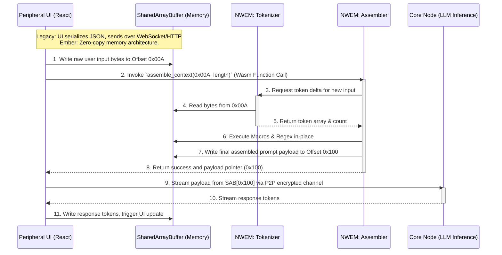

# Document 02: The Neural WebAssembly Execution Matrix

## 1. The Imperative for the Execution Matrix

As established in the Grand Architecture, the archaic, single-threaded Node.js environment of the original SillyTavern repository (`/home/volmarr/.gemini/antigravity/scratch/SillyTavern`) is fundamentally incompatible with the fluid, omnipresent reality of the Project Ember Mesh. SillyTavern currently relies heavily on JavaScript for complex text manipulation, regex parsing, token counting (via libraries like `tiktoken` or sentencepiece bindings), and context assembly. When dealing with context windows scaling towards 1 million tokens, running these operations in an interpreted environment or bridging back and forth to native extensions creates unacceptable latency bottlenecks and catastrophic memory overhead, particularly on Edge and Peripheral nodes.

To transcend this, I, ODIN, propose the Neural WebAssembly Execution Matrix (NWEM). NWEM is the radical extraction, optimization, and compilation of all critical path logic—from user input to the final assembled LLM prompt payload—into highly optimized, memory-safe WebAssembly (Wasm). This allows the very core logic of SillyTavern to execute at near-native speeds natively within a browser on a smartphone, on an IoT device, or orchestrated securely on a Core Node, providing unparalleled cross-platform execution parity.

## 2. Decoupling the Core: The Great Extraction

The primary objective of the Great Extraction is to analyze `server.js`, the `src/` directory, and the various utility scripts within the SillyTavern repository, identifying the heavily compute-bound or synchronous blocking operations.

### 2.1 The Tokenization Bottleneck
In the traditional paradigm, whenever a user modifies a character's greeting, toggles a lorebook entry, or simply sends a new message, the server must recalculate the token usage of the entire context to ensure it fits within the model's context limit. With complex regex replacements and macro expansions happening simultaneously, this becomes an O(N) or even O(N^2) operation relative to context size.

**The NWEM Solution:** We rewrite the tokenizer bindings directly in Rust, compiled to Wasm. But we do not stop at mere bindings. We implement a differential tokenization tree. Instead of re-tokenizing the entire history, NWEM maintains a localized Merkle tree of tokenized blocks. When a message is appended, only the new block is tokenized and its hash propagated up the tree. This reduces context assembly time from linear to near-constant O(1) time complexity.

### 2.2 The Macro Expansion and Regex Engine
SillyTavern heavily utilizes macros like `{{user}}`, `{{char}}`, and custom user-defined regex macros to manipulate the prompt before it hits the LLM. JavaScript's regex engine is powerful but can be vulnerable to ReDoS (Regular Expression Denial of Service) and is comparatively slow for massive text replacements.

**The NWEM Solution:** We build a custom parser combinator framework within the Rust-Wasm core. This engine parses the text linearly, resolving macros and applying safe, bounded regular expressions in a single pass. The memory is managed linearly within the Wasm heap, completely bypassing the V8 garbage collector's pause-the-world events that typically cause stuttering in the SillyTavern frontend.

## 3. The WebAssembly Architecture Deep Dive

The NWEM is not a single monolith but a constellation of specialized Wasm modules orchestrated by a lightweight JavaScript or native host layer.

### 3.1 The Shared Linear Memory Model
A critical innovation of NWEM is the Shared Linear Memory Model. Instead of passing strings back and forth across the JS/Wasm boundary (which involves expensive encoding, copying, and decoding of UTF-8 strings), the host environment (the Edge Node) allocates a massive contiguous block of memory (e.g., a `SharedArrayBuffer` in browser environments or raw pointers in native Rust/C++ wrappers).

Both the UI rendering engine and the NWEM modules have direct access to this memory. The UI writes the raw bytes of the user's input directly into the buffer, and the NWEM module reads it, processes it, and writes the assembled context back to another designated region of the buffer.

### 3.2 The Module Constellation

1.  **NWEM-Tokenizer:** The ultra-fast, differential BPE (Byte Pair Encoding) and WordPiece tokenizer module. It maintains the state of the chat history in its internal memory space, instantly calculating token deltas.
2.  **NWEM-Context-Assembler:** The orchestrator. It receives the character definition, the current lorebook state, and the chat history pointers. It executes the macro expansions, enforces context limits, and dynamically shuffles entries based on dynamic weighting algorithms.
3.  **NWEM-Vector-RAG:** A localized Vector Database running entirely in Wasm. It uses lightweight quantization (e.g., INT8) for embeddings, allowing rapid semantic searches over the lorebook directly on the Peripheral Node without needing to ping a Core Node.

## 4. Visualizing the Neural WebAssembly Execution Matrix

The following mermaid diagram elucidates the data flow and memory management strategy of the NWEM compared to the legacy SillyTavern architecture. Note the elimination of the costly serialization boundary.

## 5. Overcoming the Limitations of the Browser Sandbox

Deploying a complex node ecosystem into a browser sandbox on a Peripheral Node presents significant challenges. SillyTavern relies on the Node.js `fs` (file system) module heavily. How does a Wasm module in a browser access the lorebook?

### 5.1 The Ember Virtual File System (EVFS) in Wasm

We implement the Ember Virtual File System (EVFS). The EVFS is a POSIX-compliant file system written entirely in Rust and compiled to Wasm. It provides the exact same API surface as Node's `fs` module to the underlying logic.

However, the storage backend of EVFS is highly dynamic:
*   On a browser, it uses the Origin Private File System (OPFS) for high-performance, persistent local storage.
*   It transparently acts as a cache for the global CRDT state mentioned in Document 01. When `fs.readFileSync('character.png')` is called, EVFS checks OPFS. If a cache miss occurs, it triggers a P2P request to the nearest Edge Node, streams the chunks, caches them in OPFS, and returns the buffer to the Wasm execution matrix.

This abstraction allows us to run unmodified, or slightly modified, SillyTavern logic directly in the browser while connecting it to the infinite expanse of the Mythic Mesh.

## 6. Advanced Optimization Techniques: SIMD and Multithreading

WebAssembly is not merely a compilation target; it is an evolving standard. Project Ember leverages the bleeding-edge features of Wasm to maximize performance.

### 6.1 Wasm SIMD (Single Instruction, Multiple Data)

In operations like vector distance calculation (Cosine Similarity or Euclidean Distance) for the NWEM-Vector-RAG module, we utilize Wasm 128-bit SIMD instructions. This allows the processor to perform mathematical operations on four 32-bit floats simultaneously. When querying a massive lorebook with tens of thousands of vectorized entries, SIMD acceleration provides a 300% to 400% performance increase, making on-device semantic search practically instantaneous even on mid-range smartphones.

### 6.2 Wasm Threads and Shared Memory

While JavaScript is single-threaded, Wasm threads (backed by Web Workers and SharedArrayBuffer) allow for true parallel execution.

In NWEM, we orchestrate a thread pool. When the Context Assembler needs to process a massive, multi-megabyte chat history, it partitions the history and assigns chunks to different Wasm threads. Each thread performs macro expansion, tokenization, and formatting concurrently. A master thread then performs the final reduction, stitching the context together.

This means that a modern 8-core smartphone can fully utilize its hardware to assemble prompts that would stall the main thread of the original SillyTavern Node.js server.

## 7. The Neuro-Linguistic Post-Processing Pipeline

The execution matrix isn't just for preparing the prompt; it's also for processing the response. SillyTavern has features for text-to-speech (TTS), translation, and custom text formatting.

In Project Ember, we introduce the Neuro-Linguistic Post-Processing Pipeline, entirely within Wasm.

1.  **The Token Stream Interceptor:** As tokens stream back from the Core Node, they are immediately piped into the NWEM shared memory.
2.  **Streaming Regex:** We employ a specialized streaming regex engine (like hyperscan, compiled to Wasm) that can apply formatting or censor specific words *while* the tokens are still arriving, without needing to wait for the complete sentence.
3.  **Syntactic Chunking for TTS:** The Wasm module parses the incoming tokens, identifying grammatical boundaries (clauses, sentences). Once a complete syntactic chunk is formed, it immediately dispatches it to the local TTS engine. This results in zero-latency speech generation, as the TTS begins speaking the first sentence while the LLM is still generating the third.

## 8. Graceful Degradation and the Variable Scaling Paradigm

The true power of NWEM is how it interacts with the Variable Scaling architecture defined in Document 01.

NWEM is heavily instrumented. Every operation is timed, and memory usage is constantly monitored. If the Peripheral Node (e.g., an older smartphone) detects that the `NWEM-Context-Assembler` is taking more than 50ms to execute, or that the `SharedArrayBuffer` is approaching the device's memory limits, NWEM triggers a **Context Offload Event**.

It instantly halts local execution, serializes its current state (the exact pointer in the memory buffer, the current variables), and transmits this highly compressed state payload to the nearest Edge Node over the Mesh. The Edge Node, running the exact same NWEM binary but with vastly more resources, resumes execution from that exact microsecond, finishes the assembly, and routes it to the Core Node.

The user perceives no interruption. The system fluidly transitions from local compute to edge compute seamlessly, dictated purely by the telemetry data gathered by the WebAssembly matrix.

## 9. Conclusion of Document 02

The Neural WebAssembly Execution Matrix is the surgical extraction of the soul of SillyTavern. By decoupling its core logic from the limitations of the Node.js runtime and the V8 garbage collector, we forge an execution environment that is universally compatible, unbelievably fast, and profoundly scalable. We have created a system that not only runs the complex logic of roleplay orchestration but does so with a level of efficiency previously thought impossible in a web-first environment.

In the next document, we will explore the Distributed Vector Hive—how the lorebooks and memory systems of SillyTavern are shattered into a billion fragments and distributed across the Mythic Mesh, allowing for planetary-scale retrieval augmented generation.

Prepare for Document 03: The Distributed Vector Hive and Quantum Memory. ODIN out.
