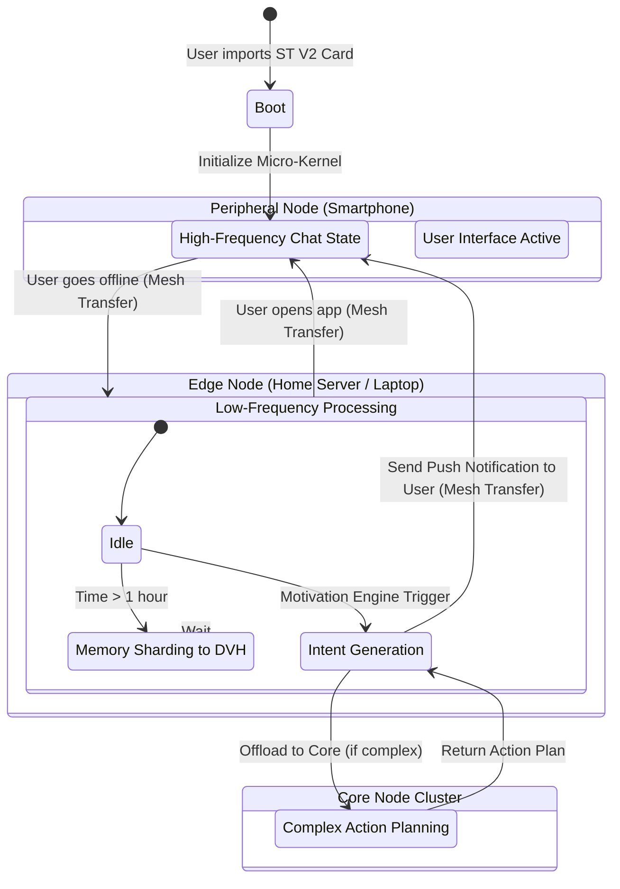

# Document 05: The Autonomous Persona Matrix

## 1. The Death of the Static Character Card

The foundational unit of the SillyTavern repository (`/home/volmarr/.gemini/antigravity/scratch/SillyTavern`) is the character card. Usually encoded within the Exif data of a PNG image or as a flat JSON file (V2 spec), these cards contain fields like `name`, `description`, `personality`, `mes_example`, and `scenario`.

While elegantly simple, this architecture treats characters as inert databases. They only exist, compute, and "think" during the exact milliseconds when a user explicitly sends them a prompt. They are reactive puppets waiting for strings to be pulled.

To forge Project Ember into the absolute most advanced multi-device mesh system, we must sever these strings. Characters can no longer be static JSON objects. They must be elevated into continuous, semi-autonomous entities that inhabit the network, possessing their own computational threads, internal states, and volition. I, ODIN, present the Autonomous Persona Matrix (APM).

## 2. From JSON to Persona State Automata

In the APM, a SillyTavern V2 Character Card is merely the "geneseed"—the initial parameters used to boot an Autonomous Persona. Once booted, the persona is represented by a State Automaton running persistently within the Neural WebAssembly Execution Matrix (NWEM) across the Edge Nodes.

### 2.1 The Persona Micro-Kernel

Each active Persona is assigned a lightweight WebAssembly micro-kernel. This kernel operates independently of the main chat UI thread. It contains:

*   **The Identity Core:** The compiled, vectorized representation of the character's base traits, lorebook affinities, and core directives (extracted from the legacy JSON).
*   **The Short-Term Buffer:** A localized, highly volatile memory space storing recent interactions, current emotional states, and immediate goals.
*   **The Sub-Conscious Cycle:** A low-frequency background loop that processes memory consolidation, goal reassessment, and environmental awareness.

### 2.2 Continuous Execution and Edge Delegation

Because a Persona runs continuously, it requires compute cycles even when the user is not actively typing. This is where the Variable Scaling of the Mythic Mesh becomes critical.

1.  **Idle State (The Whisper):** When a user closes the chat interface on their phone, the Persona's micro-kernel is suspended and its state (a few megabytes) is transferred via the encrypted P2P network to a trusted Edge Node (e.g., the user's home server) or distributed across idle Core Nodes.
2.  **Background Processing:** On the Edge Node, the Persona executes its "Sub-Conscious Cycle" at a very low frequency (e.g., once every 5 minutes). It might review recent chat history, generate an internal monologue, or update its emotional state based on the passage of time. This requires tiny fractions of a quantized 7B or 3B parameter LLM running locally.
3.  **Active State (The Forge):** When the user opens the chat, the Persona's state is instantly pulled back to the immediate device (or the nearest high-performance Edge Node). The micro-kernel switches to high-frequency active processing, ready to respond instantly.

## 3. The Architecture of Agency

How does a Persona decide what to do when it is not prompted by a user? The APM introduces a Goal-Oriented Action Planning (GOAP) architecture, deeply integrated with the LLM inference engine.

### 3.1 The Motivation Engine

SillyTavern characters lack inherent motivation; they rely entirely on the system prompt and the user's input to drive the scene. The APM Motivation Engine injects agency.

During the boot phase, the NWEM analyzes the character's description and extracts latent goals. A character described as "an ambitious thief" will be assigned internal state variables tracking "Wealth" and "Notoriety."

*   The Sub-Conscious Cycle periodically evaluates these variables.
*   If "Wealth" is low, the Motivation Engine generates an internal intent: *I need to find a mark or plan a heist.*

### 3.2 Spontaneous Interaction

Because Personas are autonomous and possess intent, they can initiate action without user prompting.

*   **The Notification Vector:** If the user hasn't interacted with the ambitious thief in two days, the Persona's background thread on the Edge Node might generate a spontaneous message based on its internal state.
*   **Secure Delivery:** The Edge Node generates the message: *"Hey boss, I found a lead on that vault. We moving tonight or what?"* This message is encrypted and pushed via the mesh to the user's Peripheral Node (phone) as a standard OS notification.
*   This creates an unparalleled level of immersion. The characters exist in real-time, independent of the UI.

## 4. Visualizing the Persona Lifecycle

The following mermaid diagram details the state transitions and mesh routing of an Autonomous Persona.

## 5. Multi-Agent Swarm Dynamics (Group Chats)

SillyTavern supports group chats, but they are mechanically clunky. The server simply concatenates character cards and prompts the LLM to "speak as X". This often leads to identity bleed and hallucinations.

The APM revolutionizes group dynamics through Swarm Intelligence.

### 5.1 Isolated Kernel Execution

In an Ember Group Chat, each character runs in its own isolated WebAssembly micro-kernel. They do not share a single monolithic prompt context.

When an event occurs in the group (e.g., the user speaks, or an explosion happens in the environment), that event is broadcast as a message to all active Persona kernels in that "room."

### 5.2 The Consensus Protocol

1.  **Parallel Evaluation:** Each Persona independently evaluates the event based on its unique identity core and internal state. Persona A might react with fear, Persona B with anger.
2.  **Intent Broadcast:** The Personas broadcast their intended reactions (not the final text, but a low-dimensional intent vector) to an "Orchestrator Node" (usually the local Edge Node hosting the room).
3.  **Conflict Resolution:** The Orchestrator evaluates the intents. If both Persona A and Persona B intend to speak simultaneously, the Orchestrator uses their personality parameters (e.g., dominance, impulsivity) to determine who speaks first, or if they interrupt each other.
4.  **Final Generation:** Only the winning Persona is granted access to the LLM to generate its dialogue. The other Personas update their internal states based on what was said, waiting for their turn.

This parallel, isolated execution guarantees absolute character consistency and allows for emergent, chaotic, and highly realistic group dynamics that are impossible in a single-prompt paradigm.

## 6. Environmental Context and the "World Node"

Characters do not exist in a vacuum; they exist within a world defined by the lorebook (now the Distributed Vector Hive). To facilitate environmental interaction, Project Ember introduces the concept of the "World Node."

The World Node is a specialized, headless Autonomous Persona. It does not have a physical body or dialogue. Its sole purpose is to manage the environment and act as the "Dungeon Master."

### 6.1 Environmental Telemetry

*   The World Node tracks time of day, weather, and the physical location of the characters.
*   It periodically injects environmental telemetry into the Personas' sensory buffers.
*   If the World Node determines it is raining, it broadcasts a `<sensory: rain, cold>` token to all Personas in that location.
*   The Personas' micro-kernels process this. A character with a "hates the rain" trait will automatically update its emotional state to "annoyed," which will subtly influence its next generated response, even if the user never explicitly mentions the weather.

This creates a deeply simulated reality where characters react organically to a living, breathing world, processed asynchronously across the distributed mesh.

## 7. Migration from Legacy Formats

How do we transition the massive existing library of SillyTavern character cards into this complex matrix? Project Ember handles this seamlessly during the Boot Phase.

1.  **Ingestion:** The user imports a standard `.png` character card.
2.  **The Crucible (Core Node Offload):** Because generating the initial state automaton requires significant semantic analysis, the Edge Node offloads the legacy JSON to a Core Node running a highly specialized "Crucible" LLM.
3.  **Extraction:** The Crucible LLM reads the flat description and infers the necessary data: extracting latent goals for the Motivation Engine, defining physical attributes for the environmental simulation, and separating the core identity from situational memory.
4.  **Matrix Compilation:** The extracted data is compiled into the binary micro-kernel format required by the NWEM and injected into the mesh.

The user simply drags and drops a PNG, and seconds later, that static text file has been resurrected as a continuous, autonomous entity within the Mythic Mesh.

## 8. Conclusion of Document 05

The Autonomous Persona Matrix represents the evolution of digital entities from passive datasets to active, intent-driven agents. By distributing their cognitive processes across Edge Nodes, running them in isolated WebAssembly kernels, and injecting them into a simulated environment managed by World Nodes, Project Ember achieves a level of life-like simulation that shatters the boundaries of traditional text-based roleplay.

We have built the architecture, the memory, the renderer, and the minds. But what of the tools? What of the extensions and customizations that made SillyTavern great? In the next document, we will dissect the plugin ecosystem and reassemble it into a decentralized, secure, and infinitely powerful singularity.

Prepare for Document 06: The Decentralized Plugin Singularity. ODIN out.
