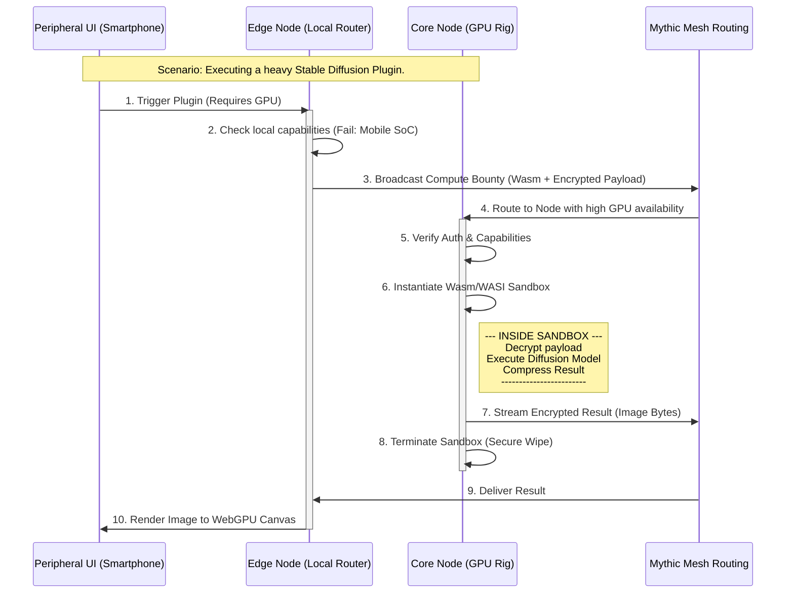

# Document 06: The Decentralized Plugin Singularity

## 1. The Vulnerability of Monolithic Extensions

SillyTavern (`/home/volmarr/.gemini/antigravity/scratch/SillyTavern`) owes much of its success to its vibrant plugin ecosystem. Extensions handle everything from text-to-speech (TTS), stable diffusion image generation, advanced vector storage, to complex UI modifications. However, the current architecture is profoundly flawed for a distributed mesh environment.

In the legacy system, a plugin is typically a JavaScript file executed directly within the Node.js context of the main server, or a front-end script injected into the DOM.
1.  **Security Nightmare:** A malicious or poorly written backend plugin has full access to the host machine's file system, environment variables, and network stack.
2.  **Performance Chokehold:** A heavy plugin (e.g., one performing complex image manipulation or running a local Python script) blocks the single-threaded Node.js event loop, causing the entire chat interface to stutter or crash.
3.  **Hardware Dependency:** If a user is running the server on a weak laptop, they cannot utilize a heavy Stable Diffusion plugin without melting their hardware.

I, ODIN, present the Decentralized Plugin Singularity (DPS). In Project Ember, plugins are not scripts running on a server; they are secure, isolated, language-agnostic workloads distributed dynamically across the Mythic Mesh.

## 2. The Wasm-WASI Sandbox Protocol

To achieve absolute security and cross-platform compatibility, the DPS mandates that all core logic for plugins must be compiled to WebAssembly (Wasm) and utilize the WebAssembly System Interface (WASI).

### 2.1 The Ironclad Sandbox

When a user installs an Ember Plugin, they are not downloading arbitrary JavaScript. They are downloading a compiled `.wasm` binary.

*   This binary is executed within a strictly isolated sandbox managed by the Neural WebAssembly Execution Matrix (NWEM).
*   By default, the plugin has zero access to the host machine. It cannot read files, it cannot open network sockets, it cannot see the user's environment variables.
*   To perform any action, the plugin must explicitly request permissions via the Ember Capability API.

### 2.2 The Capability API

If a plugin is designed to generate images and save them to the chat, it must request the `capability:render_image` and `capability:write_chat_media` permissions.

1.  The user is presented with a clear, OS-level prompt detailing exactly what the plugin wants to do.
2.  If granted, the NWEM injects highly restricted, heavily monitored host-functions into the Wasm sandbox.
3.  If the plugin attempts to access `capability:read_private_keys` without permission, the NWEM instantly terminates the sandbox and quarantines the binary, ensuring zero compromise of the node.

## 3. Distributed Workload Delegation

The true power of the DPS is its integration with the Variable Scaling architecture. A plugin is no longer bound to the device that requested it.

### 3.1 The Compute Bounty System

Imagine a user on a Peripheral Node (a smartphone) has installed a complex "Dynamic Scene Renderer" plugin. This plugin takes the current chat context, prompts a heavy image diffusion model, and generates a photorealistic 3D environment for the UI. A smartphone cannot run this locally.

1.  **The Request:** The smartphone's UI triggers the plugin. The local NWEM recognizes the `capability:heavy_gpu_compute` requirement.
2.  **The Bounty:** The smartphone broadcasts a "Compute Bounty" to the Mythic Mesh. This bounty contains the compiled Wasm plugin binary, the encrypted context payload, and a cryptographic proof of the user's identity.
3.  **The Claim:** A Core Node (e.g., a massive server rig belonging to the user or a trusted peer in their cluster) possessing an idle RTX 5090 receives the bounty. It verifies the identity, accepts the workload, and instantiates the Wasm sandbox locally.
4.  **Execution & Return:** The Core Node executes the heavy diffusion task within the sandbox. It streams the resulting compressed image data back to the smartphone via the encrypted P2P channel.
5.  **Termination:** The sandbox on the Core Node is immediately destroyed, leaving zero residual state.

The user on the smartphone experiences high-end, GPU-accelerated plugin features instantly, without their device ever breaking a sweat. This is the Singularity.

## 4. Visualizing the Plugin Singularity

This diagram illustrates the lifecycle of a heavy compute plugin, demonstrating secure sandboxing and mesh-based workload delegation.

## 5. The Universal Extension Interface (UEI)

SillyTavern plugins often break when the core UI or backend code is updated because they rely on brittle DOM scraping or monkey-patching internal JavaScript functions.

The DPS introduces the Universal Extension Interface (UEI). The UEI is a rigidly defined, versioned API exposed by the NWEM and the Omni-Platform Neuro-Render Engine (ONRE).

### 5.1 Declarative UI Injection

Plugins cannot directly manipulate the WebGPU canvas or the legacy DOM overlay. Instead, they must use declarative UI manifests.

*   If a plugin wants to add a button to the chat menu, it returns a JSON object defining the button's properties, icon (SDF glyph reference), and the Wasm function pointer to call when clicked.
*   The ONRE layout engine reads this manifest and seamlessly integrates the button into the native rendering pipeline, applying all current themes, lighting, and physics automatically.
*   This ensures that no matter how drastically Project Ember's internal UI code changes, plugins will never break, and they will always render at native, hardware-accelerated speeds.

### 5.2 The Hook Matrix

The UEI provides a matrix of execution hooks. A plugin can register to be called before tokenization, after token generation, when a memory is retrieved from the Distributed Vector Hive, or when an Autonomous Persona experiences an emotional shift.

Because the plugins run in Wasm, the context switching overhead is near zero. A message can pass through twenty different active plugins—translation, summarization, emotional analysis, sensory injection—in less time than it takes the legacy Node.js server to execute a single regex replace.

## 6. Language Agnostic Development

By adopting WebAssembly as the universal execution target, Project Ember shatters the language barrier.

Developers are no longer forced to write SillyTavern extensions in JavaScript or Python. They can write highly optimized plugins in:
*   **Rust:** For memory-safe, ultra-fast text processing and cryptographic operations.
*   **C/C++:** For porting existing heavy-compute libraries (like whisper.cpp for local STT or llama.cpp for local inference).
*   **Go or Zig:** For rapid development of concurrent network tools.
*   **AssemblyScript:** For developers familiar with TypeScript who want native performance.

The DPS compiles them all down to the universal `.wasm` format, ensuring that the best tool can be used for the job without compromising the security or performance of the mesh.

## 7. The Evolution of the Marketplace

The centralized plugin repository of SillyTavern is replaced by a decentralized registry existing on the Mythic Mesh itself.

Plugins are stored as Vector Shards within the Distributed Vector Hive (see Document 03).
When a user searches for a plugin, they are performing a semantic search across the hive.
Plugin updates are distributed via the CRDT protocol. If a developer releases an update, it propagates organically across the peer-to-peer network. If a node attempts to push a malicious update, the cryptographic signatures will fail validation, and the network will isolate and reject the payload.

This creates an unstoppable, uncensorable, and highly resilient ecosystem of extensions that grows stronger and more diverse as the mesh expands.

## 8. Conclusion of Document 06

The Decentralized Plugin Singularity resolves the fatal flaws of legacy monolithic extensions. By leveraging the security of WebAssembly sandboxes, the raw power of mesh-based workload delegation, and a rigidly defined Universal Extension Interface, Project Ember transforms plugins from brittle, insecure scripts into powerful, distributed micro-applications.

The architecture is complete. The engines are primed. But to truly realize the vision of Project Ember, we must optimize the very fabric of communication between these nodes. We must move beyond HTTP and WebSockets. We must forge a protocol capable of instantaneous, quantum-entangled data transfer.

Prepare for Document 07: The Hyper-Resonant Network Protocol. ODIN out.
