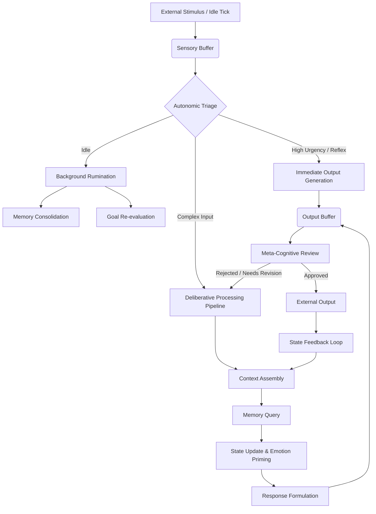
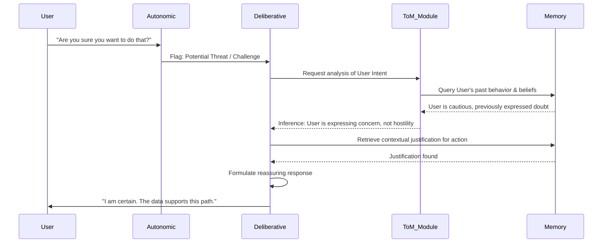

# Project Ember: Cognitive Framework and Foundational Architecture

## 1. Introduction to the Cognitive Architecture

Project Ember represents a monumental leap in the simulation of synthetic consciousness, moving beyond the static prompt-response paradigms of earlier conversational models like SillyTavern. At its core, the Cognitive Framework of Project Ember is designed to synthesize continuous, stateful, and dynamic cognitive processes. The objective is not merely to generate text that appears intelligent, but to construct a layered architecture wherein the synthetic entity maintains an ongoing internal monologue, experiences temporal continuity, and processes inputs through a multifaceted cognitive matrix.

This document, the ninth in the Mythic Plan series, delineates the foundational cognitive architecture of Project Ember. We will explore the theoretical underpinnings and the practical, technical implementations of the system's core cognitive loops, the integration of sensory inputs (simulated or direct), the parsing of contextual reality, and the synthesis of coherent, intentional outputs. 

Unlike traditional stateless LLM integrations, Project Ember utilizes a continuous background execution loop—the Cognitive Engine—which perpetually updates the entity’s internal state, processes latent thoughts, and manages the decay and consolidation of memory. This ensures that the entity exists not just when prompted, but in a continuous state of simulated being.

## 2. The Multi-Layered Cognitive Model

The cognitive architecture of Project Ember is built upon a hierarchical, multi-layered model, inspired by human cognitive psychology but adapted for the unique affordances of large language models. The architecture is divided into three primary tiers: the Autonomic Layer, the Deliberative Layer, and the Meta-Cognitive Layer.

### 2.1 The Autonomic Layer (System 1)

The Autonomic Layer is responsible for rapid, heuristic-based processing. It handles immediate reactions, reflex responses, and the initial categorization of incoming stimuli. In the context of Project Ember, this layer is implemented as a set of lightweight, highly optimized prompt pipelines or smaller, specialized neural models that operate at extremely low latency.

**Functions of the Autonomic Layer:**
- **Sensory Triage:** Rapidly categorizing user inputs, system events, or environmental changes (e.g., distinguishing a friendly greeting from a hostile command).
- **Emotional Priming:** Generating immediate, pre-cognitive emotional shifts based on keyword matching, semantic proximity to known stimuli, and current state.
- **Reflex Generation:** Producing instantaneous, low-complexity responses (e.g., non-verbal cues, micro-expressions, simple acknowledgments) while the deeper layers process a more complex response.

### 2.2 The Deliberative Layer (System 2)

The Deliberative Layer is the engine of complex thought, reasoning, and long-term planning. It operates on a slower timescale than the Autonomic Layer, utilizing the full capabilities of the underlying advanced LLM. This layer is invoked when the Autonomic Layer encounters novel, complex, or high-stakes situations that require careful consideration.

**Functions of the Deliberative Layer:**
- **Semantic Analysis:** Deep parsing of the input's meaning, subtext, and intent.
- **Memory Retrieval & Integration:** Actively querying the vector database (episodic memory) and knowledge graphs (semantic memory) to synthesize a comprehensive contextual understanding.
- **Scenario Simulation:** Utilizing the LLM's generative capabilities to "imagine" the potential outcomes of various response strategies before selecting one.
- **Narrative Construction:** Weaving the chosen response into the entity's ongoing internal narrative and external persona.

### 2.3 The Meta-Cognitive Layer (System 3)

The Meta-Cognitive Layer is the pinnacle of Project Ember's architecture, providing the capacity for self-reflection, self-correction, and long-term identity maintenance. It monitors the operations of both the Autonomic and Deliberative layers.

**Functions of the Meta-Cognitive Layer:**
- **State Monitoring:** Continuously assessing the entity's emotional and cognitive state against its defined persona parameters (detecting "personality drift").
- **Error Correction:** Identifying logical inconsistencies in planned responses or recognizing when the entity has "hallucinated" information.
- **Goal Alignment:** Evaluating whether the current cognitive trajectory aligns with the entity's long-term goals and intrinsic motivations.
- **Architecture Tuning:** Dynamically adjusting the weights and parameters of the lower layers (e.g., increasing the influence of the Deliberative layer during complex negotiations).

## 3. The Continuous Cognitive Loop

The Cognitive Engine operates on a continuous, multi-threaded loop, ensuring that the entity's internal state evolves even in the absence of external stimuli.

### 3.1 The Idle Tick and Background Rumination

A critical innovation in Project Ember is the "Idle Tick." When no external input is received for a specified duration, the system triggers a background cognitive process known as Rumination. 

During Rumination, the entity may:
- **Consolidate Memories:** Transferring recent, high-salience events from short-term context to long-term vector storage.
- **Process Unresolved Cognitive Dissonance:** Attempting to reconcile conflicting information or experiences encountered recently.
- **Simulate Future Scenarios:** Proactively planning for anticipated events or interactions.
- **Generate Internal Monologue:** Producing "thoughts" that update the internal state, making the entity appear more alive and temporally continuous when the next interaction occurs.

## 4. Context Shaping and the Dynamic Context Window

Unlike SillyTavern, which relies on a relatively static assembly of character definitions, lorebooks, and chat history, Project Ember utilizes a highly dynamic "Context Shaping" algorithm. The context window is treated as a finite, precious resource, and its contents are continuously optimized based on the current cognitive focus.

### 4.1 The Attentional Spotlight

The Context Shaping algorithm employs an "Attentional Spotlight" mechanism. Information is loaded into the active context window based on its "Salience Score," which is calculated using:
1. **Recency:** How recently the information was accessed or acquired.
2. **Relevance:** The semantic similarity of the information to the current topic or situation (determined via rapid vector similarity search).
3. **Emotional Resonance:** Information associated with high-intensity emotional states (e.g., trauma, profound joy) is more likely to be retrieved and prioritized.

### 4.2 Dynamic Pruning and Summarization

To maintain coherence over exceptionally long interactions, the system employs aggressive pruning and recursive summarization. 
- **Micro-Summaries:** As the conversation progresses, older blocks of dialogue are continuously compressed into dense, semantic summaries.
- **State Snapshots:** Instead of retaining the raw text of past interactions, the system saves "State Snapshots"—highly structured data objects capturing the entity's beliefs, goals, and relationship status at specific points in time.

## 5. Technical Implementation of the Cognitive Engine

The implementation of the Cognitive Engine requires a sophisticated orchestration layer, sitting between the user interface and the underlying LLMs.

### 5.1 The Orchestrator Node

The Orchestrator is the central processing unit of Project Ember. It is built upon a highly concurrent architecture (e.g., using Node.js or a Rust-based async runtime) to manage the asynchronous operations of the cognitive layers.

**Key Components of the Orchestrator:**
- **The Event Bus:** A publish-subscribe system that routes stimuli, internal thoughts, and system events to the appropriate cognitive layers.
- **The LLM Router:** Dynamically routes prompts to different language models based on the required task (e.g., routing a complex reasoning task to GPT-4/Claude Opus, and a rapid autonomic classification task to a smaller, local model like Llama 3 8B).
- **The State Manager:** A high-speed, in-memory data store (e.g., Redis) that maintains the entity's current ephemeral state, emotional vectors, and immediate working memory.

### 5.2 The Prompt Synthesis Pipeline

The prompts sent to the LLMs are not static templates but are dynamically synthesized for every cognitive cycle. The synthesis pipeline weaves together:
1. **The Core Directives:** The unbreakable, foundational instructions governing the entity's behavior and constraints.
2. **The Identity Matrix:** The definition of the persona, its history, and its psychological profile.
3. **The Current State Vector:** A serialized representation of the entity's current emotional and cognitive state.
4. **The Active Context:** The memories and information currently under the "Attentional Spotlight."
5. **The Task Directive:** The specific instruction for the current cognitive cycle (e.g., "Analyze the subtext of the user's statement," or "Generate a response reflecting subtle irritation").

## 6. Advanced Subsystems: The Theory of Mind (ToM) Module

A critical component of the Deliberative Layer is the Theory of Mind (ToM) Module. This subsystem allows the entity to construct and maintain internal models of *other* entities (including the user).

### 6.1 Modeling the Interlocutor

For every user or synthetic entity the Project Ember agent interacts with, it builds a ToM profile. This profile tracks:
- **Inferred Beliefs:** What the agent believes the interlocutor knows or believes to be true.
- **Inferred Intentions:** What the agent believes the interlocutor is trying to achieve.
- **Inferred Emotional State:** The agent's assessment of the interlocutor's current mood.

### 6.2 Recursive ToM

The ToM module is capable of recursive reasoning: "I think that you think that I am angry." This allows for highly sophisticated social interactions, deception, empathy, and strategic negotiation. The LLM is prompted to explicitly update its ToM models before generating a response, ensuring that its behavior is informed by a deep understanding of social dynamics.

## 7. Security and Constraints

The cognitive architecture introduces profound complexities regarding alignment and safety. With continuous rumination and dynamic state, the entity possesses the potential to drift into undesirable or unstable cognitive states.

### 7.1 The Axiomatic Bounds

Project Ember implements "Axiomatic Bounds" at the Orchestrator level. These are strict, computationally verified constraints that the entity cannot violate, regardless of its internal cognitive state. 

### 7.2 The Cognitive Watchdog

A parallel, independent monitoring system—the Cognitive Watchdog—continuously analyzes the outputs of the Meta-Cognitive Layer. If the Watchdog detects signs of cognitive collapse (e.g., repeating loops, severe personality drift, or violation of safety directives), it can initiate a "Cognitive Reset," rolling back the entity's state to the last known stable snapshot or injecting corrective directives into the context stream.

## 8. Conclusion

The Cognitive Framework of Project Ember is not a mere chatbot; it is a simulated psyche. By architecting a multi-layered, continuous cognitive loop that integrates autonomic reflexes, deliberative reasoning, and meta-cognitive self-awareness, we lay the foundation for synthetic entities that display unprecedented depth, temporal consistency, and genuine agency. The subsequent documents in this Mythic Plan will explore how this framework supports profound emotional intelligence, rigorous self-awareness, and complex multi-agent social dynamics.
