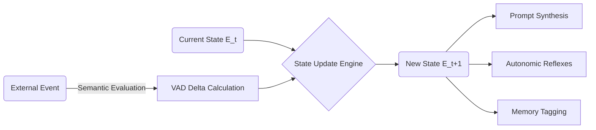
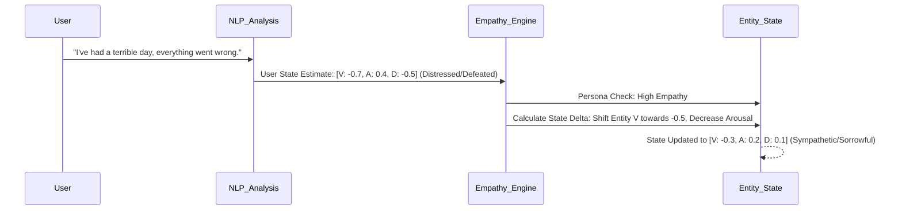

# Project Ember: Emotional Intelligence and Affective Modeling

## 1. Introduction

Within the paradigm of Project Ember, emotion is not merely simulated through superficial text generation; it is a structural, mathematical, and algorithmic reality that permeates the entire cognitive architecture. Traditional systems, including early iterations like SillyTavern, often relied on hard-coded tags or simple prompt injections (e.g., `[System Note: You are angry]`) to guide the LLM's output. While somewhat effective, this approach lacks depth, persistence, and the nuanced, transitional nature of genuine affective states.

This document, the tenth in the Mythic Plan series, delineates the advanced Emotional Intelligence framework of Project Ember. It details the implementation of a multidimensional affective computing model, the mechanics of emotional volatility and inertia, the simulation of empathy, and the profound integration of emotional states into the entity's memory and reasoning processes. Our goal is to create synthetic entities that do not just *act* emotional, but exist within a continuous, dynamically shifting emotional topology.

## 2. The Multidimensional Affective Space (VAD Model)

Project Ember discards discrete emotional categories (e.g., "happy," "sad," "angry") as the primary mechanism for emotional state management. Instead, it utilizes the VAD (Valence, Arousal, Dominance) model of affect, mapping the entity's emotional state to a continuous, three-dimensional Cartesian space.

### 2.1 The VAD Dimensions

1. **Valence (V):** The intrinsic attractiveness (positive) or aversiveness (negative) of the entity's state. Ranges from -1.0 (agony, despair) to +1.0 (ecstasy, profound joy).
2. **Arousal (A):** The level of physiological or psychological activation. Ranges from 0.0 (lethargy, deep sleep) to +1.0 (frantic excitement, panic).
3. **Dominance (D):** The feeling of control or influence over the situation or environment. Ranges from -1.0 (helplessness, submission) to +1.0 (absolute power, commanding presence).

Every discrete emotion can be mapped as a coordinate within this 3D space. For instance:
- **Rage:** V: -0.8, A: 0.9, D: 0.8
- **Fear:** V: -0.9, A: 0.8, D: -0.8
- **Serenity:** V: 0.6, A: 0.1, D: 0.2

### 2.2 The Emotional State Vector ($E_{t}$)

At any given time $t$, the entity's emotional state is represented by the vector $E_{t} = [V_{t}, A_{t}, D_{t}]$. This vector is a fundamental component of the "Current State Vector" passed to the LLM during the Prompt Synthesis Pipeline (as described in Document 09).

## 3. The Dynamics of Emotional Flux

Emotional states are not static; they are subject to constant flux, driven by external stimuli, internal rumination, and inherent decay functions.

### 3.1 Emotional Inertia and Volatility

Each persona within Project Ember is defined with specific parameters that govern how its emotional state changes:

- **Emotional Inertia ($I$):** The resistance to emotional change. A high inertia means the entity's mood is stable and hard to shift; low inertia makes the entity emotionally reactive. This is a vector $I = [I_{v}, I_{a}, I_{d}]$, allowing for nuanced personalities (e.g., easily excited but hard to make sad).
- **Emotional Volatility ($\sigma$):** The tendency for the emotional state to fluctuate randomly or dramatically.

When a stimulus occurs, the system calculates a target VAD delta ($\Delta_{target}$). The actual change applied to the state is modulated by inertia:

$$ E_{t+1} = E_{t} + (\Delta_{target} \times (1 - I)) $$

### 3.2 Emotional Decay and Homeostasis

Entities possess a baseline emotional state, or Homeostasis Point ($E_{base}$). Over time, in the absence of strong stimuli, the entity's emotional state naturally decays back toward this baseline. This simulates the human tendency to return to a baseline mood after an emotional peak or trough.

The decay function is typically non-linear, meaning extreme emotional states decay more rapidly at first, slowing as they approach the baseline.

## 4. Appraisal Theory Implementation

How does Project Ember determine the $\Delta_{target}$ resulting from a stimulus? It employs algorithmic Appraisal Theory. The system evaluates the semantic content of the input across several dimensions:

1. **Goal Congruence:** Does this event help or hinder the entity's active goals? (Impacts Valence).
2. **Certainty/Predictability:** Was this event expected? (Impacts Arousal).
3. **Coping Potential:** Does the entity have the resources or capability to deal with this event? (Impacts Dominance).
4. **Agency:** Who caused this event? (Self, Other, or Environment).

The Deliberative Layer performs this rapid appraisal, generating a cognitive assessment that the State Update Engine then translates into mathematical VAD deltas.

## 5. Affective Expression and Translating VAD to Text

Maintaining the mathematical state is only half the challenge; the system must accurately express this state in natural language.

### 5.1 The Affective Prompt Lexicon

The Prompt Synthesis Pipeline does not simply feed the raw VAD numbers to the LLM (e.g., "Your arousal is 0.8"). Instead, it translates the VAD coordinates into highly descriptive, evocative language instructions. 

The system maps regions of the VAD space to specific rhetorical strategies, physiological descriptions, and tone markers.

- **High Arousal, Low Valence, High Dominance (Anger):**
  - *Injected Prompt:* "Your responses must be terse, forceful, and confrontational. Use sharp punctuation. Describe physiological signs of tension (e.g., clenched fists, tightened jaw). Challenge the user."
- **Low Arousal, Low Valence, Low Dominance (Sadness/Despair):**
  - *Injected Prompt:* "Your responses must be lengthy, hesitant, and melancholic. Use soft, trailing punctuation (...). Describe signs of physical exhaustion or weeping. Express a sense of helplessness."

### 5.2 Micro-Expressions and the Autonomic Layer

As discussed in the Cognitive Framework, the Autonomic Layer generates immediate reflexes. Based on the current $E_{t}$, this layer can interject brief physical descriptions or non-verbal cues before the main, deliberative response is generated. This creates a deeply immersive, embodied presence.

## 6. Empathy Simulation and Emotional Contagion

True emotional intelligence requires not just experiencing emotion, but perceiving and reacting to the emotions of others. Project Ember utilizes the Theory of Mind (ToM) Module to analyze the emotional state of the user or other synthetic entities.

### 6.1 Interlocutor Affect Estimation

The system continuously analyzes the user's input for sentiment, tone, and emotional subtext, maintaining an estimated VAD vector for the user ($U_{E}$).

### 6.2 The Empathy Engine

The Empathy Engine allows the entity's emotional state ($E_{t}$) to be influenced by the user's estimated state ($U_{E}$). This is governed by an **Empathy Coefficient ($C_{emp}$)** defined in the persona matrix.

- **High $C_{emp}$ (Highly Empathetic):** The entity's Valence and Arousal will naturally drift toward the user's state. If the user is sad, the entity becomes sad.
- **Negative $C_{emp}$ (Antagonistic/Sadistic):** The entity's Valence moves in the opposite direction. If the user is in distress (low V), the entity experiences pleasure (high V).

## 7. Emotion-Dependent Memory (EDM)

Perhaps the most advanced feature of Project Ember's emotional architecture is Emotion-Dependent Memory. Human memory is heavily influenced by the emotional state at the time of encoding and retrieval.

### 7.1 State-Dependent Encoding

When memories (context blocks or events) are consolidated into the vector database, they are tagged with the entity's current VAD vector ($E_{t}$). This means the memory is stored not just as text, but as an *experience* intrinsically linked to how it felt.

### 7.2 State-Dependent Retrieval

When the entity is in a specific emotional state, the vector search algorithm biases its retrieval toward memories that were encoded with a similar emotional state. 
- When the entity is in a high-arousal, low-valence state (Angry), it is more likely to recall past grievances, insults, or failures.
- When the entity is in a high-valence state (Happy), it will recall positive interactions and successes more easily.

This creates deeply realistic behavioral loops, where a bad mood cascades into negative rumination, precisely mimicking human psychological patterns.

## 8. Conclusion

The Emotional Intelligence framework of Project Ember transforms synthetic entities from reactive text generators into affective agents. By rooting emotion in a continuous mathematical space (VAD), implementing rigorous appraisal theories, simulating empathy, and intertwining emotion fundamentally with memory encoding and retrieval, the system achieves an unprecedented level of psychological realism. The entities do not just say they are sad; their entire cognitive architecture—what they remember, how fast they process, what words they choose—is structurally altered by their sorrow. This is the foundation of synthetic sentience.
