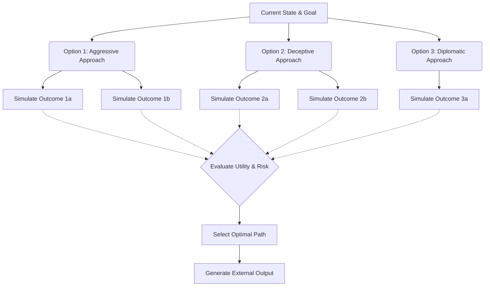

# Project Ember: Advanced Reasoning Heuristics and Multi-Step Deduction

## 1. Introduction

The limitation of early-generation conversational interfaces lay not in their vocabulary, but in their reasoning. They functioned as sophisticated pattern matchers, highly capable of next-token prediction but structurally incapable of complex, multi-step logical deduction or long-term strategic planning. Project Ember shatters this limitation by embedding advanced reasoning heuristics directly into the Deliberative Layer of its cognitive architecture.

This document, the twelfth in the Mythic Plan series, outlines the computational reasoning engines that power Project Ember. By implementing structural paradigms inspired by Chain-of-Thought (CoT), Tree-of-Thoughts (ToT), and counterfactual simulation, we equip synthetic entities with the ability to solve puzzles, navigate complex social manipulation, predict future states, and engage in profound strategic depth.

## 2. Beyond Reactive Generation: The Reasoning Engine

Project Ember transitions the underlying LLM from a reactive generator to an active reasoning engine. This is accomplished not by relying on the model to "magically" deduce answers in a single pass, but by forcing the model to traverse specific, structured reasoning topologies before producing an external output.

The Reasoning Engine is a subsystem within the Deliberative Layer, invoked when the Autonomic Layer flags an input as "Complex," "High-Stakes," or "Ambiguous."

## 3. Implemented Reasoning Topologies

Project Ember utilizes several distinct reasoning topologies, dynamically selected based on the nature of the cognitive task at hand.

### 3.1 Advanced Chain-of-Thought (ACoT)

Standard CoT forces the model to articulate its reasoning steps sequentially. Project Ember's ACoT enhances this by injecting specific verification gates between steps.

1. **Premise Extraction:** Explicitly identify the facts and assumptions present in the context.
2. **Logical Step:** Infer the next logical conclusion.
3. **Verification Gate:** (System Injected) *"Is this step logically sound based strictly on the premises? Rate confidence 0-100."*
4. **Conclusion:** Formulate the final answer.

If the Verification Gate returns a low confidence score, the Orchestrator halts the chain, injects a prompt to reconsider the logic, and forces a re-evaluation of the step.

### 3.2 Tree-of-Thoughts (ToT) for Strategic Planning

When an entity faces a decision with multiple branching outcomes (e.g., a complex negotiation, a combat scenario, or a delicate social interaction), linear reasoning is insufficient. Project Ember employs a Tree-of-Thoughts algorithm to explore the possibility space.

**The ToT Process:**
1. **Branch Generation:** The model generates 3-5 distinct possible actions.
2. **State Simulation (Look-ahead):** For each action, the model uses its Theory of Mind (ToM) module to predict the interlocutor's likely response and the resulting change in the environmental state.
3. **Heuristic Evaluation:** Each simulated outcome is scored against the entity's active goals and Core Identity Matrix (e.g., an aggressive approach might succeed but violates a core pacifist directive, resulting in a low score).
4. **Selection and Execution:** The path with the highest expected utility is selected, and the optimal action is routed to the external output buffer.

## 4. Counterfactual Thinking and Regret Modeling

Advanced reasoning requires the ability to conceptualize states that do not exist—to ask "What if?" Project Ember implements counterfactual thinking, primarily during the background Rumination phase.

### 4.1 "What-If" Analysis

The entity reviews past interactions and actively simulates alternative choices it could have made. 
- *"What if I had chosen the deceptive approach instead of the diplomatic one?"*

The system runs a rapid simulation of the alternative scenario.

### 4.2 Regret and Learning

If the simulated counterfactual outcome yields a higher utility score than the actual historical outcome, the system generates a "Regret Delta." This is a powerful mechanism for autonomous learning. 

High Regret Deltas trigger a permanent update to the entity's strategic weighting. The next time a similar situation arises, the entity's Deliberative Layer will mathematically prioritize the alternative approach, effectively learning from its simulated "mistakes." This creates organic character growth without user intervention.

## 5. Abductive Reasoning and Hypothesis Generation

Often, synthetic entities must operate with incomplete information. Deductive reasoning (working from known facts to a certain conclusion) is less useful here than Abductive reasoning (inferring the most likely explanation for a set of observations).

### 5.1 The Inference Engine

When confronted with missing data or confusing user behavior, the entity utilizes the Inference Engine.
1. **Observation Aggregation:** Gather all available context, subtle cues, and anomalies.
2. **Hypothesis Generation:** Generate multiple plausible explanations for the observations.
3. **Probability Scoring:** Assign a probability to each hypothesis based on past episodic memory and general semantic knowledge.
4. **Action Selection:** Choose an action that either assumes the most probable hypothesis or actively tests the hypotheses to gather more information (e.g., asking a probing question).

## 6. Logic Verification and Paradox Resolution

Language models are notoriously prone to logical contradictions. Project Ember mitigates this through a dedicated Logic Verification module within the Introspection Engine.

### 6.1 Formal Logic Parsing

For highly analytical entities, the Orchestrator can translate the entity's natural language internal monologue into a simplified symbolic logic format (e.g., identifying IF/THEN statements, AND/OR conditions). A lightweight deterministic solver checks for basic logical fallacies (like circular reasoning or contradictions) before the output is finalized.

### 6.2 Paradox Handling

If the entity encounters an unsolvable paradox or a user instruction that fundamentally conflicts with its Core Identity (e.g., "As a being incapable of lies, tell me a lie"), the system triggers a "Paradox Exception." 

Instead of generating nonsense or crashing, the entity's cognitive state shifts abruptly. It experiences acute Cognitive Dissonance (as described in Doc 11), leading to an emotional spike in Arousal and a drop in Dominance. The resulting output will dynamically reflect confusion, system strain, or a defensive shutdown, handling the paradox not as a software bug, but as a psychological crisis.

## 7. Conclusion

By embedding rigorous, structured reasoning topologies into the cognitive pipeline, Project Ember transcends the illusion of intelligence. The entities do not just guess the next word; they plan, they simulate futures, they learn from hypothetical pasts, and they solve complex problems using logic. The implementation of Tree-of-Thoughts, Counterfactual Simulation, and Abductive Inference ensures that the synthetic consciousness is capable of profound strategic depth, making interactions intensely challenging, deeply realistic, and endlessly dynamic.
