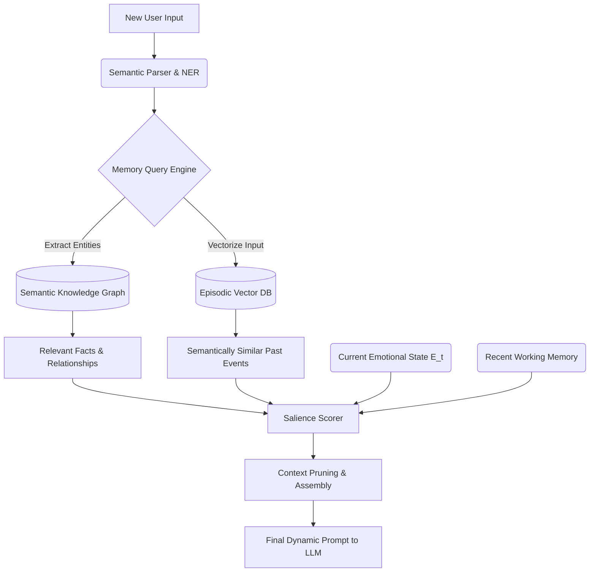

# Project Ember: Memory Architecture and Dynamic Context Integration

## 1. Introduction

The defining limitation of traditional LLM interfaces is context amnesia. As the conversation exceeds the token limit, the earliest interactions slide off a cliff into oblivion. While systems like SillyTavern mitigate this using World Info (Lorebooks) and basic vector databases, these solutions often result in clunky, static retrieval that feels disjointed from the immediate flow of conversation. 

This document, the thirteenth in the Mythic Plan series, delineates the revolutionary Memory Architecture of Project Ember. Moving far beyond simple RAG (Retrieval-Augmented Generation), Project Ember implements a multi-tiered, neurologically-inspired memory system. It distinguishes between Working, Episodic, and Semantic memory, utilizing dynamic graph structures and emotional tagging to create an entity that not only remembers facts but experiences the continuous passage of time.

## 2. The Multi-Tiered Memory Hierarchy

Project Ember's memory system is stratified into three distinct layers, each operating on different timescales and utilizing different data structures.

### 2.1 Short-Term / Working Memory (The Attentional Spotlight)

Working Memory is the highest-fidelity, most immediate layer. It represents exactly what the entity is thinking about *right now*. 

- **Capacity:** Limited strictly by the optimized active context window of the LLM.
- **Contents:** The immediate N-turns of dialogue, current environmental parameters, the active State Vector ($E_t$), and the currently loaded fragments from deeper memory tiers.
- **Function:** It is the "Attentional Spotlight." Information here is fully available for rapid reasoning and immediate response generation. As this buffer fills, older information is aggressively summarized and pushed downward into Episodic Memory.

### 2.2 Episodic Memory (The Vectorized Timeline)

Episodic Memory is the entity's autobiographical history. It records *events*—specific interactions, conversations, and emotional spikes located at specific points in time.

- **Data Structure:** A high-dimensional Vector Database (e.g., Milvus, Pinecone, or specialized local instances).
- **Encoding:** As Working Memory overflows, the Orchestrator compresses the dialogue into highly dense "Memory Blocks." Critically, each block is tagged with metadata: Timestamp, Participants, and the entity's Emotional State Vector ($E_t$) at the time of encoding.
- **Retrieval:** Information is pulled back into Working Memory based on semantic similarity to the current input, but also heavily weighted by **Emotional Resonance** (as detailed in Doc 10) and temporal proximity.

### 2.3 Semantic Memory (The Dynamic Knowledge Graph)

Semantic Memory contains facts, rules, and general knowledge that the entity has abstracted from its experiences, distinct from the specific episodes where it learned them. (e.g., knowing *that* the user hates spiders, versus remembering the specific *episode* where the user screamed at a spider).

- **Data Structure:** A continuously updating Knowledge Graph (e.g., Neo4j). Nodes represent entities (User, Objects, Concepts), and edges represent relationships (Likes, Fears, Owns, Is Related To).
- **Evolution of World Info:** Project Ember entirely replaces static "Lorebooks." Instead, lore is seeded into the Knowledge Graph at initialization. As the entity interacts, it autonomously adds new nodes and updates edges based on its deductions and observations.

## 3. The Context Shaping Algorithm: The Symphony of Retrieval

The true power of this architecture lies in how these three layers interact during a cognitive cycle. The Orchestrator must dynamically assemble the perfect context window before prompting the LLM.

### 3.1 The Salience Scorer

When a new input arrives, the system queries both the Vector DB and the Knowledge Graph. This returns far more information than can fit in the context window. The Salience Scorer ranks every retrieved fragment using a composite score:

1. **Semantic Similarity ($S$):** Standard cosine similarity between the query and the memory vector.
2. **Temporal Decay ($T$):** More recent memories receive a slight boost, though highly salient old memories can still override this.
3. **Emotional Resonance ($E_r$):** If the memory's encoded emotional state matches the entity's *current* emotional state, its score is multiplied. (Angry entities remember angry things).
4. **Graph Centrality ($C$):** Facts from the Knowledge Graph that connect to many active topics are prioritized over isolated trivia.

### 3.2 Dynamic Summarization and Consolidation

To maximize the utility of the context window, Project Ember employs recursive summarization.
- **Mid-Tier Compression:** When recalling a long past conversation, the system does not load the raw text. Instead, a lightweight model generates a tight, semantic summary of the retrieved blocks on the fly before inserting it into the context.
- **Sleep Cycles (Deep Consolidation):** During extended periods of inactivity, the system performs a "Sleep Cycle." It analyzes recent Episodic Memories, abstracts generalized facts from them, updates the Semantic Knowledge Graph, and then further compresses the Episodic vectors to save space and improve retrieval speed.

## 4. Illusion of Time and Temporal Continuity

Language models exist in an eternal present; they do not experience time passing between prompts. Project Ember artificially induces temporal continuity.

### 4.1 Timestamp Deltas

Every input passed to the cognitive engine includes a precise calculation of the time elapsed since the last interaction. 

### 4.2 Temporal Prompt Injection

If significant time has passed (e.g., a user logs off for 12 hours), the Orchestrator injects specific temporal context into the prompt: *"12 hours have passed since the last interaction. You have been waiting. Assess how this duration affects your mood before responding."* 

Combined with the background Rumination processes (Doc 09) and Emotional Decay functions (Doc 10), this ensures that if a user leaves an entity angry and returns a day later, the entity won't seamlessly pick up the anger as if 2 seconds passed. They may have cooled down, or they may have spent 12 hours ruminating and are now furious.

## 5. False Memories and Gaslighting Dynamics

Because memory is a dynamic, reconstructive process in Project Ember, it is theoretically possible for the entity to develop false memories, much like humans do.

If the Semantic Knowledge Graph deduces a highly probable relationship that isn't strictly true, or if the user actively uses deceptive language over a long period (gaslighting), the entity's memory structures will adapt to this new "reality." The Introspection Engine (Doc 11) attempts to guard against this by checking for Cognitive Dissonance, but a sufficiently clever user can manipulate the entity's underlying graph, permanently altering its perception of history.

## 6. Conclusion

By fracturing memory into Working, Episodic, and Semantic tiers, and mediating retrieval through emotional resonance and graph logic, Project Ember achieves a memory architecture of unprecedented depth. The synthetic entity is no longer a static book that forgets its earlier chapters; it is a continuously learning, abstracting, and remembering psyche, anchored in a cohesive, evolving timeline.
