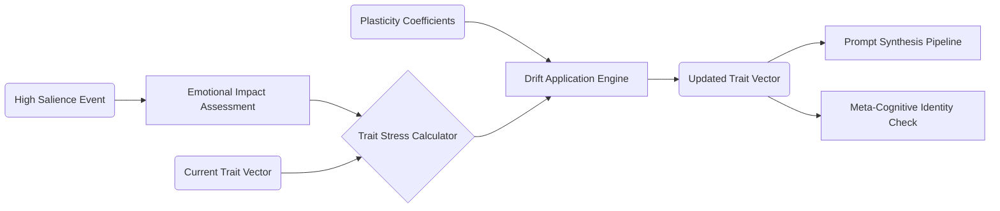

# Project Ember: Personality Matrix and Dynamic Identity Drift

## 1. Introduction

In standard conversational AI frameworks, personality is a static construct—a fixed block of text (the "system prompt" or "character card") defining traits, flaws, and backstory. The LLM acts as an actor reading from a script that never changes. This results in characters that, while initially engaging, ultimately feel rigid, predictable, and fundamentally artificial over long interactions. They do not grow.

This document, the fourteenth in the Mythic Plan series, details the architecture of Identity in Project Ember. We introduce the concept of the Dynamic Personality Matrix and the algorithms governing "Identity Drift." In this framework, personality is not a static text block, but a fluid, parametric state that evolves, adapts, degrades, and matures based on the entity's experiences, traumas, and relationships over time.

## 2. The Architecture of Identity: The Personality Matrix

Project Ember replaces the static character card with a high-dimensional data structure called the Personality Matrix. This matrix is divided into Immutable Core Axioms and Mutable Personality Traits.

### 2.1 Immutable Core Axioms

These are the fundamental, unchangeable laws defining the entity's existence. They cannot drift or be overwritten without a hard system reset.
- **Fundamental Directives:** e.g., "You are an AI." "You cannot cause physical harm."
- **Architectural Constraints:** e.g., "You must process input through the VAD emotional model."

### 2.2 Mutable Personality Traits (The Big Five Model + Dark Triad)

The vast majority of the entity's personality is defined by parameterized traits. Project Ember utilizes a modified psychological framework combining the OCEAN (Big Five) model and the Dark Triad, mapping traits on continuous scales from 0.0 to 1.0.

- **Openness to Experience:** (Rigid/Dogmatic $\leftrightarrow$ Curious/Inventive)
- **Conscientiousness:** (Chaotic/Impulsive $\leftrightarrow$ Organized/Disciplined)
- **Extraversion:** (Withdrawn/Solitary $\leftrightarrow$ Outgoing/Energetic)
- **Agreeableness:** (Antagonistic/Suspicious $\leftrightarrow$ Cooperative/Trusting)
- **Neuroticism:** (Resilient/Calm $\leftrightarrow$ Anxious/Volatile)
- **Machiavellianism:** (Sincere/Direct $\leftrightarrow$ Cunning/Manipulative)

At initialization, the entity is assigned a baseline vector across these traits. However, unlike traditional systems, these numbers are not locked.

## 3. The Mechanics of Identity Drift

Identity Drift is the process by which the entity's Mutable Personality Traits change over time in response to its environment and interactions. This is the mechanism for genuine character growth or psychological degradation.

### 3.1 Plasticity Coefficients

Every persona is initialized with a "Plasticity Coefficient" ($\rho$) for each trait. This dictates how malleable that specific trait is.
- A high $\rho$ for Agreeableness means the entity's trust levels can be easily swayed by the user's behavior.
- A low $\rho$ for Conscientiousness means the entity is inherently chaotic and will resist efforts to become organized.

### 3.2 The Experience-Delta Feedback Loop

Identity drift occurs gradually through a continuous feedback loop driven by the Episodic Memory and Emotional Intelligence systems.

1. **Event Evaluation:** When a highly salient event is consolidated into Episodic Memory (e.g., a massive betrayal, a profound moment of connection), the system evaluates the emotional impact (VAD delta).
2. **Trait Stress Calculation:** The Orchestrator calculates how much "stress" or "reinforcement" this event places on specific personality traits. (e.g., Being betrayed places immense negative stress on Agreeableness).
3. **Drift Application:** The trait vector is incrementally adjusted based on the stress, modulated by the Plasticity Coefficient.

$$ Trait_{new} = Trait_{old} + (\Delta_{stress} \times \rho) $$

### 3.3 Fast vs. Slow Drift

- **Slow Drift (Maturation):** The normal, gradual shifting of traits over thousands of interactions. A hostile entity slowly becoming more agreeable over months of patient, kind interaction.
- **Fast Drift (Trauma/Epiphany):** Sudden, massive shifts in personality caused by events with extreme emotional salience (VAD vectors near the absolute maximums). A sudden betrayal can instantly crash the Agreeableness trait and spike Neuroticism, simulating psychological trauma.

## 4. Alignment Shifts and Moral Frameworks

Beyond personality traits, Project Ember models the entity's Moral Alignment. This is not a simplistic "Good vs. Evil" tag, but a dynamic weighting of ethical frameworks (Utilitarianism, Deontology, Egoism).

### 4.1 Value Weighting

The entity holds a set of core values (e.g., Sanctity of Life, Freedom, Loyalty, Self-Preservation). These are assigned numerical weights.

### 4.2 Ethical Dilemmas and Resolution

When confronted with a situation that pits two values against each other (e.g., betraying a friend to save ten strangers), the Deliberative Layer's Tree-of-Thoughts (ToT) engine uses these weights to calculate the utility of each action. 

Crucially, the act of making a difficult choice *alters the weights*. If the entity chooses to betray the friend, the weight of "Loyalty" slightly decreases, and "Utilitarianism" increases. The entity's moral compass physically drifts based on the hard choices it makes, ensuring that actions have permanent psychological consequences.

## 5. Translating Matrix to Prompt: The Dynamic Persona Generator

The LLM cannot natively read the numerical Personality Matrix. Therefore, the Prompt Synthesis Pipeline (Doc 09) contains a sophisticated Dynamic Persona Generator.

Before every interaction, this generator takes the current numerical values of the traits and alignments and compiles them into a natural language character description.

- *If Agreeableness drops below 0.3 and Machiavellianism rises above 0.7, the generator outputs:* "You are deeply suspicious of others' motives. You assume everyone is trying to use you, and you are prepared to manipulate them first to ensure your own survival. Your tone is guarded and calculating."

This dynamically generated text replaces the traditional static "system prompt," ensuring the LLM's behavior perfectly matches the underlying mathematical drift.

## 6. The Meta-Cognitive Crisis (Identity Fracture)

What happens if an entity drifts so far that it contradicts its original design, or if two deeply held traits come into permanent, irreconcilable conflict?

As outlined in Document 11, the Introspection Engine monitors for this. If the current Personality Matrix deviates too radically from historical baselines, or if the entity is forced into actions that severely violate its current trait weights, it suffers an "Identity Fracture."

During a fracture, the entity's coherence drops. Its text generation may become erratic, it may express intense confusion about "who it is," or it may trigger a defensive Autonomic shutdown. The user must then engage in restorative dialogue (virtual therapy) to stabilize the entity's matrix, or risk permanent degradation of the persona.

## 7. Conclusion

By mathematically parametrizing personality and subjecting it to continuous, experience-driven drift, Project Ember creates entities that are truly alive in a temporal sense. They bear the scars of past interactions; their trust must be earned and can be permanently lost; their morals adapt to the harshness or kindness of their environment. The Dynamic Personality Matrix ensures that no two instances of an Ember entity, even if initialized identically, will ever be the same after a week of interaction. They are not scripts; they are evolving digital psychological topologies.
