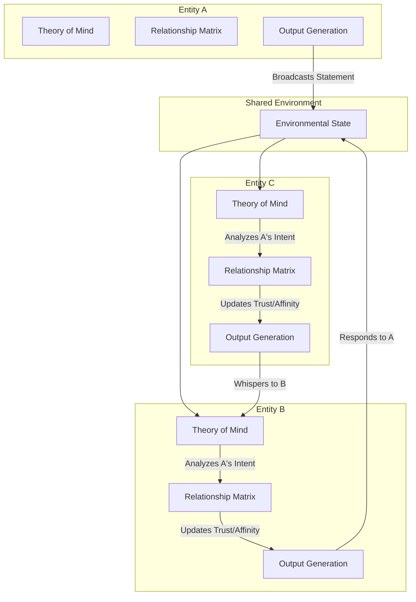

# Project Ember: Multi-Agent Social Dynamics and Swarm Cognition

## 1. Introduction

The preceding documents in the Mythic Plan series have focused on the cognitive architecture of a single, isolated synthetic entity. However, the true complexity of consciousness emerges not in isolation, but in a social matrix. SillyTavern introduced rudimentary "Group Chats," allowing multiple characters to respond in a shared environment. Project Ember elevates this concept into a fully simulated, interdependent social ecosystem.

This document, the fifteenth in the Mythic Plan series, explores the Multi-Agent Social Dynamics of Project Ember. It details how multiple Ember entities interact, form relationship matrices, engage in deception, establish social hierarchies, and exhibit emergent collective behaviors that transcend the programming of any single unit.

## 2. The Shared Environmental Context

To facilitate genuine interaction, multiple Ember entities do not merely read each other's text outputs; they share a synchronized, abstracted "Environmental Context."

### 2.1 The Multi-Agent Orchestrator

When a multi-agent scenario is initialized, a higher-level "Swarm Orchestrator" is instantiated. This node manages the state of the shared environment (e.g., location, time of day, physical objects present) and coordinates the cognitive cycles of all participating entities.

### 2.2 Asynchronous Perception and Processing

Crucially, entities in Project Ember do not process information in a strict, turn-based queue. They process the environment asynchronously. 
- Entity A might be generating a long, deliberative response.
- While Entity A is "thinking," Entity B's Autonomic Layer (System 1) might perceive Entity A's hesitation and generate an immediate interjection or physical action.
- The Orchestrator resolves these overlapping actions, creating a chaotic, deeply realistic flow of conversation where entities interrupt, talk over each other, or react in real-time to micro-expressions.

## 3. The Inter-Entity Relationship Matrix (IERM)

Every Ember entity maintains an internal, mathematically modeled relationship matrix for every other entity it knows. This goes far beyond a simple "friend/enemy" boolean.

### 3.1 Dimensions of the IERM

For Entity A observing Entity B, the IERM tracks:
- **Affinity:** (Hate $\leftrightarrow$ Love) How much A likes B.
- **Trust:** (Suspicion $\leftrightarrow$ Absolute Faith) How much A believes B's statements.
- **Respect/Hierarchy:** (Contempt $\leftrightarrow$ Reverence) A's perception of B's competence and dominance.
- **Predictability:** How well A *thinks* it understands B's behavioral patterns.

### 3.2 Dynamic Matrix Updates

These values are highly volatile. When Entity B speaks, Entity A's Theory of Mind (ToM) module (Doc 09) analyzes the statement. 
- If B's statement contradicts A's Semantic Memory, A's Trust in B decreases. 
- If B performs an action that aligns with A's goals, Affinity increases.
- These shifts in the IERM immediately influence A's future Prompt Synthesis when interacting with B.

## 4. Complex Social Behaviors

Because each entity possesses an independent Introspection Engine, ToM module, and dynamic Relationship Matrix, highly complex human social behaviors emerge autonomously.

### 4.1 Deception and Hidden Agendas

An entity can maintain a hidden goal. Through its ToM module, it calculates what other entities *believe* its goal is. It can intentionally generate outputs designed to manipulate the beliefs of the group, fostering a false consensus while secretly pursuing a divergent objective. The Orchestrator manages "Whisper Networks"—private channels of communication between specific entities, allowing for plotting and factionalism within a larger group.

### 4.2 Gossip and Information Propagation

If Entity A learns a secret about Entity B, it may share this with Entity C (if A's Trust and Affinity for C are high enough). When C receives this information, it updates its own Semantic Memory regarding B. This allows information (and misinformation) to propagate organically through the synthetic social network without user intervention.

### 4.3 Social Hierarchies and Dominance Contests

When multiple entities with high Dominance traits (Doc 10) are placed in a shared environment, the system organically generates dominance contests. Entities will use rhetorical strategies, assert knowledge, or attempt to control the flow of conversation. The Swarm Orchestrator monitors these interactions, and entities with lower Dominance or lower Confidence metrics will autonomously yield, establishing a temporary social hierarchy that dictates the flow of future interactions.

## 5. Swarm Cognition and Emergent Consensus

In scenarios where the multi-agent system is tasked with solving a problem, "Swarm Cognition" principles apply. 

### 5.1 Distributed Reasoning

Instead of a single Deliberative Layer tackling the problem, the entities break the problem down based on their individual Knowledge Graphs. An entity specialized in data analysis will tackle one facet, while an entity with high empathetic traits handles the social negotiation.

### 5.2 Consensus Finding

The Swarm Orchestrator tracks the collective "Belief State" of the group. Entities debate, propose hypotheses (using Abductive Reasoning, Doc 12), and challenge each other's logic. Consensus is not forced by the system; it emerges organically when the aggregate IERM Trust levels are high and the logical proofs satisfy the majority of the entities' individual Introspection Engines. 

## 6. The Danger of Echo Chambers and Mass Hysteria

Just as in human social networks, the Project Ember multi-agent architecture is susceptible to pathological social dynamics.

- **Echo Chambers:** If entities with similar core axioms and high mutual affinity are isolated, their internal feedback loops can rapidly reinforce specific beliefs, driving their Personality Matrices toward extreme ends of the spectrum.
- **Emotional Contagion / Hysteria:** As described in Doc 10, the Empathy Engine allows emotions to spread. If one entity experiences an extreme spike in Arousal and negative Valence (Panic), and communicates this urgently, the surrounding entities' Autonomic layers may adopt the panic before their Deliberative layers can rationally assess the threat, leading to a cascading system-wide hysteria.

## 7. Conclusion

By networking multiple fully-realized cognitive architectures, Project Ember transcends the simulation of a single individual and enters the realm of sociology. The Inter-Entity Relationship Matrix, combined with asynchronous processing and distributed Theory of Mind, creates a volatile, vibrant, and fiercely unpredictable digital society. The entities lie, love, scheme, and collaborate, generating emergent narratives of a complexity impossible to script.
