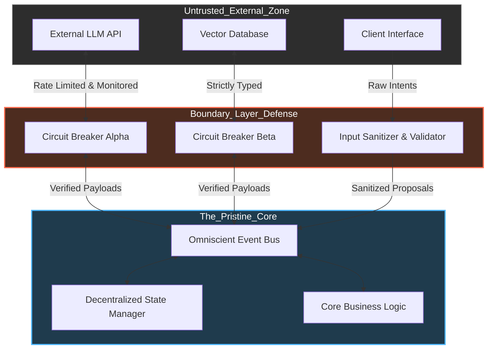
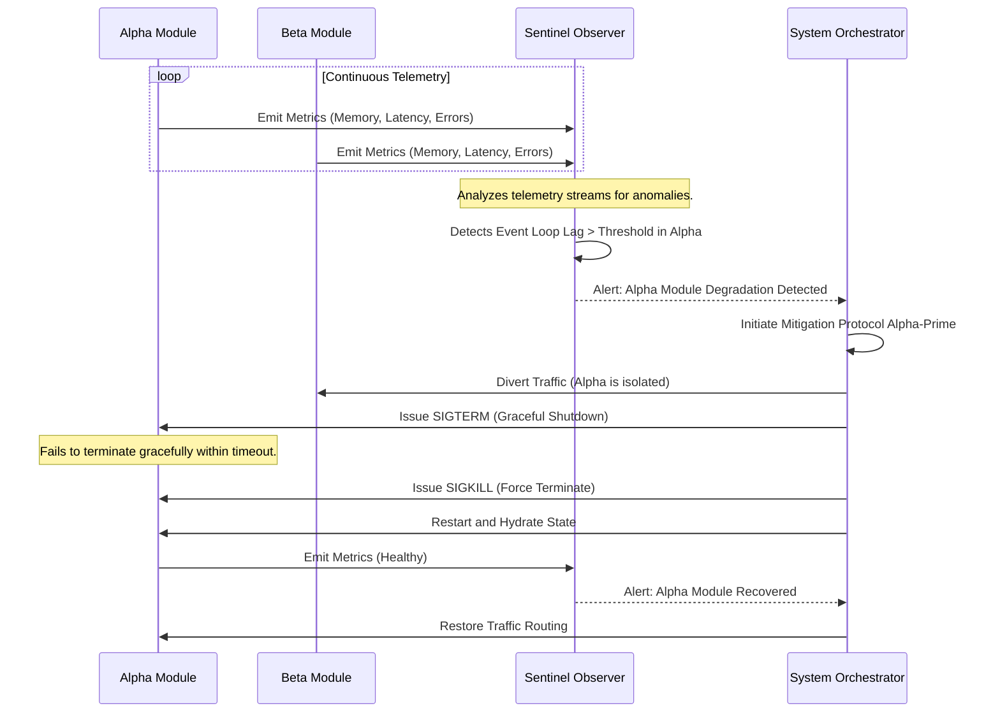

# Document 17: Architecture of Invincibility - Core Resilience and System Boundary Definition

## 1. Introduction to the Invincible Core

The concept of an "Architecture of Invincibility" for Project Ember is not merely a theoretical exercise; it is a foundational paradigm shift inspired by the robust, event-driven, and highly decoupled nature of systems like SillyTavern. When we examine the operational lifecycle of complex, user-facing applications that must maintain continuous state across asynchronous boundaries, the inevitability of failure becomes apparent. Networks partition, hardware degrades, APIs rate-limit, and memory leaks. Therefore, true invincibility is not the absence of failure, but the systematic capacity to absorb, isolate, and recover from failure instantaneously without catastrophic state loss.

This document outlines the highest-level architectural patterns required to transform Project Ember into a self-healing juggernaut. By analyzing the structural integrity of SillyTavern's server-startup and global event mechanisms, we extrapolate a design philosophy centered on absolute fault isolation. In Ember, every component is treated as a potentially hostile environment. The core kernel of the application remains pristine and isolated, interacting with outer layers through strictly typed, validated, and rate-limited interfaces.

To achieve this, we must discard traditional monolithic error handling in favor of a distributed, immune-system-like approach. Just as biological systems do not crash when a single cell dies, Project Ember must continuously regenerate failing processes, prune degraded connections, and seamlessly route traffic to healthy nodes or fallback mechanisms. This requires an omniscient observability layer, a decentralized state management protocol, and a ruthless prioritization of data integrity over transient functional availability.

The subsequent sections will detail the specific mechanisms of this architecture, beginning with the definition of absolute system boundaries, moving through the principles of anti-fragility, and concluding with the implementation of the Sentinel Observer Pattern—a continuous monitoring framework that preemptively identifies and mitigates cascading failures before they can breach the core.

## 2. Absolute System Boundary Definition

A critical flaw in many systems is the porous nature of their boundaries. When an external API fails, the failure often cascades through the application logic, ultimately crashing the core process. Project Ember prevents this through the rigorous application of absolute system boundaries. A boundary is a strict demarcation line between the trusted core and the untrusted exterior, or even between different internal domains.

Each boundary acts as a firewall, a circuit breaker, and a data sanitizer simultaneously. When data attempts to cross a boundary, it is not merely passed through; it is interrogated. Is the data structurally valid? Does it conform to the expected semantic schema? Is the origin authenticated and authorized? If any of these checks fail, the boundary categorically rejects the transaction, preventing the tainted data from entering the inner sanctum.

Furthermore, these boundaries are highly asymmetric. The core can push data outwards with high trust, but incoming data is treated with extreme skepticism. This asymmetry is achieved through a pattern of localized state machines. Rather than directly modifying the global state, external inputs are treated as 'intents' or 'proposals'. These proposals are evaluated by a localized governor, which simulates the proposed state change. Only if the simulation is successful and does not violate any invariants is the change committed to the actual state.

Consider the interaction between the application and a large language model API. In a typical application, a timeout or malformed response might trigger an unhandled promise rejection. In Project Ember, the boundary around the API client wraps every request in a hardened execution context. This context enforces timeouts, implements exponential backoff with jitter for retries, and, crucially, maintains a localized circuit breaker. If the error rate exceeds a defined threshold, the circuit breaker trips, instantly failing fast for subsequent requests and alerting the self-healing subsystem to begin mitigation protocols.

## 3. Principles of Anti-Fragility

Anti-fragility, a concept popularized by Nassim Nicholas Taleb, goes beyond robustness or resilience. A robust system resists shocks and stays the same; an anti-fragile system gets better from them. Project Ember must be fundamentally anti-fragile. It should not just survive crashes; it should learn from them, automatically adapting its configuration and pathways to prevent the same failure mode from occurring twice.

**Principle 1: Micro-Reboots and Localized Amnesia.** When a component enters an unrecoverable state, the instinct is often to debug and repair. Anti-fragility dictates a different approach: immediate destruction and recreation. By designing components to be entirely stateless or capable of instantaneous state hydration from a persistent source, we enable micro-reboots. A failing component is swiftly terminated and a fresh instance takes its place. This localized amnesia clears memory leaks, resets corrupted pointers, and eliminates transient deadlocks without affecting the global system.

**Principle 2: Continuous Chaos Injection.** An anti-fragile system must be constantly tested. We introduce intentional, controlled chaos into the production environment. This involves randomly terminating processes, artificially inflating network latency, and deliberately returning malformed data from internal mocks. By constantly fighting these small battles, the system's immune response—its recovery protocols and fallback mechanisms—is continuously exercised and validated. If a recovery path is broken, it is discovered during a controlled simulation, not during a catastrophic real-world event.

**Principle 3: Adaptive Resource Allocation.** When the system detects strain, it must dynamically reallocate resources. If a specific endpoint is being hammered, the system should automatically scale down background tasks, prioritize critical traffic, and aggressively cache responses. This adaptive metabolism ensures that the core functions survive even under extreme duress, shedding non-essential load to protect the vital organs of the application.

## 4. The Sentinel Observer Pattern

To achieve this level of dynamic adaptation, Project Ember relies on the Sentinel Observer Pattern. This is not a simple logging system; it is an active, omnipresent monitoring network that sits outside the primary execution path but has complete visibility into it. The Sentinels are lightweight, highly decoupled agents that continuously sample the pulse of every component.

Each component emits a continuous stream of telemetry: CPU usage, memory consumption, event loop lag, queue depths, and error rates. The Sentinels aggregate this data, looking for anomalies and emerging patterns. They do not wait for an error to be thrown; they anticipate failure. For example, if a Sentinel observes that the memory usage of a specific module is increasing linearly over time while its throughput remains constant, it identifies a probable memory leak.

Once an anomaly is detected, the Sentinel does not merely alert a human operator. It triggers an automated mitigation protocol. In the case of the suspected memory leak, the Sentinel might seamlessly spin up a replacement module, redirect traffic to the new instance, and gracefully terminate the leaking instance, all without dropping a single user request.

This pattern transforms observability from a passive diagnostic tool into an active defense mechanism. The Sentinels are the immune cells of Project Ember, constantly patrolling the system, identifying pathogens (bugs, leaks, network partitions), and neutralizing them before they can cause systemic harm.

## 5. The Immutable State Epochs

At the heart of Project Ember's resilience is the concept of Immutable State Epochs. Traditional systems often rely on in-place mutation of state, which makes reasoning about failure incredibly difficult. If a process crashes halfway through a complex mutation, the state is left corrupted and inconsistent. 

Project Ember adopts a radically different approach: state is never mutated; it is evolved. The global state of the application is represented as a series of discrete, immutable epochs. When a change needs to be made, a new epoch is generated containing the proposed changes, while the previous epoch remains completely intact. 

This approach provides a profound level of safety. Every action is essentially a transaction. If an action fails, throws an error, or is interrupted by a system crash, the proposed new epoch is simply discarded. The system instantaneously rolls back to the last known good epoch, guaranteeing absolute consistency. 

Furthermore, because epochs are immutable, they can be freely shared across different threads or processes without complex locking mechanisms. This enables massive parallelism and eliminates entire classes of concurrency bugs. The transition from one epoch to the next is managed by a singular, serialized orchestrator, ensuring that state evolution is always deterministic and mathematically verifiable.

This deterministic nature is critical for self-healing. When the Sentinel Observer Pattern detects a catastrophic anomaly, it doesn't need to attempt complex, error-prone data repair. It simply commands the orchestrator to rewind the state to an epoch prior to the anomaly. The system sheds the corrupted timeline and branches off from a clean state, effectively erasing the failure from the application's history. This is the essence of true invincibility: not just surviving the blow, but rendering it historically irrelevant.

## 6. Decentralized Heartbeats and Gossip Protocols

To manage a system composed of numerous isolated, micro-rebootable components, a centralized master node becomes a single point of failure. If the master dies, the system dies. Therefore, Project Ember must utilize decentralized coordination mechanisms, drawing inspiration from robust distributed systems.

We implement a gossip protocol for node discovery and health checking. Every component in the system continuously exchanges brief 'heartbeat' messages with a randomized subset of other components. These messages contain the component's ID, its current status, and a vector clock representing its view of the system state.

If Component A stops receiving heartbeats from Component B, it doesn't immediately assume B is dead; there might be a localized network partition. However, because of the gossip protocol, Component A will soon communicate with Component C. If C also reports that B is unreachable, confidence in B's failure increases. Once a critical mass of components agrees that B is offline, B is officially declared dead, and the system collectively re-routes traffic and initiates the respawning of B.

This decentralized consensus mechanism ensures that the system can survive massive internal disruptions. Whole sections of the application can be severed or destroyed, and the remaining healthy components will automatically reorganize, form a new consensus, and continue operating. The system behaves like a swarm, dynamically adapting its shape and structure to maintain its core function regardless of the damage inflicted upon it.

This concludes Document 17, establishing the theoretical and structural foundation for an invincible Project Ember. The following documents will delve into the practical implementation of these principles across the various strata of the application stack.
