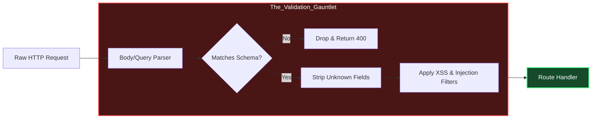

# Document 18: Fault-Tolerant Middleware & Express Handlers

## 1. The Crucible of Incoming Requests

In the architecture of Project Ember, the Express.js routing layer is not viewed merely as a set of convenient endpoints; it is the absolute frontline. It is the crucible where chaotic, unpredictable, and potentially malicious external inputs attempt to penetrate the system's core. Drawing from the structural imperatives seen in robust architectures like SillyTavern's `server-main.js` and `express-common.js`, we must re-engineer the middleware stack to be entirely fault-tolerant. 

Traditional Express.js applications are inherently fragile. A single unhandled promise rejection in an asynchronous route handler will terminate the entire Node.js process. A poorly validated payload can trigger exponential algorithmic complexity, causing a Denial of Service (DoS). To achieve invincibility, Project Ember mandates that the Express server must never crash under any circumstances arising from a client request. The middleware layer must act as an impenetrable membrane, neutralizing threats before they reach the business logic.

This requires a fundamental shift from optimistic routing to defensive routing. Every request is treated as hostile until mathematically proven otherwise. We achieve this through a rigorous sequence of middleware gates: payload sanitization, strict schema validation, aggressive rate limiting, and finally, execution within an isolated context. This document defines the architectural patterns for building these unbreachable gates.

## 2. The Unhandled Exception Firewall

The most critical vulnerability in Node.js/Express applications is the uncaught exception or unhandled promise rejection. Project Ember mitigates this entirely by implementing a universal, inescapable error-handling firewall.

We discard the standard practice of wrapping individual routes in `try...catch` blocks, as human error inevitably leads to omissions. Instead, we implement a higher-order wrapper that intercepts every route registration. This wrapper automatically encapsulates the underlying handler, injecting a comprehensive safety net.

```javascript
// Conceptual representation of the Ember Route Wrapper
function createInvincibleRoute(handler) {
    return async (req, res, next) => {
        // 1. Establish Execution Context ID for Tracing
        const contextId = generateUUID();
        req.contextId = contextId;
        
        try {
            // 2. Enforce Strict Timeout
            const timeoutPromise = new Promise((_, reject) => 
                setTimeout(() => reject(new Error('TIMEOUT_EXCEEDED')), 5000)
            );
            
            // 3. Execute with Race Condition
            await Promise.race([handler(req, res, next), timeoutPromise]);
            
        } catch (error) {
            // 4. Centralized Triage and Recovery
            EmberLogger.fatal(`Route failure in context ${contextId}`, error);
            
            // 5. Guaranteed Safe Response Formulation
            if (!res.headersSent) {
                res.status(500).json({
                    error: "CRITICAL_INTERNAL_FAILURE",
                    contextId: contextId,
                    recoveryState: "INITIATED"
                });
            }
        }
    };
}
```

This firewall guarantees that no matter how catastrophic the failure within the specific handler—whether it's a null pointer dereference, a database timeout, or a third-party API collapse—the error is trapped, logged with high fidelity, and translated into a standardized, safe response for the client. The main process remains unaffected and continues to serve other requests.

## 3. Strict Schema Enforcement and Payload Sanitization

Before a request is even allowed to execute the firewall-protected handler, it must pass through the Validation Gauntlet. Project Ember rejects implicit type coercion and optimistic data parsing. We mandate explicit, declarative schema definitions for every endpoint.

Using libraries like Zod or Joi, every expected payload, query parameter, and header is rigorously defined. The middleware layer intercepts the incoming request and validates it against the schema. If the validation fails, the request is immediately terminated with a 400 Bad Request. 



Crucially, this schema validation must also perform aggressive sanitization. We do not simply verify that a field exists; we strip away any undocumented fields that may have been maliciously injected. We sanitize strings to neutralize cross-site scripting (XSS) vectors and SQL/NoSQL injection attempts. By the time the data reaches the route handler, it is guaranteed to be clean, strictly typed, and structurally sound.

## 4. Adaptive Rate Limiting and Load Shedding

A resilient system must protect itself from being overwhelmed, whether by malicious actors or sudden spikes in legitimate traffic. Project Ember implements adaptive rate limiting as a core middleware component.

This is not a simple static threshold (e.g., 100 requests per minute). It is a dynamic system that monitors the overall health of the server. Under normal operating conditions, the rate limits may be generous. However, if the Sentinel Observers detect rising CPU load or increased response latency, the rate-limiting middleware dynamically tightens the restrictions.

Furthermore, we implement prioritized load shedding. Not all endpoints are created equal. In a crisis scenario where resources are critically depleted, the middleware will automatically start dropping requests to low-priority endpoints (like background synchronization or analytics) while preserving capacity for critical endpoints (like core state updates or authentication). This ensures graceful degradation of service rather than total systemic collapse.

## 5. Idempotency and Retry Safety Mechanisms

In distributed systems, clients often retry requests when they encounter timeouts or network glitches. If a request mutates state (e.g., a POST or PUT request), a blind retry can lead to data duplication or corruption. To make Express handlers truly fault-tolerant, we must build them to be idempotent.

Project Ember enforces idempotency through the middleware layer. Clients are required to include an `Idempotency-Key` header with mutating requests. The middleware intercepts this key and checks a fast-access, distributed cache (like Redis). 

1.  If the key is not found, the request proceeds, and the key is marked as "in progress."
2.  If the key is found and marked "in progress," the middleware holds the request and waits for the original request to complete.
3.  If the key is found and marked "completed," the middleware immediately returns the cached response of the original successful request, preventing double execution.

This mechanism ensures that no matter how chaotic the network conditions become, or how many times a client aggressively retries, the system's state remains perfectly consistent.

## 6. Circuit Breakers at the Middleware Boundary

Often, an Express handler's failure is not due to internal logic but reliance on downstream services (databases, microservices, external APIs). If a downstream service is unresponsive, continuous attempts to query it will exhaust connection pools and hang route handlers, eventually taking down the Express server.

Project Ember utilizes the Circuit Breaker pattern within the middleware to protect against this. When a route handler attempts to access a downstream service, the call passes through a circuit breaker. 

If the downstream service begins to fail or timeout repeatedly, the circuit breaker "trips" (opens). Once tripped, the middleware intercepts all subsequent requests destined for that service and immediately returns a predefined fallback response (e.g., a 503 Service Unavailable or cached data), without even attempting the downstream call.

This fail-fast mechanism prevents resource exhaustion and allows the downstream service time to recover. The circuit breaker periodically allows a single "test" request through (half-open state); if successful, the circuit closes, and normal operation resumes. This self-healing mechanism is vital for maintaining the responsiveness of the Express server even when its dependencies are crumbling.

By implementing these rigorous patterns—unhandled exception firewalls, strict schema validation, adaptive rate limiting, guaranteed idempotency, and circuit breakers—the Express routing layer of Project Ember transforms from a vulnerable attack surface into an impenetrable shield, safeguarding the core architecture from the chaotic realities of network interactions.
