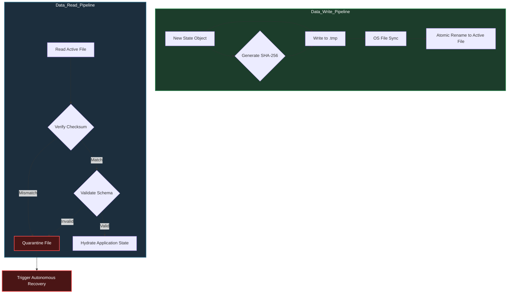

# Document 19: Self-Healing Data Pipelines - Storage, Backup, and Corruption Mitigation

## 1. The Imperative of Data Persistence Integrity

The soul of Project Ember resides in its data. Code can be redeployed, and servers can be respawned, but catastrophic loss or corruption of user state is the singular unrecoverable failure. Observing the mechanisms within SillyTavern—specifically its `recover.js` utility and structured `backups` directories—we recognize that relying on optimistic file system writes is a critical vulnerability. File descriptors lock, power fluctuations corrupt write buffers, and concurrent processes create race conditions.

To achieve an invincible data pipeline, Project Ember must treat the storage layer as a hostile territory. We cannot assume that a `write` operation successfully written to disk is structurally valid or logically sound upon the next `read`. Therefore, we must engineer a self-healing data pipeline that guarantees absolute durability, continuous validation, and automatic, zero-intervention recovery from corruption.

This document outlines the architecture for an uncorruptible storage engine. It details the implementation of atomic write patterns, continuous cryptographic state validation, multi-tiered rotational backup strategies, and autonomous recovery subroutines that repair damaged structures before they can trigger application-level crashes.

## 2. Atomic Writes and the Write-Ahead Log (WAL)

The most common source of file-based corruption is the interrupted write operation. If a process crashes or power is lost while data is being serialized to disk, the resulting file will contain a fragmented, unparseable payload. 

Project Ember mitigates this entirely by strictly enforcing atomic writes for all persistent state modifications. We abandon the practice of direct file overwriting. Instead, we implement a Write-Ahead Logging (WAL) pattern combined with a shadow-file replacement strategy.

When a state change needs to be persisted:
1.  **WAL Append:** The exact change instruction is first appended to a fast, append-only Write-Ahead Log. This guarantees the intent is recorded.
2.  **Shadow Write:** The complete new state is serialized into a temporary "shadow" file (e.g., `data.json.tmp`).
3.  **Sync & Flush:** We force the operating system to flush the shadow file buffers to physical disk, ensuring it is completely written.
4.  **Atomic Rename:** We utilize a POSIX-compliant atomic rename operation to swap the shadow file over the existing active file (`mv data.json.tmp data.json`). 

Because the final rename operation is atomic at the filesystem level, the active file is never in a partially written state. If a crash occurs during step 2 or 3, the shadow file is simply discarded on reboot, and the system relies on the previous valid active file, replaying any uncommitted changes from the WAL.

## 3. Cryptographic State Validation

Atomicity guarantees the file is fully written, but it does not guarantee the logic of the data within it. A software bug might serialize a logically invalid object. To detect this, Project Ember implements cryptographic state validation.

Every data payload written to the disk must be accompanied by a calculated checksum (e.g., SHA-256) and a schema version identifier. 

When the system boots or reads from disk, it performs a strict validation sequence:
1.  **Checksum Verification:** It recalculates the checksum of the loaded payload. If it does not match the stored checksum, the file is mathematically proven to be corrupted or tampered with.
2.  **Schema Validation:** It parses the JSON and passes it through a strict schema validator (like Zod). If the data structure deviates from the expected schema, it is considered logically corrupted.

If either validation fails, the system immediately quarantines the file and triggers the Autonomous Recovery Protocol, rather than attempting to parse bad data and crashing the core process.

## 4. Multi-Tiered Rotational Backups

Relying on a single backup file is insufficient for absolute resilience. A cascading failure or a latent bug might write corrupted data that successfully passes schema checks, overwriting the primary backup before the error is discovered. 

Project Ember implements a multi-tiered rotational backup strategy, creating an archive of historical states. 

1.  **High-Frequency Snapshots (Micro-Backups):** Before any major state mutation, a localized, in-memory snapshot is created. This protects against immediate logical errors within a single transaction.
2.  **Session/Hourly Backups:** The system maintains a rolling window of backups (e.g., the last 12 hours). These are stored in a dedicated `backups/hourly` directory.
3.  **Daily Archives:** A daily snapshot is retained for a longer period (e.g., 7 days) in a `backups/daily` directory.

Crucially, the backup creation process runs on an isolated background thread. It must never block the main event loop or impact application performance. If a backup fails to write due to disk space issues, the system logs a critical warning but continues to operate, prioritizing primary functionality over archival.

## 5. Autonomous Recovery Protocols

When the Data Read Pipeline detects corruption (via checksum mismatch or schema invalidation), the system does not crash and present an error to the user. Instead, the Autonomous Recovery Protocol (inspired by the intent behind `recover.js`) engages instantly.

This protocol follows a strict, escalating hierarchy of recovery attempts:

1.  **WAL Replay Attempt:** The system attempts to reconstruct the state by applying the Write-Ahead Log to the last known good snapshot.
2.  **Micro-Backup Reversion:** If the WAL is corrupted, the system attempts to load the most recent high-frequency snapshot.
3.  **Rotational Backup Triage:** The system scans the `backups/hourly` directory. It reads the files in reverse chronological order, subjecting each one to the Cryptographic State Validation pipeline. It will automatically load the most recent file that successfully passes both checksum and schema validation.
4.  **Graceful Degradation (The Last Resort):** If all backups are corrupted or unavailable, the system refuses to crash. It initializes a clean, empty state, notifying the user that a catastrophic data loss event occurred, but the application itself remains operational and ready to accept new input.

During this recovery process, the system locks incoming requests, returning a "503 Service Unavailable: State Reconstruction in Progress" response. This ensures that no new data is written while the foundation is being repaired.

## 6. The Black Box Telemetry

To ensure continuous improvement, every instance of data corruption and every recovery attempt is meticulously logged and analyzed. This is the "Black Box" of Project Ember. 

When corruption is detected, the system archives the corrupted file, the current WAL, and a snapshot of the current memory state into a secure diagnostic directory. A background telemetry process analyzes this payload to identify the root cause: Was it a disk I/O error? A specific sequence of events leading to a race condition? A memory leak corrupting the buffer?

This data is fed back into the development cycle, allowing engineers to patch the underlying vulnerability, thus fulfilling the principles of anti-fragility. The system encounters a near-fatal error, heals itself autonomously, and provides the exact data required to immunize itself against future occurrences.
