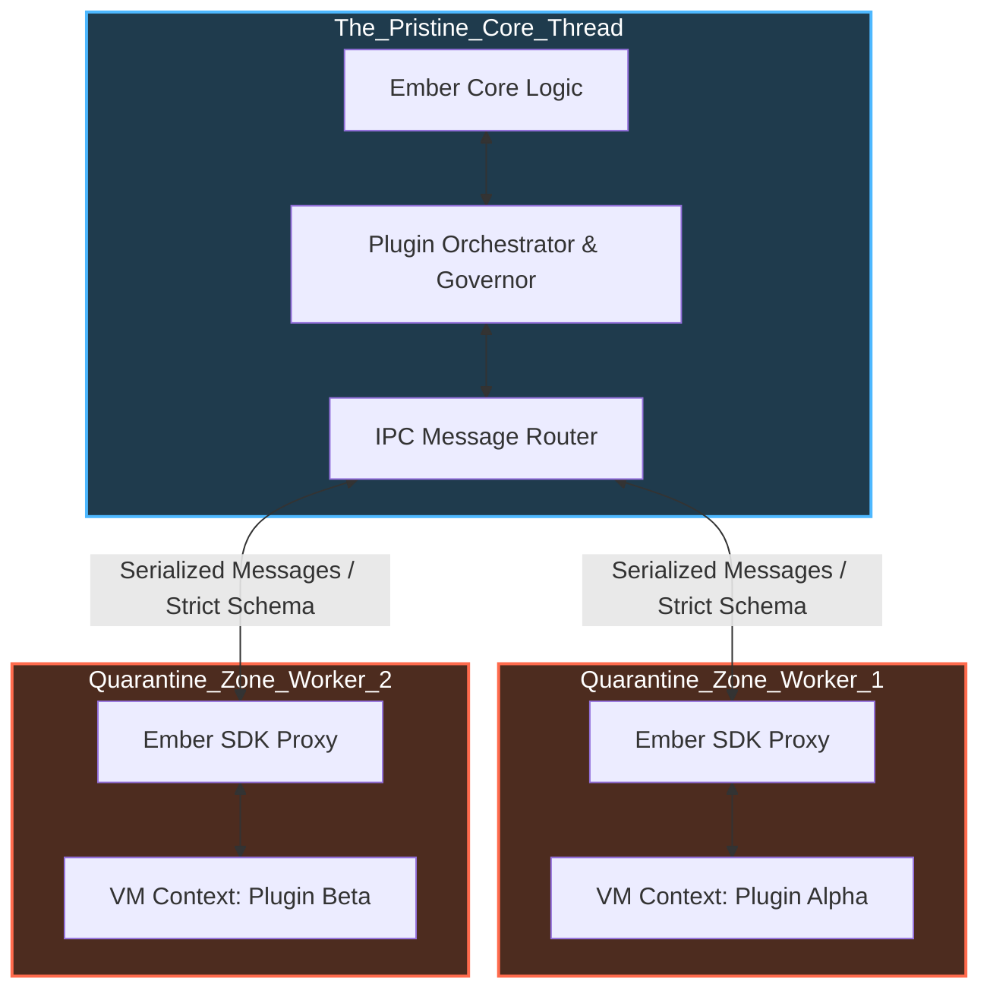

# Document 20: Crash-Proof Plugin Sandboxing - The Quarantined Extensibility

## 1. The Perils of Unrestricted Extensibility

Extensibility is a force multiplier for any application. As seen in SillyTavern's robust ecosystem, driven by its `plugin-loader.js` and the `plugins/` directory, the ability for third-party developers to inject new functionality is a massive asset. However, in the context of an architecture striving for absolute invincibility, plugins represent the most significant attack vector and stability threat.

A plugin is, by definition, untrusted code running within the perimeter of the application. If a plugin is loaded directly into the main Node.js event loop, its failures become system failures. An infinite loop in a poorly written plugin will freeze the entire application. A memory leak will crash the host process with an OOM (Out of Memory) error. A malicious plugin could mutate global state, intercept sensitive data, or delete critical configuration files.

Project Ember cannot tolerate this level of risk. Therefore, we must implement a paradigm of Crash-Proof Plugin Sandboxing. In this architecture, plugins are treated as highly volatile, potentially hazardous entities. They are executed within hermetically sealed environments, strictly monitored by resource governors, and permitted to interact with the core application only through rigorously policed, asynchronous communication channels.

This document outlines the design of the Ember Plugin Quarantine System, leveraging Node.js Worker Threads, `vm` contexts, resource quotas, and a strict Inter-Process Communication (IPC) protocol to guarantee that no plugin, no matter how catastrophic its failure, can ever bring down the core server.

## 2. The Multi-Layered Quarantine Architecture

Project Ember discards the traditional approach of simply `require()`ing or `import()`ing plugin code into the main execution context. Instead, we implement a multi-layered quarantine architecture that isolates plugins both logically and physically (at the thread level).

**Layer 1: The V8 Virtual Machine Context (`vm` Module)**
Before a plugin is even allocated a thread, its code is evaluated within a restricted V8 context using Node.js's native `vm` module. This provides the first layer of logical isolation. We construct a bespoke, hardened `global` object for the plugin. It has no access to the `process` object, no access to `fs` (file system), and no access to `require` (preventing it from loading arbitrary system modules). 

**Layer 2: Dedicated Worker Threads**
Logical isolation is insufficient against resource exhaustion (like infinite loops). To prevent a plugin from blocking the main event loop, every plugin—or at least every group of plugins—is spawned inside a dedicated Node.js `Worker Thread`. If a plugin enters an infinite `while(true)` loop, it only hangs its specific worker thread; the main Ember server remains perfectly responsive.

**Layer 3: The Inter-Process Communication (IPC) Bridge**
Because plugins run in separate threads with no shared memory, they must communicate with the core system via message passing (IPC). The core system exposes an API (the Ember SDK), but the plugin doesn't call these functions directly. Instead, calling `sdk.getCharacter()` sends a serialized message across the IPC bridge. The core receives the message, validates the request, executes it safely within the main thread, and sends the result back across the bridge.



## 3. The Resource Governor and Ruthless Termination

Isolation prevents a plugin from interfering directly with the core, but a plugin can still consume excessive system resources, degrading overall performance. Project Ember employs a Resource Governor that continuously monitors the telemetry of every Worker Thread.

The Governor enforces strict quotas based on the plugin's profile and user-defined limits:
1.  **CPU Time Limits:** If a plugin's thread consumes 100% CPU for more than a defined threshold (e.g., 2000ms), it is flagged as unresponsive.
2.  **Memory Quotas:** The memory footprint of the thread is tracked. If it exceeds its allocated quota (e.g., 50MB), it is flagged for a memory leak.
3.  **Execution Timeouts:** Every IPC request initiated by the core to the plugin must complete within a strict timeout.

When the Resource Governor detects a quota violation, it acts ruthlessly and decisively. It does not attempt to pause or debug the thread. It immediately issues a `worker.terminate()` command. This violently destroys the thread, freeing the resources instantly. 

The core system logs a fatal error for that plugin, marks it as "Crashed," and gracefully handles the failure on the main thread (e.g., if a route was waiting on the plugin for data, it returns a safe fallback or a specific error message). The user is notified that the plugin was terminated due to a resource violation, but the application remains stable.

## 4. The IPC Security Perimeter and Capability Manifests

The IPC bridge is the only way a plugin can affect the outside world. Therefore, it is heavily guarded. We cannot allow a plugin to arbitrarily ask the core to delete files or expose sensitive user data.

Project Ember implements a Capability-Based Security model. Every plugin must declare its required permissions in a manifest file (e.g., `plugin.json`). 

```json
{
  "name": "Advanced Lorebook Generator",
  "capabilities": [
    "read:character_data",
    "write:chat_history",
    "network:api.openai.com"
  ]
}
```

When the IPC Router receives a message from a plugin requesting an action, it first checks the plugin's approved capabilities manifest. 
*   If the plugin requests to read a character file, and it has `read:character_data`, the action proceeds.
*   If it attempts to read the main configuration file without the `read:config` capability, the IPC Router instantly rejects the message, logs a security violation, and potentially triggers the immediate termination of the offending plugin.

This ensures the Principle of Least Privilege is enforced at the architectural boundary, preventing even compromised or malicious plugins from accessing unauthorized vectors.

## 5. Plugin State Hydration and Micro-Restarts

Because the Governor terminates failing plugins ruthlessly, plugins must be designed to be stateless or capable of rapid state hydration. 

If a plugin manages some internal state (e.g., a cache of generated responses), it must persist this state periodically via the authorized IPC storage API (saving to the plugin's dedicated, sandboxed key-value store managed by the core).

When a plugin is terminated by the Governor, the Orchestrator can be configured to attempt an automatic micro-restart. It spawns a new Worker Thread, loads the plugin code, and injects the last known good state from the plugin's sandboxed storage. If the plugin crashes repeatedly within a short window (e.g., 3 crashes in 60 seconds), the Orchestrator permanently disables the plugin until manual intervention occurs, preventing a restart loop from consuming resources.

By combining V8 contexts, Worker Threads, ruthless Resource Governors, and capability-based IPC routing, Project Ember's plugin system achieves invincibility through extreme quarantine. The core system acts as an untouchable fortress, welcoming extensions but keeping them in highly supervised, heavily armed containments.
