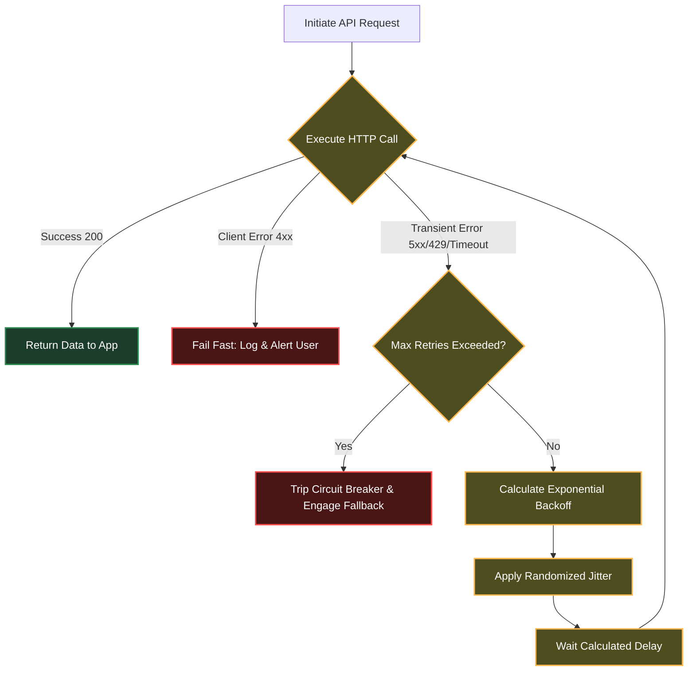

# Document 21: Graceful Degradation in API Connections - The Adaptive Network Frontier

## 1. The Inevitability of Network Betrayal

In the ecosystem of modern AI applications, the external API—whether it is an LLM provider, a vector database, or an authentication service—is the most volatile dependency. Systems like SillyTavern manage this volatility through modules like `request-proxy.js` and `fetch-patch.js`, attempting to normalize the chaotic nature of the open internet. However, an Architecture of Invincibility requires moving beyond mere normalization to active, preemptive defense and graceful degradation.

Project Ember operates under the assumption that external network connections will betray it. APIs will enforce brutal rate limits, DNS lookups will fail, SSL handshakes will timeout, and providers will experience catastrophic outages. If the core application is tightly coupled to the success of an external API call, then the provider's downtime becomes Ember's downtime.

To achieve invincibility, the boundary between Ember and the external world must be managed by an Adaptive Network Frontier. This subsystem acts as a shock absorber. When an external service falters, the application does not crash, nor does it freeze the UI indefinitely. Instead, it engages a sophisticated hierarchy of retry mechanics, circuit breakers, and seamless fallbacks, degrading the user experience gracefully rather than failing catastrophically.

This document details the strategies for constructing this Adaptive Network Frontier, focusing on exponential backoff with jitter, decentralized circuit breaking, intelligent request proxying, and the implementation of transparent multi-provider fallbacks.

## 2. The Smart Retry Engine: Exponential Backoff and Jitter

A naive approach to a failed network request is immediate retrial. When an API provider is struggling under heavy load, an application immediately retrying failed requests exacerbates the problem, contributing to a distributed denial-of-service (DDoS) effect and almost guaranteeing subsequent failures.

Project Ember replaces all basic `fetch` calls with a Smart Retry Engine. This engine implements Exponential Backoff with Jitter for any transient network error (e.g., 429 Too Many Requests, 502 Bad Gateway, 503 Service Unavailable, or generic timeouts).

**The Backoff Algorithm:**
When a request fails, the engine waits for a designated base delay before retrying. If it fails again, the delay is multiplied exponentially.
`Delay = Base_Delay * (Multiplier ^ Attempt_Number)`

**The Jitter Injection:**
Exponential backoff alone can lead to "thundering herd" problems, where many instances of Ember, backing off at the exact same intervals, all retry at the exact same moment. To break this synchronization, the engine injects "Jitter"—randomized noise added to the delay.
`Actual_Delay = Delay * (0.5 + Math.random())`

This creates a dispersed, manageable retry curve that respects the provider's constraints while maximizing the probability of eventual success.

## 3. Decentralized Circuit Breaking at the Edge

While the Smart Retry Engine handles transient glitches, it is insufficient for total provider outages. Retrying a dead endpoint, even exponentially, wastes resources and delays the necessary fallback response.

To combat this, Project Ember deploys Circuit Breakers at the edge of the Network Frontier. Every external endpoint is monitored by a localized state machine (the Circuit Breaker).

1.  **Closed State (Healthy):** Requests pass through freely. The breaker monitors the error rate (e.g., number of 5xx errors per 100 requests).
2.  **Open State (Failing):** If the error rate exceeds the defined threshold (e.g., 20%), the circuit trips. In the Open state, all incoming requests are *immediately* rejected or routed to a fallback, without even attempting the network call. This fails fast, protecting the application from resource exhaustion (hanging sockets) and immediately notifying the user of degraded service.
3.  **Half-Open State (Testing):** After a cooldown period, the breaker transitions to Half-Open. It allows a limited number of "test" requests through. If they succeed, the circuit Closes. If they fail, it trips back to Open.

By placing Circuit Breakers directly at the `fetch` abstraction layer, the core logic remains entirely unaware of the network volatility. It simply calls the API and either receives data immediately or receives an instantaneous failure/fallback response, maintaining perfect event loop fluidity.

## 4. Intelligent Request Proxying and Payload Shaping

Often, network failures are not due to the ultimate destination but the path taken. Project Ember utilizes a robust internal proxy architecture (akin to an advanced `request-proxy.js`) to route traffic dynamically.

The Proxy Layer is responsible for:
*   **Header Sanitization:** Stripping potentially identifying or problematic headers before they leave the secure perimeter.
*   **Payload Shaping:** Dynamically resizing or modifying payloads based on the destination's current capabilities. If an LLM provider is heavily loaded, the proxy might automatically truncate maximum context lengths to ensure a higher probability of request completion.
*   **Connection Pooling:** Maintaining persistent, keep-alive connections to frequently used providers to eliminate SSL handshake latency on every request.

Crucially, the proxy layer acts as the enforcement point for timeouts. It implements absolute deadlines for requests. If a downstream provider hangs indefinitely, the proxy severs the connection precisely at the deadline, returning a standardized timeout error and preventing the Ember process from bleeding memory through dangling sockets.

## 5. Transparent Multi-Provider Fallbacks (Graceful Degradation)

The ultimate defense against an API outage is not relying on a single API. Project Ember implements a transparent, multi-tiered fallback system.

When a user initiates an action requiring an LLM (e.g., generating a response), the request is sent to the Primary Provider. 

If the Primary Provider's Circuit Breaker is Open, or if the Smart Retry Engine exhausts its attempts, the system does not display an error. Instead, the Network Frontier automatically and transparently re-routes the request to a pre-configured Secondary Provider (e.g., falling back from a premium closed-source model to a local or cheaper open-source model).

This transition is invisible to the core application logic. The Network Frontier translates the request payload into the format required by the Secondary Provider, executes the call, translates the response back into the standardized Ember internal schema, and returns it.

The user might experience a slight delay or a marginal decrease in response quality (Graceful Degradation), but the application continues to function. A catastrophic failure of a primary dependency results in a minor inconvenience rather than a hard crash, fulfilling the definition of an invincible architecture. The user is notified of the fallback via a subtle UI indicator, maintaining transparency while ensuring continuous operation.
