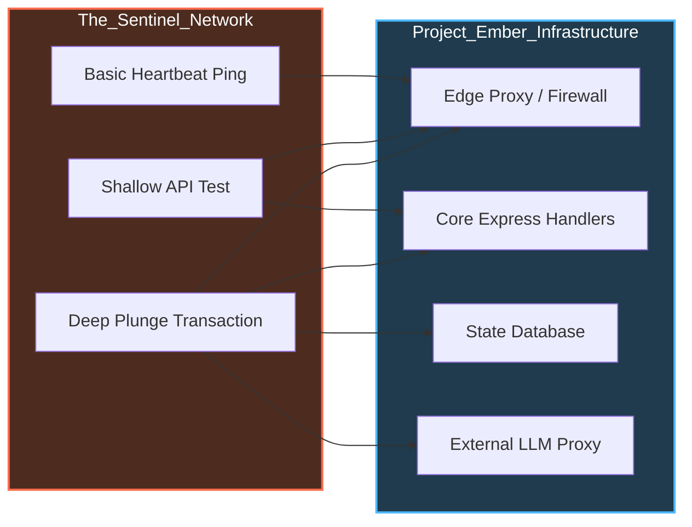

# Document 23: Omnipresent Health Monitoring & Telemetry - The All-Seeing Eye

## 1. The Inadequacy of Passive Logging

In conventional application architectures, health monitoring is often an afterthought, relegated to passive logging systems and simple `/health` endpoints (akin to basic implementations like SillyTavern's `healthcheck.js`). These systems are fundamentally reactive; they wait for a user to report an error or for a server to completely stop responding before sounding an alarm. By the time a traditional monitoring system detects a failure, the damage has already been done, user sessions have dropped, and the system is in crisis.

For Project Ember to achieve true invincibility, it requires an observability paradigm that is active, predictive, and ubiquitous. We must transcend the concept of logging errors to the concept of Continuous Telemetry. The system must understand its own baseline health at a microscopic level, enabling it to detect subtle degradations—a slowly rising memory footprint, a microsecond increase in database latency, a creeping error rate on an external API—long before they culminate in a catastrophic crash.

This document details the architecture of Project Ember's Omnipresent Health Monitoring system. It outlines the deployment of synthetic transactions, high-fidelity distributed tracing, real-time anomaly detection algorithms, and the integration of this telemetry directly into the Sentinel Observer network to trigger autonomous self-healing responses.

## 2. High-Fidelity Distributed Tracing

In a highly decoupled, asynchronous environment like Project Ember, an error rarely occurs in isolation. A failure in a plugin might be triggered by a malformed payload from a route handler, which in turn was caused by a database timeout. To understand the root cause, we must trace the complete lifecycle of every request across all boundaries.

Project Ember enforces High-Fidelity Distributed Tracing as a foundational requirement, not an optional add-on.

*   **Context Propagation:** The moment a request hits the edge firewall, it is assigned a unique, immutable Trace ID. This ID is passed inexorably through every middleware layer, every plugin IPC message, every database query, and every external API call. 
*   **Span Generation:** Every discrete operation within the system generates a "Span." A Span records its start time, end time, execution status (success/error), and contextual metadata.
*   **The Telemetry Sidecar:** To prevent tracing from blocking the main event loop, Spans are not written to disk or sent over the network by the core process. Instead, they are rapidly flushed to a lightweight, co-located Telemetry Sidecar process via a low-latency IPC socket. The Sidecar is responsible for aggregating, compressing, and transmitting the trace data to the central observability platform.

This ensures that when an error occurs, the system provides a complete, chronological map of the request's journey, pinpointing exactly which micro-component failed and what upstream data caused the failure.

## 3. Synthetic Transactions: The Canary in the Coal Mine

Passive monitoring waits for real users to experience errors. Active monitoring simulates users to find errors first. Project Ember utilizes Continuous Synthetic Transactions as its primary early-warning system.

The Sentinel Observers (detailed in Doc 17) do not merely monitor CPU and memory; they constantly execute predefined scripts that simulate critical user pathways.

1.  **The Heartbeat Ping:** A basic `/health` check that simply verifies the Express server is listening. (Low value, highly reliable).
2.  **The Shallow Dive:** A synthetic script that requests a static asset or a heavily cached API endpoint, verifying that the routing layer and caching mechanisms are functional.
3.  **The Deep Plunge:** A complex, multi-step synthetic transaction. The Sentinel might simulate a user logging in, loading a character profile, generating a short response via the proxy layer, and saving the chat history. 

These Deep Plunges are executed continuously (e.g., every 30 seconds). If a Deep Plunge fails or its latency exceeds strict thresholds, the Sentinel knows immediately that a critical subsystem is degrading, even if the primary server process appears healthy and real users haven't yet reported an issue. This allows the system to initiate mitigation protocols preemptively.

## 4. Real-Time Anomaly Detection and Predictive Failure

Static alerting thresholds (e.g., "Alert if CPU > 90%") are brittle. A system might normally operate at 95% CPU during peak hours, triggering false positives, while a memory leak slowly creeping from 40% to 60% during off-peak hours goes unnoticed until it causes an OOM crash.

Project Ember's telemetry system utilizes Statistical Anomaly Detection. The system continuously calculates the baseline behavior for every metric based on historical patterns, time of day, and current load volume. 

The Sentinels look for deviations from the dynamic baseline, not static limits.
*   **Example A:** If an endpoint normally responds in 50ms, and it suddenly jumps to 150ms while overall traffic is flat, the Anomaly Detector flags it, even though 150ms is below the hard timeout limit.
*   **Example B:** The system models the expected rate of memory garbage collection. If the frequency of GC cycles increases while the amount of memory reclaimed decreases, the system predicts an impending Out of Memory error with high confidence, long before the actual crash occurs.

## 5. Closing the Loop: Telemetry-Driven Self-Healing

The ultimate purpose of the Omnipresent Health Monitoring system is not merely to create beautiful dashboards; it is to provide the data required for autonomous action. Telemetry without automation is just noise.

In Project Ember, the telemetry pipeline is directly wired into the Orchestrator's control plane. 

When the Anomaly Detector flags a high-confidence impending failure (e.g., the predictive OOM scenario mentioned above), it does not wait for a human to intervene. The Sentinel Observer automatically triggers the Self-Healing Protocol:

1.  **Isolation:** The Orchestrator commands the Load Balancer to stop routing new user sessions to the degrading node.
2.  **Drain:** Existing sessions on the degrading node are allowed to finish their current transactions.
3.  **Spawn:** A fresh, pristine instance of the node is immediately spawned.
4.  **Termination:** Once the degrading node is drained (or if it hits a hard timeout), it is ruthlessly terminated (SIGKILL) to clear the impending OOM.

This creates a closed-loop system where Project Ember constantly observes itself, predicts its own failures, and performs surgical, automated repairs without ever dropping a user connection. The Omnipresent Telemetry is the nervous system that makes the Architecture of Invincibility possible.
