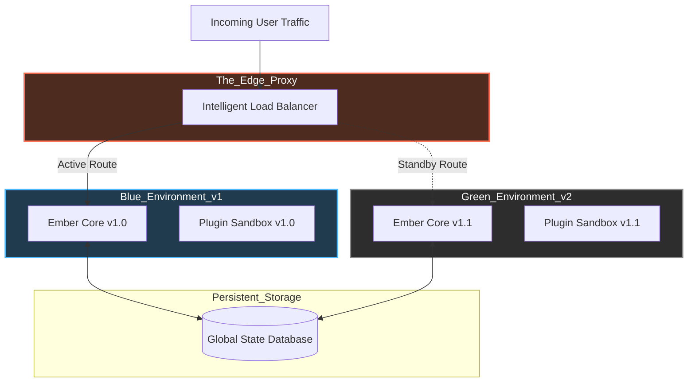

# Document 24: Zero-Downtime Deployment & State Hot-Swapping - The Ship of Theseus

## 1. The Fallacy of the Maintenance Window

In the lifecycle of traditional applications, including systems like SillyTavern where updates are managed via scripts like `UpdateAndStart.bat`, the concept of a "Maintenance Window" is accepted as a necessary evil. To deploy new code, patch a vulnerability, or update dependencies, the system must be brought offline. User sessions are severed, operations are halted, and the application is temporarily dead while the new version is installed and the server reboots.

For Project Ember, an Architecture of Invincibility rejects the concept of planned downtime entirely. If the system must be taken offline to be improved, it is fundamentally fragile. True resilience requires the ability to mutate the system's DNA while it is actively running, sprinting at full speed, without dropping a single packet or disconnecting a single user. 

This document defines the architecture for Zero-Downtime Deployment and State Hot-Swapping. We draw inspiration from the philosophical concept of the Ship of Theseus—replacing every plank of the ship while remaining at sea, until the entire vessel is new, yet uninterrupted in its voyage. This is achieved through Blue/Green routing, semantic state versioning, and the dynamic, isolated reloading of modular logic.

## 2. Blue/Green Architecture at the Edge

To achieve zero-downtime, we cannot overwrite files that are actively being executed by the Node.js process. Instead, Project Ember mandates a Blue/Green deployment strategy, enforced at the Load Balancer / Edge Proxy level.

1.  **The Active Environment (Blue):** The currently running version of Project Ember, handling 100% of the live user traffic.
2.  **The Staging Environment (Green):** A completely isolated, identical infrastructure environment. 

When a new version of Project Ember is ready for deployment, it is not installed over the Blue environment. It is deployed from scratch into the Green environment. 

The deployment process proceeds without impacting live users:
*   **Green Boot:** The new code boots up in isolation. It performs all necessary database migrations (designed to be non-destructive and backward compatible) and initializes its internal state.
*   **Sentinel Verification:** The Sentinel Observers (Doc 23) aggressively run synthetic "Deep Plunge" transactions against the Green environment to verify its stability, performance, and correctness.
*   **The Switch:** Only when the Green environment passes all algorithmic health checks does the Load Balancer atomically flip the routing rules. New user connections and API requests are instantly routed to the Green environment.

## 3. Seamless Connection Draining

Flipping the Load Balancer ensures *new* requests go to the new version, but what about the users actively connected to the old (Blue) environment? Terminating the Blue environment immediately would sever their websocket connections and ruin their experience.

Project Ember implements Seamless Connection Draining.

1.  **The Drain Signal:** When the Load Balancer switches to Green, it sends a `SIGUSR1` (Drain Signal) to the Blue environment.
2.  **Rejecting New Traffic:** The Blue environment immediately stops accepting any new connections.
3.  **Grace Period:** The Blue environment continues processing the requests and maintaining the websockets for its existing, active users.
4.  **State Streaming Handover:** Because Project Ember utilizes Continuous State Streaming and CRDTs (Doc 22), the Blue environment does not need to hold the users indefinitely. It gently instructs the connected clients to seamlessly reconnect. The clients drop the Blue websocket, reconnect to the Load Balancer (which routes them to Green), and instantly hydrate their state via the fast distributed cache.
5.  **Termination:** Once the Blue environment registers zero active connections, or a maximum grace period timeout is reached, it shuts itself down gracefully.

This ensures a 100% seamless transition for the user, who experiences only a microscopic, imperceptible re-hydration blink as they are moved across environments.

## 4. Semantic State Versioning and Upgrades

The most dangerous part of any deployment is changing the shape of the data. If Version 1.1 requires a different database schema than Version 1.0, the Blue/Green switch becomes treacherous. If Green mutates the database, Blue (which is still draining users) might crash when trying to read the new format.

Project Ember enforces Strict Forward-Only Data Migrations and Semantic State Versioning.

*   **Never Delete, Only Append:** Database migrations are never allowed to delete columns, drop tables, or rename existing fields in a destructive way. They may only add new tables or append new nullable columns.
*   **Dual-Write Compatibility:** The new code (Green) must be written to understand both the V1 and V2 data shapes. While Blue is still draining, Green writes data in a format that Blue can still parse (if necessary), or Blue ignores the new fields.
*   **Lazy State Upgrades:** The actual user state is not migrated all at once in a massive, blocking database lock. Instead, Project Ember uses Lazy Upgrades. When a user reconnects to the Green environment, their specific CRDT state is pulled from the cache. The Green environment recognizes the state is "Version 1," passes it through a localized, synchronous upgrade function to transform it into "Version 2," and then hydrates the session. 

This ensures that state migrations are distributed across time, executed only when needed, and completely avoid global database locks that cause downtime.

## 5. Dynamic Module Hot-Swapping (The Plugin Exemption)

While core engine upgrades require the Blue/Green maneuver, some components—specifically plugins within the Quarantine Zone (Doc 20)—require even faster iteration.

Project Ember allows for Dynamic Module Hot-Swapping for plugins. Because plugins are isolated in Worker Threads and communicate purely via strict IPC boundaries, they can be replaced on the fly without touching the core server or the Load Balancer.

1.  **New Code Drop:** The user or system drops an updated `plugin.js` into the plugins directory.
2.  **File System Watcher:** The core Plugin Orchestrator detects the file change.
3.  **Parallel Spawn:** The Orchestrator spawns a new Worker Thread with the updated plugin code.
4.  **State Transfer:** The Orchestrator commands the old plugin thread to serialize its internal state and pass it over the IPC bridge.
5.  **Hydration & Swap:** The Orchestrator injects the state into the new plugin thread. It then seamlessly re-routes all incoming IPC requests for that plugin to the new thread.
6.  **Old Thread Termination:** The old thread is ruthlessly terminated.

The entire process happens in milliseconds. The core application logic and the user's frontend experience zero interruption, completely unaware that a module deep within the system's architecture was just vaporized and replaced with an upgraded version. This is the ultimate realization of the Architecture of Invincibility.
