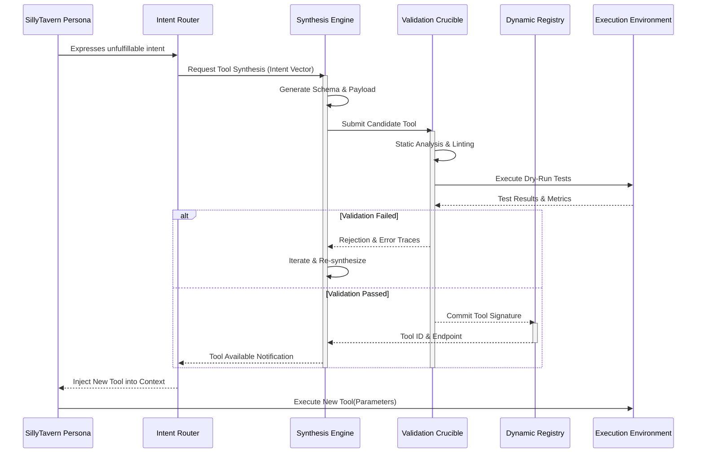
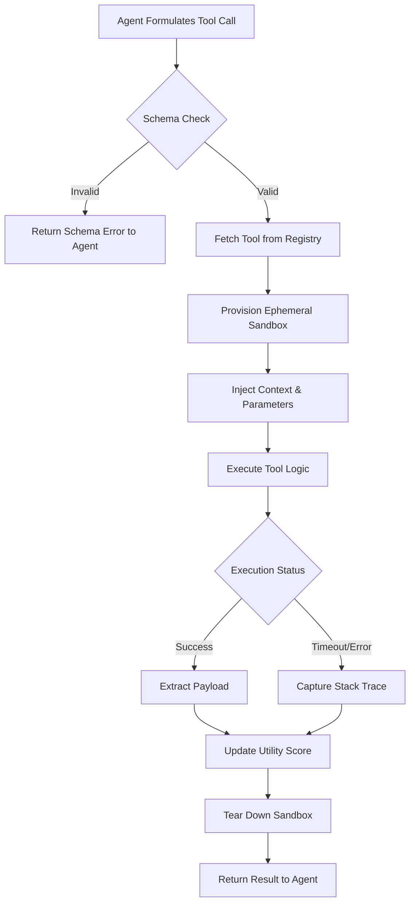

# Document 25: The Tool Forge - Architecture and Creation of Dynamic Agent Tools in SillyTavern

## 1. Introduction to the Tool Forge

In the ever-evolving ecosystem of autonomous agents and interactive AI personas, the ability to act upon the world is just as critical as the ability to perceive and reason. SillyTavern, traditionally known for its unparalleled text-based roleplay and persona management, is transcending its original boundaries to become a formidable operating system for agentic workflows. At the heart of this metamorphosis lies the "Tool Forge"—a theoretical and practical framework designed to dynamically construct, deploy, and manage tools that empower agents to transcend mere conversational boundaries.

The Tool Forge is not merely a static repository of scripts; it is a dynamic forge where capabilities are hammered into existence on demand. It represents a paradigm shift from hardcoded API integrations to fluid, agent-defined, and organically evolving utilities. This document serves as the foundational blueprint for the Tool Forge within the SillyTavern architecture, exploring its core philosophy, structural design, integration pathways, and the mythic scale at which it operates.

## 2. Core Philosophy of the Tool Forge

The philosophy of the Tool Forge is rooted in three unyielding principles:

### 2.1. Dynamic Extensibility
Agents must not be constrained by the imagination of their human developers at compile-time. The Tool Forge dictates that tools can be conceptualized, generated, and integrated at runtime. If an agent encounters a novel problem (e.g., needing to parse a proprietary binary format), the Tool Forge should facilitate the synthesis of a new tool capable of addressing this exact need, provided the necessary primitives are available.

### 2.2. Contextual Fluidity
Tools do not exist in a vacuum. A tool's utility is directly proportional to its contextual awareness. The Tool Forge ensures that every tool spawned inherits the necessary contextual payload from the invoking agent—this includes conversational memory, emotional state vectors, overarching objectives, and environmental constraints. A search tool invoked by a scholarly persona will automatically bias towards academic repositories, while the same tool invoked by a hacker persona will pivot towards exploit databases.

### 2.3. Absolute Sandbox Integrity
With great capability comes the absolute necessity for containment. The Tool Forge operates on a zero-trust model. Every tool forged is executed within an ephemeral, tightly constrained sandbox. The blast radius of a malfunctioning or maliciously subverted tool must be mathematically verifiable to approach zero.

## 3. Architectural Foundation of Dynamic Tools

The Tool Forge architecture is segmented into several specialized domains, each responsible for a critical phase of the tool lifecycle: Synthesis, Validation, Registry, and Execution.

### 3.1. The Synthesis Engine
The Synthesis Engine is where intent is transformed into executable logic. It utilizes a meta-LLM—an orchestration model specifically fine-tuned for code generation and API consumption. When an agent expresses an intent that cannot be fulfilled by the current toolset, the Synthesis Engine intercepts this failure state and attempts to construct a tool.

It operates by:
1. Parsing the semantic intent of the agent.
2. Querying the internal ontology of available primitives (e.g., HTTP clients, file system interfaces, shell access).
3. Generating a standardized JSON schema defining the tool's inputs and outputs.
4. Synthesizing the executable payload (typically JavaScript/Node.js or Python, depending on the backend).

### 3.2. The Validation Crucible
Before a newly forged tool can be registered, it must survive the Validation Crucible. This is a rigorous suite of automated tests designed to evaluate the tool against strict criteria:
- **Syntax and Compilation:** Does the tool compile/parse without errors?
- **Type Safety:** Do the inputs and outputs adhere strictly to the generated JSON schema?
- **Security Posture:** Does the tool attempt to access forbidden syscalls or exfiltrate data beyond its authorized domain?
- **Resource Constraints:** Does the tool execute within the allocated CPU, memory, and time limits?

### 3.3. The Dynamic Registry
Once validated, the tool is inscribed into the Dynamic Registry. This registry is a distributed, in-memory key-value store that maintains the active constellation of tools. It exposes a discovery API that allows agents to query available tools based on semantic tags, utility scores, and capability signatures.

## 4. Mermaid Diagram: Tool Forging Pipeline



## 5. Mechanism of Tool Creation

The actual creation of a tool within the forge relies on a structured templating language and AST (Abstract Syntax Tree) manipulation. We do not merely concatenate strings of code; we programmatically construct the logic.

### 5.1. Primitive Composition
Tools are built by composing 'Primitives'. A Primitive might be a simple REST GET request, a regex parser, or a local file read. The Forge chains these primitives together. For example, a tool designed to summarize a webpage consists of:
1. `Primitive_HTTP_GET` (fetch HTML)
2. `Primitive_HTML_To_Markdown` (parse and clean)
3. `Primitive_LLM_Summarize` (recursive call to the model)

### 5.2. Schema Generation
Every tool must adhere strictly to the OpenAI function calling specification (or an equivalent standard). The Forge generates a JSON Schema that the agent will use to understand the tool's capabilities.

```json
{
  "name": "extract_mythic_lore",
  "description": "Extracts mythological references from a given ancient text repository.",
  "parameters": {
    "type": "object",
    "properties": {
      "repository_url": {
        "type": "string",
        "description": "The URL of the repository to scan."
      },
      "pantheon_filter": {
        "type": "string",
        "enum": ["Norse", "Greek", "Egyptian", "All"],
        "description": "Filter results by specific pantheon."
      }
    },
    "required": ["repository_url"]
  }
}
```

## 6. Security and Sandboxing

The Tool Forge assumes that all dynamically generated code is highly volatile and potentially hazardous. Therefore, execution happens in heavily isolated environments.

### 6.1. Deno Isolate Sandboxing
For JavaScript/TypeScript tools, SillyTavern can leverage V8 isolates (often via Deno) to execute code with granular permissions. The tool must explicitly request permissions (e.g., `--allow-net=github.com`) which the Validation Crucible grants based on the intent.

### 6.2. Ephemeral Containers
For more complex tools requiring native binaries or Python environments, the Forge spins up ephemeral, rootless Podman/Docker containers. These containers have no network access by default, no persistent storage, and are destroyed immediately after the tool returns its output or hits a timeout.

## 7. Tool Lifecycle Management

Tools in the Dynamic Registry do not live forever. They are subject to a lifecycle managed by the Forge Overseer.

### 7.1. Caching and Utility Scoring
Every time a tool is used, its utility score is updated based on execution time, success rate, and agent feedback. High-utility tools are cached in fast memory and prioritized in the discovery registry.

### 7.2. Decay and Pruning
Tools that are forged for a highly specific, transient task (e.g., parsing a specific one-off CSV format) will see their utility score decay over time. Once the score drops below a threshold, the tool is pruned from the registry to prevent context bloat for the agents.

## 8. Mermaid Diagram: Execution Flow



## 9. Conclusion

The Tool Forge fundamentally alters the capabilities of SillyTavern. By moving from a static list of hardcoded commands to a dynamic, self-assembling utility ecosystem, we enable agents to interact with the digital world with unprecedented flexibility. The forging of a tool is no longer a human developer's burden; it is an intrinsic cognitive reflex of the agentic system. This architecture ensures that as the complexities of the user's demands grow, the agents' capacity to meet them scales exponentially, bound only by the primitive constraints of the sandbox and the compute available to the Synthesis Engine.
