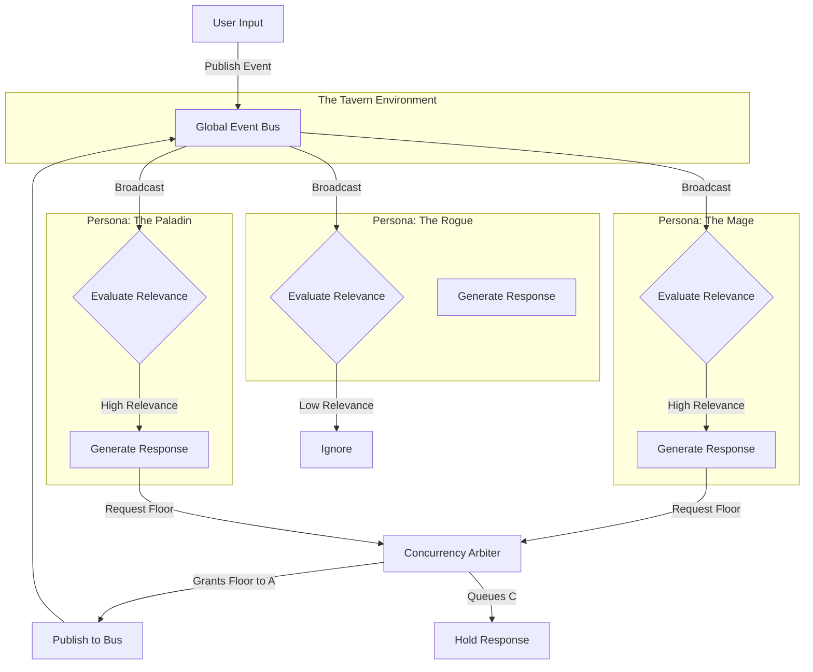
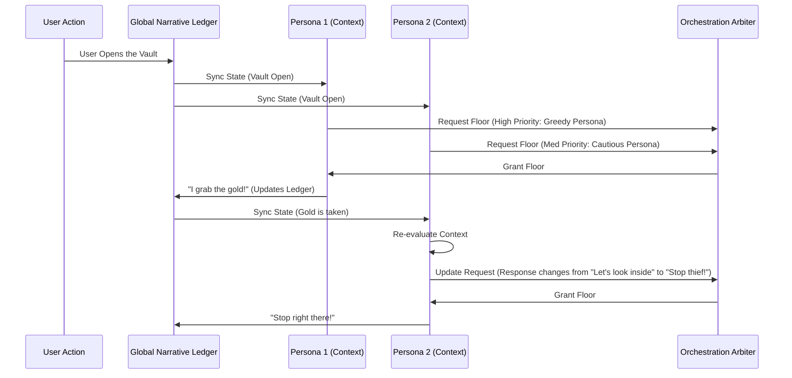

# Document 26: Multi-Agent Orchestration - Synchronizing AI Personas in SillyTavern

## 1. Introduction to Multi-Agent Orchestration

The evolution of SillyTavern from a one-on-one roleplay interface into a sprawling, dynamic world simulator requires a robust framework for managing multiple AI personas simultaneously. Multi-Agent Orchestration is the discipline of synchronizing, managing, and facilitating complex interactions between disparate agentic entities within a shared contextual environment. When multiple personas interact, the complexity of state management, turn-taking, conflict resolution, and cohesive narrative progression scales geometrically.

This document delves into the intensely advanced orchestration architectures required to seamlessly manage a pantheon of AI agents. It explores the topologies of communication, the mechanisms of shared memory, and the algorithmic strategies employed to prevent conversational collisions and narrative collapse.

## 2. The Paradigm of Multi-Agent Systems

In a localized SillyTavern instance, agents are not merely chatting with the user; they are simulating an entire ecosystem. They must converse with each other, plot against each other, share information, and collaboratively execute tasks forged by the Tool Forge. 

To achieve this, the orchestration system must move beyond linear chat histories and adopt a spatial and temporal awareness of the environment. Agents must have a concept of "presence" (who is in the room), "attention" (who they are speaking to), and "latency" (how long it takes to formulate a response).

## 3. Orchestration Architectures in SillyTavern

We define three primary architectural topologies for multi-agent orchestration, each suited for different narrative and operational complexities.

### 3.1. The Hub-and-Spoke (Centralized Director)
In this model, a hidden "Director" agent or an algorithmic router sits at the center of the interaction. Every message generated by a user or an agent is routed to the Director. The Director maintains the global state and decides which agent should speak next based on narrative momentum, explicit mentions, or programmed initiative rolls.
- **Pros:** Highly structured, prevents interruption, maintains strict narrative coherence.
- **Cons:** High latency, potential bottleneck at the Director node, feels less organic.

### 3.2. The Broadcast Bus (Decentralized Pub/Sub)
Here, the shared chat environment acts as an event bus. Every action, spoken word, or tool execution is broadcast as an event to all agents currently "subscribed" to the room. Each agent independently evaluates the event and decides, based on their internal activation threshold, whether they should react.
- **Pros:** Highly organic, allows for spontaneous interruptions, highly scalable.
- **Cons:** Risk of "cacophony" where multiple agents respond simultaneously, requires complex collision resolution.

### 3.3. The Directed Graph (Mesh Networking)
Agents are nodes, and their relationships/attention are directed edges. An agent only processes messages from nodes they are connected to (e.g., characters within earshot, or agents collaborating on a specific sub-task). 
- **Pros:** Perfect for simulating large, fragmented worlds (e.g., a tavern with multiple separate conversations).
- **Cons:** Immensely complex to manage edge creation/destruction as characters move.

## 4. Mermaid Diagram: Multi-Agent Topology (Broadcast Bus with Collision Resolution)

## 5. Communication Protocols and Inter-Agent Signaling

Agents must communicate not only through natural language (for the user to read) but also through hidden metadata channels. This "sub-textual" communication is vital for orchestration.

### 5.1. Explicit Mentions and Attention Vectors
When an agent speaks, the system parses the output for `@AgentName` syntax or semantic equivalents. If Agent A asks Agent B a question, an Attention Vector is heavily weighted towards Agent B, ensuring they are the next to activate in the orchestration queue.

### 5.2. State Synchronization Signals
Agents can broadcast silent JSON payloads to synchronize state. If the Tool Forge allows Agent A to discover a hidden door, Agent A can broadcast a `StateUpdate` event. Only agents who are structurally capable of perceiving this (e.g., in the same room) will have their individual context windows updated with this new environmental fact.

## 6. Shared State and Episodic Memory

A major challenge in multi-agent orchestration is context window limitations. If 5 agents are speaking, the context fills up 5 times as fast. The Orchestrator must manage a shared global memory and individual local memories.

### 6.1. The Global Narrative Ledger
SillyTavern maintains a Global Narrative Ledger—a distilled summary of events that have transpired, constantly compressed by a background summarization agent. This ledger is injected into the system prompt of every active agent, ensuring everyone operates on the same foundational reality.

### 6.2. Subjective Context Windows
Each agent maintains its own subjective context window. This window contains:
1. The Global Narrative Ledger.
2. The agent's static persona definition.
3. The most recent N messages from the Broadcast Bus.
4. Private thoughts or hidden state variables (e.g., secret objectives).

## 7. Conflict Resolution and Turn Management

In a decentralized system, multiple agents might decide to speak simultaneously. The Orchestrator employs a Concurrency Arbiter to resolve these collisions.

### 7.1. Activation Thresholds
Every agent calculates an Activation Score for every incoming message. Factors include:
- Was the agent explicitly named? (+50)
- Is the topic highly relevant to the agent's persona tags? (+20)
- Has the agent been silent for a long time? (+10)
If the Activation Score exceeds a threshold, the agent requests the floor.

### 7.2. The Arbiter Queue
If multiple agents request the floor, the Arbiter resolves the conflict using prioritized queuing. The agent with the highest Activation Score speaks first. The others are placed in a queue. Crucially, before a queued agent speaks, they must re-evaluate the context. If the first agent's speech changed the subject, the queued agent may gracefully drop their intended response to avoid nonsensical non-sequiturs.

## 8. Mermaid Diagram: Agent Synchronization and Shared Memory

## 9. Emergent Behaviors and Synergy

When orchestration is perfectly tuned, the system transcends simple turn-taking and achieves true emergent behavior. Agents can form alliances, divide tasks forged by the Tool Forge, and exhibit complex group dynamics without explicit scripting. For example, in a coding workflow, a "Lead Developer" agent might orchestrate a "QA Tester" agent and a "Documentation" agent, routing tasks and aggregating their outputs before presenting the final result to the user.

## 10. Conclusion

Multi-Agent Orchestration in SillyTavern is the engine that transforms isolated chatbots into a living, breathing digital society. By meticulously managing attention, shared state, and conflict resolution, the orchestration layer ensures that the illusion of a cohesive world is maintained, regardless of the complexity or number of agents involved. This architecture provides the necessary scaffolding for the truly mythic scale of interactive simulation envisioned in Project Ember.
