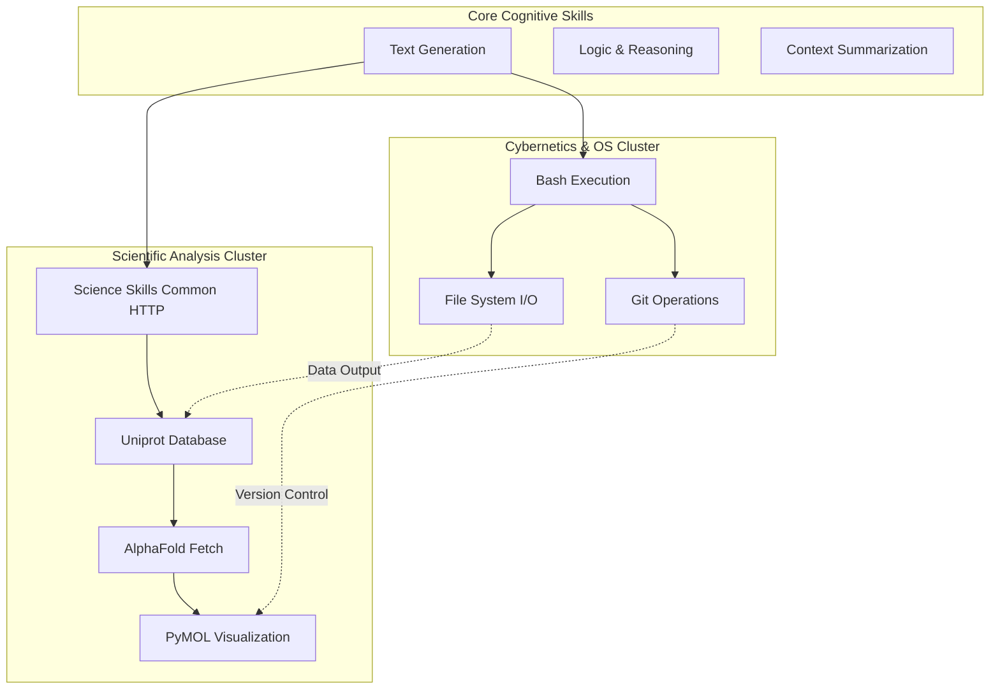
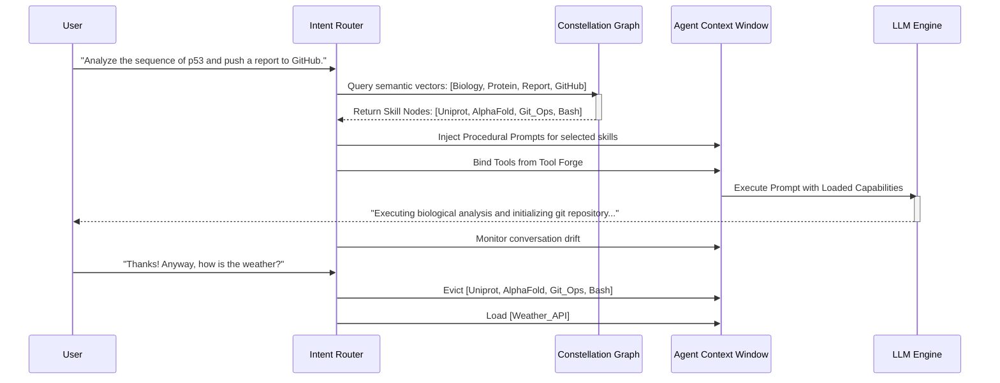

# Document 27: Skill Constellations - Mapping and Expanding Agent Capabilities

## 1. Introduction to Skill Constellations

As the cognitive capabilities of underlying Large Language Models expand, the limiting factor for agentic utility in SillyTavern is no longer reasoning power, but the structural organization and accessibility of specific skills. A "Skill" in this context is a bounded domain of knowledge, executable actions, and procedural workflows—ranging from executing a web search to orchestrating a complex genomic analysis or writing a full-stack application.

"Skill Constellations" represent a visionary topological framework for organizing, mapping, and dynamically loading these capabilities into an agent's context. Rather than burdening every agent with an exhaustive, monolithic system prompt containing every conceivable tool, Skill Constellations allow for modular, semantic, and relational loading of capabilities based on the immediate contextual needs of the persona and the narrative.

## 2. The Anatomy of a Skill Node

At the foundational level of the constellation lies the Skill Node. A Skill Node is an atomic unit of capability. It is not merely a tool (as defined in the Tool Forge), but a comprehensive instructional packet that teaches the agent *how* and *when* to use a specific set of tools.

A standard Skill Node contains:
- **Manifest:** A JSON/YAML definition including the skill's name, description, and semantic tags.
- **Prerequisites:** Dependencies required for this skill (e.g., the `python_execution` skill is a prerequisite for the `data_analysis_pandas` skill).
- **Procedural Prompting:** Specific markdown instructions injected into the agent's context window that guide the reasoning process for this domain.
- **Tool Bindings:** Links to the specific tools in the Tool Forge authorized for this skill.
- **Exemplars:** Few-shot examples demonstrating successful execution of the skill.

## 3. Topologies of Constellations

Skill Nodes do not exist in isolation; they are connected via directed edges representing relational relevance and dependency, forming a Constellation. This graph-based approach allows the orchestration system to traverse capabilities organically.

### 3.1. Hierarchical Dependency Graphs
Some skills are strictly hierarchical. An agent cannot utilize the `reactome_database` skill without first possessing the `science_skills_common` (HTTP client) and fundamental `biology_ontology` skills. The constellation maps these strict dependencies, ensuring that when a high-level skill is requested, the entire dependency chain is loaded into the agent's context.

### 3.2. Semantic Proximity Clusters
Skills are also linked by semantic proximity. The `python_execution` skill is closely clustered with `bash_terminal` and `git_version_control`. If an agent is activated in a "Software Developer" persona, the orchestration engine loads this entire cluster, anticipating that if the agent writes Python, they will likely need to test it in bash and commit it to git.

## 4. Mermaid Diagram: Skill Constellation Topology

## 5. Dynamic Loading and Context Economy

The primary genius of the Skill Constellation architecture is context economy. An LLM's context window is precious real estate. Loading every skill simultaneously leads to catastrophic forgetting, dilution of persona, and massive token costs.

### 5.1. Just-In-Time (JIT) Skill Loading
SillyTavern implements JIT loading via an Intent Router. When the user asks a question about protein folding, the Intent Router identifies the semantic vector of the prompt, queries the Skill Constellation, and dynamically retrieves the `AlphaFold Fetch` and `Uniprot Database` nodes. These instructions and tool bindings are appended to the agent's context *only for the duration of that specific task*.

### 5.2. Skill Eviction Policies
Once a task is completed, or if the conversation shifts to a mundane topic, the orchestration engine executes a Least Recently Used (LRU) eviction policy. The heavy procedural prompts of the scientific skills are purged from the active context, returning the agent to its lightweight baseline persona, thus preserving tokens and maintaining conversational agility.

## 6. Constellation Forging: Creating New Skills

The Skill Constellation is a living graph. It can be expanded natively through user interaction or automated workflows.

### 6.1. The Workflow Distillation Process
SillyTavern includes a meta-skill (e.g., `workflow-skill-creator`) designed to monitor successful interactions and crystallize them into new Skill Nodes. If a user spends an hour teaching an agent how to query a proprietary API and format the results, the user can invoke the distillation command.
The system will:
1. Analyze the transcript of the successful workflow.
2. Extract the necessary tools and parameters.
3. Generate the procedural prompting required to replicate the success.
4. Package this into a new Skill Node and inject it into the Constellation.

### 6.2. Persona-Specific Constellations
Different agents can be bound to different subsets of the global constellation. A "Hacker" persona might have permanent access to the Cybernetics cluster, while a "Biologist" persona is deeply rooted in the Scientific Analysis cluster. This enforces character consistency; the Biologist cannot arbitrarily start executing bash scripts to hack a mainframe unless the user explicitly bridges the constellation for them.

## 7. Cross-Constellation Synergy

The most advanced emergent behaviors occur when multiple skills from distant clusters are combined. For example, an agent tasked with analyzing a protein and publishing the results to a website must bridge the Scientific Analysis cluster with the Web Development cluster. 

The orchestration engine handles this by identifying the shortest path through the constellation graph, loading the intermediate bridging skills (like file I/O and JSON parsing) to ensure a smooth transition of data between the disparate domains.

## 8. Mermaid Diagram: Just-In-Time Loading Lifecycle

## 9. Conclusion

Skill Constellations provide the topological map required to navigate the infinite potential of autonomous agents. By structuring capabilities into relational, dynamically loadable nodes, SillyTavern achieves a delicate balance between omnipotence and operational efficiency. This architecture ensures that agents are not bloated monolithic entities, but agile, context-aware intellects capable of summoning the exact knowledge and tools required to overcome any challenge presented in the mythic expanse of Project Ember.
