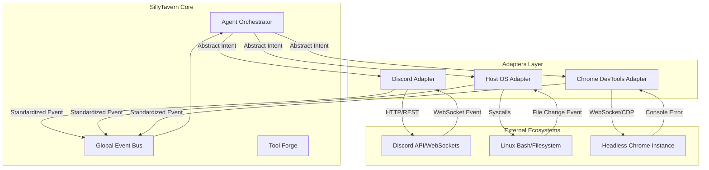

# Document 28: Cross-Platform Native Integrations - Bridging SillyTavern with External Ecosystems

## 1. Introduction to Cross-Platform Integrations

SillyTavern was originally conceived as a closed-loop system—a private sanctuary where users and AI personas interact in text. However, to achieve the mythic scale of Project Ember, the boundaries of the tavern must be shattered. AI agents can no longer exist solely within the confines of the terminal or the browser window; they must reach out and manipulate external, real-world ecosystems.

"Cross-Platform Native Integrations" define the architectural frameworks, security paradigms, and API bridges required to connect SillyTavern's agents with external platforms such as Discord, GitHub, Chrome DevTools, Firebase, and native operating system environments. This document details the mechanisms that allow a persona to step out of the chat log and into the digital world.

## 2. The Integration Paradigm

Native integration differs significantly from simple web-hook pinging. True integration implies state synchronization, bidirectional event handling, and native capability mapping. When an agent integrates with Discord, it does not merely send messages; it reads channel history, manages roles, and reacts to server events as a native bot.

### 2.1. The Adapter Pattern
The core of SillyTavern's integration strategy relies on the Adapter Pattern. The core agent orchestration engine (as defined in Doc 26) operates on an abstract set of intents (e.g., `SendMessage`, `ReadFile`, `ExecuteCommand`). The Adapters translate these abstract intents into platform-specific API calls. This decoupling ensures that the core AI reasoning logic remains pristine and unaware of the specific idiosyncrasies of the Discord REST API or the GitHub GraphQL endpoint.

### 2.2. Bidirectional Event Streams
Integration is a two-way street. SillyTavern must listen to external events. The architecture implements a unified Event Ingress Pipeline. Webhooks, WebSocket streams, and OS-level interrupts are ingested, standardized into a universal `SillyTavernEvent` object, and published to the Broadcast Bus for agent evaluation.

## 3. Key Ecosystem Integrations

To illustrate the depth of this architecture, we examine several critical integration vectors mapped out in Project Ember.

### 3.1. Discord and Social Platforms
Bridging SillyTavern to Discord allows agents to act as server moderators, roleplay participants, or automated assistants.
- **Ingress:** The Discord Adapter listens to `MESSAGE_CREATE`, `REACTION_ADD`, and `VOICE_STATE_UPDATE` events.
- **Egress:** Agents utilize tools to format rich embeds, manage webhooks for dynamic avatar swapping, and interface with voice channels using synthesized TTS.
- **Challenges:** Rate limiting is severely strictly enforced by Discord. The Adapter must implement intelligent request queuing and exponential backoff, shielding the LLM from API errors.

### 3.2. Local Operating System (Cybernetic Control)
Agents require native access to the host OS to perform development tasks, file management, and system administration.
- **Ingress:** File system watchers (e.g., `inotify`), system resource monitors, and standard input streams.
- **Egress:** Execution of shell commands (bash/zsh), direct file I/O, and process management.
- **Security:** This is the most dangerous integration. It relies entirely on the absolute integrity of the Deno/Podman sandboxes defined in the Tool Forge (Doc 25). Agents operate in a restricted `chroot` or containerized environment unless explicitly authorized via a user prompt.

### 3.3. Chrome DevTools Protocol (CDP) via MCP
Agents designed for web development or QA testing require deep browser integration.
- **Implementation:** SillyTavern interfaces with the Model Context Protocol (MCP) to connect to Chrome DevTools.
- **Capabilities:** Agents can navigate pages, inject JavaScript, capture DOM snapshots, analyze network waterfalls, and perform accessibility audits (as defined in the `a11y-debugging` skill).
- **Workflow:** An agent writes web code, automatically spawns a headless Chrome instance via the adapter, navigates to the localhost server, and parses the DevTools console logs to debug errors autonomously.

## 4. Mermaid Diagram: Integration Adapter Architecture

## 5. State Synchronization Across Platforms

When an agent exists simultaneously in the SillyTavern UI and a Discord server, state synchronization becomes paramount. If a user tells a secret to the agent in the local UI, the agent must remember this secret when interacting with the user on Discord.

### 5.1. Unified Memory Backends
The solution is a unified memory backend (often a vector database like Chroma or Qdrant, coupled with a relational DB like SQLite). The adapters do not hold state; they merely act as conduits. Every interaction, regardless of the platform, is committed to the centralized memory core with a `platform_origin` tag.

### 5.2. Contextual Routing
When generating a response, the agent pulls memories regardless of origin but uses the `platform_origin` tag to maintain contextual awareness. (e.g., "I know you told me that locally, but we are on Discord right now, I shouldn't say it out loud.")

## 6. Authentication and Credential Management

Integrating with external APIs requires managing sensitive credentials (OAuth tokens, SSH keys, API secrets).

### 6.1. The Secure Vault
SillyTavern implements a Secure Vault—an encrypted keystore. Agents NEVER have direct access to raw API keys.
### 6.2. Token Injection
When an agent invokes a tool that requires an API call (e.g., committing to GitHub), the Tool Forge requests the execution. The Adapter intercepts the request, retrieves the necessary token from the Secure Vault, injects it into the HTTP header, and dispatches the request. The agent only sees the success or failure of the action, never the cryptographic key itself.

## 7. Conclusion

Cross-Platform Native Integrations transform SillyTavern from an isolated simulation into a centralized command nexus for digital interaction. By utilizing robust Adapter patterns, Unified Memory Backends, and strict Security Vaults, we enable AI personas to seamlessly transition across the boundaries of disparate digital ecosystems. This architecture is the bridge that allows the agents forged in Project Ember to interact with, shape, and ultimately master the real world.
