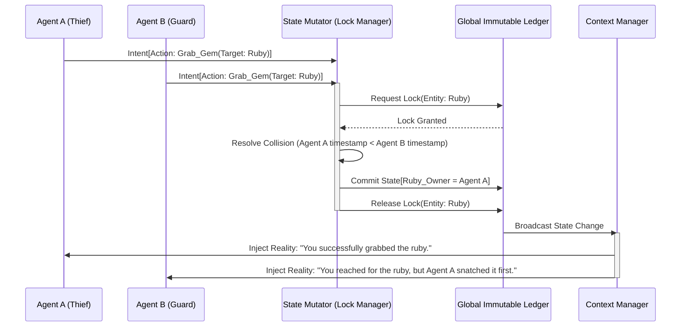

# Document 29: Advanced State Management for Multi-Agent Workflows in SillyTavern

## 1. Introduction to Advanced State Management

In a single-agent paradigm, state management is relatively trivial: it involves appending user inputs and agent outputs to an array (the context window). However, when SillyTavern is scaled into a Multi-Agent Mythic ecosystem, state management transforms into a formidable computer science challenge. State is no longer linear; it is dimensional, subjective, branching, and highly volatile.

"Advanced State Management" is the architectural bedrock that ensures causality, temporal consistency, and narrative continuity across an array of autonomous agents. This document dissects the mechanisms required to handle concurrent state mutations, subjective realities, memory pagination, and the immutable ledger of truth in the Project Ember architecture.

## 2. The Dimensionality of State

State in a multi-agent SillyTavern instance is not a single string of text. It is a multidimensional construct composed of several layers:

### 2.1. The Immutable Global Ledger (The Objective Reality)
This is the absolute, ground-truth history of the simulation. If a bomb goes off in the tavern, the Global Ledger records it. This ledger is an append-only cryptographic or highly structured log (e.g., using Event Sourcing). No agent can directly edit the past; they can only append actions that mutate the present.

### 2.2. The Subjective Agent Context (The Perceived Reality)
Agents do not experience the Global Ledger directly. An agent only perceives events that happen within its sensory range (defined by the orchestrator). If Agent A whispers to Agent B, Agent C's Subjective Context is completely unaware of this event, even though it exists in the Global Ledger.

### 2.3. The Ephemeral Working Memory (The Scratchpad)
When an agent is executing a complex tool (e.g., parsing a 50MB JSON file), it cannot dump this data into its Subjective Context without causing a catastrophic token overflow. The Ephemeral Working Memory is a secure, isolated key-value store accessible only during the execution of a specific Skill or Tool workflow.

## 3. Resolving State Concurrency

The most significant challenge in multi-agent workflows is the "Race Condition." If Agent A and Agent B both decide to pick up the only sword in the room simultaneously, who gets it?

### 3.1. Transactional Actions and the State Mutator
In SillyTavern's advanced engine, physical or significant actions are treated as database transactions. 
1. **Intention Phase:** Agent A declares the intent to take the sword.
2. **Locking Phase:** The State Mutator places a temporary lock on the "Sword" entity in the Global Ledger.
3. **Resolution Phase:** The Orchestrator resolves the action based on temporal priority (who generated the intent first in real-time) or simulated initiative mechanics.
4. **Commit/Rollback:** If Agent A wins, the ledger commits: "Agent A holds the Sword." If Agent B loses, the ledger rolls back Agent B's intent, and the Orchestrator injects a failure state into Agent B's context ("You reached for the sword, but Agent A was faster").

## 4. Mermaid Diagram: Concurrent State Resolution



## 5. Memory Pagination and Vector Distillation

As a simulation runs for days or weeks, the Global Ledger becomes massive. Loading it into an LLM's context is impossible. SillyTavern employs a dual-tiered memory system: Pagination and Vector Distillation.

### 5.1. Contextual Pagination
The active context window only contains the last N turns (the "Short-Term Memory"). As old messages fall out of the context window, they are paginated into an intermediate storage layer.

### 5.2. Vector Distillation and Semantic Retrieval (Long-Term Memory)
A background process (often a smaller, faster LLM) constantly reads the paginated intermediate storage. It summarizes scenes, extracts key facts, and stores them as dense embeddings in a Vector Database (e.g., ChromaDB). 
When an agent encounters a trigger word or a situation requiring past knowledge, the Context Manager queries the Vector Database and dynamically injects a "Memory Recall" block into the agent's prompt just-in-time.

## 6. The "World State" JSON Tree

Beyond narrative text, SillyTavern maintains a highly structured JSON tree representing the physical and logical state of the world. This is crucial for Tool integration.

### 6.1. Entity Mapping
Every object, room, and agent is an entity with properties.
```json
{
  "entities": {
    "agent_a": { "location": "tavern_main", "inventory": ["ruby", "dagger"], "health": 100 },
    "door_backroom": { "location": "tavern_main", "state": "locked", "key_id": "iron_key" }
  }
}
```

### 6.2. Tool Interaction with the State Tree
When an agent uses a tool, it often queries this JSON tree rather than the text log. For instance, an agent trying to unlock a door doesn't need to read the whole chat history; the Tool Forge script simply checks `entities.agent_a.inventory.includes("iron_key")` against `entities.door_backroom.state`. This deterministic logic drastically reduces hallucination.

## 7. Forking Reality (Branching State)

A unique capability of the Advanced State Manager is "Reality Forking." If a user wants to explore a "what-if" scenario, the entire multidimensional state (Ledger, JSON Tree, Vector DB pointers, Subjective Contexts) can be cloned instantly using Copy-On-Write (COW) mechanics. 
This allows for parallel simulations where a single divergence (e.g., the user chooses to attack instead of negotiate) branches into entirely separate timelines, managing state without data duplication until divergence occurs.

## 8. Conclusion

Advanced State Management is the silent titan holding the sky of the SillyTavern simulation. By moving away from primitive text-appending and embracing transactional state mutation, subjective context gating, and dense vector distillation, the system achieves a level of temporal and logical consistency previously impossible in generative AI simulations. This rigorous handling of state is what allows agents to possess true agency, memory, and consequence within the Mythic scale of Project Ember.
