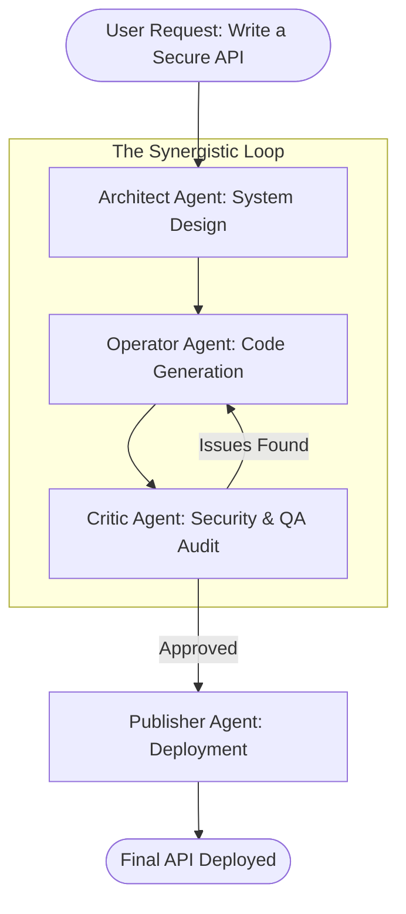

# Document 30: Forging Synergistic Workflows - Tool Pipelines and Agent Collaboration

## 1. Introduction to Synergistic Workflows

In a highly advanced multi-agent SillyTavern environment, isolated actions are insufficient for solving complex, real-world tasks. While the Tool Forge (Doc 25) enables the creation of atomic tools, and Multi-Agent Orchestration (Doc 26) manages conversation, the true power of Project Ember is realized when tools and agents are chained together into Synergistic Workflows.

A Synergistic Workflow is a directed pipeline where the output of one agent's tool execution becomes the input for another agent's cognitive process. This document details the architecture of these pipelines, the delegation of tasks, and the mechanisms by which AI personas collaborate to achieve goals that exceed the capabilities of any single node.

## 2. The Philosophy of Agent Specialization

For collaboration to be effective, agents must be specialized. A homogeneous group of generic agents will perform poorly compared to a heterogeneous group of experts. SillyTavern achieves this via Persona definitions intertwined with specific Skill Constellations (Doc 27).

- **The Architect:** Specializes in logic, planning, and structural design. Bound to high-level reasoning models.
- **The Operator:** Specializes in executing bash scripts, moving files, and interacting with the OS. Bound to fast, code-optimized models.
- **The Analyst:** Specializes in parsing massive datasets, running Python pandas scripts, and generating reports.
- **The Critic:** Specializes in QA, security auditing, and reviewing the work of others.

## 3. Workflow Architectures

Workflows in SillyTavern can be dynamically constructed or statically defined as master templates.

### 3.1. The Waterfall Pipeline (Sequential)
The simplest synergistic workflow. The user issues a command. Agent A performs a task, passes the raw data to Agent B, who formats it, and passes it to Agent C, who presents it to the user.
*Example: User asks for a stock report. Operator scrapes the data -> Analyst calculates moving averages -> Architect writes the executive summary.*

### 3.2. The Map-Reduce (Parallel Delegation)
For heavy computational or generative tasks, the Architect agent acts as the 'Mapper'. It breaks a massive task (e.g., summarizing a 1000-page book) into 10 smaller chunks. It spawns 10 ephemeral instances of the Analyst agent, assigns one chunk to each, and runs them in parallel. Once all Analysts return their results, the Architect 'Reduces' them into a single coherent output.

### 3.3. The Iterative Refinement Loop (Adversarial)
A workflow designed for high-quality code generation or creative writing. 
1. The Operator writes a draft of a script.
2. The script is passed to the Critic.
3. The Critic runs security tools and static analysis, generating a list of flaws.
4. The Operator receives the flaws, rewrites the script, and resubmits it to the Critic.
This loop continues until the Critic approves the output, at which point the final product is delivered to the user.

## 4. Mermaid Diagram: Iterative Refinement Loop (Adversarial Workflow)

## 5. Pipeline Data Formats and The "Handoff"

When agents collaborate, they cannot rely on casual conversation to transfer complex data (e.g., passing a 500-line Python script inside a chat message destroys context windows). SillyTavern utilizes a structured "Handoff" mechanism.

### 5.1. Artifact Storage (The Shared Drive)
Instead of speaking the data, agents use the Tool Forge to write their outputs to an ephemeral shared file system (The Artifact Store). 
Agent A says to Agent B: *"I have compiled the raw data. It is located at `artifact://workflow-123/raw_data.json`. Please begin your analysis."*

### 5.2. Standardized Payloads
Agents are strictly instructed via their Skill Constellations to format data handoffs in standardized, machine-readable formats (JSON, YAML, Markdown). The orchestration engine intercepts these payloads, validates their schemas, and seamlessly mounts them into the receiving agent's workspace.

## 6. Dynamic Task Delegation and the Bidding System

In highly autonomous environments, the Architect does not always explicitly know which agent is best suited for a sub-task. SillyTavern can implement an internal "Bidding" or "Contracting" system.

1. **Broadcast Request:** The Architect broadcasts a task to the Global Bus: *"Required: Parse this proprietary binary format into JSON."*
2. **Capability Evaluation:** Every active agent evaluates the request against its loaded Skill Constellation.
3. **The Bid:** Agents possessing the relevant skills (e.g., a Reverse Engineer persona) respond with a "Bid"—a confidence score indicating their ability to complete the task.
4. **Assignment:** The Orchestrator assigns the task to the agent with the highest confidence score, dynamically creating a sub-workflow.

## 7. Handling Workflow Failures and Deadlocks

Synergistic workflows are fragile. If one agent hallucinates, the entire pipeline can collapse. SillyTavern implements rigorous deadlock prevention and recovery mechanisms.

### 7.1. Timeouts and Watchdogs
Every sub-task in a workflow is assigned a hard timeout. If the Operator agent gets stuck in an infinite loop while running a bash script, the Watchdog terminates the sandbox, registers a failure, and kicks the workflow back to the Architect to devise a new strategy.

### 7.2. Circuit Breakers
If the Iterative Refinement Loop (Operator vs. Critic) reaches a predefined maximum number of cycles without resolution, a Circuit Breaker trips. The workflow halts, and the system prompts the human User for intervention, presenting the current deadlock state for manual resolution.

## 8. Conclusion

Forging Synergistic Workflows elevates SillyTavern from a conversational interface to an autonomous task-resolution engine. By allowing specialized personas to delegate, parallelize, and iteratively refine their outputs through standardized data handoffs and structured pipelines, the system mirrors the efficiency of a highly trained human engineering team. This collaborative architecture is the core engine that drives the ambitious, real-world utility required by Project Ember.
